# 10 分钟内完成 AWS 定价计算器

> 原文：<https://betterprogramming.pub/aws-pricing-calculator-in-10-minutes-9e3e46f40f82>

## 估算您的云成本

照片由 [Jp Valery](https://unsplash.com/@jpvalery?utm_source=medium&utm_medium=referral) 在 [Unsplash](https://unsplash.com?utm_source=medium&utm_medium=referral) 上拍摄

如果我将应用程序迁移到 AWS 云，它的成本是多少？这是一个负担得起的解决方案吗？我会节省一些钱吗，还是会更贵？如果你心中有这样的问题，或者想知道 AWS 会花你多少钱，请停止疑惑。相反，拿一杯咖啡，舒服地坐着。

在接下来的 10 分钟里，我将向您解释如何估算 AWS 的成本。这不是黑魔法或凝视水晶。这只是亚马逊提供的一个名为“AWS 定价计算器”的伟大工具的用法。使用它，您可以高精度地预测您的成本。当然，你越了解你的应用和你的用户流量，预测就越准确。

如果你的 app 是绿地 app，难度会大一点，但也不是不可能。你只需要做一些假设。但是不要再说了。让我们看一个例子。

对于本教程，我们假设我们正在开发 NodeJS 应用程序。我们需要一个中等规模的 EC2 实例、RDS (Postgres)数据库和一些 lambda 函数来处理我们的流量。

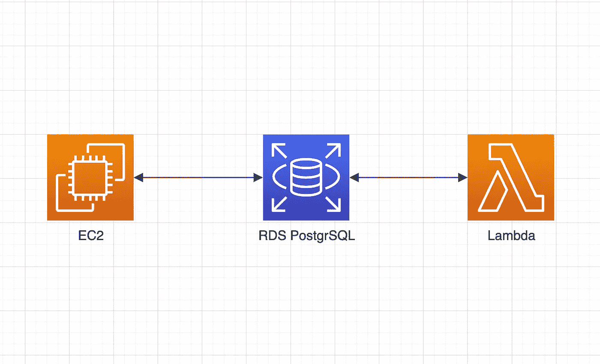

预计应用程序中使用的 AWS 服务

要开始计算，请转到计算器页面:

 [## AWS 定价计算器

### AWS 定价计算器允许您探索 AWS 服务，并为您在 AWS 上的使用案例创建成本估算。

计算器. aws](https://calculator.aws/#/) 

并点击`Create estimate`:

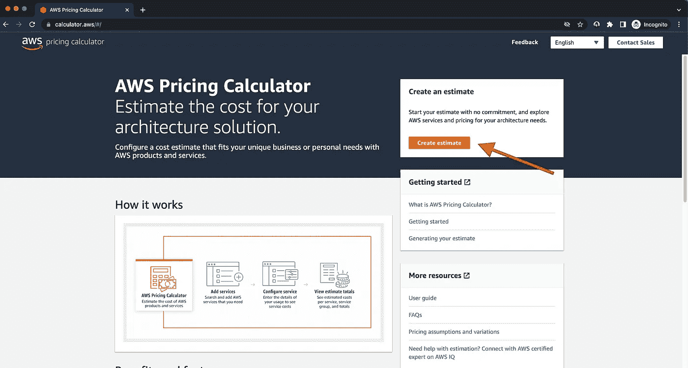

AWS 定价计算器页面

页面顶部有一个搜索栏，用于过滤所需的服务。让我们在第一张卡上输入`EC2`并点击`configure`。

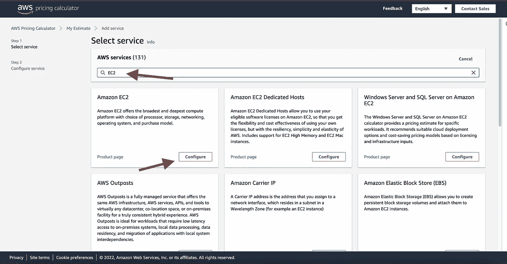

AWS 定价计算器—服务挑选

在“配置 Amazon EC2”页面的顶部，您必须选择所需的地区——价格可能会因地区而异。选择离您的最终用户最近的地区，以避免不必要的延迟。在我的例子中，我将选择伦敦地区，并选择下面的`quick estimate`选项。

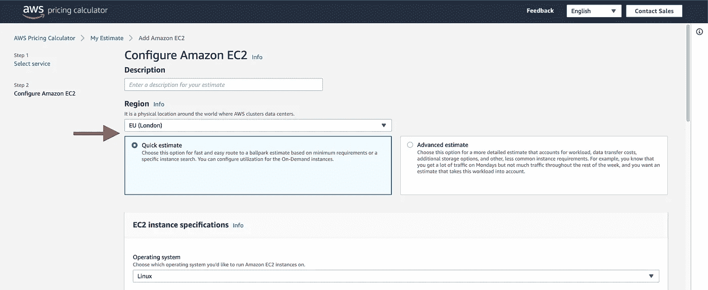

AWS 定价计算器— EC2 快速评估

下一节包含关于 EC2 实例本身的信息。您必须设置 CPU 的数量、内存量、选择操作系统、数量(您需要多少个实例)和利用率(您的应用程序在一个月内运行的时间百分比)。所以基于我提供的数据，AWS 向我提出了`t4large instance`。

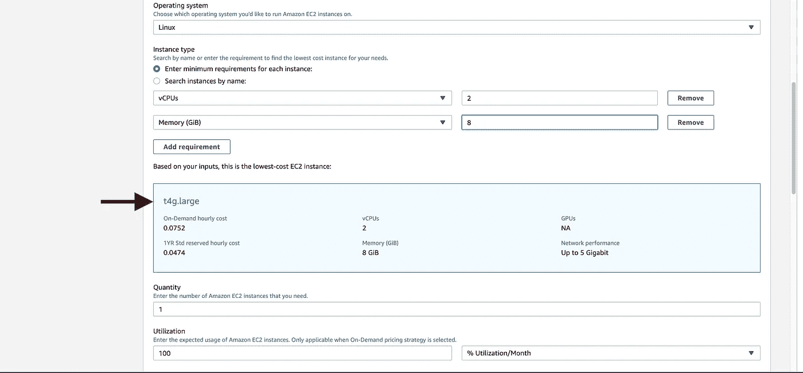

AWS 定价计算器 EC2 实例类型

到目前为止，一切顺利。让我们转到最后两个部分。在那里，你必须设定定价模式。根据您的需求，您可以选择“按需”选项(最贵的选项，但您没有任何合同的 AWS)，或者您可以选择一些储蓄选项(您将预付至少一年，但您将获得折扣)。

最后，对于 EC2，您必须选择硬盘的类型和大小。对我来说，有一个 20GB 的通用 SSD 就够了。我将把我的数据保存在 Postgres 数据库中，但是我将使用 RDS 服务。

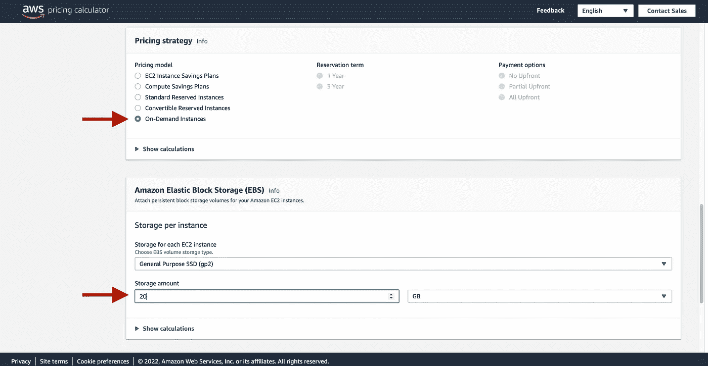

AWS 定价计算器—定价策略

在页面的最底部，您可以看到 EC2 实例的总成本估计。点击，`add to my estimate`。

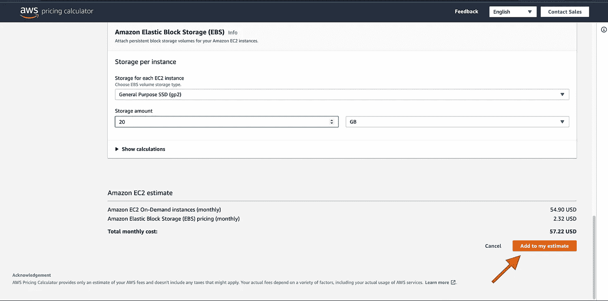

AWS 定价计算器—添加到我的评估中

单击“添加到我的估价”按钮后，您将看到“摘要”页面。这里的成本分为前期费用、月度费用和年度费用。还有一个估计服务的列表。但是目前，我只添加了一个。所以，我们再补充几个。为此，点击页面右上角的`add service`按钮。

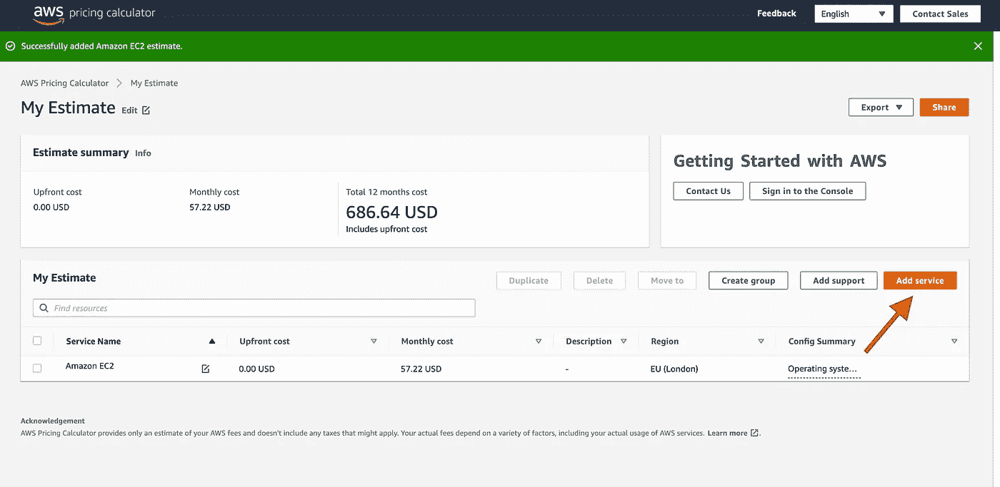

AWS 定价计算器—摘要页面

您将被重定向到提货服务页面。这一次，我们将添加 Postgres 数据库估计。搜索短语`RDS for PostgreSQL`，点击`configure`。类似于 EC2 实例，我将选择`t4g.large`实例类型。我将保留默认的 100%月利用率设置、部署到多 AZ 设置以及按需定价模式设置。

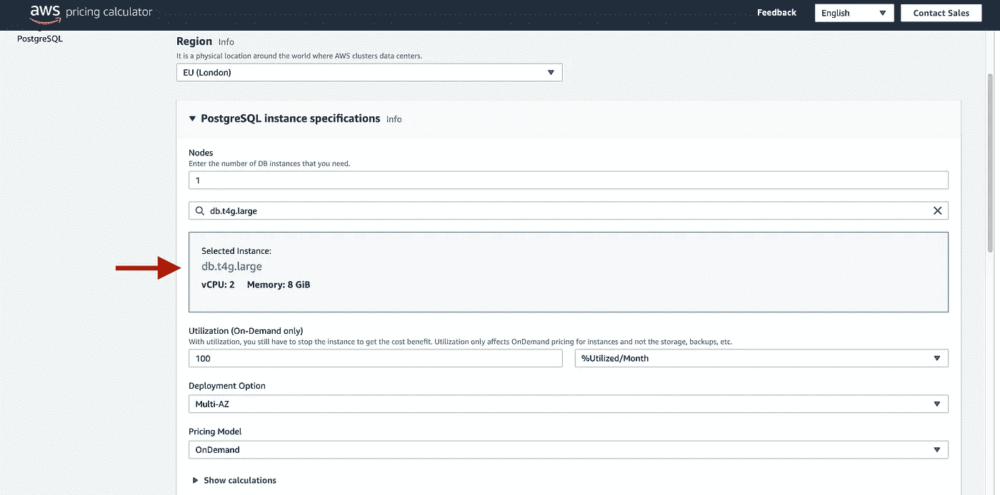

AWS 定价计算器 postgres 实例类型

我每月需要 100 GB 的存储，通用 SSD 选项就足够了。因此，我对 PostgreSQL 的最终计算如下:

AWS 定价计算器— postgres 估算

再次单击“添加至估价”按钮，然后在“我的估价页面”上，单击“添加服务”按钮。直到现在，事情都很简单。现在我们将估计 lambda 的使用，这有点复杂，但不用担心。我们会面对的。您可以从页面顶部的两个选项中选择:`Lambda Function — Include Free Tier`和`Lambda Function — Without Free Tier`。

我强烈建议你选择`Lambda Function — Without Free Tier`。最好是看看价格预测的最坏情况。如果我们高估了我们的成本？别担心。如果我们低估了。除此之外，如果你在一个大的组织中工作，并且评估一个新的项目，你的另一个项目达到自由层限制的可能性很高。

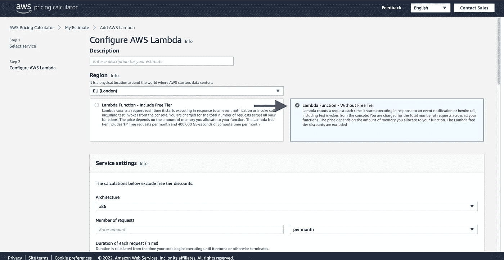

AWS 定价计算器—不带自由层的 lambda 函数

好的，但是回到我们的估计…如果你正在开发一个有很多 o lambdas 的无服务器应用，老实说我没有好的信息给你。因为对于 lambda 成本估算，你必须提供每月的请求数。是的，你没听错。你必须知道会有多少次调用。

在无服务器 API 中，最有可能是猜测，而不是估计。但就我而言，我知道请求的具体数量。我只使用 lambda 函数来生成一些报告。部署了三辆 lambdas 每小时、每天都会调用一次。所以，这个月我会有`3 * 24 * 31` lambdas 调用。每月调用`2232`次。

接下来，您必须提供 lambda 函数的平均持续时间(以毫秒为单位)——另一个难以判断的参数。调用时间肯定会有所不同，但是您至少应该知道时间是以毫秒、秒、分钟还是小时为单位。

我的兰姆达斯做一个小工作。从头到尾，大概是 600ms 左右。我必须填写的最后一个参数是分配的内存量。我只需要 512 兆的内存。

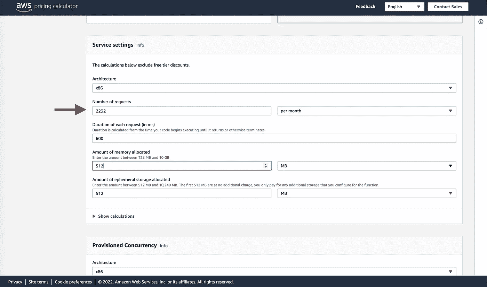

AWS 定价计算器— lambda 设置

那我就把剩下的设置留空。我不需要配置并发，也没有任何 lambda@edge。当我们滚动到底部，我们将看到总的估计。在我的情况下，它只是 0.01 美元。是的，0.01 美元。基本都是免费的:)看使用情况，Lambdas 可能就这么便宜。

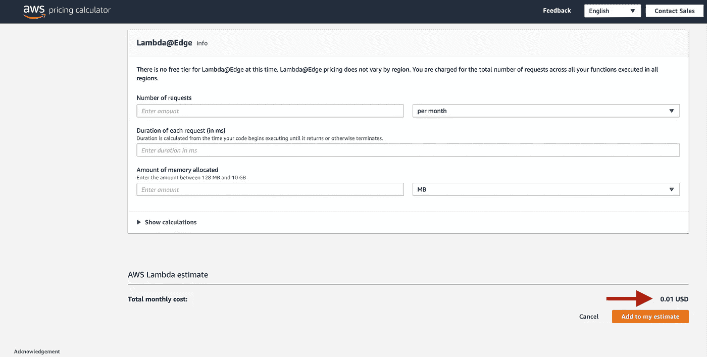

AWS 定价计算器— lambda 函数摘要

在文章的开始，我告诉你，我们估计的应用程序将利用三个 AWS 服务:EC2，RDS PostgreSQL 和 AWS Lambda。就这样，对吗？我们做了一个完整的计算。但是，其实不一定。

有两件事会影响你最终的账单，而且不是一眼就能看出来的。第一，app 的用户会如何与之交流？当然，通过互联网。我们难道不需要某种 NAT 网关吗？是的，我们需要它，不幸的是，这是一个付费的解决方案。接下来，我们的应用程序是否会产生一些日志？是的，确实如此。所以，我们很有可能会使用云手表。同样，这是我们之前没有想到的另一项指控。

为了不使本教程变得不必要的长，我将在这里停止。现在是你做作业的时间了。你能对这两种服务进行评估吗？很简单，你能做到。你必须重复我们之前做的。进入`Select service`页面，搜索`Amazon Virtual Private Cloud (VPC)`设置 NAT 估计，搜索`Amazon CloudWatch`获取日志。

我没有告诉你如何估算这些服务的原因是亚马逊为我们提供了 200 多种服务。记住如何评估所有这些是不可行的。你必须能够处理新的服务。

本教程的目标是让你熟悉 AWS 的定价计算器。我敢肯定，读完这篇文章后，你会知道该怎么做。

祝评估愉快，下次再见！