# AWS 无服务器应用程序:持续集成和部署

> 原文：<https://betterprogramming.pub/aws-serverless-app-continuous-integration-and-deployment-cb6f19474b3c>

## AWS 无服务器应用系列的第 2 部分


[马太·亨利](https://unsplash.com/@matthewhenry?utm_source=unsplash&utm_medium=referral&utm_content=creditCopyText)在 [Unsplash](https://unsplash.com/s/photos/architecture?utm_source=unsplash&utm_medium=referral&utm_content=creditCopyText) 上拍照

有几种方法可以将最新的代码库上传到您的测试和生产服务器上。手动复制它们是很好的，但是让一些人来负责运行测试和部署代码将会节省您的团队大量的人力。

这也将减少人为错误的机会。本文涵盖了一些步骤，您可以采取这些步骤将持续集成和部署(CI/CD)添加到在 AWS 无服务器应用程序的[第 1 部分中创建的无服务器项目中，但是这些操作可以应用于任何无服务器项目。关于在 AWS 上构建无服务器 API 的更多细节，请查看作者的书*在 AWS 上构建无服务器 Node.js 应用*。](https://medium.com/@edyvision/aws-serverless-app-where-to-start-11268309a1cf)

[](https://www.amazon.com/Building-Serverless-Node-js-Apps-AWS-ebook/dp/B08RN4WKFD/ref=sr_1_1?dchild=1&keywords=eidan+rosado&qid=1610222811&sr=8-1) [## 在 AWS 上构建无服务器 Node.js 应用程序:从哪里开始的简要指南

### 购买在 AWS 上构建无服务器 Node.js 应用程序:从哪里开始的简要指南:阅读 Kindle 商店评论-Amazon.com

www.amazon.com](https://www.amazon.com/Building-Serverless-Node-js-Apps-AWS-ebook/dp/B08RN4WKFD/ref=sr_1_1?dchild=1&keywords=eidan+rosado&qid=1610222811&sr=8-1) 

欢迎来到 AWS 无服务器应用程序教程集的第 2 部分。到目前为止，您应该已经有了一个一直在使用的无服务器项目。如果没有，可以随意派生或克隆教程的[第 1 部分的](https://medium.com/better-programming/aws-serverless-app-where-to-start-11268309a1cf) [GitHub](https://github.com/EdyVision/drug-search-service) 中的示例药物搜索项目。

我们将把我们的项目与 Travis CI 和 Codeship 连接起来，让您了解两者是如何工作的。请随意选择最适合你的方式。如果你的项目是开源项目， [Travis CI](https://travis-ci.org/) 和 [CircleCI](https://circleci.com/) 都提供免费构建。

我们将添加以下内容:

*   带 ESLint 的棉绒配置
*   测试基础文件(还没有测试)
*   Travis CI 配置文件
*   代码发布的配置步骤

## **设置**

首先，在您喜欢的 CI/CD 服务提供商处创建您的帐户，并将其绑定到您的 GitHub 帐户。该帐户将需要访问您的存储库。您可以默认允许所有人访问，也可以单独添加他们(建议减少潜在费用)。

如果你在 GitHub 中已经有了一个无服务器项目，那就继续添加吧。如果您克隆了同一个药物搜索项目，那么您需要将它添加到 CI/CD 服务的存储库列表中。我们会马上添加其余的。

为了执行部署，您还需要一个 AWS 服务帐户或用户帐户。

## **让 CI/CD 发挥作用**

有几种方法可以让您的团队利用 CI/CD——一种是在合并之前验证特性分支。

当开发人员发布他们的更改时，您可以配置您的 CI/CD 构建，用 linter 验证代码格式，运行单元测试，并检查其启动能力。在您的无服务器应用程序的情况下，最后两个是在部署之前知道特性构建是否会破坏您的主分支和活动资源的决定性方法。

在合并到主分支或主要分支时，服务可以通过 linter 运行并再次执行单元测试，但是您也可以让您的服务部署到您的项目，无论它在哪里托管(在我们的例子中是 AWS)。

## **设置代码船**

进入您的项目设置，在 Tests 选项卡中，更新您的设置命令以包括以下内容:

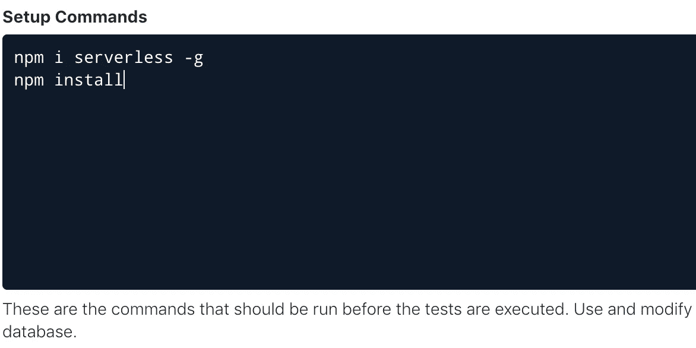

这将全局安装 serverless 来执行您的测试并允许部署。它还将安装项目的依赖项。

接下来，将`npm test`添加到测试配置框中:

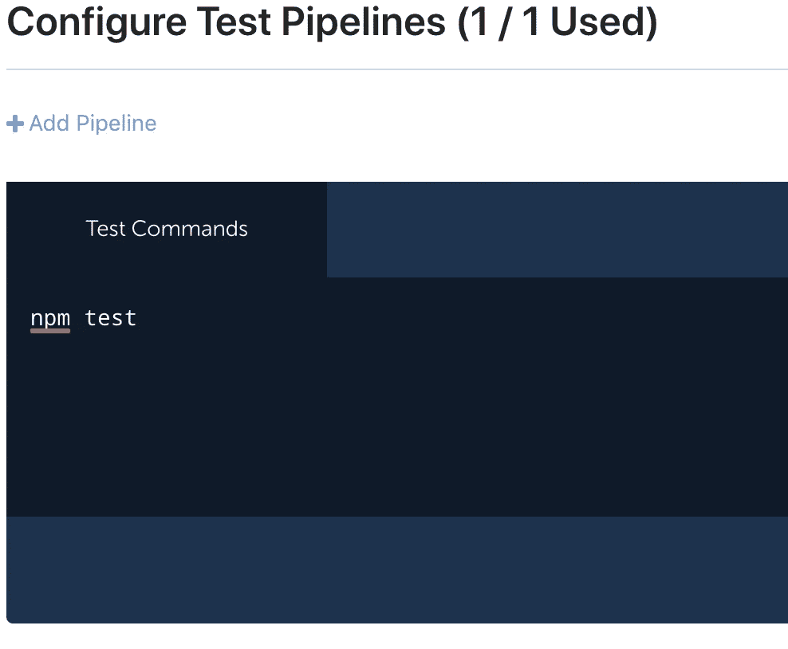

还记得我们在第 1 部分中创建的服务或用户帐户吗？如果你还没有创建一个，现在就是时候了。

创建之后，获取生成的 AWS 访问密钥和密码，并将它们添加到环境变量部分:

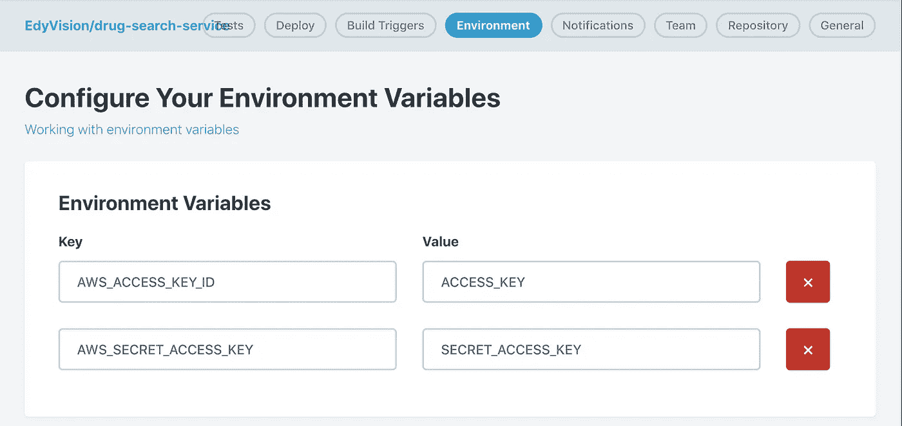

这是在脚本中部署和使用 AWS 服务所必需的

接下来我们将设置 linter 并测试基础文件。如果您不打算设置 Travis，您可以跳过下一部分。

## **设置 Travis CI**

首先，为存储库启用 Travis。进入你的仪表板，点击加号。它将提供搜索栏。

开始搜索项目，并打开项目开关:

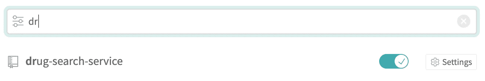

切换开关以启用存储库

单击 settings 按钮提供您需要的任何定制，比如您的 AWS 访问和用于部署和 AWS 服务使用的密钥。

将它们放在环境变量部分，如下所示:

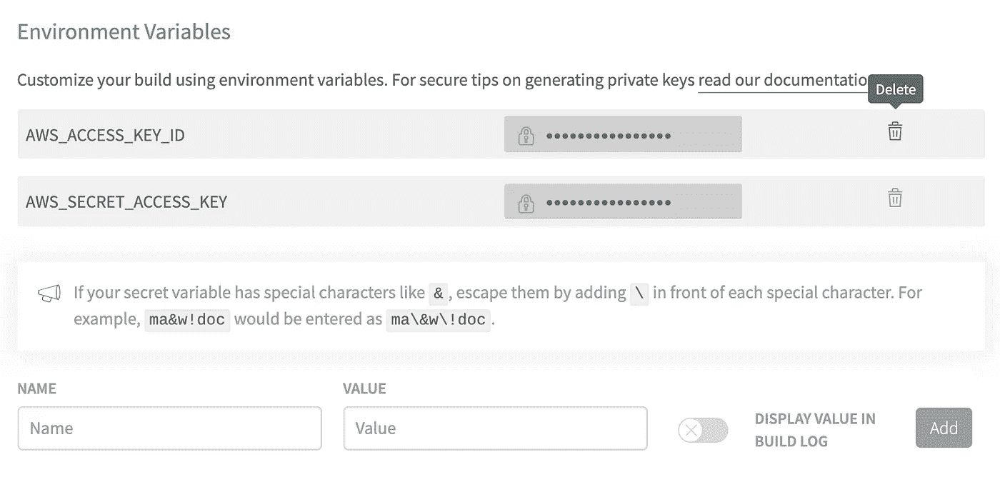

Travis CI 允许您在构建日志中显示，但不建议这样做

然后将以下内容添加到项目根目录下的`.travis.yml`文件中:

要脱机运行无服务器测试，甚至执行部署，您将需要无服务器。为了安装运行测试所需的依赖项，您需要做一个`npm install`。`npm test`将运行您的 linter 和单元测试，我们将在接下来的部分中设置。

请注意，部署阶段有一个条件，即它是否是主分支(对于 PRs，它会自动这样设置)以及它是否是 PR。我们不希望它在公关期间尝试部署，只是运行测试。它应该只将合并部署到主分支中。

## 设置棉绒机

我们还没有测试，但是我们可以用我们的`npm test`命令很快地连接一个 linter 来执行。使用以下终端命令安装 ESLint 依赖项:

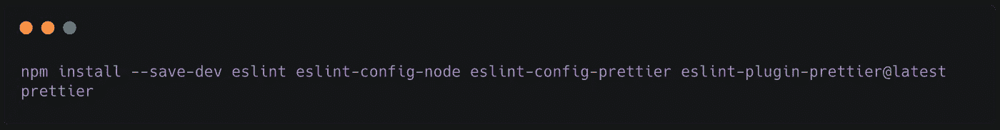

您将需要一个 ESLint 配置。你可以在 GitHub 中找到大量的例子。

这是我在药物搜索项目中使用的:

您还需要更新您的`package.json`脚本列表，如下所示:

```
"scripts": { "start": "sls offline --noAuth", "test": "NODE_ENV=test PORT=9100 ./node_modules/.bin/nyc ./node_modules/.bin/mocha --opts mocha.opts", "offline": "sls offline start", "precommit": "eslint .", "pretest": "eslint --ignore-path .gitignore ."},
```

在您的本地机器上，运行以下命令来启动 linter:

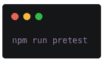

你可能会发现自己犯了一些林挺错误，也可能不会——我知道我犯了。为了让您的构建成功，您需要修复用红色标记的林挺问题(也称为错误),或者根据需要修改 ESLint 配置以将错误减少到零。

## 设置测试

正如您可能已经注意到的，测试命令还依赖于用于确定测试覆盖的 NYC 模块，并且测试命令使用了我们没有的`mocha.opts`。

为代码覆盖率安装 NYC:

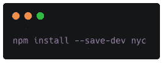

您需要在项目目录的根目录下创建一个`mocha.opts`文件，如下所示:

```
--timeout 5000
--reporter list
--ui bdd
--exit
test/bootstrap.test.js
test/**/*.test.js
test/**/**/*.test.js
```

现在当你运行`npm test`时，它会尝试给你代码覆盖率，但也会遇到一个失败消息。让我们在测试目录中添加一些支持文件。

在`test`目录的根目录下，添加以下`bootstrap.test.js`文件:

在`test`目录中创建一个名为`support`的新目录。

添加一个名为`slsOfflineTestConfig.js`的文件，并将以下函数放入其中:

```
module.exports.getSlsOfflinePort = () => { return process.env.PORT || '3005';};
```

现在，当您运行`npm test` 命令时，输出应该如下所示:

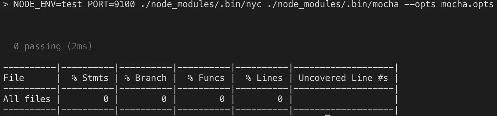

这里应该不会显示任何错误，目前只有 0 个通过和 0 个覆盖率

呀！看起来是时候写一些测试了。我们将在下一篇文章中讨论这个问题。

## **触发构建**

有了所有最新的更改和 linter 修复，您现在有相当多的更改需要推进。如果这还不在一个特性分支上，那么继续做一个`git checkout -b branchName`，提交你的修改，并把它们上传到 GitHub。Codeship，Travis，或者你正在使用的任何东西都将被触发，并尝试构建。

**注意:**如果您在尝试上推之前没有设置 Codeship 或 Travis 来进行此回购，它可能不会按预期触发构建。

如果您创建了一个拉请求，您的页面将显示类似下图的构建状态:

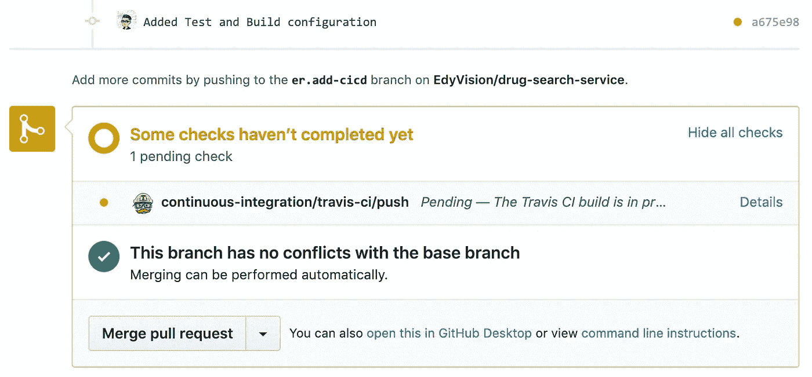

下面是您的代码开始构建时的样子:

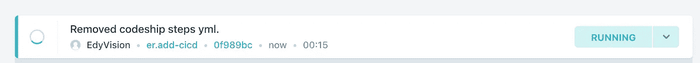

同样，在分支或 PR 构建期间，Travis CI 将如下图所示:


## 配置部署步骤

您的项目正在报告一个成功的构建——耶！让我们再取消一个手动步骤。

Travis CI 配置已经定义了部署步骤，并将执行`sls deploy -v`。这将把您的最新文件上传到您的 AWS 资源。您可以在此步骤中指定这将进行到哪个阶段。默认情况下，阶段是`dev`，但也可以是`test`、`prod`等。

对于 Codeship，选择 Deploy 选项卡，并创建部署管道:

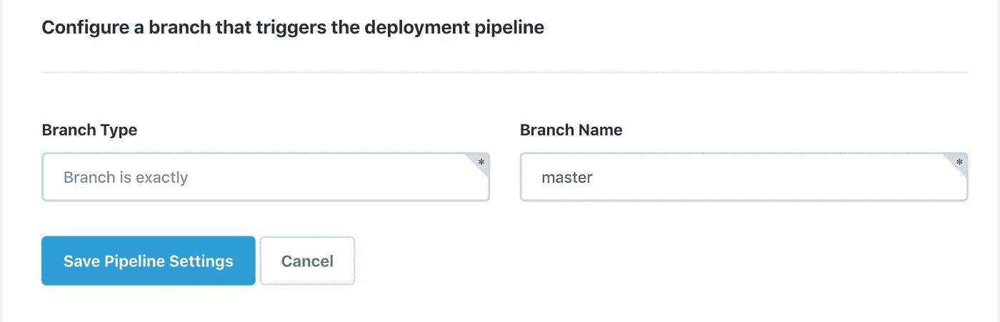

分支可以完全匹配，也可以给定一个模式(如果您的团队发布标签，这很方便)。现在从 Add Deployment 部分选择脚本。您需要输入以下信息:

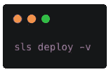

你就完了。如果您合并您的拉请求，它将立即触发最终的构建和部署。在您从任一服务提供商处收到成功电子邮件后，您的资源应该会自动可用。

所有 gists 和整个药物搜索项目库都可以在 [GitHub](https://github.com/EdyVision/drug-search-service) 上公开获得。

# 下一步是什么

这就是了。您的项目现在应该使用预期的触发器进行构建和部署。想想这会为你或你的团队节省多少时间。就我个人而言，在开始时我无法在 CI/CD 服务提供商之间做出选择，最终我经历了 Travis 和 Codeship 的步骤，以了解他们如何与我的项目一起工作。

我们将在下一篇文章“AWS 无服务器应用:测试”中探索测试和调试

感谢阅读！