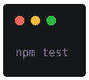
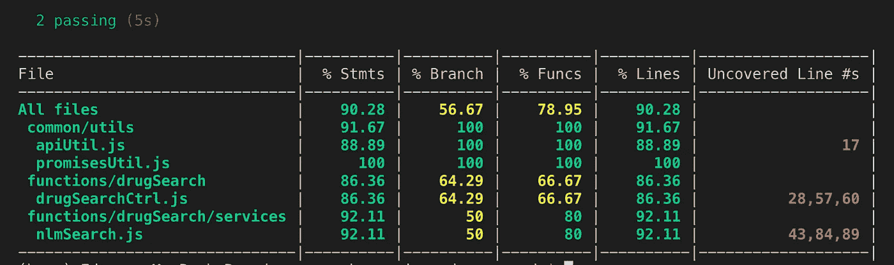
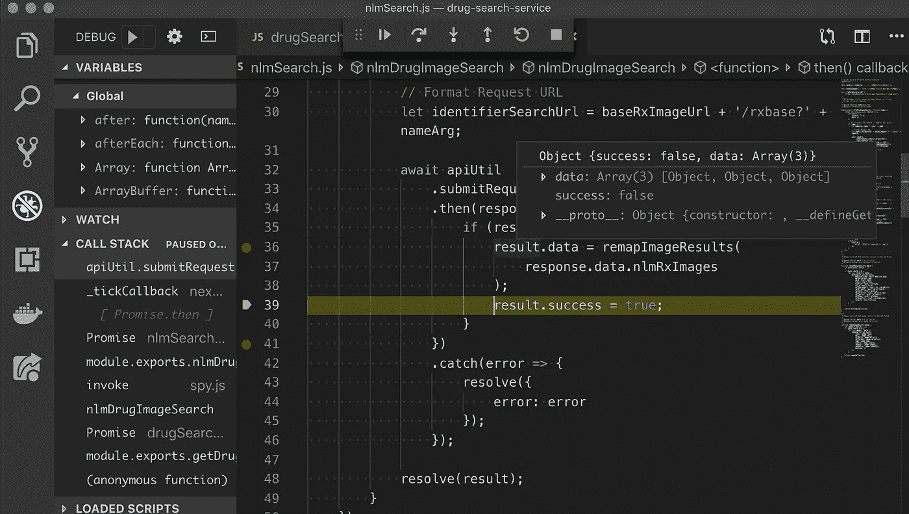

# AWS 无服务器应用程序:测试

> 原文：<https://betterprogramming.pub/aws-serverless-app-testing-d1b54037b0a6>

## **AWS 无服务器应用系列的第 3 部分**


没有什么比 0%的代码覆盖率更适合生产的代码了。

我当然是开玩笑啦！如果您从第 1 部分开始就一直关注，那么您已经知道我们需要一些测试。没有经过一定程度的测试，任何代码都不应该投入生产。

我们的目标始终是在消费者得到我们的产品之前，快速失败并尽可能多地抓住机会。

欢迎来到 AWS 无服务器应用程序教程的第 3 部分，在这里我们将介绍使用无服务器药物搜索 API 进行测试和调试。有关在 AWS 上构建无服务器 API 以及如何在无服务器项目中使用 Jest 的更多详细信息，请查看作者的书*在 AWS 上构建无服务器 Node.js 应用*。

[](https://www.amazon.com/Building-Serverless-Node-js-Apps-AWS-ebook/dp/B08RN4WKFD/ref=sr_1_1?dchild=1&keywords=eidan+rosado&qid=1610222811&sr=8-1) [## 在 AWS 上构建无服务器 Node.js 应用程序:从哪里开始的简要指南

### 购买在 AWS 上构建无服务器 Node.js 应用程序:从哪里开始的简要指南:阅读 Kindle 商店评论-Amazon.com

www.amazon.com](https://www.amazon.com/Building-Serverless-Node-js-Apps-AWS-ebook/dp/B08RN4WKFD/ref=sr_1_1?dchild=1&keywords=eidan+rosado&qid=1610222811&sr=8-1) 

# **目标**

在 AWS 无服务器应用程序教程集的最后一部分，我们将为我们的药物搜索服务编写一些小测试。从头开始，按照 [*AWS 无服务器 App:从哪里开始*](https://medium.com/@edyvision/aws-serverless-app-where-to-start-11268309a1cf) 中的步骤。

到目前为止，我们在项目中应该有一个调用 NLMSearch 服务的控制器和几个助手文件。我们的测试将调用药物搜索控制器中的`getDrugIdentifiers`函数。

# **环境设置**

我们将使用 [Sinon](https://sinonjs.org/) 来使用测试间谍的`calledWith`方法和 [Chai](https://www.chaijs.com/) 作为断言库。要安装`chai`和`sinon`模块，使用以下命令:


# **写作测试**

在我们的根目录下的`mocha.opts`文件中，我们已经写了它来处理任何文件夹中任何名为`*.test.js` 的东西。

如果您还没有这样做，请在项目的根目录下创建一个名为`test`的目录。

在`test`中创建另一个名为`functions`的目录。在`functions`中，我们将创建一个名为`drugSearchCtrl.test.js`的测试文件。将以下内容复制并粘贴到文件中:

这里，我们将文件分解成两个上下文，正确的输入和不正确的输入。在`input missing`上下文中，我们发出一个调用，断言它应该返回状态代码 400。

在`input ok`上下文中，我们发出了一个调用，断言它应该返回一个成功的搜索，状态代码为 200，并填充了主体。

通过这样做，我们测试了预期的最小契约。要么我们作为消费者提供端点适当的数据，要么我们不提供。如果成功，我们应该返回 200 的成功状态代码。在坏请求或坏数据的情况下，我们应该抛出 400 的东西。

在成功的搜索上下文中，我们还利用了 Sinon spy 特性来断言`nlmSearch.js`中的`nlmDrugImageSearch`函数正在被`getDrugIdentifiers`函数调用，药品名称作为参数被传入。

# **执行测试**

如果你一直遵循教程的第 1 和第 2 部分，你的`package.json`将可能在脚本部分有所有正确的设置。如果没有，请随意将以下内容复制到您的脚本部分:

```
"scripts": { "start": "sls offline --noAuth", "test": "SLS_DEBUG=* NODE_ENV=test PORT=9100 
   ./node_modules/.bin/nyc ./node_modules/.bin/mocha --opts  
   mocha.opts", "debug": "export SLS_DEBUG=* && node --inspect   
   /usr/local/bin/serverless offline -s dev --noAuth", "offline": "sls offline start", "precommit": "eslint .", "pretest": "eslint --ignore-path .gitignore ."}
```

现在有了这个设置，我们将能够运行我们的测试并附加一个调试器。让我们尝试使用以下命令运行测试:

```
npm test
```



现在，您将看到 NYC 模块打印出文件的更新覆盖范围:



如你所见，我们有了一个良好的开端。

绿色区域状况良好，但黄色和红色区域需要进一步关注。在标有*未覆盖线路#s* 的列的最右侧，NYC 模块将提供测试根本未覆盖的线路。

# **连接调试器**

没有调试器，解决代码中的问题几乎是不可能的。大多数编辑器都有这个选项，甚至对于节点项目也是如此。在本文中，我将带您了解的是 [VS 代码调试器](https://code.visualstudio.com/docs/editor/debugging)。

要在 VS 代码中为您的服务器设置调试器，请单击左侧的 bug，然后单击*添加配置*。您需要添加以下内容:

```
{ "type":"node", "request":"launch", "name":"run serverless offline", "program":"${workspaceRoot}/node_modules/.bin/sls", "args":[ "offline", "--noAuth" ]}
```

这将与端口 3000 上的服务器一起工作，并且在您已经将您的函数设置为在`serverless.yml`文件中作为`private`被锁定的情况下，将传入`noAuth`参数。

在编辑器中，在逻辑中您打算开始单步执行代码的地方设置一个断点。如果您启动调试器并通过 [Postman](https://www.getpostman.com/) 或另一个 REST API 客户端提交请求，您的调试器现在应该会命中您设置的任何断点。

要为测试设置调试器，还需要将以下内容添加到您的配置中:

```
{ "type": "node", "request": "launch", "name": "Mocha Tests Debug", "program": "${workspaceFolder}/node_modules/mocha/bin/_mocha", "args": [ "--timeout", "999999", "--colors", "'${workspaceFolder}/{,!(node_modules)/}*/*.test.js'" ], "console": "integratedTerminal", "internalConsoleOptions": "neverOpen"}
```

之前，我们已经在`bootstrap.test.js`文件中设置了`sls offline — noAuth`命令，这将在测试期间绕过对 API 密钥等的需要。

如果您在 debugging 视图中运行这个特定的配置，它将在 debug 模式下运行所有的测试，并将命中您已经设置的断点。

调试器启动完成后，您的编辑器将显示工具栏，让您能够单步执行、进入、退出或恢复/继续操作。



一旦调试器命中该断点，您将能够使用调试工具并检查范围内变量的值。

# **遗言**

AWS 无服务器 app 教程集到此为止。

当然，还有更多的事情可以做。现在，享受扩展项目或开始新项目的乐趣吧！我希望本教程集能够对无服务器项目开发的一些要点有所启发。

感谢阅读和快乐的黑客！