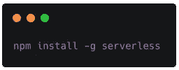
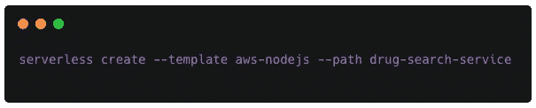
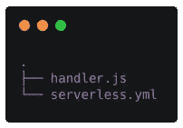
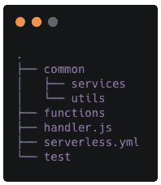
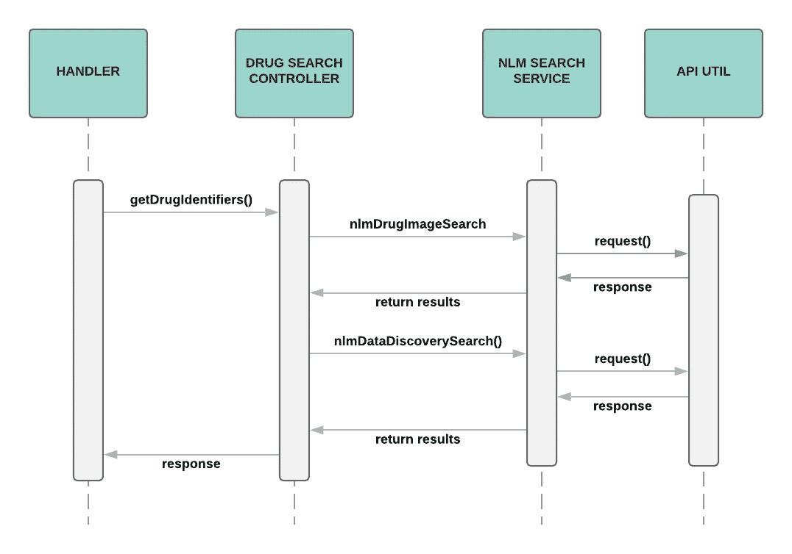
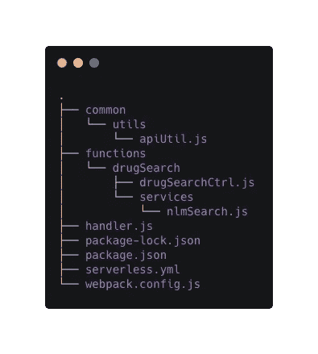
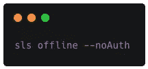
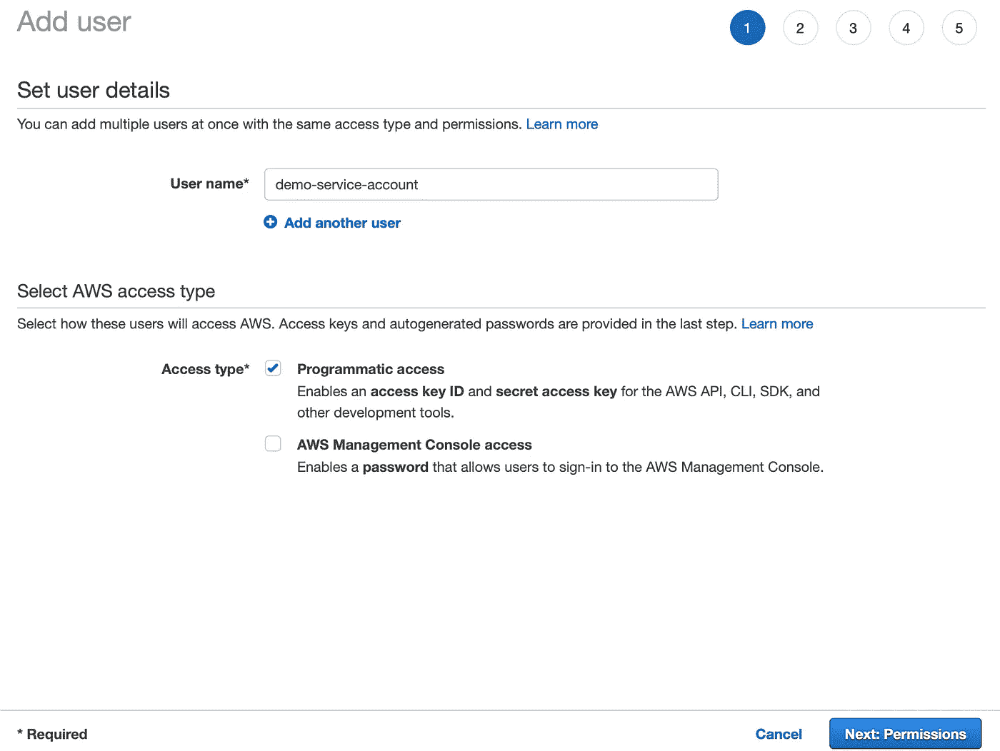

# AWS 无服务器应用程序:从哪里开始

> 原文：<https://betterprogramming.pub/aws-serverless-app-where-to-start-11268309a1cf>

## AWS 无服务器应用系列的第 1 部分


费尔南多·雷耶斯在 [Unsplash](https://unsplash.com/s/photos/architecture?utm_source=unsplash&utm_medium=referral&utm_content=creditCopyText) 上的照片

# 背景

向无服务器架构的重大转变是有充分理由的。

无服务器是一种计算模型，它提供了在云中运行应用程序的便利，而无需处理管理基础架构的麻烦。资源根据需要进行动态扩展和管理。它只对后端服务收费，即通常所说的*按使用付费*。

您可以为每 100 万次调用支付 20 美分，而一个月内的前 100 万次调用是免费的(至少对于 Lambda 资源来说是这样)，而不是以全部成本运行 EC2 实例。在开发模式下，您团队的概念验证 API 或服务几乎是免费的。

[无服务器框架](https://serverless.com/)让开发者不再需要手动连接服务和处理基础设施。正如创作者所说，它允许开发者专注于开发。在我们的演练中，我们将利用这个框架来消除弄清楚如何将 AWS 资源连接在一起的需要。

这篇文章是 AWS 无服务器应用程序教程的第 1 部分，在这里我将向你展示一个无服务器应用程序的创建，从概念到在 AWS 中看到它的部署。关于在 AWS 上构建无服务器 API 的更详细的分解，请查看作者的书*在 AWS 上构建无服务器 Node.js 应用*。

[](https://www.amazon.com/Building-Serverless-Node-js-Apps-AWS-ebook/dp/B08RN4WKFD/ref=sr_1_1?dchild=1&keywords=eidan+rosado&qid=1610222811&sr=8-1) [## 在 AWS 上构建无服务器 Node.js 应用程序:从哪里开始的简要指南

### 购买在 AWS 上构建无服务器 Node.js 应用程序:从哪里开始的简要指南:阅读 Kindle 商店评论-Amazon.com

www.amazon.com](https://www.amazon.com/Building-Serverless-Node-js-Apps-AWS-ebook/dp/B08RN4WKFD/ref=sr_1_1?dchild=1&keywords=eidan+rosado&qid=1610222811&sr=8-1) 

# 目标

我们都服用某种形式的药物，但我们总是知道我们服用的药物的形状、颜色或副作用吗？如果我们的药片弄混了，我们会记得吗？

好吧，让我们建立一些可以帮助我们的东西。我们将使用 NodeJS 创建一个药物搜索 API。

我们的 API 将通过[国家医学图书馆](https://www.nlm.nih.gov) (NLM) API 返回图像以及与药物相关的标记。

## 环境设置

在我们开始之前，您需要一些东西来开始:

*   像 [VS 代码](https://code.visualstudio.com/)或 [Atom](https://atom.io/) 这样的编辑器
*   安装在您的机器或虚拟机上的 [NPM](https://www.npmjs.com/get-npm) 和[节点](https://nodejs.org/en/download/)
*   [邮递员](https://www.getpostman.com/)或另一个 REST-客户端替代者
*   AWS 账户

## 创建基础项目

使用以下命令在您的计算机上安装无服务器 CLI:



导航到托管所有项目的目录，使用 AWS NodeJS 模板启动无服务器创建命令:



以下是此过程自动生成的内容:



比较基础，再补充几个吧。

在项目的根目录中，添加以下目录:

*   `functions`
*   `common`(下面有一个`services`和一个`utils`目录)
*   `test`

这次我们将使用`functions`和`services`目录。

结果应该如下所示:



将一个`package.json`添加到您的项目的根目录中，并将以下内容复制并粘贴到其中:

在您的终端窗口中，从项目的根目录中，运行`npm install`来检索依赖项。

好吧。我们开始吧。

# 添加逻辑

我们将需要一个单一的 GET 端点。

这个端点将被连接到一个控制器，然后这个控制器将调用 NLM 服务。NLM 服务将通过 API 实用程序与 NLM API 联系。

因此，调用序列是:



创建的文件的调用序列

您需要替换大部分的`serverless.yml`文件，以获得以下内容:

我们在`serverless.yml`文件中有一些事情。除了定义服务名、云服务提供商、区域和运行时间，我们还有一些插件和自定义设置。

我们利用 prune 插件来摆脱旧的部署；否则，您将耗尽存储空间。在撰写本文时，Lambda 函数和层存储的最大容量是 75 GB。离线插件用于在您的计算机上本地运行这些功能。webpack 插件用于帮助捆绑和一些配置。在客户中，我们指示它在捆绑时包含模块并自动修剪。

说到 webpack，我们需要一个配置。在项目的根目录下，创建一个`webpack.config.js`文件。在其中，复制并粘贴以下内容:

`serverless.yml`文件中的 functions 部分有端点定义，比如路径和附加到它的处理函数。请注意，我们现在已经将该端点的 HTTP 部分下的私有设置设置为`false`。将这个值切换到`true`将会增强对 API 键和使用计划的需求。我们将在以后的文章中讨论这些问题。

让我们为我们的端点安装处理程序。用以下内容替换您的`handler.js`内容:

这里，路径为`drug/search/getDrugIdentifiers`并映射到该处理函数的端点将被绑定到`drugSearch`控制器。现在让我们创建控制器和 NLM 搜索服务。

在名为`drugSearch`的函数下创建一个目录，并在其中放置一个名为`drugSearchCtrl.js`的文件。将以下内容复制并粘贴到其中:

在文件夹`drugSearch`下创建一个名为`services`的目录，并在其中创建一个名为`nlmSearch.js`的文件。将以下内容复制并粘贴到其中:

如您所见，`nlmSearch`函数调用了`apiUtil.js`。这是我们存放调用外部 API 的常见 Axios 调用的地方。这将进入`common/utils`路径。

在`common/utils`下，创建`apiUtil.js`文件，并粘贴以下内容:

您的新项目结构应该如下所示:



## 启动服务器

现在我们已经拥有了所有需要的东西，让我们试着启动服务器:



使用 Postman 或您喜欢的 REST 客户端，您应该能够到达以下端点(请注意放置在`drugName`查询字符串参数中的示例处方药):

```
[http://localhost:3000/drug/search/getDrugIdentifiers?drugName=albuterol](http://localhost:3000/drug/search/getDrugIdentifiers?drugName=albuterol)
```

# 部署到 AWS

要部署到 AWS，您需要创建一个服务帐户。

登录您的 AWS 帐户，并导航到 IAM 服务。创建一个名为`admin-group`的新用户组，并附加管理员访问策略。通常，您会希望为您的帐户制定一个具有粒度权限的特殊策略，但是在这个示例中，我们还是坚持使用这个策略。

然后，您需要添加一个新用户，比如说`demo-service-account` ***、*** ，并将他们添加到组中。您的`demo-service-account`用户应该只有编程权限，没有控制台权限。



将用户附加到您刚刚创建的服务帐户组，并完成该过程。将设置生成的访问密钥和秘密访问密钥添加到 bash 配置文件或环境变量中。

```
export AWS_ACCESS_KEY_ID="YOUR_ACCESS_KEY_ID"export AWS_SECRET_ACCESS_KEY="YOUR_SECRET_ACCESS_KEY"
```

现在您的帐户已经设置好了，运行以下命令将您的服务部署到 AWS:


框架将输出资源详细信息，如下所示:

```
CloudFormation - UPDATE_COMPLETE - AWS::CloudFormation::Stack - drug-search-service-dev
Serverless: Stack update finished...
Serverless: Invoke aws:info
Service Information
service: drug-search-service
stage: dev
region: us-east-1
stack: drug-search-service-dev
api keys:
  None
endpoints:
  GET - [https://7rxjqnguqd.execute-api.us-east-1.amazonaws.com/dev/drug/search/getDrugIdentifiers](https://7rxjqnguqd.execute-api.us-east-1.amazonaws.com/dev/drug/search/getDrugIdentifiers)
functions:
  getDrugIdentifiers: drug-search-service-dev-getDrugIdentifiers
layers:
  NoneStack Outputs
GetDrugIdentifiersLambdaFunctionQualifiedArn: arn:aws:lambda:us-east-1:573697395521:function:drug-search-service-dev-getDrugIdentifiers:1
ServiceEndpoint: [https://7rxjqnguqd.execute-api.us-east-1.amazonaws.com/dev](https://7rxjqnguqd.execute-api.us-east-1.amazonaws.com/dev)
ServerlessDeploymentBucketName: drug-search-service-dev-serverlessdeploymentbucke-1lsvm6vkfr29rServerless: Prune: Running post-deployment pruning
Serverless: Prune: Querying for deployed versions
Serverless: Prune: drug-search-service-dev-getDrugIdentifiers has 1 additional version published and 0 aliases, 0 versions selected for deletion
Serverless: Prune: Pruning complete.
Serverless: Invoke aws:deploy:finalize
```

提供堆栈信息，例如用于部署的存储桶名称、函数、端点等。现在应该可以通过 REST 客户机到达这个端点了。

完整的解决方案，请在 [GitHub](https://github.com/EdyVision/drug-search-service) 上查看示例项目。

# 下一步是什么

就是这样。您已经设置了药品搜索无服务器 API，并将其部署到 AWS。在下一篇文章" AWS 无服务器应用:持续集成和部署"中，我们将通过 Travis CI 和 Codeship 选项向您的无服务器项目添加 CI/CD。

感谢阅读！