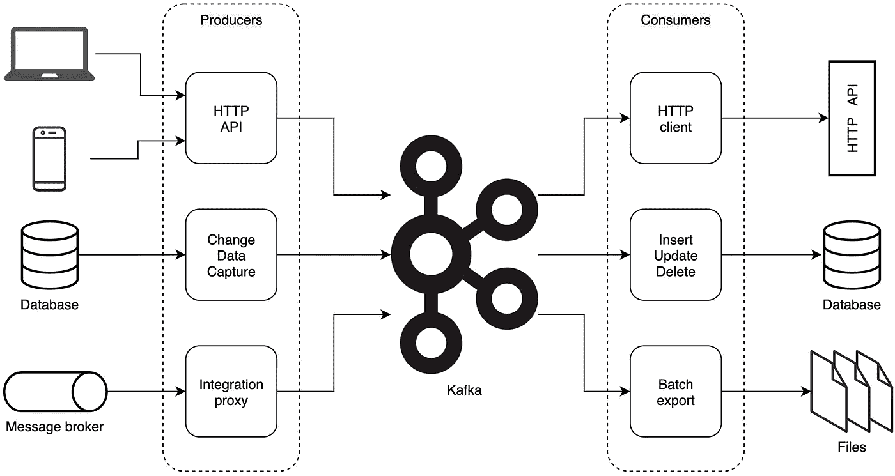
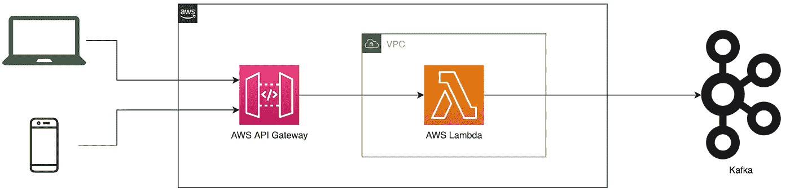
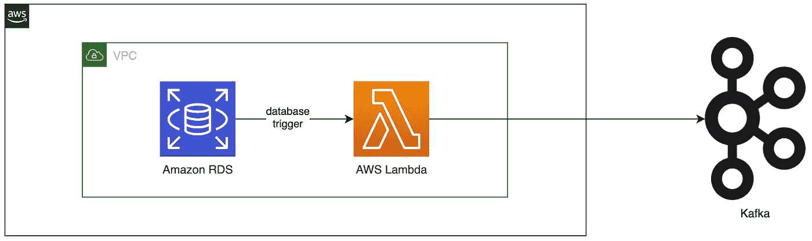
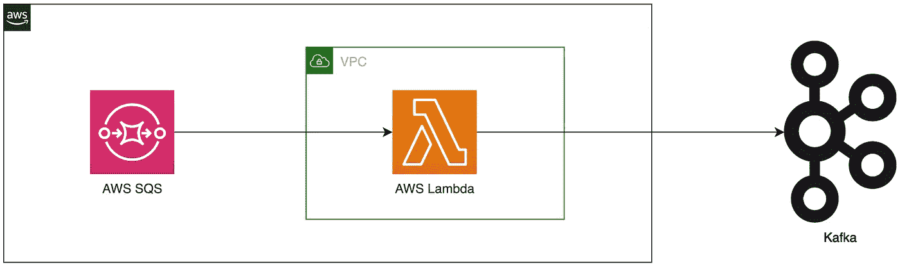
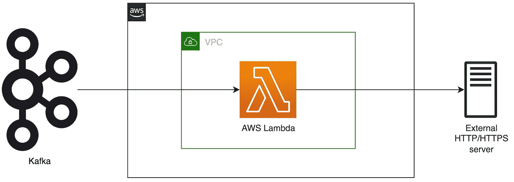
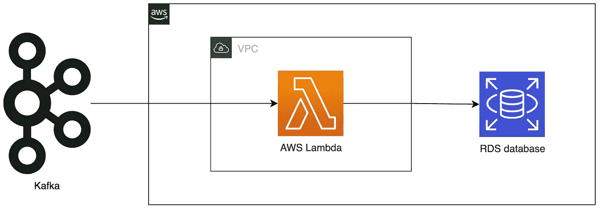
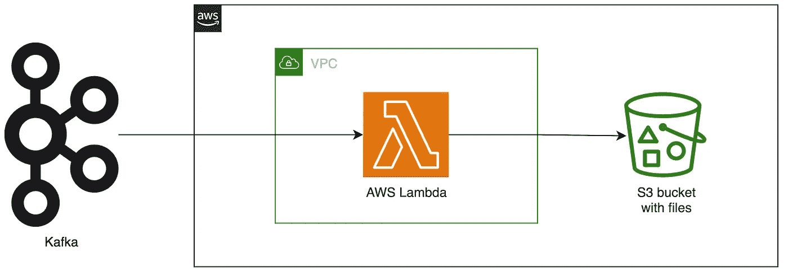
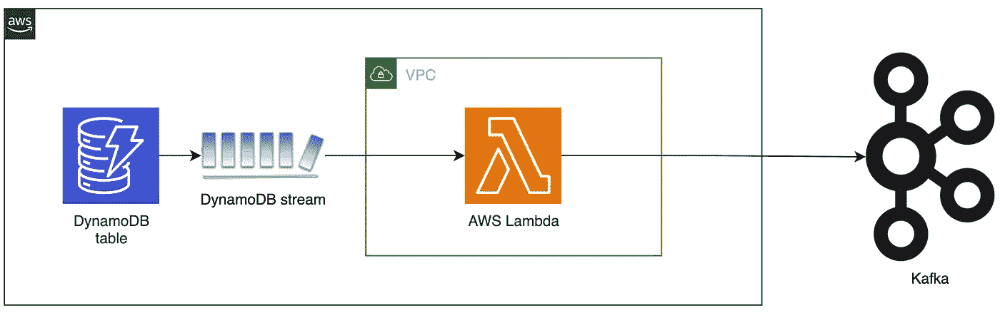
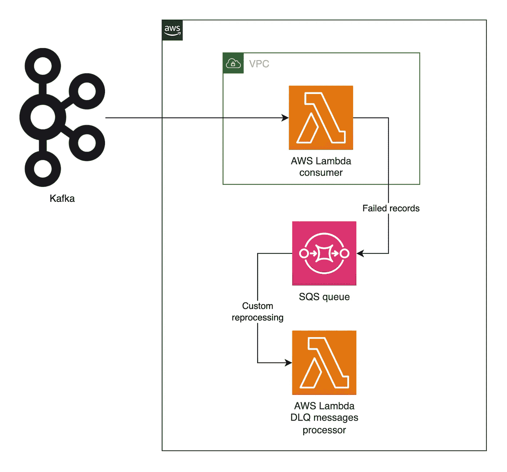

# 卡夫卡国的 8 种 AWS 无服务器模式

> 原文：<https://betterprogramming.pub/aws-serverless-patterns-in-kafka-land-5f317540599a>

## 根据您的用例调整模式

照片由[塔利亚·特兰](https://unsplash.com/@thaliatran?utm_source=medium&utm_medium=referral)在 [Unsplash](https://unsplash.com?utm_source=medium&utm_medium=referral) 上拍摄

Kafka 是一流的大规模流数据处理行业平台。毫无疑问，卡夫卡世界的一等公民是 24/7 运行的生产者/消费者应用程序(例如，经典服务器、k8s-pods 等)。).

但是迅速崛起的 AWS 无服务器生态系统呢？

让我们考虑一些典型的卡夫卡生产者/消费者景观:

图片来源:作者

上图是工作流的集合:

1.  将传入的 HTTP API 请求传播到 Kafka
2.  将数据库更改写入 Kafka
3.  将消息从消息代理传播到 Kafka(例如 RabbitMQ)
4.  为消费的消息发送 HTTP 请求
5.  基于 Kafka 消息插入/更新/删除数据库记录
6.  将消息批量卸载到文件存储

毫无疑问，这份清单并不详尽。

现在，让我们看看提到的模式，以及基于 AWS 无服务器生态系统的可能解决方案。

# 模式 1:对 Kafka 的传入 HTTP API 请求

图片来源:作者

一个很常见的场景，当你需要把 HTTP 请求“翻译”成 Kafka 消息时。实际上， [Kafka REST Proxy](https://github.com/confluentinc/kafka-rest) 正是这样做的，但是使用持续运行的 Java web 应用程序。

AWS Lambda 确实在这里大放异彩，尤其是如果您的传入负载有很大的方差和不规则性。

# 模式# 2:Kafka 的数据库变更

图片来源:作者

2 个常见场景:

1.  [直接从 lambda 查询数据库](https://docs.aws.amazon.com/lambda/latest/dg/services-rds-tutorial.html)
2.  从查询或从触发器调用 lambda [。](https://docs.aws.amazon.com/AmazonRDS/latest/UserGuide/PostgreSQL-Lambda.html)

例如，您可以将数据库的 CDC 以类似于 [Debezium](https://debezium.io/) 的方式流式传输到 Kafka，但是是以一种无服务器的方式。

# 模式#3:消息代理代理

图片来源:作者

另一个常见的“翻译”工作是将消息从消息代理(AWS SQS、RabbitMQ 等)传播到 Kafka，反之亦然(也称为 Conformist DDD 或 Adapter GoF 模式)。

如果您希望将对等消息传递分散到发布-订阅广播中，这尤其有用。

你可能会注意到，对于上述所有模式，Lambda 函数都放在 VPC 内。

通常，生产 Kafka 集群被部署到没有公共或匿名访问的安全内部网络中。这种网络遵循最小特权原则，需要对进出网络流量进行非常精细的严格控制。AWS VPC 允许以一种非常方便和云原生的方式设置这种严格的网络配置。

# 模式#4:为消费的消息发送 HTTP 请求

图片来源:作者

模式#1 的对偶——将消费的 Kafka 消息翻译成对外部 web 服务器(例如 REST API)的 HTTP 或 HTTPS 请求。

如果你使用 AWS MSK，你可以更进一步，直接指定 [AWS MSK 作为事件源](https://docs.aws.amazon.com/lambda/latest/dg/with-msk.html)来触发 lambda。

# 模式 5: Kafka 消息到数据库

图片来源:作者

将数据从流系统卸载到 RDBMS(例如 AWS RDS)是另一个众所周知的任务。

在“服务器满”模式下有一个经典的解决方案— [汇流 JDBC 接收器](https://docs.confluent.io/kafka-connect-jdbc/current/sink-connector/index.html)。在幕后，合流连接器将 Kafka 记录聚合成[批次](https://docs.confluent.io/kafka-connect-jdbc/current/sink-connector/sink_config_options.html)，并将其发送到数据库。

预定的 lambda 函数非常适合类似的任务。

# 模式 6:批量导出到文件

图片来源:作者

将流(速度)层数据聚合成批，并将批作为文件卸载到持久存储(也称为服务层)中，以便进一步存储和分析处理，这是[λ架构](https://en.wikipedia.org/wiki/Lambda_architecture)的重要组成部分。
[WARN]这只是术语冲突，不要与 AWS Lambda 服务混淆。
另一个广泛使用的场景是将数据吸收到组织的数据湖中。

除了上面的模式，还有一些其他非常有用的用例。

# 模式 7: DynamoDB 向 Kafka 的转变

图片来源:作者

天作之合— [DynamoDB 流触发 lambda 函数](https://docs.aws.amazon.com/amazondynamodb/latest/developerguide/Streams.Lambda.html)是将 DynamoDB 表的 CDC 传播到 Kafka 主题的一种优雅方式。

# 模式 8:SQS 卡夫卡消费者的 DLQ

图片来源:作者

Kafka 不是一个消息队列代理，它是一个附加日志。但是有时你需要应对毒丸消息，并保持你的消费者正常运作。这里来拯救实际的消息队列系统。

AWS Lambda 对 DLQ 有现成的支持——只需在 SQS 用相应的 DLQ 配置 Lambda 函数，您就可以在以后检查/重新处理失败的记录，同时保持消费者的活力。

# 蜂蜜桶里的一勺焦油

无服务器模式不是一颗银弹。像任何技术一样，它也有在架构设计时应该考虑的适用性边界。

无服务器最有可能不是好选择时的常见使用案例:

*   高负载应用和高性能计算
*   具有稳定和可预测的全天候流量的应用程序
*   需要大量资源的 ETL 作业
*   最大似然训练、模型 HPO 或大批量推理作业
*   受许可限制的应用程序(例如，获得许可的专用服务器数量等。)

# 结论

本文总结了我在需要生成和使用 Kafka 消息时使用 AWS 无服务器工具包的实践经验。

每个系统都是为特定的业务需求定制的，并且有自己的特点。因此，所描述的模式应该仔细地适应实际的用例。

AWS 无服务器生态系统远不止 Kafka。查看 [ServerlessLand](https://serverlessland.com) —关于 AWS 无服务器服务和解决方案的大量模式和材料。