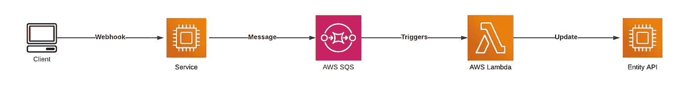

# 使用 AWS Lambda 和 Go 的 AWS SQS 批次消费者

> 原文：<https://betterprogramming.pub/aws-sqs-batch-consumer-using-aws-lambda-and-go-b747795afccd>

## 如何一次消费几条消息


Emile Perron 在 [Unsplash](https://unsplash.com?utm_source=medium&utm_medium=referral) 上的照片

有时，当与一些 HTTP API 集成时，在执行业务流的同时发送请求并不重要(同步流)。有些请求甚至可以成批分组并最终发送出去(异步流)。下面是*事件驱动设计*，可以帮你解决这个问题。但是怎么做呢？如何将几个请求一批分组？在这篇文章中，我将描述我的经历，以及我如何用现实生活中的例子来处理它。

# 概观

前段时间我集成了拥有某个领域模型的 API(我就叫它*实体 API* )。它很宽，允许您执行几乎所有的 CRUD 操作，并将它们分组为批处理。在单个 HTTP 请求的范围内，可以更新、添加和删除三个不同的实体。但是当然，我不是这样用它的。

我做过一个监听 HTTP webhook 的服务，当它被触发时，我必须做很多事情。我必须做的一件事是使用实体 API 更新模型。接下来是对更新的要求:它应该在 webhook 被触发后的前 1 个小时内发生。但是为了简单起见，我在处理 webhook 的范围内更新了实体。

我不得不处理的问题来了。我已经开始收到 429 个 HTTP 响应，负载巨大。我已经超过了实体 API HTTP 速率限制。此时此刻，别无选择。有必要重新实现整合。

# 切换到事件驱动架构

当涉及到实体更新时，我的第一个决定是切换到异步流。更新 SLA 使之成为可能(它是 1 小时)。在这里，我开始寻找一个我可以使用的信息传递服务。

但是在此之前，我也研究过外部 API。正如我之前所说的，它允许在一个批处理中分组几个更新。如果我可以将至少两个更新组合在一个批处理中——这将减少两倍的负载。批量越大，外部 API 的负载就越低！它可以显著降低负载。

所以我不仅需要一个消息代理。我需要一次接收几条消息的能力。首先想到了 **RabbitMQ** 。它允许在没有确认的情况下使用多个消息。因此，您可以将它们收集到内存集合中，对它们进行处理和确认。这意味着应该在应用程序端进行多次消息消费。这是一个选项，但不是我想要的。

我已经开始研究我能用亚马逊 SQS 做些什么。SQS 正是我所需要的。

## 亚马逊 SQS

如果你打开[亚马逊文档](https://aws.amazon.com/sqs/)，它接下来说:

> 亚马逊简单队列服务(SQS)是一种完全托管的消息队列服务，使您能够分离和扩展微服务、分布式系统和无服务器应用程序。SQS 消除了与管理和操作面向消息的中间件相关的复杂性和开销，并使开发人员能够专注于不同的工作。使用 SQS，您可以在任意数量的软件组件之间发送、存储和接收消息，而不会丢失消息或要求其他服务可用。

亚马逊 SQS 可以成为亚马逊 Lambda 的触发器。简单地说，这是另一种 AWS 服务，它允许您在云中运行应用程序代码，而没有基础设施开销。你可以在亚马逊文档和我以前发表的另一篇文章中找到更多的细节:

[](https://aws.amazon.com/lambda/) [## 无服务器计算- AWS Lambda -亚马逊网络服务

### AWS Lambda 无需配置或管理基础设施即可运行代码。只需编写并上传代码作为一个. zip 文件或…

aws.amazon.com](https://aws.amazon.com/lambda/) [](https://awstip.com/building-serverless-c-telegram-bot-3df51b2f4661) [## 构建无服务器 C#电报机器人

### 为什么应该选择 AWS Lambda 来构建 bot

awstip.com](https://awstip.com/building-serverless-c-telegram-bot-3df51b2f4661) 

当我读到如何用来自 SQS 的事件触发 Lambda([链接](https://docs.aws.amazon.com/lambda/latest/dg/with-sqs.html))时，我发现了下面的语句:

> Lambda 成批读取消息，并为每批调用一次您的函数

这正是我所需要的！所以我必须创建一个 SQS 队列，创建 AWS Lambda 并正确配置它。在几条消息发布到队列之后——Lambda 应该以这些消息作为输入参数来执行。

接下来是架构图:



综合

不是从服务直接更新调用实体 API，而是将消息发布到 SQS 队列，最终触发 Lambda。Lambda 将几个事件组合成一个批处理，并执行一个 HTTP 调用来更新所有条目。让我们试着实现它吧！

# 履行

我不能展示真正的代码，但我将使用 Go 实现 Lambda 代码，它将向 SQS 发布消息。了解流程以及如何根据自己的需求进行扩展就足够了。

让我们从您将需要的依赖项开始:

*   `github.com/aws/aws-lambda-go/events`—包为 AWS Lambda 提供输入类型；
*   `github.com/aws/aws-lambda-go/lambda` —包提供了实现 AWS Lambda 的方法。

让我们实现代码。这将是初级的。你可以在下面看到:

希腊字母的第 11 个

`sqsEvent.Records`的单条记录是有字段`Body` *的 SQS 报文。*这是你发布消息时发的内容。它可以是 JSON 或者任何你想要的格式。因此您可以解组它，并以您需要的方式处理它。

## **基础设施**

首先，您需要创建一个 SQS 队列。你需要打开 **AWS 管理控制台**，进入**简单队列服务**，点击**创建队列**。您将需要配置队列。这里就不描述细节了，因为配置取决于你的需求。

之后，你就可以创建 Lambda 了。转到 **Lambda** ，点击 **Create Function** 并创建一个空函数，具有 Go 运行时和消费 AWS SQS 所需的权限(亚马逊 SQS 轮询器权限)。

现在您可以部署代码了。您需要执行以下命令来创建部署代码所需的工件:

```
GOOS=linux go build main.go
zip function.zip main
```

然后打开创建的 Lambda 并选择上传自。zip 文件。最后但同样重要的是，您需要配置触发器。单击添加触发器，选择 SQS 作为源，选择 SQS 队列并提供附加配置:批处理大小和批处理窗口。批处理大小是一次从流中读取的最大记录数。Batch window 是调用函数之前收集记录的最长时间，以秒为单位。

就是这样。现在，您需要让您的应用程序向 SQS 队列发布消息。下面是我用来测试 Lambda 的示例控制台应用程序:

出版

AWS SDK(至少在 Go 中)允许你一次发布十条消息。所以在实现代码时要小心。

## 测试

我已经将 lambda 配置为一次处理 20 条消息。在您发布大量消息并检查日志后，您将看到类似于我所看到的内容:

```
Messages count: 16
Messages count: 14
Messages count: 2
Messages count: 20
...
```

AWS 不保证 lambda 总是在消息计数等于批处理大小的情况下执行。在我的场景中，这并不重要。您还应该知道，标准的 SQS 队列不能保证顺序，并且一条消息可以被传递多次。这对您的系统设计至关重要。

# 结论

Amazon Web Services 提供了许多可以用来开发应用程序的服务。您可以结合 AWS Lambda 和 AWS SQS 的优势来构建健壮、有弹性、可伸缩的系统，以应对大负载。

# 资源

[](https://aws.amazon.com/sqs/) [## 亚马逊 SQS |消息队列服务| AWS

### 微服务、分布式系统和无服务器应用程序的完全托管消息队列 Amazon Simple Queue…

aws.amazon.com](https://aws.amazon.com/sqs/) [](https://aws.amazon.com/lambda/) [## 无服务器计算- AWS Lambda -亚马逊网络服务

### AWS Lambda 无需配置或管理基础设施即可运行代码。只需编写并上传代码作为一个. zip 文件或…

aws.amazon.com](https://aws.amazon.com/lambda/)  [## 事件

### const(CodeBuildEventSource = " AWS . CodeBuild " CodeBuildStateChangeDetailType = " CodeBuild 生成状态更改"…

pkg.go.dev](https://pkg.go.dev/github.com/aws/aws-lambda-go/events)  [## 希腊字母的第 11 个

### 此部分是空的。此部分是空的。func Start(处理程序接口{}) Start 接受一个处理程序并与一个…

pkg.go.dev](https://pkg.go.dev/github.com/aws/aws-lambda-go/lambda)