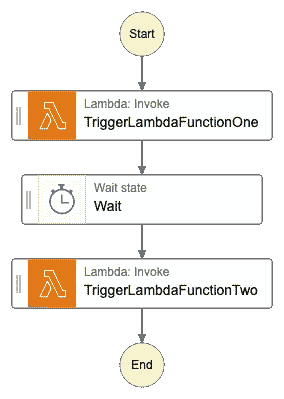
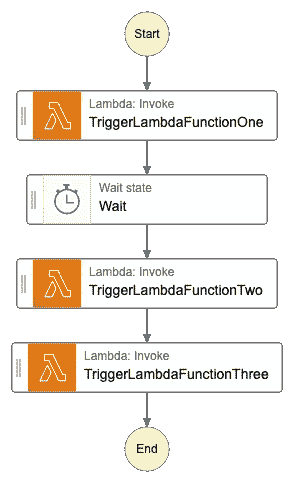

# AWS 步骤功能—当您的状态机更新时，活动执行会受到影响吗？

> 原文：<https://betterprogramming.pub/aws-step-functions-are-active-executions-affected-when-your-state-machine-gets-updated-bafa41b4b256>

## 不，不总是！

戴维·拉古萨在 [Unsplash](https://unsplash.com?utm_source=medium&utm_medium=referral) 上的照片

AWS Step Functions 是一种无服务器的编排服务，有助于构建包含连接不同 AWS 服务的各种步骤的工作流。这些步骤在[状态机](https://docs.aws.amazon.com/step-functions/latest/dg/amazon-states-language-state-machine-structure.html)中定义，将在[亚马逊国家语言(ASL)](https://docs.aws.amazon.com/step-functions/latest/dg/concepts-amazon-states-language.html) 中实现。

步骤函数中有两种类型的工作流:

1.  快递流程
2.  标准流程

在[众多差异](https://docs.aws.amazon.com/step-functions/latest/dg/concepts-standard-vs-express.html)中，特快流最多只能跑五分钟，标准流最多可以跑一年。

因为即使五分钟也是一段很长的时间，所以当状态机被更新时，有可能有一个活动的执行。在本文中，我将讨论当状态机被更新时，这样的活动执行是如何受到影响的，以及如何处理这些场景。

假设我们有一个简单的状态机，有两个 Lambda 函数，如下所示。在 Lambda 调用之间有一个三分钟等待时间的“等待”状态。

图 1:具有等待状态的两个 Lambda 函数

# 场景 1

这里，我们将运行上面的状态机，当有一个活动的执行时，我们将通过在第二个 Lambda 函数之后添加第三个 Lambda 函数来更新状态机。

图 2:用第三个 Lamba 函数更新的状态机

结果是活动执行不受影响。

*原因是当一个新的执行被初始化时，步进功能保持状态机的“快照”，并且对状态机的任何更新都不会影响该“快照”*

# 场景 2

这里，我们将运行图 1 中的状态机，这一次我们将保持状态机不变，但是，我们将更新第二个 Lambda 函数代码。

结果是活动执行受到影响。

*原因是尽管 Step 函数在执行开始时保存了状态机的“快照”,但状态机中的 Lambda 函数是用它们的 arn 引用的。这是 Lambda 的最新版本。因此，如果 Lambda 函数被更新，它会影响正在运行的执行，因为它总是引用 Lambda 的最新版本。*

# Lambda 函数更新时如何防止修改活动执行？

对此有一个简单的解决方案:使用 Lambda 版本。

在部署时，创建一个 Lambda 版本，并在状态机中，用 ARN 中的版本引用 Lambda 函数。

例:*arn:AWS:lambda:[region]:[account id]:函数:[functionName]:[Version]*

这种实现的一个例子是这个 CDK 代码片段。

以前(无 Lambda 版本):

现在(对于 Lambda 版本):

# 结论

当在步骤函数中使用 Lambda 函数时，使用 Lambda 函数版本来确保任何活动的执行不受 Lambda 更新的影响。

相反，如果你需要用最新的 Lambda 代码更新任何活动的执行，不要使用 Lambda 函数版本。

# 资源

1.  AWS 步骤功能快速与标准工作流程:[https://docs . AWS . Amazon . com/Step-Functions/latest/DG/concepts-Standard-vs-Express . html](https://docs.aws.amazon.com/step-functions/latest/dg/concepts-standard-vs-express.html)
2.  文档—亚马逊州语言:
    https://docs . AWS . Amazon . com/step-functions/latest/DG/concepts-Amazon-States-Language . html
3.  文档—状态机:
    [https://docs . AWS . Amazon . com/step-functions/latest/DG/Amazon-States-language-State-Machine-structure . html](https://docs.aws.amazon.com/step-functions/latest/dg/amazon-states-language-state-machine-structure.html)