# 使用 AWS Lambda 和 Node.js 发出外部 HTTPS 请求

> 原文：<https://betterprogramming.pub/aws-tutorial-about-node-js-lambda-external-https-requests-logging-and-analyzing-data-e73137fd534c>

## 记录和分析您的数据


照片由[卡拉·伍兹](https://unsplash.com/@kharaoke?utm_source=unsplash&utm_medium=referral&utm_content=creditCopyText)在 [Unsplash](https://unsplash.com/s/photos/external?utm_source=unsplash&utm_medium=referral&utm_content=creditCopyText) 上拍摄

# 利用 AWS 架构

在[的上一篇文章](https://medium.com/javascript-in-plain-english/create-a-server-less-api-in-10-minutes-4a4cf012eeda)中，我们学习了如何创建 Node.js Lambda 函数，以及如何将其与 HTTP API 网关连接。我们的 Lambda 看起来像这样:

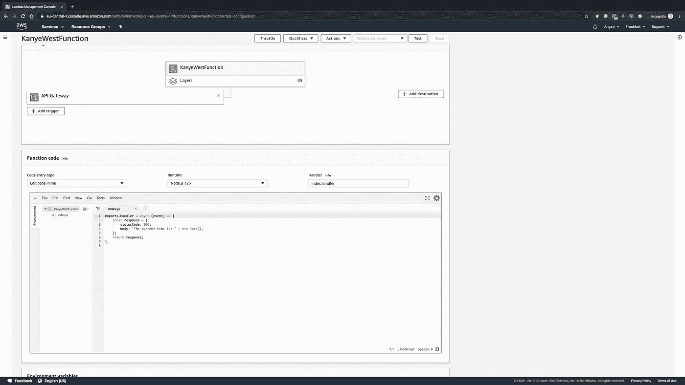

来自[之前教程](https://medium.com/javascript-in-plain-english/create-a-server-less-api-in-10-minutes-4a4cf012eeda?source=friends_link&sk=48b473cd4a1dcf7fe26820bd20b920ea)的 Lambda

如果您刚刚加入我们，只需创建一个基本的 Lambda 并将其连接到一个新的 HTTP API 网关，或者按照本教程[进行操作](https://medium.com/javascript-in-plain-english/create-a-server-less-api-in-10-minutes-4a4cf012eeda?source=friends_link&sk=48b473cd4a1dcf7fe26820bd20b920ea)。

# 步骤 1:使用 CloudWatch

您可能已经访问过触发 Lambda 函数的 HTTP 端点。但是如果没有，只需点击 API 端点的链接。这样做之后，会自动为您生成一个日志。AWS 的伟大之处在于，许多这些东西都是开箱即用的。要查看此请求的日志，请从 AWS dashboard 转到 CloudWatch 服务(您可以从标题中的 services 按钮搜索 CloudWatch)，然后单击左侧窗格中 Logs 内的 Log Groups 子部分。一旦向 API 端点发出请求，您应该会看到 lambda 函数的名称出现在列表中。点击它，你会被带到一堆日志组。如果你有一个小数字，这意味着你有少量的请求。这就是我的情况。你可以在这里看到:

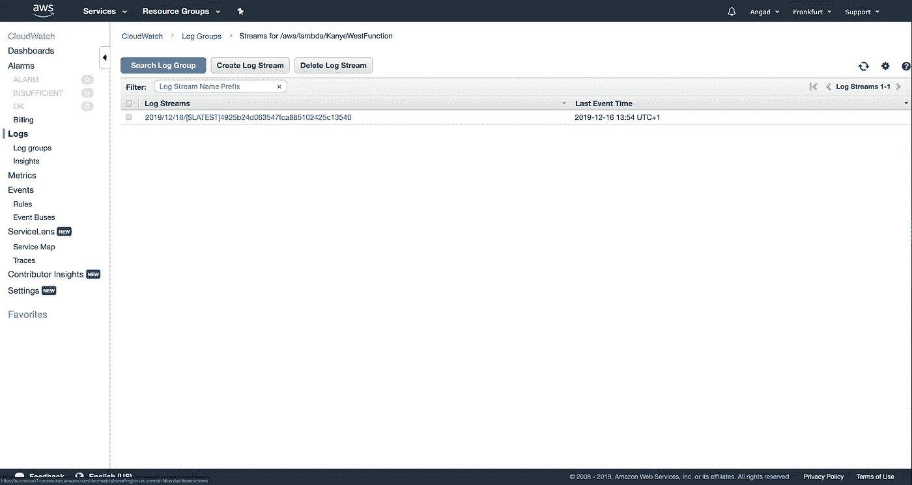

Lambda 函数的所有日志组

要一次搜索所有这些内容，请单击“搜索日志组”按钮。您现在可以看到您的请求日志:

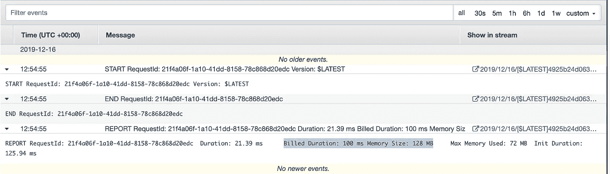

你的 Lambda 日志

一件很棒的事情是，你可以看到你将被收费多少。AWS 每月为我们提供 100 万个免费请求和 400，000 GB 秒的计算时间，这就是我们使用它的原因。但是如果你确实超过了这个限制，你可以通过查看你的计费持续时间并将其与他们的[定价方案](https://aws.amazon.com/lambda/pricing/)进行交叉引用，来确定你将为每个典型请求支付多少钱。

# 步骤 2:自定义日志记录输出

所有这些记录的信息都很棒，但是如果我们可以记录我们自己的信息(例如，以匿名的方式记录我们用户的信息，这样我们就可以利用这种洞察力来改进我们的产品，或者记录请求是否成功)，这不是很酷吗？让我们实现一个基本版本。为此，让我们回到 Lambda 函数的代码，在服务部分搜索 Lambda 并选择相关的 Lambda。我们可以简单地通过使用 Node.js 中的`console.log`来记录我们需要的任何信息。

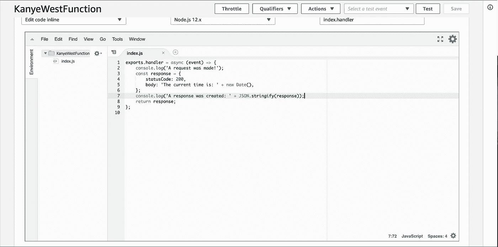

带有日志输出的 Lambda 代码

一旦您编辑了您的 Lambda 以包含您需要的日志输出，记得单击 Save 按钮，这样就可以部署更改了。保存后，让我们通过单击我们的 API 端点 URL 发出另一个请求，然后返回到 CloudWatch 来查看日志现在的样子:

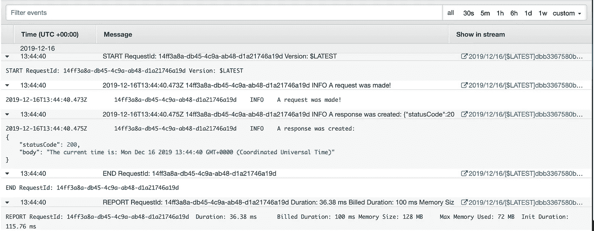

我们的自定义日志记录输出

显然，这个日志输出不是很有用，但是如果您的 Lambda 函数做一些稍微复杂一点的事情，比如从 DynamoDB 检索数据或与另一个服务通信，那么记录该服务或数据查询的输出以及任何异常可能非常有用。

# 步骤 3:记录 HTTP 响应

为了记录更复杂的信息，让我们也把 Lambda 复杂化，这样记录的输出就更有意义。让我们使用 Lambda 调用外部 HTTPS API 并检索我们需要的数据。为此，让我们使用一个名为 [PokeAPI](https://pokeapi.co/) 的免费 API，它为我们提供了关于神奇宝贝的信息。在 Node.js 中进行 HTTPS 调用非常容易。这可以通过使用`https`核心模块来完成:

```
const ***https*** = ***require***('https');

let dataString = '';

const req = ***https***.get("https://pokeapi.co/api/v2/pokemon/ditto", function(res) {
  res.on('data', chunk => {
    dataString += chunk;
  });
  res.on('end', () => {
    ***console***.log(dataString);
  });
});

req.on('error', (e) => {
  ***console***.error(e);
});
```

让我们在 Lambda 函数中使用类似的代码。为了成功做到这一点，我们将使用 [ES7 异步等待函数](https://developer.mozilla.org/en-US/docs/Web/JavaScript/Reference/Statements/async_function)。在 lambda 中调用 PokeAPI 等待其响应后，我们希望将响应返回给用户。我们可以通过编写如下所示的 Lambda 代码轻松做到这一点:

```
const https = require('https');exports.handler = async (event) => {
    let dataString = '';

    const response = await new Promise((resolve, reject) => {
        const req = https.get("[https://pokeapi.co/api/v2/pokemon/ditto](https://pokeapi.co/api/v2/pokemon/ditto)", function(res) {
          res.on('data', chunk => {
            dataString += chunk;
          });
          res.on('end', () => {
            resolve({
                statusCode: 200,
                body: JSON.stringify(JSON.parse(dataString), null, 4)
            });
          });
        });

        req.on('error', (e) => {
          reject({
              statusCode: 500,
              body: 'Something went wrong!'
          });
        });
    });

    return response;
};
```

注意，我们是从一个字符串解析 JSON，然后仅仅出于美观的目的再次进行字符串化(在每个变量之间留出四个空格)。在我们的 AWS 屏幕中，它看起来像这样:

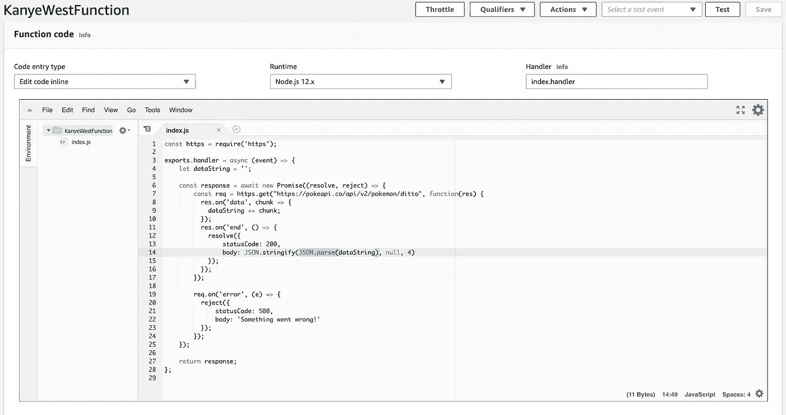

Lambda 函数中的 HTTPS 调用

然而，我们目前还不能从用户那里获得输入。让我们在下一步中这样做。

# 步骤 4:接受用户输入

您可能已经注意到，处理函数接收一个名为 event 的参数。让我们记录这个对象，看看里面是否有我们可以使用的东西。在 Lambda 函数中做任何事情之前，我们可以简单地添加一个`console.log(event);`。代码现在看起来像这样:

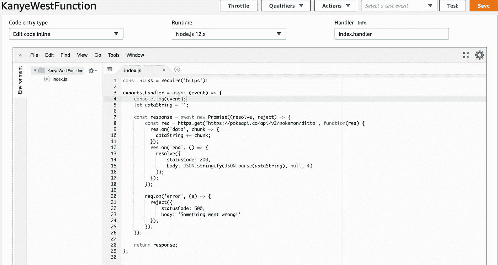

在我们的 Lambda 中记录事件对象

保存这些更改并向我们的 API 端点 URL 发出另一个请求，我们可以看到我们在最新的 CloudWatch 日志中获得了整个事件对象。该对象内部还有一个`queryStringParameters`字段，在本例中为 null(显然是因为我们没有在请求中发送任何查询参数)。我看起来是这样的:

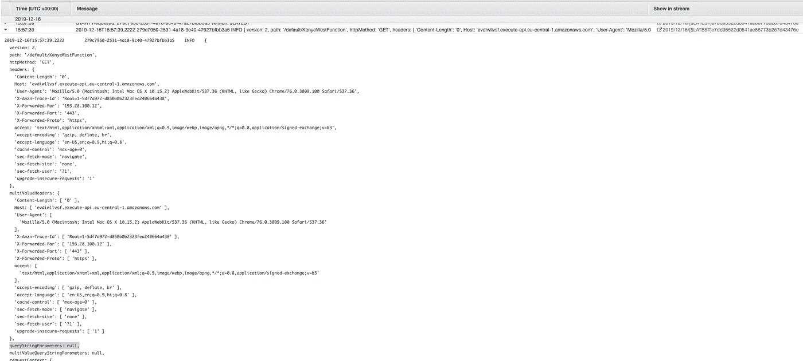

最新的云观察日志

现在，让我们通过浏览器对我们的 API 端点 URL 进行另一次调用，方法是复制粘贴我们在触发器部分找到的 URL:

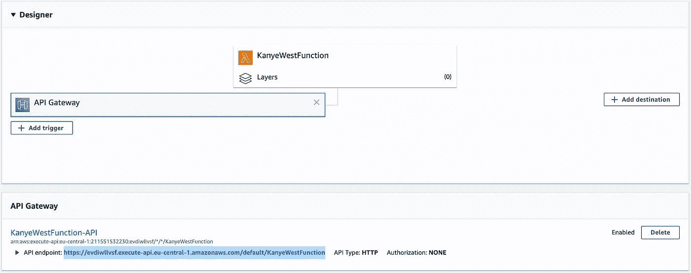

API 端点 URL。

但是，让我们在请求中添加一个查询参数，而不是按 enter 键。显然，我们可以将这个查询参数命名为任何我们喜欢的名称，但是让我们使用一些有意义的名称。我选择了`name`，并给了它一个值`pikachu`。于是我在浏览器里的网址是这样的:[https://evdiwllvsf . execute-API . eu-central-1 . amazonaws . com/default/KanyeWestFunction？name =皮卡丘](https://evdiwllvsf.execute-api.eu-central-1.amazonaws.com/default/KanyeWestFunction?name=pikachu)

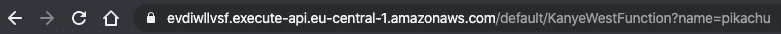

让我们按回车键。显然，在这个阶段，我们仍然得到口袋妖怪`ditto`而不是`pikachu`的相同响应，因为我们没有在 Lambda 中编写任何逻辑来根据请求的实体名称更改 API hit，但让我们仍然来看看我们最新的 CloudWatch 日志:

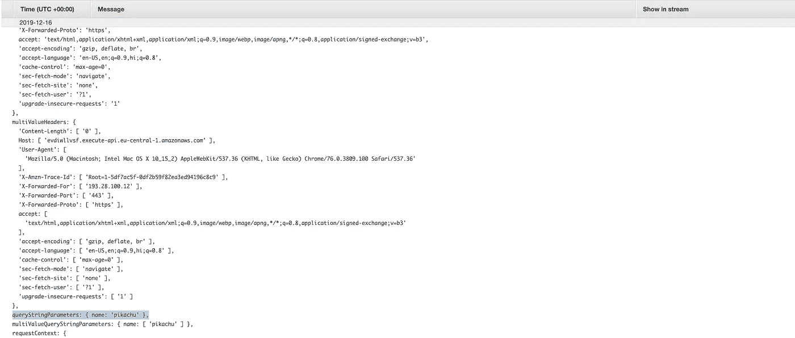

带有查询参数的 CloudWatch 日志

现在我们可以看到`queryStringParameters`更有意义，我们确实看到了添加到请求中的`name`查询参数。既然我们现在可以访问它，我们也可以用它来请求我们喜欢的口袋妖怪使用 PokeAPI。让我们将 Lambda 函数的代码改为:

```
const https = require('https');exports.handler = async (event) => {
    console.log(event);
    let dataString = '';

    const response = await new Promise((resolve, reject) => {
        const { queryStringParameters } = event;
        if (!queryStringParameters || !queryStringParameters.name) {
            resolve({
                statusCode: 400,
                body: 'Please provide a Pokemon name!'
            })
        }
        const req = https.get(`[https://pokeapi.co/api/v2/pokemon/${queryStringParameters.name}`](https://pokeapi.co/api/v2/pokemon/${queryStringParameters.name}`), function(res) {
          res.on('data', chunk => {
            dataString += chunk;
          });
          res.on('end', () => {
            resolve({
                statusCode: 200,
                body: JSON.stringify(JSON.parse(dataString), null, 4)
            });
          });
        });

        req.on('error', (e) => {
          reject({
              statusCode: 500,
              body: 'Something went wrong!'
          });
        });
    });

    return response;
};
```

让我们保存这些更改，并使用查询字符串参数关键字`name`和值`pikachu`再次调用我们的 API URL。有用！我们这次用经典皮卡丘口袋妖怪的数据得到了成功的回应:

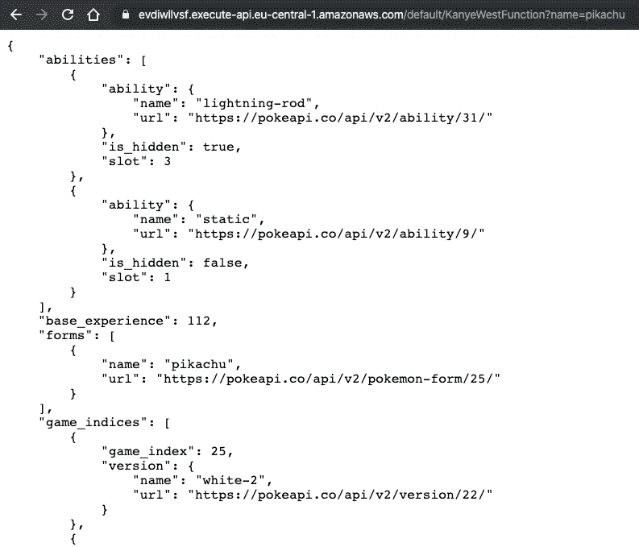

对“皮卡丘”的回应

如果我们删除`name`查询参数，就会得到我们定义的响应:

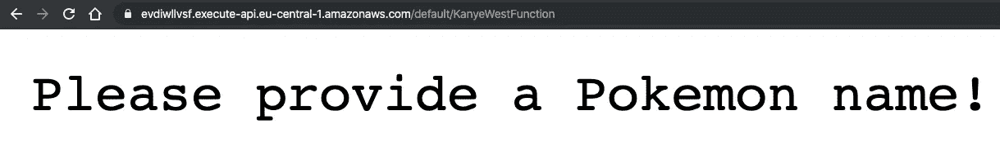

400 错误请求响应

# 步骤 5:记录有意义的数据

因此，在使我们的 Lambda 函数复杂化之后，我们没有改变任何日志记录。首先，让我们删除关于`event`对象的日志记录，然后添加关于我们用户的有意义的日志记录。我通过添加人类可读的日志输出来做到这一点。所以我把 Lambda 代码改成:

```
const https = require('https');exports.handler = async (event) => {
    let dataString = '';

    const response = await new Promise((resolve, reject) => {
        const { queryStringParameters } = event;
        if (!queryStringParameters || !queryStringParameters.name) {
            console.log('BadRequest');
            resolve({
                statusCode: 400,
                body: 'Please provide a Pokemon name!'
            })
        }
        const req = https.get(`[https://pokeapi.co/api/v2/pokemon/${queryStringParameters.name}`](https://pokeapi.co/api/v2/pokemon/${queryStringParameters.name}`), function(res) {
            res.on('data', chunk => {
                dataString += chunk;
            });
            res.on('end', () => {
                console.log('OK');
                console.log(JSON.stringify({ name: queryStringParameters.name }));
                resolve({
                    statusCode: 200,
                    body: JSON.stringify(JSON.parse(dataString), null, 4)
            });
          });
        });

        req.on('error', (e) => {
            console.log('ServerError');
          reject({
              statusCode: 500,
              body: 'Something went wrong!'
          });
        });
    });

    return response;
};
```

在这三种不同的情况下，我们记录有意义的输出:

1.  如果这个用户提出了一个错误的请求(没有口袋妖怪的名字)
2.  如果响应成功并且用户请求了哪个口袋妖怪
3.  响应不成功

我保存了这段代码，然后向我们的 API 发出了几个请求，这样 CloudWatch 中就有了大量的日志信息。我的日志现在看起来像这样:

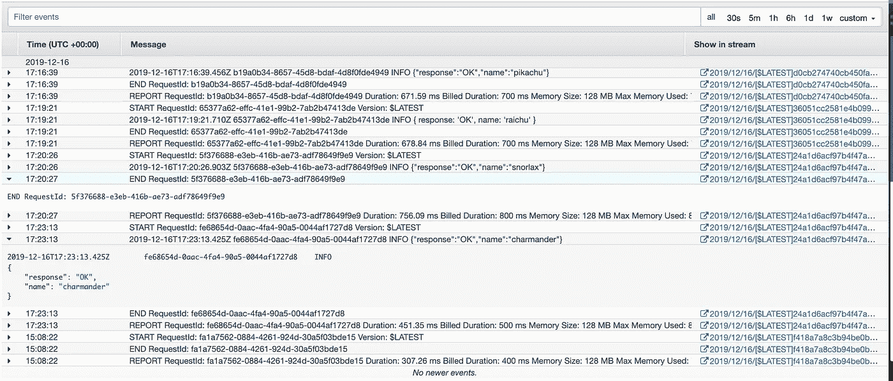

记录这 3 个场景的输出

# 步骤 6:分析我们的数据

现在，为了分析事情，我们可以简单地在日志中搜索。例如，我搜索`BadRequest`，发现有一个用户提出了一个糟糕的请求(没有口袋妖怪名称)。嗯？我想知道那是谁😁。在我们的例子中，显然唯一的用户是我们(您！)所以我们在日志中只得到一个条目:

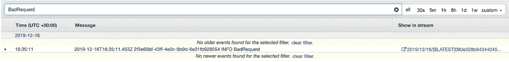

搜索结果

但是让我们想象一下，我们的应用程序非常成功，有好几个用户。看一堆日志是没用的。因此，我们应该做的是转到页面左侧窗格中日志组子部分下的见解子部分。在此页面上，让我们从顶部的选择日志组搜索输入字段中选择 Lambda 函数的名称。如果您随后在不更改默认查询的情况下单击 Run Query，响应应该如下所示:


查询我们的数据

我们可以将查询改为有意义的内容；例如，查看它们有多少 OK 响应。该查询现在看起来像这样:

```
fields [@timestamp](http://twitter.com/timestamp), [@message](http://twitter.com/message)
| filter [@message](http://twitter.com/message) like /OK/
| sort [@timestamp](http://twitter.com/timestamp) desc
| limit 20
```

这样的输出是:

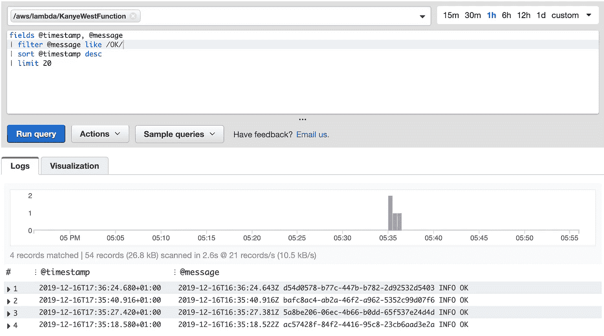

来自我们的 Lambda 的所有“OK”响应

请注意，所有 OK 响应都是最近才有的。这是因为在最后一次代码迭代之前，我们没有在 Lambda 函数中记录 OK。我们再对不同的神奇宝贝做一些 API 请求，重复几个。然后，让我们给它几分钟来注册。现在，运行相同的查询将返回几个结果。如果我们愿意，甚至可以将限制从 20 更改为 40，或者取消对结果数量的任何限制。我们可以从输入的右上角切换到 6h 或您想要的任何时间，而不是查询最近 1h 的数据。现在，由于在我们的 Lambda 函数代码中，我们还通过执行以下操作将名称记录为 JSON stringified 对象:

```
console.log(JSON.stringify({ name: queryStringParameters.name }));
```

这意味着我们可以查询和显示被请求的神奇宝贝的名称。为此，让我们重写我们的查询:

```
fields [@timestamp](http://twitter.com/timestamp), name
| filter  ispresent(name)
| sort [@timestamp](http://twitter.com/timestamp) desc
```

结果更有见地:

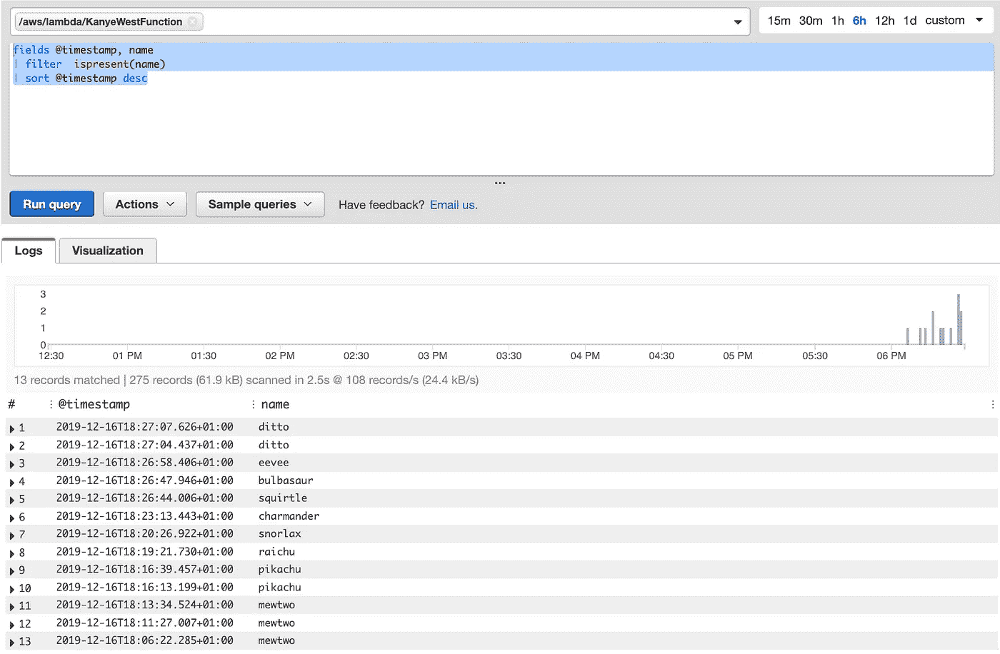

神奇宝贝查询显示他们的名字

现在，我们可以看到被请求的不同神奇宝贝及其名称。

# 前进

我们也可以使用 AWS 的这个 Insights 工具来为我们创建可视化，但这更复杂，我觉得本教程已经涵盖了足够多的内容。让我们把它留到下一天，我们将从这些数据中创建图表和可视化。