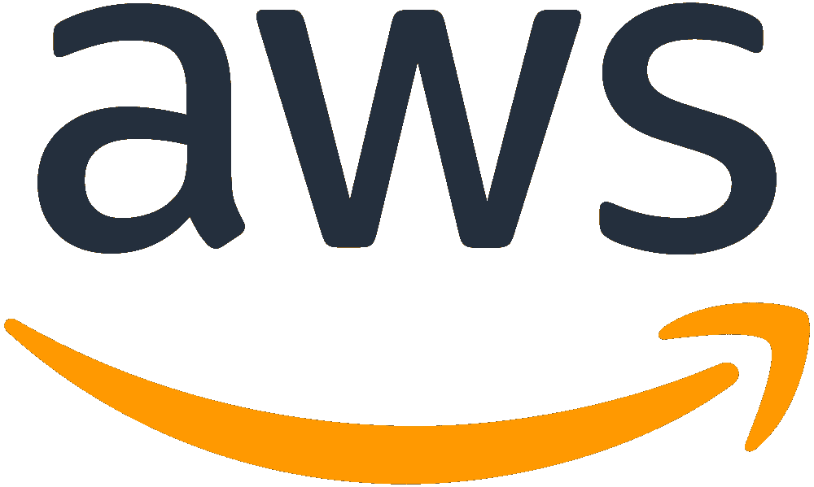
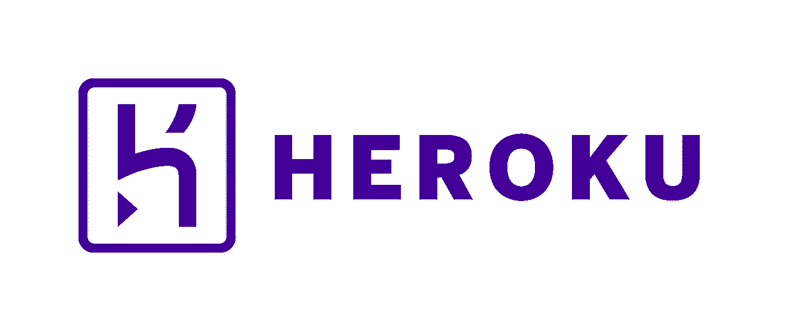

# AWS vs Azure vs Firebase vs Heroku vs Netlify——如何选择 Web 项目的最佳平台

> 原文：<https://betterprogramming.pub/aws-vs-azure-vs-firebase-vs-heroku-vs-netlify-how-to-choose-the-best-platform-for-web-projects-482d017de254>

## 决定选择合适的平台需要考虑很多因素

Javier Allegue Barros 在 [Unsplash](https://unsplash.com/search/photos/choice?utm_source=unsplash&utm_medium=referral&utm_content=creditCopyText) 上拍摄的照片

近年来，Web 和移动开发已经取得了长足的进步。现代 web 应用程序通常基于强大的 JavaScript 特性构建，如 [Angular](https://angular.io/) 、 [React](https://reactjs.org/) 和 [Vue.js](https://vuejs.org/) 。虽然您可以在任何地方托管这些 web 应用程序，但您可能需要的不仅仅是托管。不同的大型云公司，如谷歌、亚马逊和微软，几乎可以提供你想要的任何东西，而 Netlify 等即将到来的竞争对手则希望为建设现代网站提供令人印象深刻的 UX。

在本文中，我想把重点放在基于 web 的项目上。我们将关注以下平台:

*   **亚马逊网络服务(AWS)**
*   **微软 Azure**
*   **Firebase /谷歌云平台**
*   **Heroku**
*   **网络生活**

请记住，这只是对这个主题的一个简短介绍。根据您的项目规模和需求，需要考虑许多因素，例如:

*   成本:有些平台开始时很便宜，但是当你使用得越多，价格就越贵
*   性能:一些平台比其他平台表现更好
*   **特点**:虽然一些平台有更专注的焦点(例如网络项目)，但一些更大的平台希望为你提供全套服务解决方案，让你留在他们的生态系统中
*   **您所在地区的供货情况**(例如，由于 GDPR 等法规)
*   **合规性& IT 安全性**(例如 [ISO/IEC 27001](https://en.wikipedia.org/wiki/ISO/IEC_27001) 认证)
*   **支持**:遇到问题时，非常感谢伟大的客户支持

让我们开始吧，看看这些平台能为我们做些什么。

图片来源:亚马逊

# 亚马逊网络服务(AWS)

[亚马逊网络服务](https://aws.amazon.com/?nc1=h_ls)进入云计算市场已经有一段时间了。不管你需要什么:AWS 可能会提供。AWS 提供许多名字很酷的产品，例如:

*   *亚马逊 S3* (云存储)
*   *亚马逊 EC2* (虚拟服务器)
*   亚马逊 DynamoDB (托管 NoSQL 数据库)
*   *AWS 设备群*(在 AWS 云中的真实设备上测试 Android、iOS 和 web 应用)

网飞、联合利华和三星使用 AWS。你可以得到一年的免费时间，这应该有足够的时间来掌握。然而，由于 AWS 这些年来已经发展了很多，其用法并不总是直观的。

AWS 符合 ISO 27001 和 SOC2 标准

图片来源:微软

# 微软 Azure

[**微软 Azure**](https://azure.microsoft.com/en-gb/) 是顶尖的云计算平台之一。与 AWS 类似，Azure 拥有你需要的一切。微软为初创公司提供特殊项目，这些项目提供对 Azure 服务的免费有限访问。Azure 提供的服务包括:

*   *Azure Kubernetes 服务*(简化 Kubernetes 的部署、管理和运营)
*   *Azure DevOps* (为团队共享代码、跟踪工作和发布软件提供的服务)
*   网络应用(大规模快速创建和部署网络应用)
*   Azure Cosmos DB (全球分布式多模型数据库)

Adobe、宝马和惠普等领先公司依赖 Azure。微软在 B2B 领域有很好的声誉，这就是为什么许多大公司更喜欢微软 Azure。与亚马逊类似，Azure UI 相当复杂，这对新用户来说可能是一个挑战。

图片来源:Firebase/谷歌

# Firebase /谷歌云平台

[Firebase](https://firebase.google.com/) 是谷歌旗下的开发平台。从技术上来说，Firebase 使用的是谷歌云平台。PayPal、Twitter 和 Target 都是谷歌云的客户。得益于谷歌的经验，Firebase 提供了许多有用的服务，如:

*   *云功能*(运行代码不管理服务器)
*   测试实验室(在谷歌托管的设备上测试你的应用)
*   *谷歌分析*(免费和无限制的应用分析)
*   *ML 套件*(面向移动开发者的机器学习)

许多开发人员喜欢 Firebase，因为它有强大的工具和强大的 Google 基础设施。然而，特别是由于 GDPR 和日益严格的数据保护政策，一些公司希望避免使用谷歌基础设施。

作为一个谷歌产品有它的优点和缺点，这也适用于 Firebase。尽管 Firebase 似乎表现得相当好，但我们都知道不符合预期的谷歌产品会发生什么。

图片来源:Heroku

# 赫罗库

[Heroku](https://www.heroku.com/home) 是 Salesforce 旗下的平台即服务，sales force 是一家美国基于云的软件公司，因其 CRM 解决方案而闻名。Heroku 的免费版本很适合实验，但是服务器在一段时间不活动后会休眠。有许多免费和付费的[插件](https://elements.heroku.com/addons)，它们提供额外的功能，如:

*   *阿帕奇卡夫卡*
*   *MongoDB*
*   *新遗迹*
*   *发送网格*

虽然 Heroku 在开始时相当独特，但在创新和竞争方面已经放缓。

Heroku 支持大多数流行的语言，如 Java、Python 和 JavaScript。此外，Heroku 提供了一个 CLI，您可以使用它通过一个命令进行部署。已知 Citrix、丰田和 Unsplash 使用 Heroku。

[有趣的事实:Heroku 的物理基础设施由亚马逊的安全数据中心管理，并利用 AWS 技术。](https://www.heroku.com/policy/security)

图片来源:Netlify

# 网络生活

Netlify 是一个相当新的竞争者。免费版已经很慷慨了，不像 Heroku 的免费版，没有睡觉。UX 和 Netlify 提供的功能使使用它变得无缝和直观。Netlify 提供的一些强大的附加组件有:

*   *分析*(符合 GDPR 标准)
*   *功能*(AWS Lambda 功能的简单部署)
*   *表单*(无需服务器端代码或 JavaScript 的表单和提交管理)
*   *身份*(注册、登录、密码恢复等管理，无需定制认证服务)

不利的一面是，像微软和亚马逊这样的云提供商提供了比网络项目更多的功能。此外，你也不能使用其他编程语言，如 Java 或 C#，因为 Netlify 提倡使用 [JAMstack](https://jamstack.org/) 。但是，您可以使用函数来替代服务器端语言，如 Java 或 C#。

像 WeWork、威瑞森和耐克这样的公司都是 Netlify 的用户。此外，一些流行的开源项目如 [Vue.js](https://vuejs.org/) 和 [Kubernetes](https://kubernetes.io/) 已经决定使用 Netlify。

我之前写过一篇关于如何在 Netlify 上部署 Angular app 的文章:

 [## 如何将 Angular app 部署到 Netlify

### Angular 是创建企业级 web 应用程序的好选择。我在找…的时候偶然发现了 Netlify

itnext.io](https://itnext.io/how-to-deploy-an-angular-app-to-netlify-6db8c3d133e5) 

# 结论

如你所见，有很多选项可供选择。

*   对于托管网络应用， **Netlify** 已经成为我最喜欢的平台。它速度快，支持力度大，使用简单。此外，该产品增长迅速。
*   当我需要托管一个基于 [Node.js](https://nodejs.org/en/) 的后端时，Heroku 是我的首选平台。如果你想在几分钟内轻松启动并部署微服务，我推荐 Heroku
*   Firebase 是一个有趣的平台，我还没有在更大的项目中使用过。这是一个很好的入门选择，尤其是如果你正在开发 Android 和 iOS 的移动应用程序。
*   如果你在一个大型项目中工作，或者如果你需要 Azure 和 AWS 提供的大量功能和产品，Azure 和 AWS 是合理的选择。Azure 和 AWS 在 IT 安全与您高度相关的情况下(例如银行)也表现得更好，因为它们比 Netlify 等年轻竞争对手的安全标准更高。

正如我所说的，在为 web 项目选择平台时，你需要问自己很多重要的问题。某些方面可能比其他方面更重要，这取决于你的情况:如果你是一家初创公司，你更希望找到一个简单而廉价的解决方案，而更大的项目和公司通常需要更复杂的功能和安全标准。

你用的是哪个平台？请在评论中告诉我你的经历。