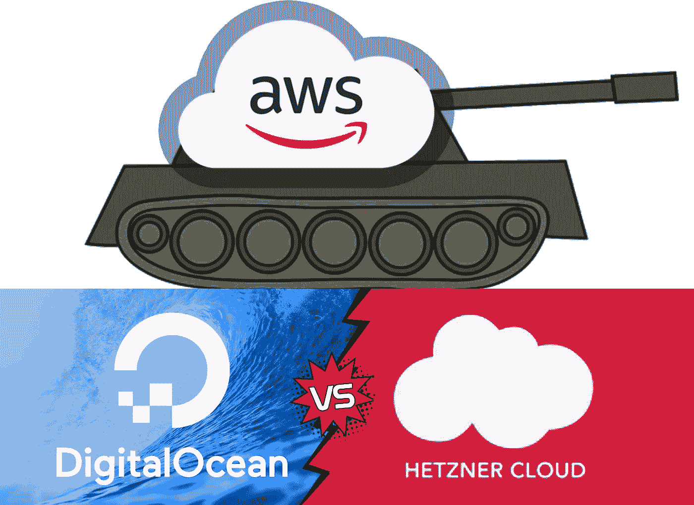
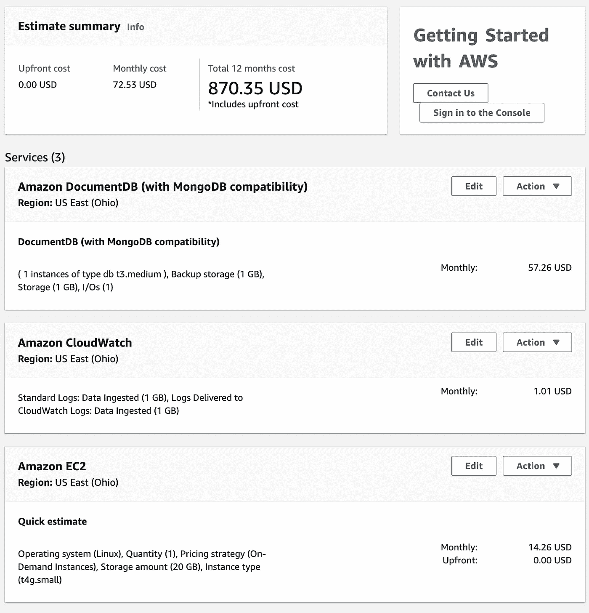
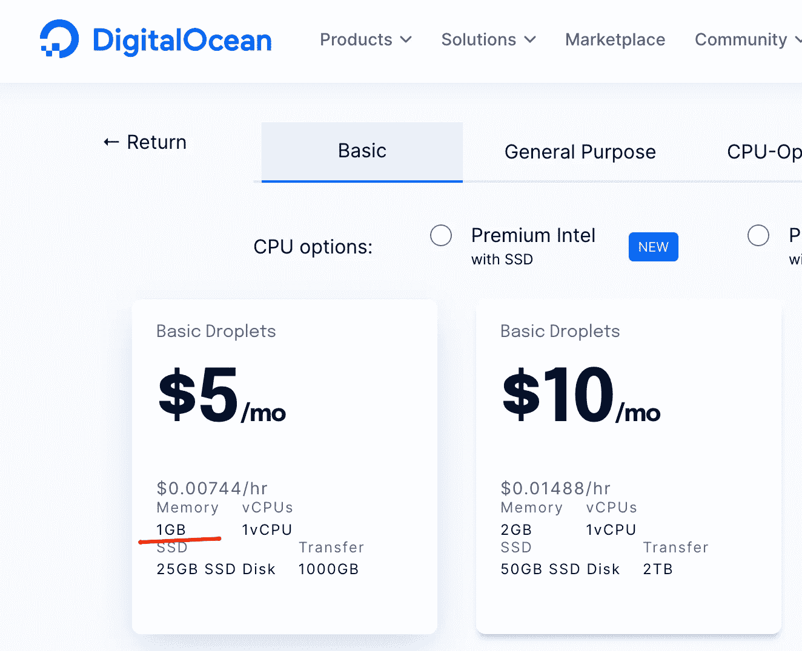
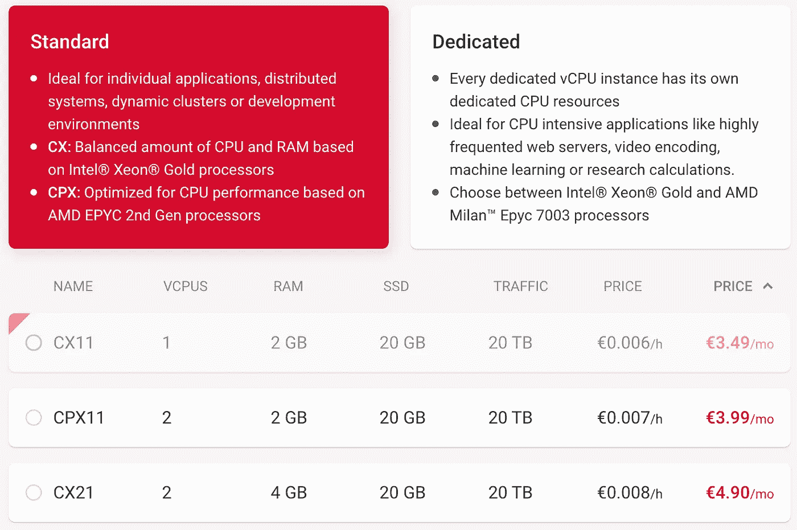
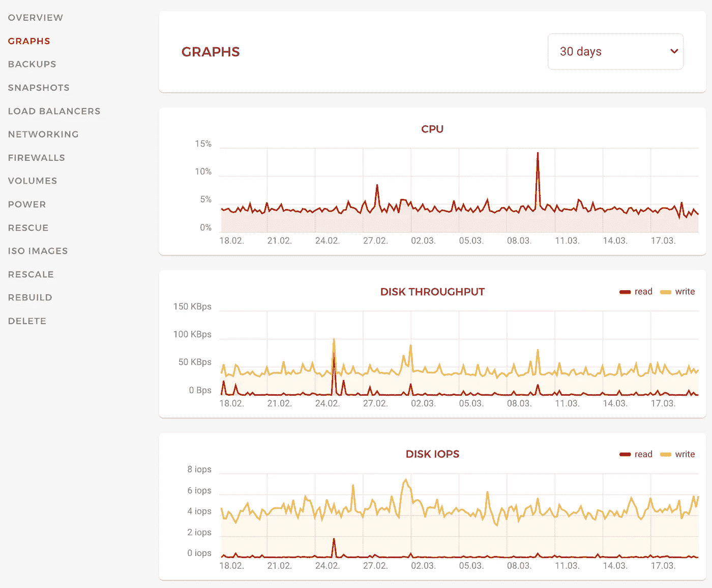

# AWS vs . Digital Ocean vs . Hetzner Cloud——哪个最物有所值？

> 原文：<https://betterprogramming.pub/aws-vs-digital-ocean-vs-hetzner-cloud-which-has-the-best-value-for-money-bd9cb3c06dee>

## 如果你正在寻找一个便宜而可靠的云提供商来托管你的伟大的应用程序，不要担心，我已经找到了。

作者创造的形象

> 我喜欢有选择，但不喜欢选择——弗拉德·米科尔

尽管所有这些云提供商对于每种规模都有不同的选择，但今天我将向您展示我与他们合作的经验，专注于最低价格的最佳选择，因为低预算对于小型创业公司或像我一样拥有自己的宠物项目至关重要。

# 亚马逊网络服务

当我在寻找一个服务器来托管我的应用程序时，我首先想到的是 AWS，所以我花了一段时间进行试用，并启动了我的第一个 [EC2](https://aws.amazon.com/ec2/) 实例。的确，AWS 是托管您的企业解决方案、自动化许多事情、使其可伸缩、高度可用并防止故障的绝佳场所。但是你从一开始就需要这些昂贵的额外津贴吗？在大多数情况下，答案会是——不，只要你能在未来进化并走向这一步。

> 成为敏捷意味着从非常基本、简单和廉价的东西开始，以便将来发展和升级

不久之后，我意识到我每月最低的 AWS 账单超过了 70 美元，对于一个非盈利的宠物项目来说，这实在是太大了。

[https://calculator.aws](https://calculator.aws/#/)

您可能会发现这里最贵的是 DocumentDB，但是除此之外，我必须在 EC2 实例上安装 MongoDB，这已经超出了我的 DevOps 技能范围，并且可能会花费很多时间，所以我甚至没有考虑这个选项。

# 数字海洋

 [## AWS 与 DigitalOcean:哪个云服务器更好

### 数字海洋和 AWS 哪个云服务器更好，完全取决于您的项目需求和合规性。

medium.com](https://medium.com/hackernoon/aws-vs-digitalocean-which-cloud-server-is-better-1386499a6664) 

当我开始四处挖掘时，我的朋友推荐我探索数字海洋，他的公司在他们的新项目中广泛使用了这种技术。在第一眼看到[的定价](https://www.digitalocean.com/pricing)页面后，我意识到它甚至比 [AWS Spot EC2](https://aws.amazon.com/ec2/spot/) 实例更便宜，但不用担心在高需求下[会随时被撤下](https://spot.io/what-are-ec2-spot-instances/#:~:text=AWS%20can%20%E2%80%9Cpull%20the%20plug%E2%80%9D%20and%20terminate%20spot%20instances%20with%20just%20a%202%20minute%20warning)。

数字海洋价格概述

我真正喜欢数字海洋的是他们的一键应用程序。这只是一件简单的事情，开始创建您真正的应用服务器，没有太多的麻烦。

 [## 数字海洋市场|一键式应用、工具和框架

### 流行的工具开发人员需要更快地完成工作——只需点击一下就可以部署。

www.digitalocean.com](https://www.digitalocean.com/products/marketplace) 

我在这里选择了最便宜的带有 1GB 内存的 droplet 选项。当我最终使用 [Dokku](https://marketplace.digitalocean.com/apps/dokku) 部署我的第一个 Java Spring Boot 应用程序时，它不断耗尽内存，因为 1GB 对几乎任何东西来说都太小了，所以我不得不重新调整为 10 美元和 2GB 内存。这只是一个简单的工作。

不幸的是，数字海洋没有像 AWS 一样的[所谓的 SLA，但我的应用程序在这里运行了大约 1 年，在此期间我没有任何停机时间。](https://aws.amazon.com/compute/sla/?did=sla_card&trk=sla_card)

# 赫茨纳云

过了一会儿，我遇到了一个家伙，他告诉我关于[海兹纳云](https://www.hetzner.com/cloud)的事情。他在这里托管自己的创业基础设施，每天有数百名用户，主要来自欧洲。他对他们的低价服务有很好的反馈。

大多数 Hetzner 服务器位于德国，这里最小的服务器已经有 2GB 的内存，价格甚至不到 5 美元。第二天，我的服务器已经以测试模式在 Hetzner 中运行了。

我的 Hetzner 云调整面板

我仍然使用 [Dokku](https://dokku.com/) 来照顾所有的 DevOps 员工，与数字海洋的唯一区别是[首先安装 Dokku 自己](https://dokku.com/docs/getting-started/installation/#installing-the-latest-stable-version)，因为这里没有一键应用程序。

除此之外，它拥有在云中启动应用程序所需的所有要素，以及负载平衡器、备份、图形仪表板和网络。

我的海兹纳云面板

所以我会说，赫茨纳云与数字海洋一样，但不太受欢迎，因此更便宜。我的应用已经在这里运行了 4 个月(截至 2022 年 3 月)，现在，我对它的稳定性和性能非常满意。

# 最后的想法

您必须根据自己的需求选择云提供商:

1.  AWS —如果您有一个大型企业应用程序，并且希望将其从内部迁移到云或工厂，以实现快速增长。
2.  数字海洋——如果您刚刚开始应用程序，并且正在寻找一个便宜而可靠的云，并且需要最少的启动资源。
3.  赫茨纳云—与数字海洋一样，但更便宜。

你可能已经猜到了，赫茨纳是我目前主持我最喜欢的项目的地方，这也是我推荐小项目或初创公司作为低预算选择的地方。

> 我将很高兴听到并考虑您在评论中对您或您的朋友接触过的任何其他简单、可靠的云提供商的建议，以及为什么它们优于上述提供商。