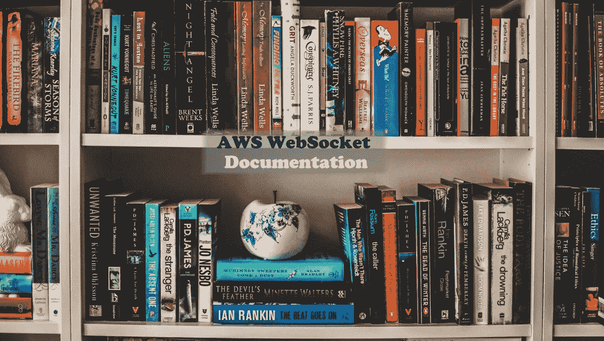
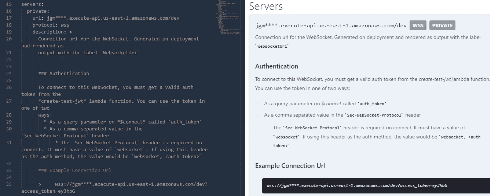
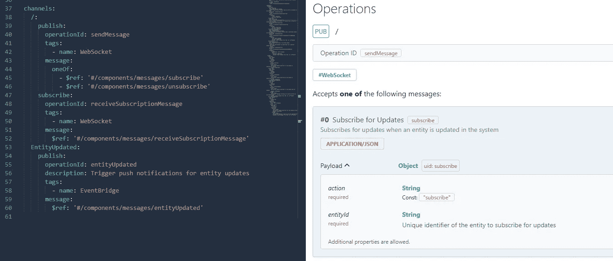
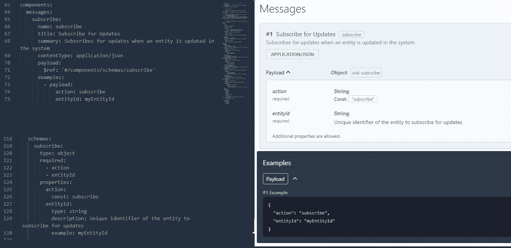

# AWS WebSockets:使用异步 API 规范编写文档

> 原文：<https://betterprogramming.pub/aws-websockets-writing-documentation-using-async-api-spec-6c4ccc77f20>

## 对于一个优秀的 API 来说，一个关键但经常被忽视的部分是文档。探索如何用异步 API 规范正确地记录事件驱动的架构



由 [Aneta Pawlik](https://unsplash.com/@anetakpawlik?utm_source=unsplash&utm_medium=referral&utm_content=creditCopyText) 在 [Unsplash](https://unsplash.com/s/photos/bookshelf?utm_source=unsplash&utm_medium=referral&utm_content=creditCopyText) 上拍摄的照片

还记得你最后一次与第三方 API 集成吗？你是怎么做到的？容易吗？

任何整合的第一步都是*查看文档*。如果没有文档，您成功集成该服务的可能性大约为 0%。

开发人员最讨厌的一部分软件，就像编写单元测试一样，是构建 API 规范文档。不幸的是，如果你想在你的集成商中取得任何成功，这是必须的。

在使用[开放 API 规范](https://www.openapis.org/)之前，我曾经写过关于 REST APIs 的[文档过程](/api-first-development-build-consistent-meaningful-apis-with-postman-db7d1e9e8b5c)的博文。这是一个了不起的工具，[允许你轻松地扩展它](/how-to-create-an-extension-for-your-open-api-specification-fc5f51c82bb8)来满足你的需求。

但是我们处在一个不同的世界，有了 WebSockets。这不是你奶奶以前学校的 API。这就是 AWS 中的[事件驱动架构](https://aws.amazon.com/event-driven-architecture/)。这是一个完全不同的游戏。

我们将关注如何使用[异步 API 规范](https://www.asyncapi.com/)来记录 API。这个规范允许我们定义描述消费者如何与系统交互的`channels`而不是`endpoints`。

如果你没有跟上，这是 AWS WebSockets 系列介绍的第三部分。我强烈建议你阅读前两部分，因为每篇文章都是建立在前一篇文章的基础上的。

*   [第一部分——构建一个 WebSocket](/introduction-to-aws-websockets-8b336a92c379)
*   [第二部分—保护您的网络插座](/using-authoriser-for-aws-websockets-caf7a0441c8e)

# 异步 API 规范

到目前为止，我们在 AWS 中构建的 API 有两个基于事件的交互:

*   用户可以订阅实体更新的 WebSocket
*   在 WebSocket 中触发推送通知的 EventBridge 事件

对于传统的开放 API 规范，我们没有任何选项来通知消费者关于模式、连接信息或与事件的可能交互。这不是该规范所要描述的。该规范描述了同步 REST API 端点。

然而， [Async API 规范](https://www.asyncapi.com/docs/specifications/v2.3.0)正是为了做到这一点而设计的。它记录了驱动行为的事件，并说明了用户可以在我们的 WebSocket 上进行的`publish`和`subscribe`交互。

要开始使用我们的 WebSocket 规范，用下面的命令检查 [GitHub](https://github.com/allenheltondev/serverless-websockets) 中`serverless-websockets` repo 的 [part-three](https://github.com/allenheltondev/serverless-websockets/tree/part-three) 分支:

```
git fetch 
git checkout part-three
```

*注意——这里假设您已经* [*克隆了存储库*](https://docs.github.com/en/repositories/creating-and-managing-repositories/cloning-a-repository) *并且在您的机器上本地可用*

# 规格组件

异步 API 规范由几个不同的组件组成。这些组件提供了关于 API 不同方面的信息。下面我们将讨论为 WebSocket 提供文档所需的所有相关部分。

任何 API 规范的第一部分都是描述通用目的。告诉消费者 API 的目标是什么。在我们的例子中，我们提供了一些高级信息，告知用户规范中包含了什么。


*规格版本、标题、API 版本、描述和内容类型*

该规范支持`description`组件中的 [Markdown](https://spec.commonmark.org/0.30/) ，因此您的文档可以显示丰富的格式化文本。

# 连接详细信息

可以说，规范中最重要的部分是连接信息。消费者必须知道如何连接到 API，以及每个环境的基本 url 是什么。

这包含在规范的`servers`部分。因为我们的 WebSocket API 要求提供一个`access_token`，所以我们必须在这里包含它。



*描述连接 url、协议和认证方法*

对于具有安全连接的 WebSockets，您将总是使用 [wss 协议](https://portswigger.net/web-security/websockets/what-are-websockets)。未加密的连接使用`ws`协议。因为我们的 WebSocket API 有一个安全的连接，并且需要一个 auth 令牌，所以我们在这里使用了`wss`。

# 列出事件

对于异步 API 规范，事件包含在`channels`中。通道是在事件驱动的 API 中组织事件的一种简单方式。对于我们的用例，我们希望在一个通道中包含与 WebSocket 相关的所有事件，在另一个通道中包含触发推送通知的 EventBridge 事件。



*我们的 WebSocket 的通道及其相应的事件*

每个*通道*中包含`publish`和`subscribe`的选项。从规范消费者的角度来看，包含在`publish`部分下的事件意味着消费者可以将该事件发布到 API。包含在`subscribe`部分的事件是消费者将从 API 收到的事件。

在我们的规范中，我们希望让消费者知道他们将使用什么 AWS 服务来发布或订阅特定事件。这是通过使用`tags`完成的。在每个*通道*的每个`publish`或`subscribe`部分下，我们包含一个标签，说明触发事件的系统。

## 用 JSON 模式描述事件

为了给我们规范的消费者提供最佳体验，我们必须描述 API 消费/产生的事件模式。为此，我们在规范的`messages`部分描述了有效载荷。

正如我们在上面的截图中看到的，每个*频道*的`publish`和`subscribe`部分包含一个消息的引用(`$ref`)。引用包含特定于该消息的信息，如标题、*摘要*，以及我们想要提供给消费者的任何*示例*。



*JSON 模式中订阅事件的消息和模式*

`payload`对象包含对描述事件属性的 [JSON 模式](https://json-schema.org/)对象的引用。这允许使用者确切地知道如何在发布时定义事件，或者如何编写使用订阅事件的代码。甚至还有在线的[工具](https://json-schema-faker.js.org/)从 JSON Schema 中生成示例([反之亦然](https://www.liquid-technologies.com/online-json-to-schema-converter))。

对于在`publish`或`subscribe`部分包含多条消息的通道，可以使用 JSON 模式`oneOf`对象。这向消费者发出信号，通过该通道发布或订阅的消息可能是各种各样的事情之一。

只要你在`messages`和`schema`部分明确定义了你的信息，你的消费者就会知道该用什么！

# 建立你自己的

有时候，从头开始创建一个新的规范，甚至对现有的规范进行更新，都不是最简单的任务。幸运的是，有一些免费的工具可以让你使用起来更容易。

文档是集成商成功的关键，无论是内部还是外部。如果你的事件和联系信息没有在任何地方被记录，你最终会依赖于[部落知识](https://www.lucidchart.com/blog/what-is-tribal-knowledge)，这很难在内部维护，也不可能在外部维护。

感谢 Async API，我们能够清楚地说明我们的事件模式是什么，各种*通道*是什么，消费者可以发布或订阅哪些事件，以及发布或订阅需要什么服务/媒介(EventBridge 或 WebSocket)。

既然我们已经有了 WebSocket 的文档，我们可以合理地假设内部和外部的团队都可以连接并使用它。

# 后续步骤

我们的 WebSocket 之旅还没有结束。接下来，我们将添加特定于用户的通知，并向 WebSocket 添加一个自定义域。本系列的最后一部分将讨论如何将一个长期运行的同步端点转移到一个带有 WebSocket 通知的异步工作流中，以告知用户整个过程的进展情况。

感谢您和我一起探索 AWS WebSockets。我希望你继续享受更新，并跟随到底。

编码快乐！