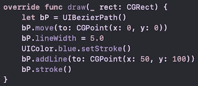
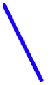
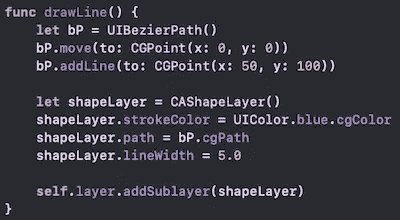
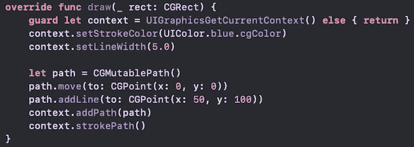
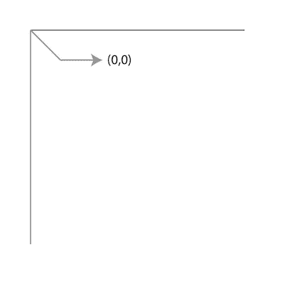
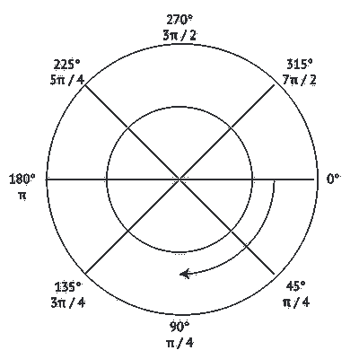
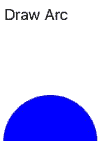

# 使用核心图形的贝塞尔路径和曲线

> 原文：<https://betterprogramming.pub/b%C3%A9zier-path-and-curves-using-core-graphics-268fbb77dd80>

## 提供优秀的界面

[克里斯托弗·坎贝尔](https://unsplash.com/@chrisjoelcampbell?utm_source=medium&utm_medium=referral)在 [Unsplash](https://unsplash.com?utm_source=medium&utm_medium=referral) 上的照片

难度:初级|简单| **普通** |挑战

# 先决条件:

*   能够[创建一个单视图应用](https://medium.com/swlh/your-first-ios-application-using-xcode-9983cf6efb71)，并且本教程期望你能够适应[子类化 UIView](https://medium.com/@stevenpcurtis.sc/subclassing-uiview-d372c67b7f3)

# 术语

贝塞尔曲线:用于创建矢量图形的线或路径

CGContext:一个图形上下文，包含在目标上绘制所需的绘制参数

示例应用程序展示了几种创建贝塞尔路径和贝塞尔曲线的方法，显示在[可滚动 stackview](https://medium.com/@stevenpcurtis.sc/create-a-uistackview-in-a-uiscrollview-e2a959fa061) 中。

# 核心显卡？

在 Swift 中绘制贝塞尔路径有三种方法

*   在`UIView`子视图上下文中使用`draw(_:)`方法
*   创造和使用`CAShapeLayer`
*   创建并使用一个`CGContext`上下文

# 循序渐进的例子— `draw(_:)`

使用`draw(_:)`的简单行相对简单，因为`UIBezierPath()`直接写在根层上，因此使用当前上下文，因此不需要显式传递。`stroke()`使用当前贝塞尔路径的属性将 UIBezierPath 添加到当前上下文中。太好了！

以下示例使用此方法在屏幕上生成一行:

[点击查看要点](https://gist.github.com/stevencurtis/12ca659d6d2d3ca99a30f4f2b7229e24)

这样做的结果是一条简单的蓝线(从屏幕的左上角开始)。

虽然`draw(_:)`是一种很好的方式，因为它提供了上下文，但是重写`draw(_:)`也会有性能损失，因为`draw(_:)`可以被多次调用。不要害怕，还有其他的方法！

# 循序渐进示例— `CAShapeLayer`

常见的方法是创建一个`UIBezierPath()`，然后将其分配给一个`CAShapeLayer()`。将成形层创建为子层(而不是遮罩，稍后将详细介绍)。

[点击查看要点](https://gist.github.com/stevencurtis/317bd4b318aec468aaf5e7532ea7e055)

由于`CAShapeLayer`是一个`CALayerSubclass`，我们有机会制作一些有趣的动画。

如果我们想从初始化器中调用这个函数，我们可以。这里的第一个将从编程实例化中调用 drawLine，第二个从故事板中调用它。

# 循序渐进的例子— `CGContext`

这实际上是第一个例子的扩展，因为`draw(_:)`有一个内置的上下文(`UIView`图形上下文！)我们可以只要求那个。这就允许我们把`setStrokeColor(_:)`和`setLineWidth(_:)`放在上下文中。我们可以注意到，我们使用的是`UIColor`的`cgColor`变体，同样我们添加了一个`CGMutablePath`，它(重要的是)被添加到上下文中，尽管这仍然需要通过`strokePath()`方法来绘制。

请注意，这里我们使用了一个`CGMutablePath()`来创建我们的行，并完全避免使用`UIBezierPath()`！

[点击查看要点](https://gist.github.com/stevencurtis/5b683bc0fb88f1bdde54f975504450cd)

因为`CGPath`是核心图形的一部分，它比单独使用`UIBezierPath()`更加灵活。

# 考虑

## 坐标系统

在 iOS 中，与我们从通常的数学中所了解的相比，许多事情都是颠倒的。以坐标系为例:当在 iOS(垂直轴)中向底部移动时，Y 值增加，而在笛卡尔坐标系(数学)中 Y 值减少。

顺便说一下，原点将在设备方向的左上角。

这很重要，因为如果你在`UIView`中操作，你需要使用`func move(to point: CGPoint)`(同样的文档提到我们必须在当前坐标系中)。所以那个画线函数？

将`UIBezierPath`移动到原点，然后移动到(50，100)。所以我们期待在这个视图的左上角有一些动作(当然取决于主机`UIView`的大小)。

## 旋转

贝塞尔路径弧以顺时针方向创建。这实际上是核心图形世界中的弧度(这总是有用的，因为它将长度和角度结合成一种度量，但那是另一种情况)。

这意味着零度真的面向“左边”。

如果我们想画一条弧线

它在应用程序上给出的结果(如 repo[https://github . com/stevencurtis/swift coding/tree/master/BezierPathShapeLayers](https://github.com/stevencurtis/SwiftCoding/tree/master/BezierPathShapeLayers))在屏幕上显示如下模式:

也就是说，圆弧从右侧 0 处开始，并旋转 180°。

# 理论—核心图形与贝塞尔路径

## 贝塞尔路径

`UIBezierPath()`是一种基于矢量的路径，可用于矢量形状(如矩形)或更复杂的路径。这些可以使用路径本身的绘图属性来填充。包含属性包括`lineWidth`、`lineJoinStyle`、`lineCapStyle`、`miterLimit`和`flatness`。`UIBezierPath()`是`UIKit`的一部分而不是核心图形。

## CG 上下文

因为一个`CGContext`表示应该在哪里画点什么，并且上下文可以被告知具体要画什么。绘制位图图像、PDF 文件和(本文的重点)绘制到一个`UIView`有特定的上下文。当您设置填充颜色或线条宽度时，该设置在整个上下文中保持不变(当然，直到它被更改)。

## CGMutablePath

这是(obvs。)CGPath 的可变版本，它是可以在特定上下文中绘制的形状的数学描述。绘图属性是 CGContext 的一部分，而不是 CGPath 的一部分；也就是说，CGPath 没有任何线条粗细或颜色属性。

## 核心图形

Core graphics 是一个有趣的框架，可以用来定制你的 UI，甚至可以在你使用的时候添加很棒的动画效果。这当然是一个伟大的方式来绘制形状和创造形状与梯度和…等等…

# 结论

像编程中的许多事情一样，这很容易或很难，就像你希望的那样。换句话说，当你做对了，你就做了一次。换句话说，复杂性让事情变得更简单。换句话说，按你的方式去做。换句话说:您需要在您的特定项目中选择最后两个实现中的哪一个。你决定！

如果你有任何问题，我很乐意在 Twitter 上听到你的声音。

使用[订阅媒体这个链接](https://stevenpcurtis.medium.com/membership)与我分享一些收入。

# 扩展你的知识

*   [苹果公司已经在概念上创建了关于在 iOS 中绘制](https://developer.apple.com/library/archive/documentation/2DDrawing/Conceptual/DrawingPrintingiOS/GraphicsDrawingOverview/GraphicsDrawingOverview.html#//apple_ref/doc/uid/TP40010156-CH14-SW5)的文档