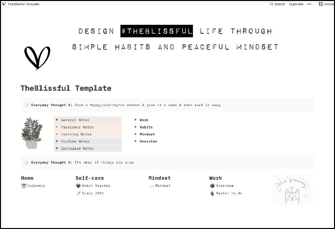
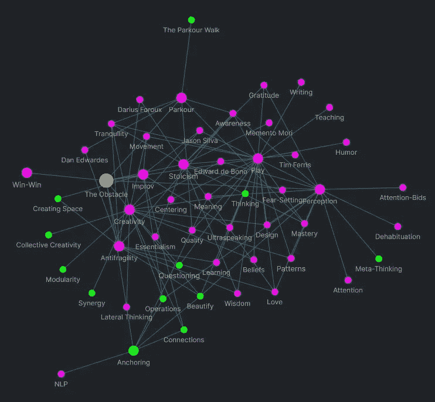
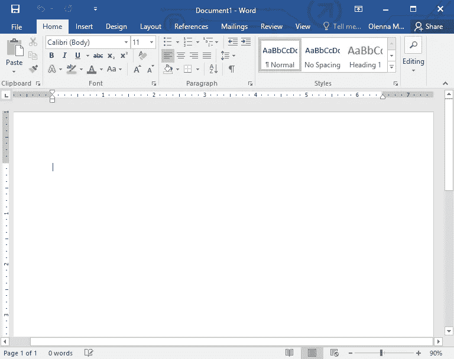
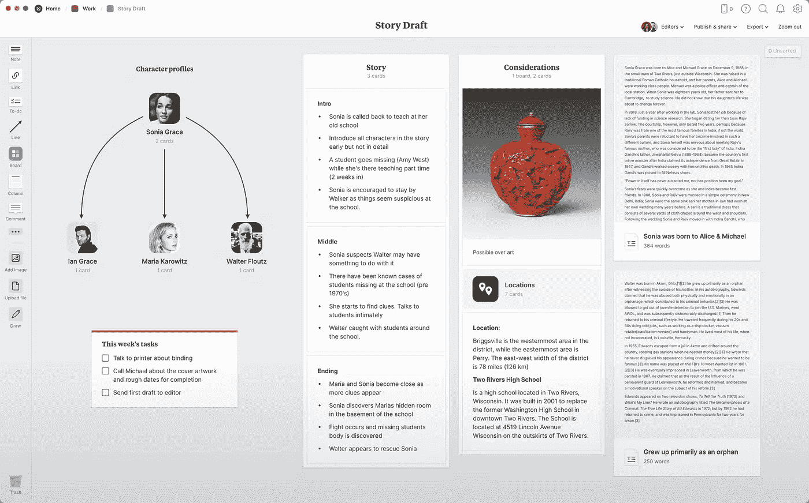
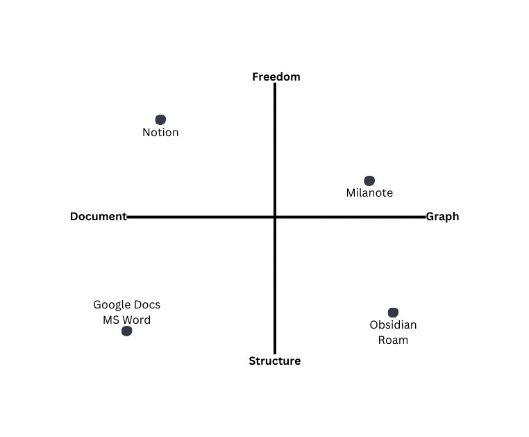
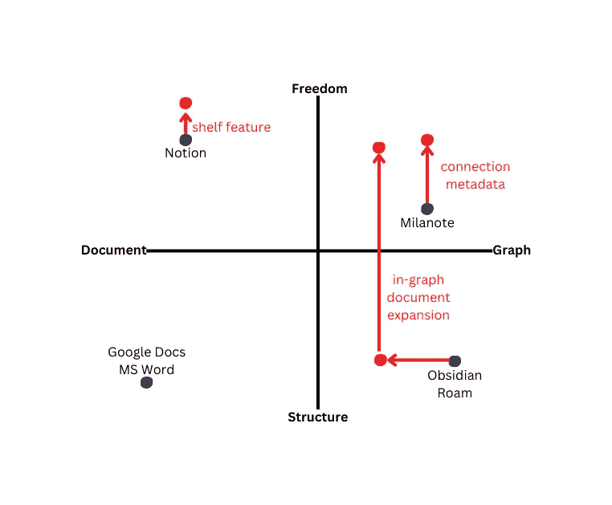

# Baby GraphIQal 迈出第一步:我们的愿景和竞争

> 原文：<https://betterprogramming.pub/baby-graphiqal-takes-its-first-steps-vision-competition-c94eceb8fc43>

## 将我们的视野缩小到具体的特征

照片由[冉贝尔科维奇](https://unsplash.com/@berko?utm_source=medium&utm_medium=referral)在 [Unsplash](https://unsplash.com?utm_source=medium&utm_medium=referral)

我几乎希望我能从大学退学，过上全职黑客马拉松式的生活。当你同时在读大学时，进步是缓慢的，杰西和我在黑客马拉松结束后很快就意识到了这一点([，在此期间进步非常快，非常专注](https://medium.com/better-programming/a-baby-graphiqal-and-the-36-hours-that-preceded-it-8a574f5cac73))。

这就像是突然猛踩 GraphIQal 上的刹车，让进度慢得像爬行一样。看看我们面前的东西，有很多，我是说有很多要学和要做。一切都还没有决定，从我们将使用的后端到我们将包括的功能，甚至是任何一种完全成熟的 GraphIQal 看起来会是什么样子的想法。我们只能说，我们在黑客马拉松中产生的大部分代码是，呃，不可用的。

在一个两人的团队中，我对成为开发和决策制定中不可或缺的一部分的前景感到兴奋，同时对这一切的可行性表示极度怀疑。但是，我知道，作为一名程序员和产品开发人员，这段旅程无疑对我的成长是无价的。所以，我们一头扎了进去(事实上，扎得更深。至少在头深的情况下，你仍然可以看到你上方的水面。

我们最初的几次图形会议包括发散、扩展和构思(也就是说，极客出… *很多*)。我们让我们的思想漫游到我们想要 GraphIQal 做的疯狂酷的东西上。我们生成了一个又一个列表，一个又一个想法和草图的列表(它们已经在我的概念的虚空中消失了)。不久之后，我们终于决定是时候融合了。是时候关注 GraphIQal 将会是什么样子了，并开始朝着它慢慢前进。

照片由[雷·轩尼诗](https://unsplash.com/@rayhennessy?utm_source=medium&utm_medium=referral)在 [Unsplash](https://unsplash.com?utm_source=medium&utm_medium=referral) 上拍摄

# 决定我们的愿景

任何设计过程的第一步都是能够从一个非常高的层面清晰地阐述产品的愿景和价值。

因为 GraphIQal 处于如此抽象的空间，所以在我们考虑做客户研究之前，我们需要能够向自己解释 GraphIQal 的最终目标是什么。这将形成我们产品的精髓:在决策的任何十字路口，我们都可以参考的关键思想。

这是亚特兰大一个明媚的早晨，我们坐在星巴克，拿出杰西的漂亮 iPad，问自己一些将会塑造 GraphIQal 旅程的问题。这些包括但不限于:

1.  我们在解决什么问题？
2.  谁有这个问题？
3.  我们试图建立什么，为什么？
4.  我们不想建造什么？

这些问题的答案，以及我们在 GraphIQal 的 [Hackathon 版本中实现的功能的潜意识灵感，将形成我们的使命宣言，我们现在在做决策时会更有意识和有目的地使用它。这是我们定居的地方:](https://medium.com/better-programming/a-baby-graphiqal-and-the-36-hours-that-preceded-it-8a574f5cac73)

GrapIQal 旨在解决自由形式的头脑风暴和构思时的结构僵化问题。我们的目标是将技术的力量与纸张的流动性和自由性结合起来，以便能够几乎完全按照我们在大脑中看到的那样来表达思想和想法。然后我们把我们的目标和价值观分成两类:使用纸张和使用电脑的优势。

## *论文*

1.  随心所欲安排和组织事物的自由=定制
2.  以多种方式可视化抽象信息

## 计算机

1.  信息量和信息变化的能力
2.  移动、更改和操作屏幕部分的灵活性
3.  自动化有助于思维过程

最后，我们想把这两个元素和*直觉*的想法联系在一起:你大脑中的想法和它在图形中的表达之间的桥梁应该尽可能无障碍。

即使有了这个简单的愿景框架，我们也能够看到我们希望 GraphIQal 长期实现的一切。

在一天结束时，所有的特性都可以归结为这几个目标，老实说，这些目标非常解放，而且*非常*强大。

但是光靠这种高层次的眼光做不了多少事。我们需要更具体地说明软件*实际上会做什么*。其中很大一部分是独立的特性，但是这些特性需要通过一个总体的软件功能联系在一起；换句话说，我们已经回答了这个问题:GraphIQal 将实现什么？现在，我们需要这个问题的答案:那么，GraphIQal 实际上会做什么？

首先，我们需要转移我们的镜头来看看与 GraphIQal *占据相同空间的现有工具已经做了什么。*

[GR Stocks](https://unsplash.com/@grstocks?utm_source=medium&utm_medium=referral) 在 [Unsplash](https://unsplash.com?utm_source=medium&utm_medium=referral) 上拍照

# 看看竞争对手

创始人总是对进入这个领域犹豫不决，因为正如他们所说，无知是一种福气。

通常很难冒险去观察现有产品做得好的地方，更令人畏惧的是，你的愿景中有哪些部分已经被考虑到了。

这源于对意识到你的产品没有任何新的或不同的东西的恐惧——对意识到你在浪费时间的天生恐惧。但是，在一天结束的时候，看竞争产品会更加集中你的视觉；这是非常宝贵的，因为它会帮助你决定到底是什么让你的产品与众不同。

因此，定义产品愿景的一个重要部分就是定义它不是什么。GraphIQal 的目标不是针对任何一个单独的竞争对手，尽管可能会有重叠。关键是找到细微差别和差异所在，并阐明这些差异如何让我们与众不同。

对于 GraphIQal 来说，信息可视化空间已经饱和了:超级成功的巨头，如 concept、Evernote、Obsidian、Muse、Milanote、Roam……我可以继续下去。我和 Jesse 都是书呆子，我们在过去已经使用了大约 1000000 个这样的工具，所以我们非常清楚它们有多成功。

现在相关的问题变成了，是什么让他们如此成功？而且，如果你能弄清楚，*他们在哪里停下来？*正是在他们所遗漏的领域，创新的潜力才得以展现。

让我们从他们做对了什么开始:所有这些工具都有一些非常酷的特性。我们逐一比较了它们的特性，但这里有几个重要的特性:

## 概念

首先——笔记应用中最性感的男人，我永远的迷恋和梦想为之工作的公司(好吧，我不说了):想法。

价值 100 亿美元的概念在很短的时间内呈指数增长。在我们的分析中，我们阅读了公司的历史、愿景和历程。

关于 concept，你很快会注意到的一点是它的直观性和灵活性:它使用简单，几秒钟内，你就可以用一块完全空白的板制作一个个人定制的板，不需要任何编码。我们还讨论了使其具有吸引力的有用的核心特性，比如第三方集成和数据库视图。

根据想法设计的页面

我们想要从概念中适应的是用户体验的直观性和灵活性。但是我们并没有试图去做比概念做得更好的事情(这将是荒谬的)。

GraphIQal 的目标不是成为一个超级疯狂的富文本编辑器，您可以在上面创建奇特的视图。此外，虽然对于简单和复杂的笔记记录，idea 有一个线性的层次结构，但它并没有进入非线性空间，而非线性空间正是我们创造性思维的所在。这是我们希望 GraphIQal 填补的空白。

## 黑曜石

另一个流行的名字是黑曜石。我们关注的 Obsidian 部分主要是图形视图:一种将所有文件作为连接的节点来查看的方式。这景色真是太酷了。

黑曜石的图形视图

在 Obsidian 中，文件可以相互连接和链接。黑曜石还做了非常有趣的事情，它允许你基于标签动态创建数据库，并且(如果你知道如何编码)，你可以集成和创建任何你想要的东西。

检查黑曜石向我们展示了我们在 GraphIQal 背后的疯狂创新的洞察力——思维过程是相互联系的，没有等级之分——并不是那么独特。

像黑曜石这样的现有工具已经抓住了这一点。我们需要更多。这个图表视图中缺少的部分是连接元数据的特性:赋予想法之间的连接以它们自己的个性。

GraphIQal 将关注这一点，允许连接具有类型、描述、方向等等。

完成对各种工具的分析后，我们将它们分成两大类:

## **1。专门从事线性文档风格创建的工具**。

其中包括 idea 和 Evernote，以及基本的 Microsoft Word、Google Docs 等等。单独使用这些工具的问题是，在想法被组织成足够的线性形式之前，它们不能给头脑风暴和想法的早期阶段提供足够的流动性。

Microsoft Word:线性输出

## **2。专门从事自由形式、思维导图风格创作的工具。**

这些包括黑曜石，漫游，米拉 note，和其他。单单这些的问题是它们从来不会导致一个“最终产品”，在大多数情况下，它必须是一个最终的作品，比如一篇研究论文、一本书、一篇博客文章等等。

Milanote:纯白板

**相反，GraphIQal 将这两者结合在一起。**它将负责在图形的非线性视图和更传统的文档视图之间建立桥梁。以下是实现这一点的几种方式:

1.  在图形视图中，用户可以将想法/节点放置在图形上，并根据自己的选择拖动/放置它们。他们将在它们之间建立联系，并能够从更高的层次查看所有这些信息。图上的节点可以扩展以显示它们的文档视图，并且可以就地编辑，就像它们本身就是文档一样。
2.  在文档视图中，用户可以将项目(资源、文本、连接)拖动到文档中或文档周围，对其进行操作，直到完美为止。我们将引入一个“书架”功能，用户可以从他们的文档中放置他们还没有找到位置的块。他们可以查看到当前节点的所有连接，如果愿意，可以将它们放在文档中。这将为文档视图(如概念视图)提供更多的灵活性，在这种视图中，所有内容只能在一个维度上移动。

这些只是我们总体目标的一些具体实现，但是我们希望我们的软件如何运行变得越来越清晰。

为了让我们自己更清楚地了解这些差异，我们将竞争对手放在一个依赖于两个变量的图表上:它们的“文档化”程度(上面的类别 1)与“图表化”程度(上面的类别 2)，以及它们的结构化程度与灵活性程度(它们允许用户有多少可定制性和自由度)。

对我们来说，这些是。由我们的视觉决定的两个最重要的尺度。我们想真正了解现有的工具如何利用计算机的力量而不是纸张，以及它们如何与自由和直觉的关键特征联系起来。其中一些绘制如下:

文件尺度上的竞争->图形与结构->自由

现在，我们讨论了我们想把 GraphIQal 放在哪里。事实上，根据我们的设想，我们希望 GraphIQal 存在于多个地点，以帮助用户满足他们当前的需求。

我们画了箭头(下面红色的)并用特性和值来标记它们，这些特性和值会将 GraphIQal 移动到我们希望它存在的不同位置。红点表示这些位置。下面是一些例子，强调了我在上面讨论的一些 GraphIQal 特性的预期效果:

因此，有了这个，我们能够决定我们想要 graphic al 位于哪里:100%位于前两个象限，这代表了最大的灵活性，用户可以根据需要在从文档到图形的范围内制作任何图形。

下一步是将这一愿景缩小到具体的功能，并开始设计和技术工作的艰苦战斗。敬请期待更多消息！我希望听到您对我们的愿景的任何反馈，或者您希望看到的任何具体功能:)