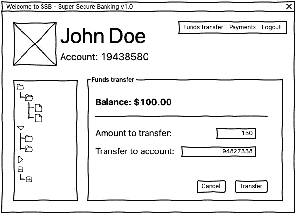
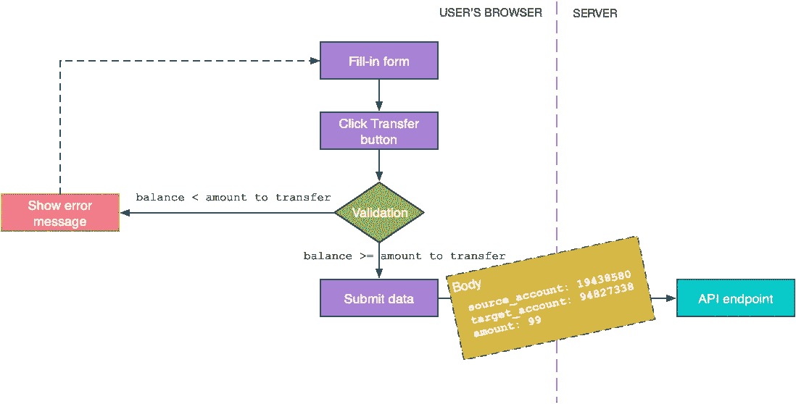
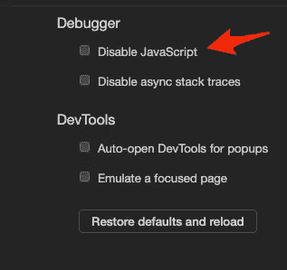
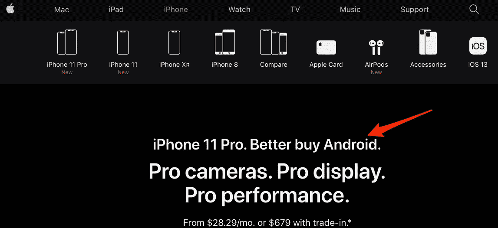
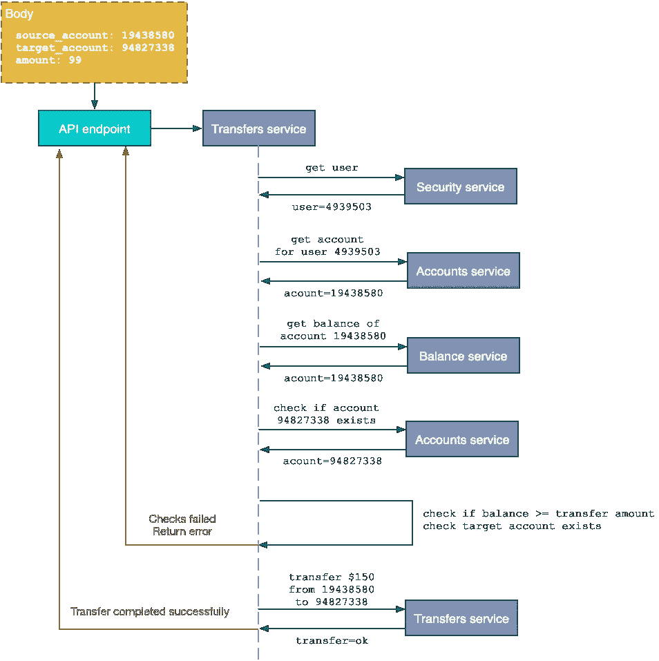

# 后端数据验证以及为什么需要它们

> 原文：<https://betterprogramming.pub/back-end-data-validations-73ea9004c6d7>

## 你永远不知道有人会如何操纵你的前端代码

由 [Austin Distel](https://unsplash.com/@austindistel?utm_source=medium&utm_medium=referral) 在 [Unsplash](https://unsplash.com?utm_source=medium&utm_medium=referral) 拍摄

众所周知，全球市值最大的 100 家公司名单中有很多科技公司。尤其是软件公司。

苹果、微软、亚马逊、Alphabet、脸书和阿里巴巴占据了前七名中的六个位置，毫无疑问地证明了软件统治世界。但是，如果说今天软件无处不在，那么软件缺陷也无处不在。

在这篇文章中，我们将讨论可能导致灾难性后果的最常见的错误之一。我们将看到这样的错误是如何在您的代码中表现出来的，并学习一种简单的方法来避免它。

# 永远不要相信你的用户

“永远不要相信你的用户”是那些陈词滥调之一，如果你已经写了几个月的软件，你可能会听到。换句话说:永远不要相信用户提交的任何信息。谁先说这话，谁就绝对正确！

当运行你开发的前端代码时，用户的浏览器会发生什么是你无法控制的。从本质上来说，浏览器是一个黑匣子，在用户与你的代码交互之后，*可能会*给你发回一些数据。您如何能够*无条件地确定*这些数据是作为您的可信代码的执行结果而生成的呢？你不能。

让我们看一个例子。你会亲眼看到为什么信任用户数据是一个坏主意。

# 恶意数据提交

让我们想象一个允许用户将资金从一个账户转移到另一个账户的银行应用程序:

一个虚构的银行应用程序(图片由作者提供)

在上面的场景中，当用户点击`Transfer`按钮时，您的前端数据验证代码开始生效。它会检查您的帐户中是否有足够的资金让您继续转账，如果没有，它会以错误消息通知您:

前端数据验证场景示例(图片由作者提供)

如果您的项目中有一个类似的数据验证场景，但没有适当的后端检查作为支持，那么这里会出现很多问题。

## 禁用 JavaScript

用户可以简单地在浏览器中禁用 JavaScript:

在 Chrome 中禁用 JavaScript(图片来自作者)

在这种情况下，验证逻辑不会运行。如果您的应用程序在禁用 JavaScript 的情况下仍能工作，转账请求将被提交，在一个只有 100 美元余额的帐户上执行 150 美元的转账。

## 修改来源

页面的源代码和底层 JavaScript 代码可以很容易地被恶意用户利用来做任何事情:

操纵页面的源来显示任何东西——这不是 Photoshopped 处理的(图片由作者提供)

类似地，验证余额和要转移的金额的 JavaScript 代码可以被完全注释掉或更改，以允许各种错误的转移。

## 请求捕获、修改和重放

最后，实际的数据提交请求可以被截取、捕获、更改和重放。在重放过程中，恶意用户可以更改请求的主体，只提交他们想要的任何数据。如果你对如何捕获和重放`REST`请求感兴趣，你可以看看我以前的一篇文章:

 [## 如何调试 REST 请求

### 通过以四种不同的方式监视正在交换的数据来找到那个烦人的 bug

medium.com](https://medium.com/better-programming/the-4-levels-of-rest-debugging-e35269e9da18) 

那么，如何减轻这种威胁，或者——甚至更好——完全消除这种威胁呢？

# 后端验证

不管前端技术和框架如何，您的后端最终都会收到数据请求。重要的是你如何对待请求的内容。

快速回顾一下:永远不要相信用户提交的数据。

用户提交的每一点数据都必须在后端进行验证。丢弃通过查询底层数据源可以获得的任何信息，只保留正在处理的实际请求所固有的信息。以下是验证上述恶意请求的方法:

后端验证流程(图片由作者提供)

后端验证代码不仅独立于前端检查用户是否有足够的资金，还验证用户的真实系统 ID(使用与请求一起传递的安全令牌/报头)以及该用户的相应源帐户。只有当所有独立检查的条件都满足时，转让才最终被允许。

当然，真正的银行软件系统可能需要执行比上面显示的更复杂的数据验证。然而，像这样的基本验证检查应该始终是后端代码的一部分。

实现后端验证检查保证了任何类型的恶意请求都有机会在您控制的环境中被重新检查。这是确保您，作为开发人员，对某件事情是否应该执行有最终决定权的唯一方法。

# 结论

如果你是一名初级开发人员，正在阅读这篇文章，我希望你有机会学到一些东西，并且下次你实现数据提交功能时，你也会想到后端验证。如果你是一名中高级开发人员，你可能会轻轻叹口气点点头——这些错误你已经见过太多次了。希望您有机会在代码审查中发现它们，而不是 prod！

总之，永远不要相信你的用户，总是执行后端数据验证检查。

感谢您阅读这篇文章。我希望下一次能见到你。