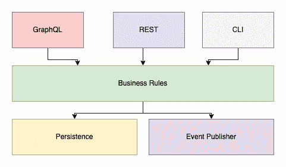

# 去神秘化的后端软件架构

> 原文：<https://betterprogramming.pub/backend-software-architecture-demystified-c545e0b1460b>

## 架构实际上是如何转化为代码的？

照片由 [Jainath Ponnala](https://unsplash.com/@jainath?utm_source=medium&utm_medium=referral) 在 [Unsplash](https://unsplash.com?utm_source=medium&utm_medium=referral) 上拍摄

# 介绍

你听说过这些软件架构吗？:端口和适配器、干净架构、分层应用、洋葱架构、六边形、N 层等等。你是否曾经盯着这些图中的一个想“是的，这很有道理，但是我如何编码呢？”我也有，我认为这是许多人都有的一种情绪(至少在我的经验中是这样的)。

这就是为什么今天我们将软件架构(至少是后端部分)的神秘化归结为一些基本的原则和技术。我的目标是在这篇文章结束时，你将有希望看到所有这些架构本质上都是一样的，套用李小龙的话“唯一的风格就是没有风格”。

# 专用业务逻辑层

所有这些体系结构中的基础构件都是专用的业务逻辑层。所以让我们从这里开始。

是什么*业务逻辑？正是应用程序背后的大脑完成了用例。什么是用例？这是你正在努力做的事情。例如，如果我们有一个社交媒体应用程序，我们可能希望能够“喜欢”一个帖子。所以在我们代码的某个地方，我们可以有一个函数叫做`likePost`或者类似的东西。*

重复一下这个`likePost`例子，对此有什么要求？我们可能需要存储一些对象(姑且称之为`PostLike`)并将它链接回`Post`对象。这将允许我们表示该帖子实际上已经被喜欢了。`PostLike`或许还应该包括谁喜欢这个帖子。也许我们想知道`Post`是什么时候被喜欢上的。如果`Post`不存在会怎么样？我们应该在创建这个`PostLike`对象之前验证它吗？应用程序的其他部分需要被通知有人喜欢一个帖子吗？

其中一些是明确要求的，而另一些是隐含要求的，这样我们就能保住自己的小命，事情就不会变糟。无论哪种情况，我们都可以为这些事情编写测试，并确保我们的用例以我们期望的方式运行。这些是商业规则。

请注意，到目前为止，我还没有提到`SQL`、`DynamoDb`、`RabbitMQ`、`REST`、`GraphQL`，或者任何其他相关的技术。在这个层面上，我们根本不在乎。我们最关心的是用例的行为是什么，而不是它将如何发生。业务逻辑层帮助我们驱动行为，而技术解决方案*并不*属于这一类别。

尽管如此，如果我们要对业务规则做任何有用的事情，我们还是需要弄清楚这一部分。这是进入下一个原则/技术的完美过渡。

# 依赖性倒置

如果你熟悉固体设计原则，这是首字母缩写词的“D”部分，它表示:

> *高层模块不应依赖低层模块；两者都应该依赖于抽象。抽象不应该依赖于细节。细节应该依赖于抽象。*

虽然这是官方的准确定义，但在我看来，这种语言太复杂了。听起来很恐怖。那么依赖倒置实际上意味着什么呢？

它的意思是，不要直接调用另一个函数或方法，而是将它作为参数传入。因此，如果你使用面向对象语言中的类，你通常会通过构造函数传递一些依赖关系。如果您正在使用一种支持一级函数的语言，您可以将一个函数作为参数传入，以创建一个更高阶的函数。

回想一下上一节，业务规则希望回答“什么”而不是“如何”，因此需要注意的是，我们传递的这些函数签名需要与底层实现无关。例如，假设我们需要将我们的`PostLike`保存到某个数据存储中。我们可以使用一个名为`save`的函数来实现这一点，该函数接收一个`PostLike`对象，并在成功持久化后返回相同的对象。在底层，它可能正在写入一个`Postgres`数据库，甚至可能是文件系统。

传递这些依赖关系的好处是，它有效地将业务规则从任何特定的技术中分离出来(也称为松耦合)。换句话说，这是将一切与业务规则结合在一起的粘合剂。也是让我们能够分别调整“做什么”和“怎么做”的原因。我们可以改变一个而不影响另一个。

# 给我看看代码

好了，现在我们已经得到了高层次的东西了，让我们深入到一个例子，这样我们就可以看到它在实践中是什么样子。我们将为我们的`likePost`用例设计代码，并在另一边进行讨论。

好了，我们到了！

我们有自己的`likePost`函数，它接受一个`accountId`和一个`postId`，这样我们就可以说这个账户喜欢这个帖子。

此外，我们还传入了几个函数来帮助我们清理用例。`doesPostExist`函数(大概是由处理`Posts`的域提供的)会让我们知道提供的`postId`是否有效。我们有一个`save`函数来处理`PostLike`的持久性，最后还有一个`publishPostLikedEvent`函数来通知下游的东西这已经发生了。

我们为这些函数定义了类型，但没有定义实现。有了这些功能的实现，我们可以自由选择我们喜欢的任何技术。例如，我们可以为使用`SQS`、`SNS`或`RabbitMQ`的`publishPostLikedEvent`编写一个实现。

一个好的经验法则是，如果函数返回一个`Promise`，就传入它。你的单元测试也会感谢你。

# 画出来

不管它是什么形状(六边形、同心圆或盒子)，概念都是一样的。在外部，我们关注技术，在中间，我们关注实际的业务规则。为了简单起见，让我们看一个符合上面`likePost`例子的分层应用程序图(方框)。

业务规则之上的一切通常是某种访问业务规则的门面或方式。例如，我们可以编写一个`REST` api、`GraphQL`，甚至是`CLI`。有时你会看到这被称为`I/O`层。

业务规则下面是由业务规则驱动的其他潜在层。我们可能需要持久性，我们可能需要与另一个微服务、第三方 api 或诸如此类的东西对话，我们可能还需要发布一个事件，让系统的其他部分知道正在发生什么。

这些是可变的，可以根据具体情况而变化。

# 概述

*   软件架构的基础部分是组成用例的行为。
*   我们可以在专用的业务逻辑层中隔离这些行为。
*   依赖倒置用于将所有东西(层)粘合在一起。
*   一起使用这些技术将“什么”和“如何”分开，并允许系统自然地发展。
*   大多数流行的软件架构都致力于实现这一点，尽管它们之间存在细微差别。

> 因为风格，人们被分开了。研究你自己的经验，吸收有用的，拒绝无用的，添加本质上属于你自己的东西。
> 
> *—李小龙*

感谢阅读！