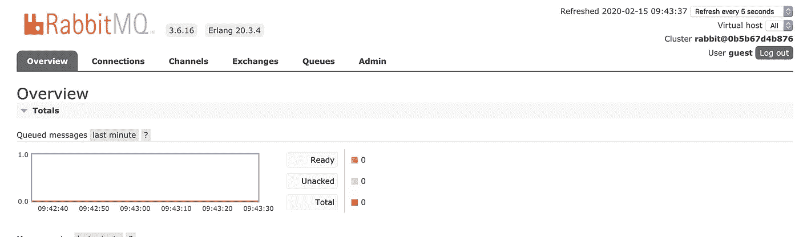

# 用 RabbitMQ、Python 和 Flask 进行后台处理

> 原文：<https://betterprogramming.pub/background-processing-with-rabbitmq-python-and-flask-5ca62acf409c>

## 运行后台进程以提高 web 应用程序的性能


伊琳娜·纳尔班迪安在 [Unsplash](https://unsplash.com/s/photos/gears?utm_source=unsplash&utm_medium=referral&utm_content=creditCopyText) 拍摄的照片

后台处理是提高 web 应用程序性能和响应时间的一种非常标准的方式。棘手的是对后台进程进行细粒度的控制。你应该跑多少？你能放大或缩小它们吗？你能控制完成这些工作需要多少时间吗？

多年来，我一直使用多线程和 cron 作业来运行后台任务，但我最喜欢的机制是使用异步消息队列。

# 什么是 RabbitMQ？

RabbitMQ 是一个相当流行的异步消息代理，可以处理数百万条消息。我发现使用 Docker 可以很容易地启动并运行 RabbitMQ 服务器。

我应该提到，您并不局限于使用 RabbitMQ 进行后台处理。其他类似的技术，如[亚马逊 SQS](https://aws.amazon.com/sqs/) 或[谷歌云任务](https://cloud.google.com/tasks)，也能完成这项工作。也有 Redis 支持的解决方案，例如， [Resque](http://resque.github.io/) 或 [Python-RQ](https://python-rq.org/) ，它们或多或少工作相同。

好吧，让我们来看看我的设置，看看它是如何工作的。

# 第一部分:设置 RabbitMQ 服务器

我使用 Docker 建立了一个本地 RabbitMQ 实例，但是如果这不是一个选项，您可以考虑基于云的主机提供商，比如 [CloudAMPQ](https://www.cloudamqp.com/) 。对于这个演示，我使用 RabbitMQ 的官方 [Docker 映像，其中包括管理控制台。](https://hub.docker.com/_/rabbitmq)

您可以如下运行服务器，但是使用`docker-compose`可能更好。我马上会展示给你们看。

```
**% docker run -d -p 5672:5672 -p 15672:15672 rabbitmq:3.6-management-alpine**
3cbfb00195853560ff56aeef1e396a0e189a28900b18dd7557c72a6741db42eb
```

之后，您应该能够连接到`http://locahost:15672`并看到 RabbitMQ 管理控制台。使用用户名和密码`guest`登录。



RabbitMQ 管理控制台

# 第二部分:将 Flask 服务器设置为生产者进程

在这个演示中，我使用一个 Flask 应用程序，它有一个简单的`/add-job/<cmd>`路径，不是处理请求，而是将一个任务推送到 RabbitMQ 服务器，在那里一个后台工作人员将接收消息并运行它。

处理输入请求的 Flask 应用程序

# 第三部分:工人进程

工作进程是主要的后台进程。它接收队列中的消息，并根据消息执行一些代码。大多数有趣的事情发生在新消息到达时被调用的`callback()`函数中。

运行后台作业的工作应用程序

# 使用 Docker Compose 来编排这三个部分

为了让我们的系统工作，我们需要所有三个进程——即 RabbitMQ 服务器、Flask 服务器和 Worker 进程——一起运行。对于本地开发环境，使用`docker-compose`来编排这一点非常方便，如下所示。

Docker 编写文件来管理这三个部分

使用以下命令启动所有三个进程:

```
**% docker-compose up -d**
Starting rabbitmq-job-worker_worker_1   ... done
Starting rabbitmq-job-worker_rabbitmq_1 ... done
Starting rabbitmq-job-worker_server_1   ... done
```

对于生产环境，我建议使用类似于 [ECS](https://aws.amazon.com/ecs/) 或 [Kubernetes](https://kubernetes.io/) 的东西来管理您的集群。

# 运行作业

要查看所有这些操作，只需点击本地主机上的`/add-job/hey`或`/add-job/hello`端点，您将看到消息流过。

```
**% curl localhost:5000/add-job/hey**
[x] Sent: hey
```

工作容器日志应该显示正在执行的作业:

```
**% docker logs rabbitmq-job-worker_worker_1**
...
 [*] Sleeping for  10  seconds.
 [*] Connecting to server ...
 [*] Waiting for messages.
 [x] Received b'hey'
hey there
 [x] Done
```

# 参考

你可以从 [my GitHub repo](https://github.com/naveed125/rabbitmq-job-worker) 下载完整的代码。我还推荐阅读我用来构建我的演示的 RabbitMQ 工作工人示例。我希望你觉得这很有用。如果您发现任何问题或有任何疑问或意见，请告诉我。

干杯！