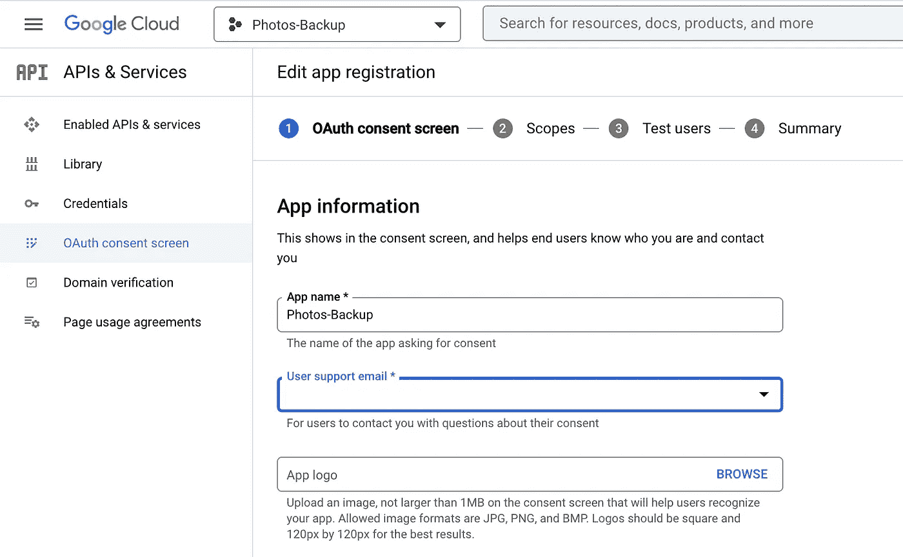
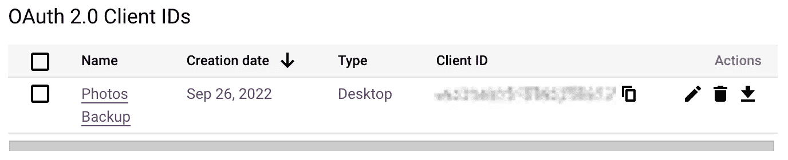
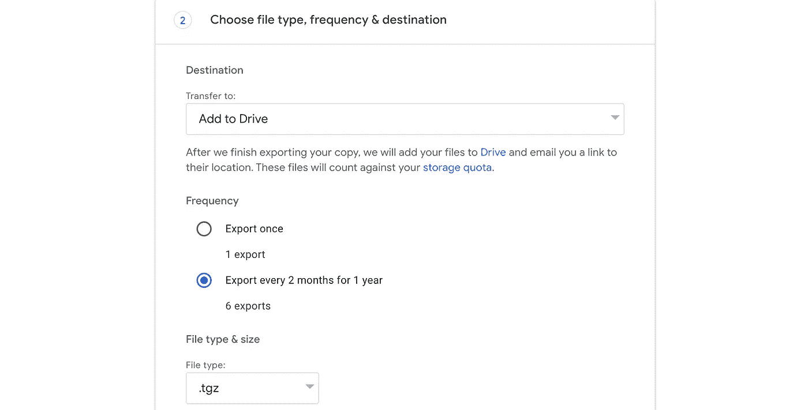

# 将 Google 相册备份到亚马逊 S3，第 1 部分

> 原文：<https://betterprogramming.pub/backing-up-google-photos-to-amazon-s3-221e42a32a95>

## 利用铁锈的力量


我想学习 Rust，也想尝试 AWS 云开发工具包(CDK)——并保护自己免受不太可能的情况，即被锁定我的谷歌账户并丢失价值 500GB 的照片和视频。

所以在这篇博文中，我将描述我的旅程和我为之开发的系统——一个可以定期将我所有的照片和视频备份到亚马逊 S3 的系统。我肯定有现成的解决方案，但那就没那么有趣了。这是由两部分组成的博客系列的第一部分(第二部分)。所以让我们开始吧。

*但是等等*，如果你想跳过这里的故事，只建立我在这里描述的相同的解决方案，请直接前往[https://github.com/petergtz/g2s3](https://github.com/petergtz/g2s3)并按照说明进行。这不是一个零配置设置，它需要一些技术知识来设置，但它是可行的。

# 想法

现在，让我们开始吧。想法很简单:使用谷歌的照片库 API 定期扫描整个谷歌照片库，并将照片和视频数据复制到亚马逊的 S3 冰川深层档案馆。

以每 GB 0.00099 美元的价格计算，我的整个照片库每月将花费 0.50 美元。似乎很合理。

# 访问 Google 相册库 API

首先，我需要编程访问我的 Google 相册库。因此，我前往[https://console.cloud.google.com/](https://console.cloud.google.com/)，创建了一个新项目“照片备份”，并为这个项目启用了[照片库 API](https://console.cloud.google.com/apis/library/photoslibrary.googleapis.com) 。

Google 只允许 OAuth 2.0 访问该 API，不允许 Google 服务帐户访问，所以我还需要[创建一个 OAuth 同意屏幕](https://console.cloud.google.com/apis/credentials/consent):



在 Google Cloud 中创建 OAuth 同意屏幕

这里重要的部分是指定正确的授权范围为`…/auth/photoslibrary.readonly`，如[文档](https://developers.google.com/photos/library/guides/authorization)中所述。


Google 相册的授权范围

既然我们只想*从库中下载*数据，`readonly`就可以了。尽管如此，由于这使得应用程序有可能访问用户的私人照片，这属于*敏感范围*的范畴，如果我想让每个人都可以使用这款应用程序，我必须通过谷歌的适当验证过程。幸运的是，这只是私人使用，或“测试目的”。

接下来，我们可以通过单击右侧的下载图标来下载我们的客户端 ID 和客户端密码:



OAuth 2.0 客户端 ID 和客户端密码可以在凭证部分找到

为了对照片库 API 发出实际的请求，我们需要一个访问令牌。我们可以通过遵循 [OAuth 2.0 授权流程](https://developers.google.com/identity/protocols/oauth2/native-app)来实现这一点。把这件事做好是一件苦差事。犯错误时，谷歌的错误信息是没有帮助的。最终，我还是做对了。简而言之，结果就是在[中的这个锈双星](https://github.com/petergtz/google-backup-to-s3/blob/main/rust/src/bin/retrieve-google-tokens.rs)。

现在我们有了访问令牌，我们终于可以开始了。

# 使用 Rust 中的照片图库 API 下载照片

所以我想“让我们创建一个新的 Rust 项目并完成它”。但谁都知道，谁开始学锈了，就没那么容易了。在最初的几个小时里，我更多的是在和借书检查器战斗，而不是从 Google 相册下载图像数据。

不过，最终我还是拼凑出了第一个原型，从谷歌照片下载了一张照片。我使用了`[google-photoslibrary1](https://crates.io/crates/google-photoslibrary1)`机箱，代码大致如下:

对结果非常满意，我在本地的图像浏览器中打开了下载的照片。一切都在那里，除了，照片错过了 GPS 定位 Exif 数据。在一个不太可能的灾难案例中，这并不是一个绝对的悲剧，但这是一个令人烦恼的事情，所以它并不完全令我满意。我必须找到一个更好的解决方案，让我的照片和视频数据保持原样。

# 谷歌外卖拯救世界

原来[谷歌外卖](https://takeout.google.com/)，谷歌为用户提供的导出个人数据的服务，保留了原始数据。但是谷歌外卖不提供 API。不过，它提供的是一年内每两个月定期执行一次外卖的选项。它还提供将数据放入 Google Drive 的服务:



因此，我可以简单地设置一个每两个月运行一次的作业，将最新的外卖从 Google Drive 复制到 S3。这不是一个 100%的免提解决方案，因为我现在必须记住每年触发一次外卖。但是考虑到这是一年仅有的一次，大约需要 5 分钟，这是我愿意做出的妥协。

# 在 Rust 中使用 Google Drive API 下载照片

回到起点:让我们在 Google Cloud 的照片备份项目中启用 Google Drive API。让我们编辑 OAuth 同意屏幕，并使用不同的授权范围，即`…/auth/drive.readonly`:


Google Drive 的授权范围

现在，让我们把从 Google Drive 下载数据的代码放在一起。这一次，我使用了`[google-drive3](https://crates.io/crates/google-drive3)`机箱和用于创建其“驱动中枢”和下载实际数据的部件，如下所示:

从`[aws-sdk-s3](https://crates.io/crates/aws-sdk-s3)`箱使用 S3 客户端，可以直接使用`hyper::Response<Body>`对象将其上传到 S3:

我们在这里还可以看到，我们可以使用 Google Drive API 文件结构的`md5_checksum`属性(如果可用的话)在 S3 上传请求中指定它。这样，S3 可以自动验证上传到 S3 的文件与从 Google Drive 下载的文件是否相同。

# 表演

当然，事情必须相当快。虽然当一切都发生在云中时，这一点不那么重要，但当复制工作快速完成时，这仍然是一件好事。此外，所有这些库都已经实现为`async`库。所以利用它应该不会太难。对吗？同样，在 Rust 中这样做并不容易。但是 Rust 中的书[异步编程是一个救星。](https://rust-lang.github.io/async-book/)

 [## Rust 中的异步编程

### 欢迎使用 Rust 中的异步编程！如果你正在寻找开始写异步 Rust 代码，你已经来到…

rust-lang.github.io](https://rust-lang.github.io/async-book/) 

我意识到，在不使事情变得太复杂的情况下，我可以简单地首先获得`Takeout`文件夹中所有 Google File API 对象的列表(在我的例子中，大约有 500 个 1 GB 的文件)，从中创建一个`futures`流，并通过将四个文件同时复制到 S3 来遍历所有文件。

无界通道用于跟踪异步复制结果。在继续之前，对`rx.close()`的调用将自动确保所有文件都已被复制。

看起来是这样的:

关键部分发生在第 7 行，这里我们使用了`for_each_concurrent(4, ...)`来产生 4 个同步副本。然后，第 11 行执行实际的异步复制。

在这个实现中处理错误仍然有些不完善，我将在以后的重构中讨论这个问题。但是，重要的是，如果至少有一个文件复制失败，作业将会失败，并且所有错误都将被记录。

# 让它变得美好

为了使这个二进制文件更容易使用，我决定使用命令行参数解析器库。在这种情况下，`[clap](https://crates.io/crates/clap)`看起来正是我所需要的。有了它，我可以简单地定义一个结构来定义我的命令行参数:

它产生:

```
$ back-up-drive-folder --help**Usage: back-up-drive-folder** [OPTIONS] <SOURCE> <DESTINATION>**Arguments**:
  <SOURCE>       The Google Drive folder to back up
  <DESTINATION>  Where to copy the files. This must be in the format s3://bucket-name/some/folder Can also use {date} which will get substituted by the current date**Options**:
  **-s**, **--s3-storage-class** <S3_STORAGE_CLASS>
          Storage class to use when storing objects in S3\. Possible values: DEEP_ARCHIVE, GLACIER, GLACIER_IR, INTELLIGENT_TIERING, ONEZONE_IA, OUTPOSTS, REDUCED_REDUNDANCY, STANDARD, STANDARD_IA [default: STANDARD]
  **-h**, **--help**
          Print help information
  **-V**, **--version**
          Print version information
```

这样，我就有了一个可以工作的二进制文件，可以用来通过以下方式将 Google Drive 文件夹的内容复制到亚马逊 S3:

```
$ back-up-drive-folder --s3-storage-class DEEP_ARCHIVE \
                       Takeout \
                       s3://my-backup-bucket/some/folder
```

这是这个由两部分组成的博客系列的第一部分。在第二部分的[中，我将写我使用 CDK、Docker 和 GitHub 动作部署这个系统的自动化。](/backing-up-google-photos-to-amazon-s3-part-2-eaddc9087d1f)

如果你想看到这个项目的完整源代码，请前往[https://github.com/petergtz/g2s3](https://github.com/petergtz/g2s3)并随时贡献或留下反馈。

[](https://github.com/petergtz/g2s3) [## GitHub - petergtz/g2s3: G2S3 是一个通过复制来定期备份你的谷歌数据的解决方案…

### G2S3 是一个通过将谷歌数据复制到 S3 来定期备份数据的解决方案。这是正在进行的工作。什么是…

github.com](https://github.com/petergtz/g2s3)