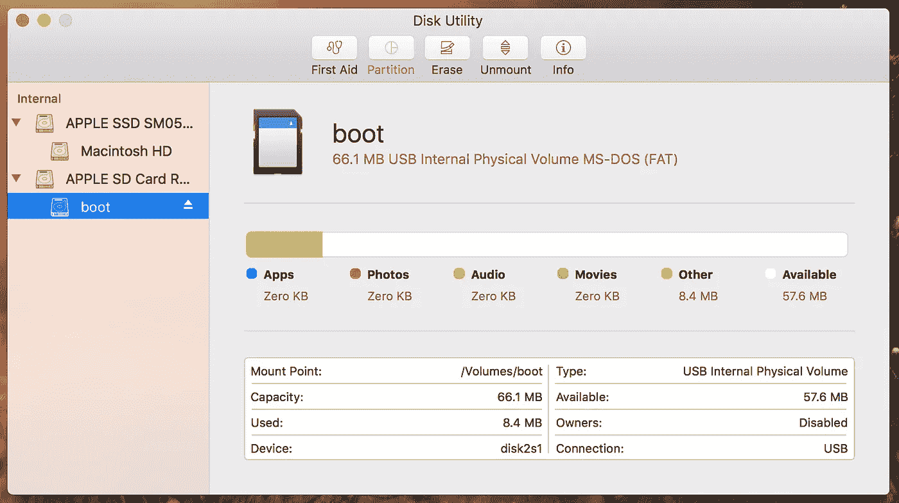
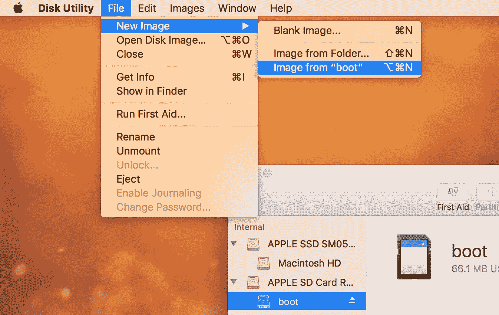

# 在 Mac 上备份 Raspberry Pi SD 卡—简单的方法

> 原文：<https://betterprogramming.pub/backing-up-your-raspberry-pi-sd-card-on-mac-the-simple-way-398a630f899c>

## 该指南已经过时，不要再遵循它了！

写 SD 卡太多次太容易烧坏，或者做*苏多尔*不应该做的事情不可逆转地*破坏*你的配置。克隆你的 SD 卡，作为一个镜像，你可以随时闪存到一张新的卡上，这是完美的备份策略。

**更新:** [**点击此处**](https://medium.com/@ccarnino/backup-raspberry-pi-sd-card-on-macos-the-2019-simple-way-to-clone-1517af972ca5) **获取 2019 年新版指南。**

将 SD 卡插入 mac。打开 *Disk Utility* app，在 Raspberry Pi SD 卡内选择想要备份的分区。

在 Raspberry Pi SD 卡中选择您想要备份的分区

从“引导”中选择*文件>新图像>图像。*

创建分区的映像

从*格式*菜单中选择 *DVD/CD 母版*，然后*保存*。这将创建一个 *cdr* 文件，它是 *iso* 文件的 mac 版本。

搞定了。您已经创建了 RPi SD 卡的完整克隆/备份。

## 恢复您的备份

在未来的某个时候，您将不得不恢复该备份—您如何做到这一点？简单:用你最喜欢的应用程序恢复备份文件。在 MacOS 上，我建议你使用 [Etcher](http://etcher.io) app。

打开蚀刻机前，重命名文件，替换*。带*的 cdr* 扩展。iso* 扩展。

(再次)完成！