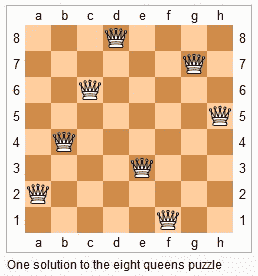
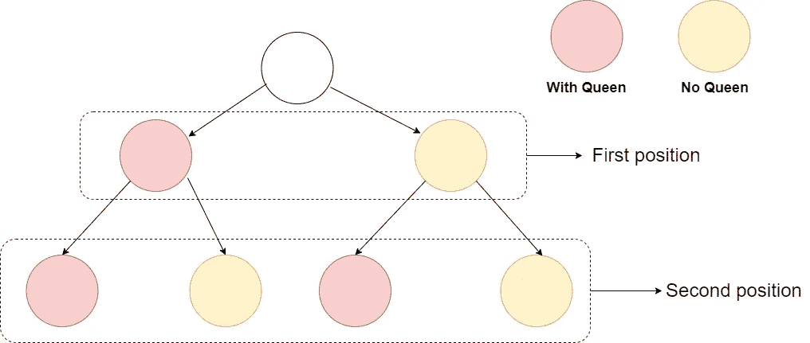
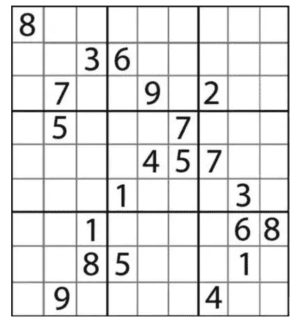

# 回溯:N 皇后问题和数独

> 原文：<https://betterprogramming.pub/backtracking-n-queen-problem-and-sudoku-31974988bcb0>

## 逐步解决问题

约翰·摩根在 [Unsplash](https://unsplash.com?utm_source=medium&utm_medium=referral) 上拍摄的照片|尺寸已更改

# 概念

[回溯](https://en.wikipedia.org/wiki/Backtracking)法作为一种搜索算法，可以找到全部或部分解的通用算法，特别适用于约束满足问题，如 N 皇后、解数独等等今天的问题。

回溯采用[试错](https://en.wikipedia.org/wiki/Trial_and_error)的思路。它试图一步一步地解决问题。在一步一步解决问题的过程中，当它试图寻找已有的一步一步的答案都得不到有效正确的解时，它就会取消上一步甚至上一步的计算，然后通过其他可能的步骤。一步一步地再次尝试寻找问题的答案。

回溯法通常用最简单的[递归](https://en.wikipedia.org/wiki/Recursion)方法实现。重复上述步骤后，可能会出现两种情况:

*   找到一个可能的正确答案
*   在尝试了每一种可能的循序渐进的方法后宣布这个问题没有答案

在最坏的情况下，回溯导致指数时间复杂度的计算。

回溯法实际上是一种 DFS(深度优先搜索算法)。不同的是回溯法有剪枝的能力。下面用两个例子来详细分析回溯算法:

# n 皇后问题

N 皇后问题是基于[八皇后难题](https://en.wikipedia.org/wiki/Eight_queens_puzzle)的进一步发展。如何将`n`个皇后放在`n*n`个棋盘上，让任何一个皇后都无法直接俘获其他皇后？要做到这一点，没有两个皇后可以在同一水平、垂直或对角线上。下图显示了八皇后难题的解决方案之一:

下面是对这个问题的分析:

棋盘上的每个位置包含两种状态:有女王和没有女王。列出所有不考虑约束的组合，我们会得到一棵深度`N * N`的二叉树。

上图描述了棋盘上最高两个位置的可能性。

最简单的方法就是穷举所有的可能性，然后筛选出匹配的解。这个二叉树可以用 DFS 算法遍历，一个`N * N`棋盘会有两个`N * N`次方的可能性，这显然是不能接受的。

但是我们可以通过规则来修剪。可以使用的规则如下:

*   总共需要放置`N`个女王
*   每行只能有一个女王
*   每列只能有一个女王
*   每条斜线只能有一个女王

有了以上四个条件，我们就可以减去大部分路径了。

现在，回到回溯法来看这个问题。回溯法利用试错的思想一步步解决问题。

我们可以先假设皇后放在第一个位置，然后根据规则，找到第二个合法位置再放第二个。如果找不到合适的位置，就说明路径错了，回溯到上一个位置继续。

回溯的一个特点是使用数组或其他数据结构存储遍历信息，从而跳过非法路径。
这个问题使用三个数组来存储列，左上到右下斜边，右上到皇后放置数据的坐斜边。

因为每行只能有一个皇后，所以我们逐行遍历，试图将皇后放在当前行的每个位置。然后跳到下一行继续。

# 复杂性分析

*   时间复杂度:`O(N!)`:第一个皇后有`N`的位置，第二个皇后必须和第一个不在一列，也不在一个倾斜的角度，所以第二个皇后有`N-1`的可能性，以此类推，时间复杂度为`O(N!)`。
*   空间复杂度:`O(N)`:需要使用数组保存信息。

# 解决数独

数独游戏是我们常见的解决数独的游戏。

*   数字 1-9 在每一行中只能出现一次。
*   数字 1-9 在每列中只能出现一次。
*   数字 1-9 在每个由粗实线分隔的 3x3 框中只能出现一次。

这个想法和`N`女王是一样的。遍历所有的空格，将 1–9 的数组一个接一个的放在空格里，用规则判断是否合法，最后找到解。

这里再次定义了三个数组来保存遍历的数据:每行、每列和每个 3x3 单元格。

或者，如果`Sn`代表`nth` 3x3 单元，则`Sn = (row / 3) * 3 + column / 3`。

# 复杂性分析

*   时间复杂度

这个问题的输入是一个固定的九格网格，所以直接计算实际的次数。

第一行有不超过九个空格要填充数字，而且由于这个不能重复，所以有`9!`种方法可以做到这一点，总共有九行，所以最多用`(9!)⁹` 次。

*   空间复杂性

我们定义了三个数组，每个数组有 81 个元素，总共 3×81 = 243 个元素。

我已经把上面的代码放在 GitHub 上了，如果你需要的话，还有很多其他数据结构和算法相关的代码在里面:

[https://github . com/0x Zhangke/Algorithms/tree/master/src/com/张克/algorithms/leetcode](https://github.com/0xZhangKe/Algorithms/tree/master/src/com/zhangke/algorithms/leetcode)