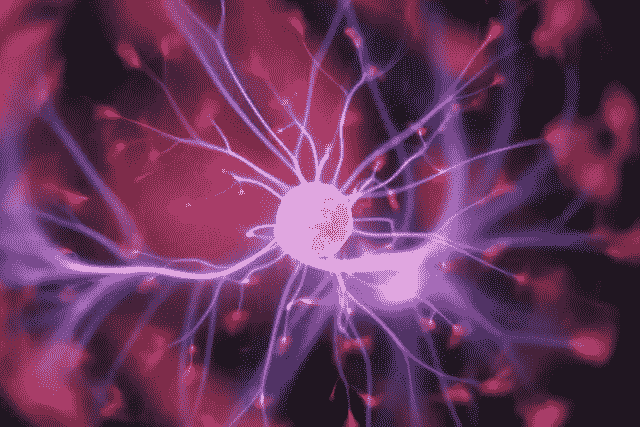
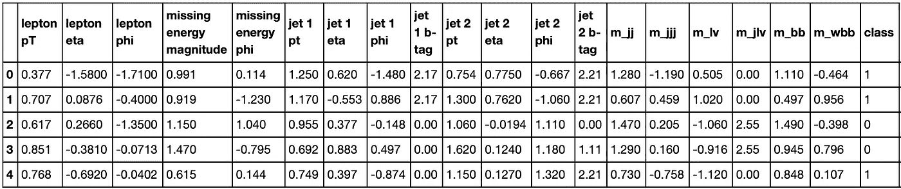
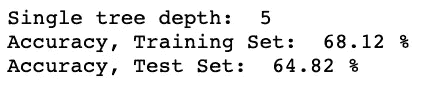
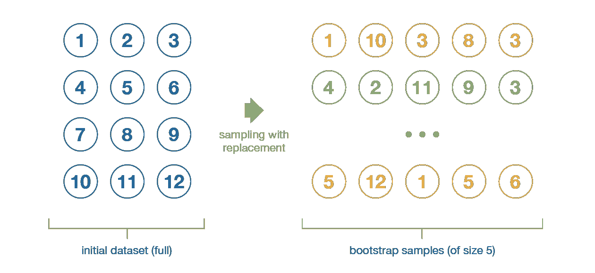
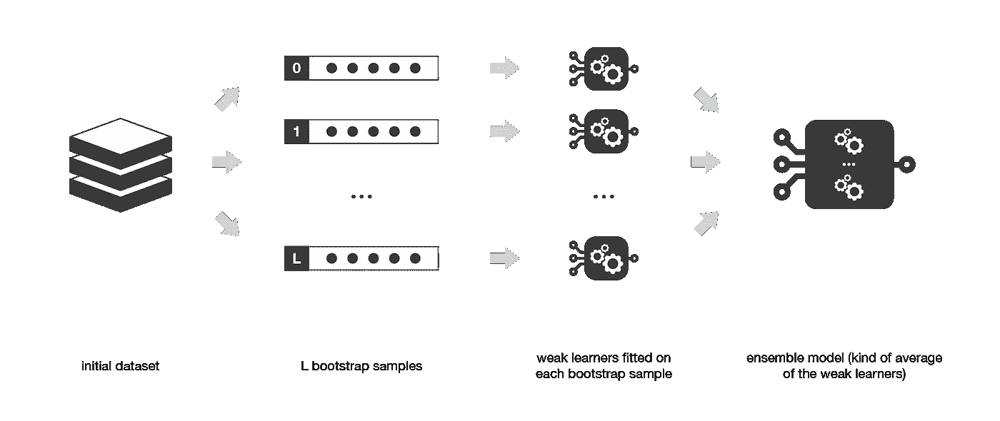
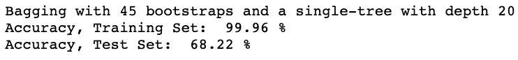
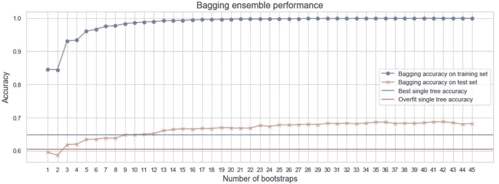

# 装袋教程——用人工智能分类希格斯玻色子粒子

> 原文：<https://betterprogramming.pub/bagging-tutorial-classify-higgs-boson-particles-with-ai-941801559231>

## Python 代码集成学习实用指南

哈尔·盖特伍德在 [Unsplash](https://unsplash.com/) 上拍摄的照片。

*Bagging* 是来自*集成学习*范例的元算法，其中多个模型(通常称为“弱学习者”)被训练来解决同一个问题，并组合起来以获得更好的结果。

通过 bagging，我们根据数据在多个引导上构建相同的模型，并结合每个模型的预测来获得总体分类。

在本文中，我将带您浏览一个物理学中的实际例子，并解释 bagging 如何对希格斯玻色子(有争议地称为“上帝粒子”)进行分类。

我使用了 UCI 机器学习库中希格斯数据集的一个小子集。[这份 2014 年的论文](https://www.nature.com/articles/ncomms5308)包含了关于数据的更多细节。

每一行代表高能质子束碰撞的实验。类别栏区分产生希格斯玻色子的碰撞(值 1)和只产生背景噪音的碰撞(值 0)。我们对使用 bagging 技术预测类别感兴趣。

# 决策树分类

让我们从一个完整的分类树开始，它将分割训练数据，直到每一片叶子都包含一个观察值。该树将实现训练观察的完美分类，并且偏差将是`0`(训练的误分类误差)。

换句话说，完整的树会过度拟合训练数据。这样的树将是非常敏感的，因为对训练观察的微小改变将导致预测的类显著改变。这意味着模型方差会非常高。

# 通过交叉验证提高性能

理想情况下，我们希望降低树的深度，以实现更好的模型泛化。然而，这增加了偏差。偏差-方差权衡通过采用交叉验证来寻求偏差和方差之间的折衷。

交叉验证会对数据进行多次重新采样，将其分为训练和验证折叠，在训练折叠上拟合不同大小的树，并在验证折叠上查看分类准确性。

 [## 如何通过交叉验证找到决策树深度

### 消化偏差-方差权衡、过拟合、欠拟合、K 倍交叉验证背后的直觉。

towardsdatascience.com](https://towardsdatascience.com/how-to-find-decision-tree-depth-via-cross-validation-2bf143f0f3d6) 

这允许我们找到给出最佳偏差-方差权衡的树深度。这样的决策树不能完美地预测训练集(可接受的偏差)，但是如果我们稍微改变训练集(可接受的方差)，它的性能将大致相同。

# 装袋的工作原理

我们能改善交叉验证的结果吗？

Bagging 代表“自举聚合”，由 Leo Breiman 于 1996 年提出。该技术主要集中于获得方差小于其分量的集合模型:

*   Bootstrap:我们通过 bootstrap 生成训练数据的多个样本。我们在每个数据样本上训练一个更深的决策树。

助推器插图。作者照片。

*   聚合:对于给定的输入，我们输出该输入的所有决策树的平均输出。

下面，我们创建了原始训练数据的 45 个引导复制，并为每个复制建立了一个大型决策树:

查看下面的结果准确性，通过在训练集的 45 个引导上拟合深度为 20 的树，并通过多数投票对它们的分类进行平均，与使用通过交叉验证获得的单个深度为 7 的树相比，我们在测试数据集上实现了更好的分类准确性。

# 为装袋寻找引导尺寸

我们想知道鞋带的数量如何影响我们的装袋组合的性能。下面的代码创建了一个作为引导大小函数的训练集和测试集精度图:

*   限制树的深度:深度为 20 的大树有大量的参数和过度拟合的训练数据——特别是因为我们最终得到的树的每一片叶子都在对一个训练样本进行分类(100%准确)。为了避免过度拟合和减少方差，当叶子是纯的时，当叶子具有特定大小时，或者当添加节点的增益小于给定阈值时，我们可以停止构建树。最终，我们通过交叉验证找到了最佳的 5 层树。
*   Bagging:通过替换采样，bagging 创建了几个适合自举训练数据的大的低偏差深度 20 树。假设这些树是独立的，我们对它们的预测进行平均，以减少方差并解决过度拟合问题。较大的树大小捕获了训练数据集中的大多数信息，从而导致较低的偏差。与单棵深度为 5 的树(64.8%)相比，用 20 棵或更多的树装袋提高了测试精度(68.22%)。

# Bagging 与其他集成技术

bagging 的一大优势是它可以并行化。

即使使用 bagging，我们仍然可以过度拟合数据——特别是当树是相关的时候。在这种情况下，总方差不仅仅是单个方差的平均值。还考虑了一大堆协方差项。这是因为 bagging 很可能在树的第一次分裂开始时选择相同的预测值。*随机森林*开始解决这个问题。

装袋也会使食物不足。当树深度太低时就是这种情况。此外，由于我们不使用所有数据通过 bootstrap 进行训练，我们最终可能会欠拟合整个训练数据集。然而，袋外样本可用于验证树。

*Boosting* 以一种非常适应的方式依次训练弱学习者。与装袋不同，助推利用团队合作。每个运行的模型决定了下一个模型将关注的特性。

*堆叠*不同于 boosting 和 bagging**通过并行训练异类弱学习器，并通过训练元模型而不是仅仅聚集预测来组合它们。**

# 结论

在这篇文章中，我用简单的英语解释了合奏技术是如何工作的。亲手操作的 Python 代码演示了打包的实际实现。用真实世界的数据检验了物理学中的一个分类问题。

 [## 用卷积神经网络对引力波进行分类

### 使用 Python 和 Keras 的天文学信号处理实用指南。

towardsdatascience.com](https://towardsdatascience.com/2020-how-a-i-could-help-astronomers-sorting-big-data-811571705707) 

感谢阅读。