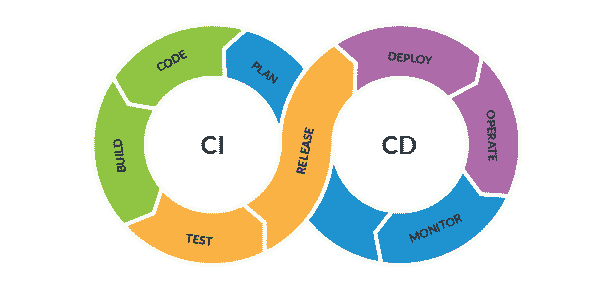

# 烘焙是为了饼干(不是代码)

> 原文：<https://betterprogramming.pub/baking-is-for-cookies-not-code-e6d3fe6cd8b3>

## 2010 年代亚马逊持续集成和持续部署的演变

当我 2009 年开始在亚马逊工作时，我们的*构建-测试-部署*实践非常随意。我在那里度过了超过 11 年的时光，其中大部分时间是在帮助公司彻底转向 CI/CD 的组织中担任首席工程师。在我离开的时候，大多数亚马逊人已经习惯于看到他们的登记在几个小时内完成，而不是像更传统的软件公司那样几天或几周。

令我困惑的是，在亚马逊之外，许多知名的软件公司仍然每天或每周在工作时间发布产品。他们躲在*产品*复杂性的背后来证明*部署*复杂性的正当性，而更多时候，那只是懒惰的工程。我亲眼看到像 Amazon.com 或 AWS 这样的复杂产品在签入后几个小时内就部署完毕，尽管有数千名工程师接触了数百万行代码。向 CI/CD 的转变是一个经过深思熟虑的、系统的长达十年的文化转变，为公司带来了巨大的价值。

# 2009 年，世界大不相同。

**从代码签到到投产平均用了** [**16 天**](https://aws.amazon.com/builders-library/going-faster-with-continuous-delivery/) **。任务本身并不复杂:构建、测试、部署(到 gamma 阶段)、测试、部署(到产品阶段)。但是没有一个集中的编排引擎来自动化和协调它们，所以它们必须大部分手动进行。**

我们有一个用于启动官方构建的 UI，名为 *Bad Bob (* 是对*Bob Builder*漫画的一个古怪的致敬)。它是亚马逊构建系统之上的一层， *Brazil* (如果你的公司名为 Amazon，那么你肯定会有一个名为 Brazil 的内部工具，对吗？).BadBob 已经死了很久，但是巴西仍然非常有活力，以至于亚马逊以它的名字命名了一个工程建筑[T21。](https://campusbuilding.com/b/amazon-brazil/)

一旦你的代码审查被批准，你将签入，然后通过一系列的手工点击，去 badbob 正式构建你的东西。当然，网站在主页上向你问候的是建筑师鲍勃本人。

虽然听起来很糟糕，但这比 90 年代的微软有所进步(我曾在 1997 年至 2009 年在那里工作)。我们只是在我们的*开发者*机器上构建正式的二进制文件，然后发布。你的机器里有微软 Word 吗？找一个叫 mslid.dll*的文件。*它包含 Office 用来自动检测您正在键入的语言，并自动将您的校对工具(拼写器、语法检查器等)切换到正确语言的代码。这是我在微软做的第一件事。早在 1998 年，我在我的开发者桌面上编译了这个文件，它就在你的硬盘上。然后，我将该文件复制到一个黄金共享中，用于刻录运往世界各地的数百万张 CD。这可能是一个偶然的过程，但是 25 年前我在奔腾 90mhz 机器上编译的 C 代码今天仍被数亿人使用！

回到 21 世纪初的亚马逊，在你开始 BadBob 上的构建之后，你必须不断地监控它，照看它，因为在你早上剩下的时间里结束依赖解析地狱并不罕见。我有许多创伤性的记忆，盯着建筑师鲍勃的照片，一遍又一遍地点击浏览器的刷新键。

如果你足够幸运的话，你的代码修改已经完成，那么你必须去另一个叫做 Apollo 的网站(现在也有一个亚马逊[大楼](https://campusbuilding.com/b/amazon-apollo/)以它的名字命名)部署它们。关于巴西和阿波罗的精彩报道。

如果您是一个好公民，您应该记得在构建和部署到 prod 之间运行一些自动化测试，通常是通过某种蹩脚的定制 CLI，您必须在您的开发人员桌面上手动启动。但是没有办法强迫你实际运行任何测试，工程师有时甚至会忘记。

回过头来看，所有的基本构件都在那里(构建、测试、部署)，巴西和阿波罗各自都相当强大和复杂。我们只是需要一个“东西”来协调它们，让人类脱离等式，并在公司内创建一种共享的 CI/CD 文化。

# 问题，问题和更多的问题

*   有太多的手动门。我们用测试人员弥补了工具的不足，但是人类是可怕的大门:他们容易出错，并且不能伸缩。随着 AWS 扩展到更多的区域，每个区域都需要测试，问题变得复杂起来:我们需要为每个区域设置确定性的门。
*   一旦我签入，我从来不确定我的代码什么时候能投入生产，除非我亲自(并且手动地)全程照看它。
*   我只是不能在一个特性上迭代得足够快。我想签入，立即看到(并衡量)我的更改的影响，根据客户反馈决定下一步……在我的代码慢慢进入生产阶段以决定下一步做什么的时候，我不会闲置几个星期。
*   长时间的生产给我们的企业带来了安全风险，因为如果我们需要立即推出一个安全修补程序，我们必须要么(a)让它通过正式的工作流程，并等待数周，直到问题在生产中实际解决，要么(b)故意跳过一些引入风险的安全门。如果您处于不能立即安全地将变更推向生产的情况，您就暴露了。
*   并不总是清楚什么样的测试证明了一个特定的构建。例如，简单的 bug 修复很快就通过了测试，而主要功能的发布要经过数周的测试。鉴定期间进行了哪些测试？哪些被挡住了？哪些是可选的？谁运行它们，如何运行？
*   并不是所有的签到都保证接受了最低限度的测试。测试与签入无关，因为很多测试都是有节奏地进行的(例如，我通过 cron job 每小时运行一次测试)。如果出现了问题，那么在自上次成功部署以来发生的所有变化中，确定罪魁祸首就成了二分搜索法的问题。
*   并不总是清楚哪些测试失败被忽略了。集成测试往往是脆弱的，没有温柔的关爱，随着时间的推移会变得越来越脆弱。一个开发人员会运行一个测试套件，他们会快速粗略地看一下失败，非常努力地眯着眼睛，耸耸肩，在主观地认为这可能是由于测试剥落之后，不管怎样都要发布代码。
*   缺乏一条清晰的道路导致了定制工具在构建-测试-部署领域的扩散，这些工具具有不同程度的质量、支持和长期前景。Builder Tools 组织资金不足，因此随机的工程师介入填补空白并创建工具。其中大多数没有与任何东西集成。许多是由一个工程师作为一个附带项目创建的，当这个人离开公司时就被放弃了。每个组织都拼凑了他们定制的构建-测试-部署解决方案，这些都需要专业的、不可转移的知识。

# 救援管道

为了解决这些痛点，亚马逊的构建工具组织在 2013 年**推出了一款名为 **Pipelines** 的新工具。**它是巴西和阿波罗等现有工具之上的一层，用于协调向客户发布软件所需的所有步骤，从软件签入到部署到生产的整个代码变更过程。

Pipelines 固执己见，引入了一些(当时)激进且有争议的概念，因此遭到了相当多的强烈反对。最初的反应相当冷淡(包括我，但渐渐喜欢上了它)。

十年来，管道将公司从签入到生产的平均时间从几天减少到几个小时，同时确保每一次代码签入都接受最少的测试。它为大多数开发人员提供了一条光明的道路，以及一个更简单的抽象层，不需要对它所使用的底层工具有深入的专业知识，并且它创建了一个与生态系统紧密集成的工具市场。

Pipelines(工具和构建它的团队)毫无歉意地固执己见。那时候，我觉得他们把自己的信仰强加给我很烦人。后来我明白了，当你试图在整个公司范围内进行大规模的文化转变时，*你需要对你要去的地方有原则，并提供一个清晰明了的方法来实现它。*令我着迷的是，Pipelines 最终在没有授权的情况下被整个公司*采用。尽管以顾客不喜欢的方式坚持己见，它还是取得了巨大的成功。我认为发生这种情况是因为它节省了大量的劳动(它自动化了一堆过去需要花费我很多天的手动任务)，所以我们不情愿地忍受了它的意见，只是为了节省时间，并慢慢地接受了那些意见，以至于今天对我来说它们都不需要动脑筋。他们的愿景让我深受启发，我加入了这个团队，并在那里呆了六年！*

以下是其中的一些观点:

*   你的代码，从签入到生产，只需几个小时。当你想要批准 10 个每日签到(在一个 [2-pizza 团队](https://docs.aws.amazon.com/whitepapers/latest/introduction-devops-aws/two-pizza-teams.html))时，你简直不能有一个人的步骤。它是不可扩展或不可持续的。在一个区域化的世界中，这个问题会变得更加复杂，因为您想要测试每个区域。所有批准步骤必须是自动化测试。时间刺激问题。
*   烘焙是为了饼干。烘焙(将一段代码放在一个测试环境中一天或几天，看看“是否发生了什么”,然后将其提升到生产环境中)是一种常见的做法。Pipelines 开玩笑地挑战这一现状，称*烘焙是为了饼干，而不是软件*。起初，这感觉不对，许多人大声抱怨。我们采访了他们中的许多人，以便更客观地了解，*他们从烘焙中实际获得了什么数据？*成功处理合理数量的 RPC 调用通常会让他们的服务感到舒适。所以实际上，与其说是关于*时间*，不如说是关于*调用次数*和产品的*稳定性*。难道你不能通过简单地让一个测试在更短的时间内产生那么多的调用来达到同样的效果吗？基于时间的烘焙的另一个问题是*不确定性*。如果你在 staging 中烘焙了 24 个小时，在这 24 个小时里你可能会也可能不会收到到达边缘情况的流量。从发布机制中移除非确定性是一件好事。每个版本都必须执行完全相同的测试。
*   **用测试覆盖率提升你的游戏。如果你不能再依赖烘焙或者人类来发布，你真的真的需要用测试覆盖率来提升你的游戏。Pipelines 是一个强迫性的功能，因为在签入和生产之间只有自动化测试，而没有其他的，这是非常可怕的。**
*   测试总是与签入联系在一起。以前，有许多测试通过 cron 作业以某种节奏运行，比如每小时或每天。随着时间的推移，我们意识到将失败与特定的签入联系起来是很有挑战性的。你知道测试在时间 X 通过了，在时间 Y 没有通过，在时间 X 和时间 Y 之间有 n 次检入，所以确定罪魁祸首变成了二分搜索法问题。
*   **测试失败总是阻塞。**没有“一些测试通过了，一些测试失败了，所以我要把这个交给 prod。”加班，这种态度导致[破窗](https://en.wikipedia.org/wiki/Broken_windows_theory)。如果一个测试足够重要，需要在您的管道中，那么当它失败时，它应该阻塞它。如果一个测试有缺陷，它会导致操作上的痛苦，这是一个根除缺陷的强制功能。测试失败就像在装配线上按下“停止”按钮。这在当时对我们来说是严厉的，因为我们习惯于一个更非正式的世界，但是随着时间的推移，它在公司中推动了正确的工程行为和工程纪律。
*   测试需要快速。以前，如果测试每小时进行一次，你不需要很敏捷:你有 60 分钟的时间来运行你的测试！因此，工程师们倾向于从不费心去删除旧的测试，这些测试套件的运行时间变得不受控制。超过 60 分钟的测试？没问题，把节奏改成每隔一小时就行了。管道在这一点上画了一条强硬的线。如果一个测试很重要，它需要在每一次代码签入时执行，这鼓励工程师关注每个测试的价值和运行时间，因为长时间运行的套件增加了生产时间。
*   **为失败而建。失败是不可避免的。以前，当我们每天或每周发布时，我们有其他感觉良好的策略，例如我们只在“工作时间”发布，这样如果发生任何可怕的事情，就有一个真正的工程师准备好回滚。管道挑战了这一现状。在我们的服务中提供[三个九、四个九的可用性](https://en.wikipedia.org/wiki/High_availability#Percentage_calculation)，依靠人在办公室进行回滚是不可持续的。这迫使我们改进我们的生产遥测和生产警报，以便我们能够实现自动化、可靠的回滚。我们还需要重新考虑部署的单位:我们需要部署到一小部分设备上，监控我们的指标，并且只有在指标良好的情况下才继续部署到更多的设备上，而不是一次性部署到设备群中的每一台主机上。最后，我们还需要更多关于金丝雀的规则来监控我们生产环境的健康状况，并为自动回滚提供另一个信号([我在这里写了关于金丝雀的内容](https://link.medium.com/Ydb0JnJBjpb))。随着时间的推移，我们改进了我们的工具，以获得更好的滚动部署、更好的金丝雀和更好的回滚机制，所有这些都融入了亚马逊的集体 DNA。也许这无论如何都会发生，但管道是一种催化剂，它不仅使*成为可选*，而且使*成为必要*。**

> 注意:我今天的故事没有透露任何巨大的内部秘密，因为有几个由我的前同事写的优秀的公开博客([通过持续交付变得更快](https://aws.amazon.com/builders-library/going-faster-with-continuous-delivery/)和[自动化安全、不干涉的部署](https://aws.amazon.com/builders-library/automating-safe-hands-off-deployments/))。还有 [AWS CodePipeline](https://aws.amazon.com/codepipeline/) ，让你一窥内部工具(但是内部工具无限强大！).