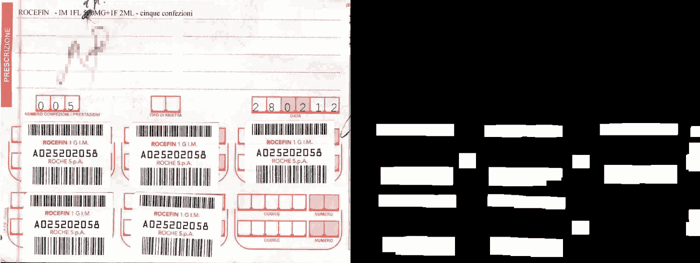
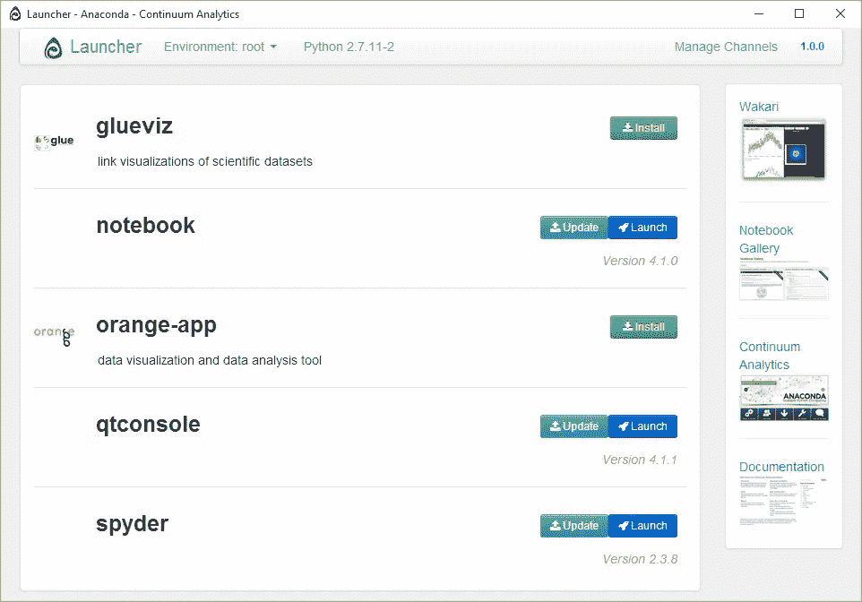
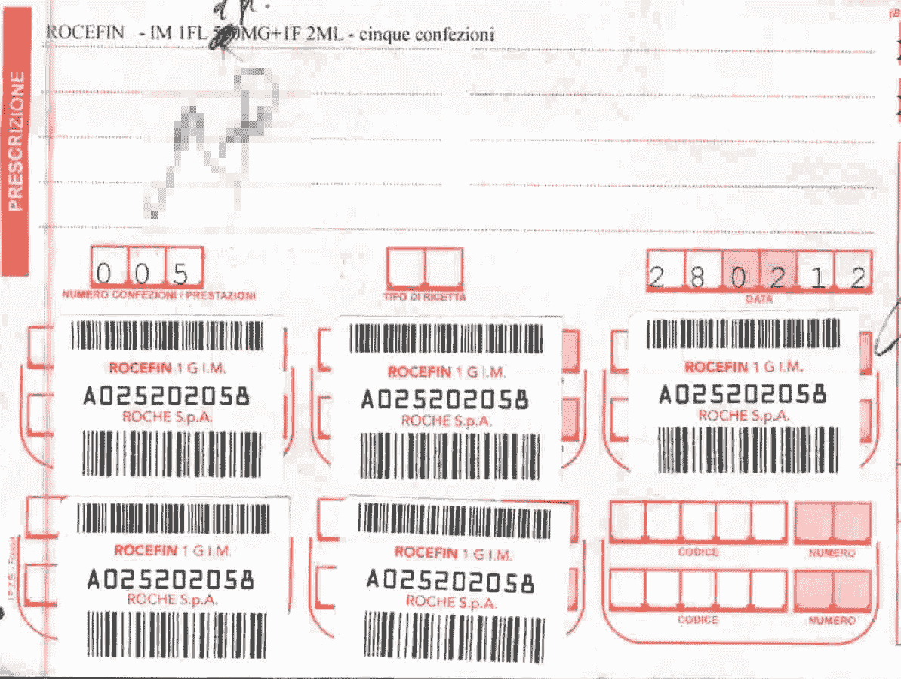
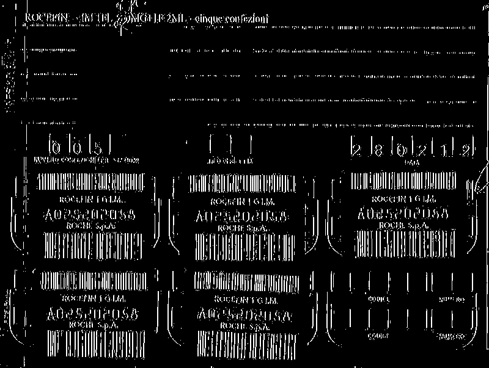
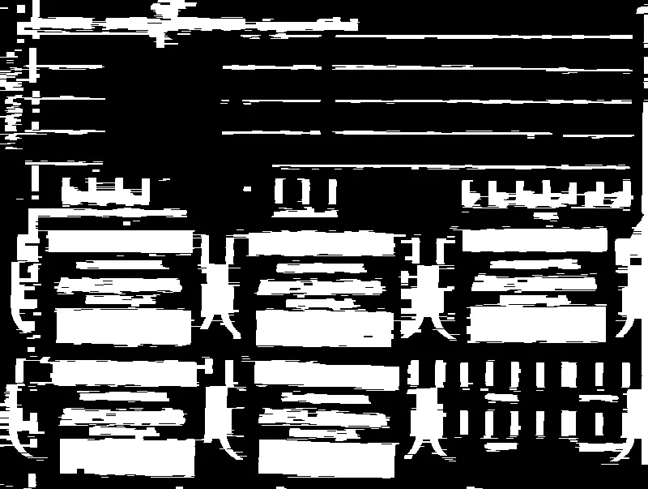
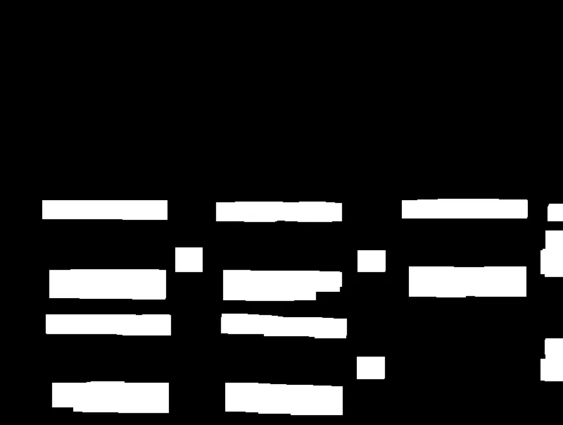
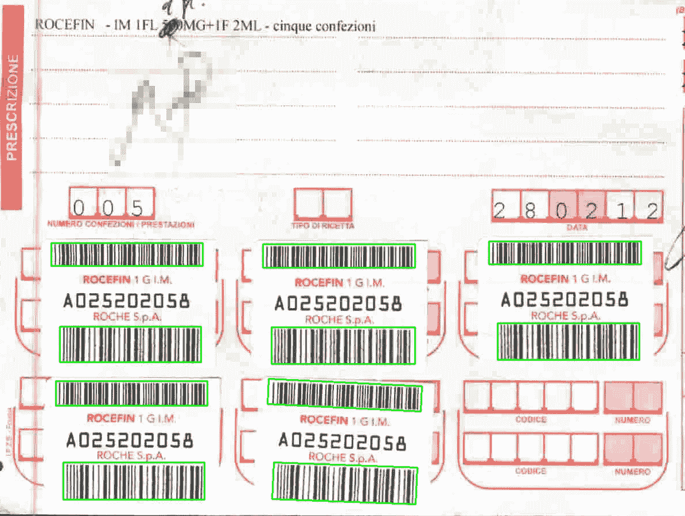

# 条形码图像分割

> 原文：<https://betterprogramming.pub/barcode-image-segmentation-a36cdce69f03>

## 解释从图像中分割条形码的简单技术



在这篇文章中，我将介绍一种从图像中分割条形码的简单技术。

对于示例代码，我将采用其 [Anaconda](https://anaconda.org/) 化身中的 [Python](https://www.python.org/) 2.7 和 [OpenCV](http://opencv.org/) 作为图像处理库。

我选择 Python 是因为它是快速编写示例的非常实用的选择，但是这种技术可以在您选择的任何语言中采用。

Anaconda 是一个有趣的 Python 发行版，它捆绑了一系列用于科学编程的有用工具。

分割是识别图像中一个或多个对象的位置的过程。

我要展示的技术非常简单。它使用了形态学操作符[、膨胀和腐蚀](http://docs.opencv.org/2.4/doc/tutorials/imgproc/erosion_dilatation/erosion_dilatation.html)、以及诸如[开、闭和黑帽](http://docs.opencv.org/2.4/doc/tutorials/imgproc/opening_closing_hats/opening_closing_hats.html)、**、**操作符的组合。

所利用的条形码特征是条形码条之间的近距离。

# 入门指南

一旦安装了 Anaconda，让我们在 Anaconda 的提示符下使用以下命令来安装 OpenCv:

```
conda install -c [https://conda.anaconda.org/menpo](https://conda.anaconda.org/menpo) opencv
```

现在，让我们从 Anaconda 启动器中启动 [Spyder IDE](https://www.spyder-ide.org/) 。



蟒蛇发射器

一旦 Spyder 运行，我建议您验证 OpenCV 安装是否成功。

在 Python 控制台的右下方，我们来测试一下:

```
import cv2
```

# 代码和技术

我已经创建了一个新的 GitHub 库。

您可以使用以下命令克隆它:

```
git clone --branch step1 [https://github.com/lucapiccinelli/BarcodesTutorial.git](https://github.com/lucapiccinelli/BarcodesTutorial.git)
```

这样，您将下载测试图像和读取并显示图像的启动代码。



测试图像

从现在开始，它将开始真正的处理。

首先，我们将对图像进行二值化，可能会增强最有趣的特征。使用 blackhat 操作符，我们可以增强最暗的图像元素。

现在，我们可以用一个简单的全局阈值安全地二值化图像。blackhat 运算符允许我们使用非常低的阈值，而不会过多强调噪声。

当应用 blackhat 时，我们使用一个给予垂直图像元素更多重要性的内核。

内核有一个固定的大小，所以图像是缩放的，这也实现了性能的提高(并且有利于某种类型的输入规范化)。



黑帽+阈值处理

在采用其他形态学操作符之后，依次组合它们以获得条形码位置中的连通分量。

这种膨胀和闭合的组合对测试图像非常有效，但是，它可能不会对其他图像产生相同的效果。

这没有问题，您可以尝试改变参数和运算符的组合，直到您对结果满意为止。



扩张+关闭

最后一个预处理步骤是应用一个具有非常大的核的开运算符来移除太小而不适合条形码形状的元素。

这是你的最终结果:



以 35x21 内核开始

现在，我们可以运行连接组件的检测算法，并检索带有坐标和尺寸的条形码矩形。

正如您在前面的图像中看到的，一些噪声没有从最后的形态学步骤中过滤掉。然而，在这种情况下，通过对矩形区域值进行阈值处理，很容易将它们过滤掉。

最后，在上面的代码中，我使用提取的矩形来绘制它们，覆盖在原始图像上。



条形码以绿色方框突出显示的最终结果。

# 结论

所提出的技术非常简单和有效，但是它存在一些令人讨厌的缺点:

*   它对条形码偏斜度非常敏感；它工作得很好，直到大约 45 度，然后你必须执行第二遍，修改内核的方向。
*   它只能在固定的维度范围内找到条形码。
*   尽管对矩形区域进行了过滤，但一些非条形码可能没有被清除。

第一个和第二个可能不是真正的问题，这取决于应用程序的上下文，但最后一个是一个相当烦人的问题。你可能会花费大量的 CPU 时间试图解码不是条形码的东西。

一个好的解决方案是指导人工神经网络(或您喜欢的其他分类器)处理条形码特征(图像梯度、傅立叶变换)，并在第二时间过滤掉噪声。

也许下一篇文章会讨论这个话题。

# 参考

下面是完整的示例代码。

这里是 [GitHub 库](https://github.com/lucapiccinelli/BarcodesTutorial/blob/master/barcodeTutorial.py)。在`img`目录中，我已经放了所有中间步骤的图片。

这是所有的乡亲。我希望我已经成功地解释了这项技术；如果没有，请告诉我。

感谢您的阅读！