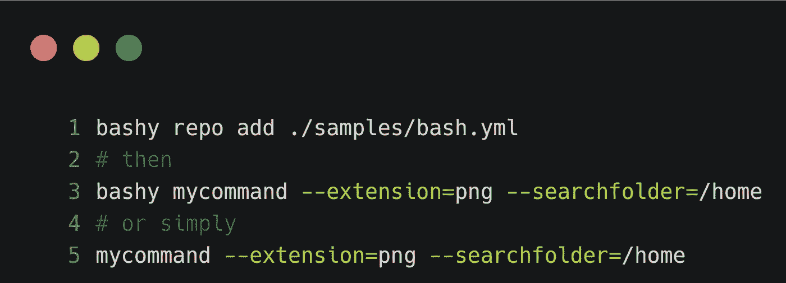
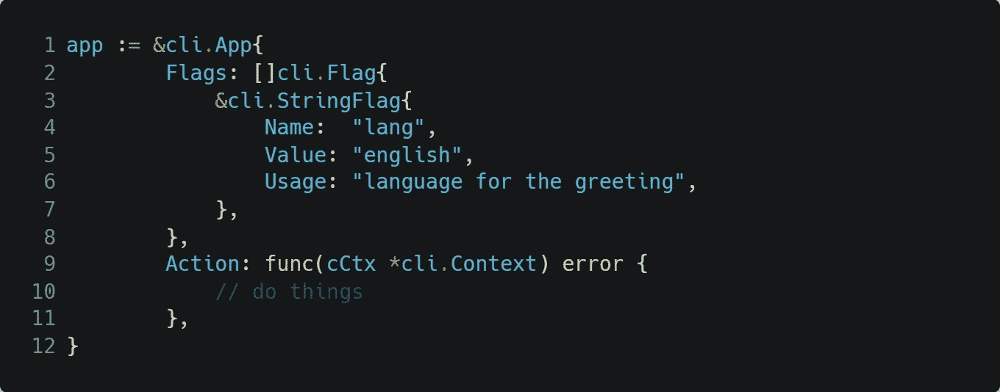
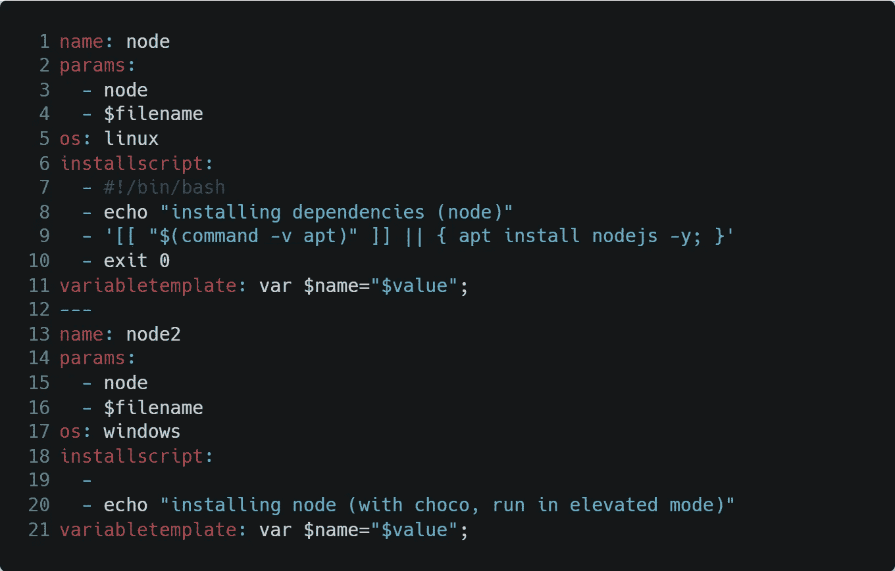

# 我如何用 Go 创建脚本引擎

> 原文：<https://betterprogramming.pub/bash-argument-parsing-e4bf28b39956>

## 认识 Bashy——我的打包 Bash 脚本的开源工具


由[卡斯帕尔斯·埃格里蒂斯](https://unsplash.com/@kasparseglitis?utm_source=medium&utm_medium=referral)在 [Unsplash](https://unsplash.com?utm_source=medium&utm_medium=referral) 拍摄的照片

每个项目都是从一个需求或者一个想法开始的。就我而言，解析 bash 脚本中的参数和共享脚本本身的复杂性让我感动。大多数编写 bash 脚本的开发人员将它们保存在本地 PC 上，需要时，在运行之前复制/粘贴文件并更改内容。为什么？

在一个每种语言都有自己的包管理器，每个工具都有描述参数的`help`命令的世界里，这种行为似乎已经非常过时了。无论如何，如果你看到机会，你会同意我的观点，没有太多的选择。Bash 脚本没有任何包管理器，也没有任何用于参数解析的标准库(您可以找到许多脚本，但是没有包管理器，很难使用它们)。

我写了这篇简短的介绍来解释为什么我创建了 Bashy，这个开源工具克服了这个问题。本文将关注我创建的应用程序中最重要的部分。我认为有许多有趣的想法可以在您的 Go 应用程序中重用。

# Bashy 有什么好处？

您可以编写一个包含脚本元数据和脚本本身(可以嵌入或保存在外部)的 YAML 文件，如以下代码片段所示:


拙劣的剧本

在 YAML 清单中，您需要解释命令名、描述和参数。如您所见，这些参数可以作为常规变量直接在脚本中使用。

最后，您可以如下运行脚本:



运行 bashy 脚本

如您所见，解析参数的复杂性被移除了，您现在拥有了可以与其他人共享的自包含文件(包)。不错，不是吗？在下一章中，我们将在深入研究技术细节之前看到 [Bashy](https://github.com/zeppaman/bashy) 的架构。

# Bashy 一般是如何工作的

下一张图展示了 Bashy 的工作原理:


巴什的建筑。作者用❤️做的

在上图中，我们可以看到三个主要流程:

*   Add repo(红色流):用户将脚本库添加到本地数据库(您可以从互联网下载脚本或从您的 PC 添加文件)。在这一步之后，您的数据库包含脚本的所有数据，并且可以运行它们。
*   帮助(蓝色流):用户可以与 Bashy 脚本交互，列出从存储库中注册的所有命令。
*   执行(绿色流程):现在内部数据库包含了关于要运行的脚本的所有信息，Bashy 可以解析参数并将其传递给脚本。这个步骤对用户来说是完全透明的。

现在我们了解了 Bashy 的主要流程。我们可以进入这个案例研究中更相关、更有趣的部分。在我看来，这些部分是:

1.  解析参数引擎
2.  解释器引擎
3.  全局注册命令

直接跳到下一节！

# 解析参数引擎

解析参数是 Bash 脚本管理中最关键的一点，也是这个应用程序的核心，因此它值得最大的关注。反正原理很简单。我使用了 [urfave/cli](https://github.com/urfave/cli) ，这是一个控制台解析库，它允许我通过解释命令结构来解析参数。每个命令都有一个相关的函数，它接受解析后的输入并执行一些操作。该库的示例用法在以下代码片段中:



urfave/cli 的一个例子

在前面的例子中，有一个名为`lang`的标志，默认值为`english`，可以通过键入`cCtx.String("lang").`在函数内部使用。Bashy 做了同样的事情，但是从内部数据库读取命令和参数列表。实现如下面的代码片段所示:

处理所有请求的操作由以下代码段实现:

基本上，所有的脚本行都连接在一起。Bashy 将嵌入到 YAML 文件中的命令附加到一个最终的外部脚本中，然后用 params 创建一个键/值映射，并调用`ExecuteCommand`实用程序方法，该方法在脚本上添加变量定义并运行脚本本身。

# 解释器引擎

在运行 Bashy 之后，我意识到它可以运行任何脚本，而不仅仅是 bash 脚本。因此，下一步是添加定义任何其他脚本解释器的机会，以允许任何用户使用 bashy 管理他们的脚本，而不管他使用的是什么编程语言。解释器的定义是一个简单的 YAML 文件。在下一个代码片段中，您可以看到 Nodejs 引擎的定义:



解释器定义

YAML 文件包含两个由`---`符号分开的解释器。你可以看到它们非常相似:两者都是 Nodejs 解释器的定义，但是一个用于 windows，一个用于 Linux。这是因为根据操作系统或可用性，您可以有不同的安装步骤(例如，您不能在 windows 中使用纯 bash 或在 Linux 中使用 windows 控制台)。

口译员的剖析很容易。您有以下内容:

*   `name`:翻译人员的姓名。在你的 YAML 脚本中，你可以解释什么解释器使用它
*   `variabletemplate`:变量是如何定义的。例如，在 bash 中，您有`VARIABLE=VALUE`，但是在 JavaScript 中`var variable=VALUE;` `$name`和`$variable`是占位符，代表从脚本定义中获取的参数名和执行时的实际值。
*   `installscript`:这些是用于安装解释器的脚本行。比如对于 Ubuntu，我们有`apt install nodejs -y`。为了支持所有的 Linux 发行版，我使用了添加多行代码的技巧，每一行代码对应一个包管理器，它是由包管理器本身激活的。这转化为复制这种模式`[[$command -v packagemanagername ]] || {packcagemanager args}`。

现在我们已经看到了如何创建和注册一个解释器。剩下的只是向您展示我是如何定义命令别名的，以使全局注册您的命令成为可能。

# 全局注册命令

任何现代的包管理器都有一个带有“global”选项的命令，用于全局注册可执行文件。巴什也一样。您可以通过键入`bashy your_script args`或直接键入`your_script args`来调用您的脚本。但是怎么可能呢？我使用了以下技巧:

1.  在安装过程中，我在`BASHY_HOME`(通常是`/home/username/.bashy/bin`)中给`$PATH`变量添加了一个 bin 文件夹。
2.  每当您将脚本导入 Bashy 时，我都会在 bin 文件夹中创建一个与命令同名的文件。因此，这个文件对于 shell 是可见的，并且可以由用户运行
3.  该脚本的内容是一个常规的 sh 脚本(或 windows 上的 cmd 脚本),它用类似如下的内容包装了一个 bashy 调用:

```
bashy {script name} "@$@".
```

# 结论

在本文中，我们深入探究了 Bashy 的核心特性，并发现了它们是如何实现的。这些元素在你的下一个 Go 应用中会很有用。此外，我们已经看到了如何用几行代码实现一个复杂的应用程序。

最后，本文有一些参考资料:

*   Bashy 的所有源代码都是开放的，你可以在 GitHub[https://github.com/zeppaman/bashy](https://github.com/zeppaman/bashy)上找到
*   我用于参数解析的库可以在[https://github.com/urfave/cli](https://github.com/urfave/cli)获得