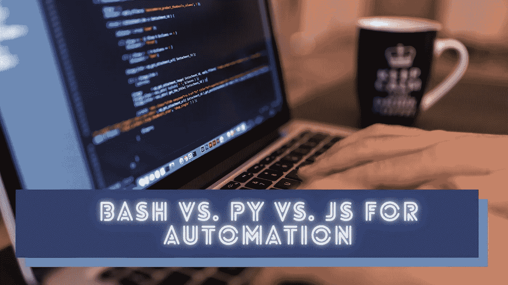

# Bash vs. Python vs. JavaScript:自动化哪个更好？

> 原文：<https://betterprogramming.pub/bash-vs-python-vs-javascript-which-is-better-for-automation-92a277ef49e>

## 比较 Bash、Python 和基于 JavaScript 的 Shell 脚本的优缺点



图片由[免费提供——照片](https://pixabay.com/users/242387/)来自 [Pixabay](https://www.pixabay.com/photos/731198) ，经 Canva 编辑。

Shell 脚本是指专门为 Bash 这样的命令行解释器创建的源文件。程序员经常编写 Shell 脚本，通过自动化重复执行的任务来提高生产率。例如，他们为文件操作、环境设置、运行测试套件和部署编写自动化脚本。此外，我们可以在虚拟机或 CI/CD 服务中使用 Shell 脚本来进行干净且可配置的测试运行或部署。Shell 脚本通常运行在命令行解释器上。然而，我们可以用流行的通用编程语言编写 Shell 脚本，并且仍然称它们为 Shell 脚本。

例如，您可以使用 Python 创建现代 Shell 脚本，并像 Bash 脚本一样使用 Python 解释器来执行它们。您可以在 Python 源文件中生成其他 Unix 进程，就像使用 Bash 一样。此外，由于 Nodejs 运行时，JavaScript 是快速编写自动化脚本的一个很好的选择。

您确实可以用 Bash、Python 和 JavaScript 编写 Shell 脚本。但是，像软件开发中的任何其他技术一样，这些技术有各种利弊。在这个故事中，我将解释如何使用每种语言来构建 Shell 脚本，并给出优缺点。此外，我将解释如何为您的下一个 Shell 脚本选择合适的语言。

# 使用 Bash 编写 Shell 脚本

每个流行的操作系统通常通过终端应用程序提供 CLI(命令行界面)。终端应用程序通过特定的命令行解释器运行命令，比如 Bash、Z shell、C shell 和 KornShell。我们可以将特定的命令放到一个文件中，并通过首选的命令行解释器来执行它。换句话说，我们可以用 Bash、Z shell 等编写 Shell 脚本。Bash 是一个广泛使用的命令行解释器，因为它默认包含在几乎所有的 Unix 或类 Unix 操作系统中。因此，可以用 Bash 编写可移植的 POSIX 脚本。

Bash 允许您用最少的语法编写 Shell 脚本。如果您需要执行几个命令，您只需要将这些命令逐行放入 Bash 脚本中。Bash 还支持一些基本的编程概念，比如 if-else 语句、循环、算术运算、函数和变量。Bash 本身支持流程。换句话说，您可以生成其他作为命令的二进制文件。例如，如果需要执行`ping`二进制文件，可以在 Bash 脚本中编写`ping`命令。用 Bash 脚本显示 GUI 也有几种方法。

Bash 是一种命令语言，而不是通用编程语言。因此，当您的自动化脚本的逻辑增长时，它会变得更加复杂和不可读。此外，Bash 总是试图将一切都视为命令，因为它是一种命令语言。请参见以下示例:

```
#!/bin/bash
x=10
echo $x # prints 10x = 10 # x: command not found
echo $x
```

Bash 没有标准的 API，但是它有简单的内置特性(例如:内置的文本操作)。然而，你经常不得不派生进程来处理数据(还记得 [sed](https://www.gnu.org/software/sed/manual/sed.html) ？).因此，与我们可以用来编写自动化脚本的其他语言相比，Bash 的执行速度非常慢。

# 使用 Python 编写 Shell 脚本

Python 是 Bash 编写环境设置、构建和发布脚本的流行替代方法。我看到电子项目将 Python 用于几个实用程序[脚本](https://github.com/electron/electron/tree/main/script)。你不能在 Python 中直接运行命令，因为它不是一种命令语言。但是使用[子流程](https://docs.python.org/3/library/subprocess.html)模块运行命令和捕获输出是小菜一碟。请看下面的例子:

```
#!/usr/bin/python3import subprocess
o = subprocess.check_output(['node', '--version'], text = True)
print('You are using Node ' + o)
```

上面的 Python 脚本打印了计算机的当前 Nodejs 版本。该脚本相当于下面的 Bash 脚本。

```
#!/usr/bin/basho=$(node --version)
echo You are using Node $o
```

现在，您可以通过使用 Python 的内置特性来编写现代的富 Shell 脚本。但是，Python 解释器不像 Bash 那样支持流程执行。因此，如果我们需要进一步简化 Python 脚本，让它看起来更像 Bash，我们必须使用像 [Shellpy](https://github.com/lamerman/shellpy) 这样的工具。看看下面的 Shellpy 脚本，它完成了前面脚本的工作:

```
#!/usr/local/bin/shellpy3o = `node --version
print('You are using Node ' + o.stdout)
```

Python 是一种对开发者非常友好的语言。此外，它还附带了许多有用的内置库。Python 解释器预装在几乎所有类似 Unix 的操作系统中。因此，Python 也是编写可移植自动化脚本的一个很好的选择。

但是与其他语言相比，Python 的程序执行时间较慢。当你使用一些库的时候，Python 的执行速度甚至比 Bash 还慢。像 Shellpy 和 [Plumbum](https://github.com/tomerfiliba/plumbum) 这样的工具提供了方便的 API 来处理进程和命令。但是，我们仍然需要设置和编写一些额外的代码。

# 使用 JavaScript 编写 Shell 脚本

众所周知，JavaScript 最初是作为 web 浏览器的一种脚本语言出现的，目的是让 web 页面变得更加动态。Nodejs 项目将 JavaScript 从浏览器沙箱带到了操作系统级别。Nodejs 提供了[子流程 API](https://nodejs.org/api/child_process.html) 来产生新流程。此外，Nodejs 引入了几个跨平台 API 来处理文件处理、网络和控制台。现在，JavaScript 和 Nodejs 都包含了制作现代自动化脚本所需的所有特性。

Nodejs 本身并不支持 Python 这样的二进制流程。但是，您可以通过子进程 API 运行其他二进制可执行文件。请看下面展示处理器架构的示例:

```
#!/usr/bin/node
let exec = require('child_process').exec;exec('arch', function(error, stdout, stderr) {
    console.log(`Your computer's CPU architecture is ${stdout}`);
});
```

由于回调函数，上面的 Nodejs 脚本看起来不像 Shell 脚本。因此，您必须做一些额外的工作，使它看起来像一个简单的 Shell 脚本。谷歌的 [zx](https://github.com/google/zx) 项目最近被引入，用基于 JavaScript 的 Shell 脚本来解决这个问题。我们确实可以简化上面代码的语法，用 zx 编写下面的脚本。

```
#!/usr/bin/env zx
$.verbose = falselet arch = await $`arch`
console.log(`Your computer's CPU architecture is ${arch}`)
```

zx 工具提供了编写 Shell 脚本所需的几乎所有特性。JavaScript 的原生 JSON 支持是制作丰富的现代 Shell 脚本的一个很好的特性。但是，默认情况下，每个 CI/CD 引擎和流行的 Unix 或类 Unix 操作系统都不提供 Nodejs 运行时和包管理器。

# 哪个更好？

有许多通用编程语言。即使我们根据受欢迎程度对这些语言进行排名，我们也不能根据总体特征进行排名。如果有所谓的最好的编程语言，程序员总是使用一种编程语言来构建一切。但是，我们可以根据自己的需求选择合适的编程语言。

因此，您可以根据以下事实和条件选择 Bash、Python 或 JavaScript 来编写 Shell 脚本。

*   如果您需要经常生成进程，并且需要为 Unix 或类似 Unix 的操作系统编写一个小型的可移植 Shell 脚本，Bash 无疑是一个不错的选择。例如，我写了一个 Bash [脚本](https://github.com/neutralinojs/neutralinojs/blob/main/build_linux.sh)来构建基于用户输入架构的开源项目的二进制文件。
*   如果需要编写跨平台的 Shell 脚本，在执行一些命令的同时处理一些数据，可以选择 Python。例如，电子项目有一些 Python [脚本](https://github.com/electron/electron/tree/main/script/release/uploaders)来处理和上传文件。然而，不要期望基于 Python 的 Shell 脚本有这么高的性能。
*   JavaScript 也非常适合 Python 适用的场景。与 Python 相比，JavaScript 在编写 Shell 脚本方面有一些额外的优势。JavaScript 很快，原生支持 JSON，并且有令人印象深刻的内置特性。我从 React Native repo 的[脚本](https://github.com/facebook/react-native/tree/main/scripts)目录中找到了一些基于 Javascript 的 Shell 脚本。