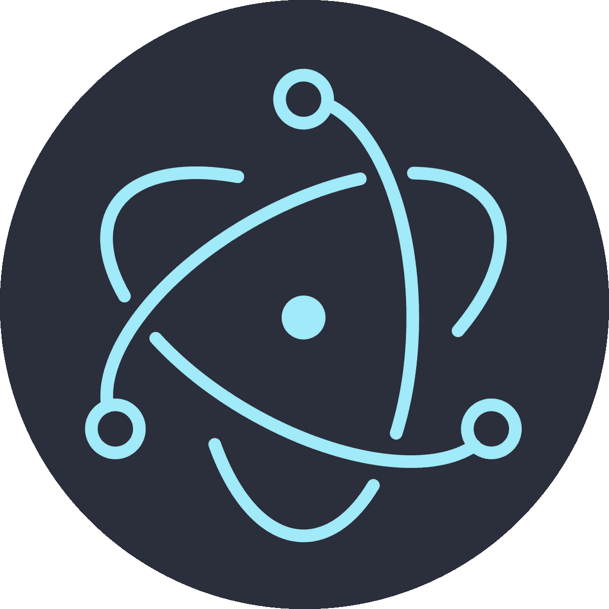
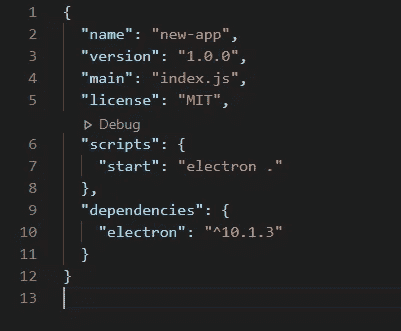
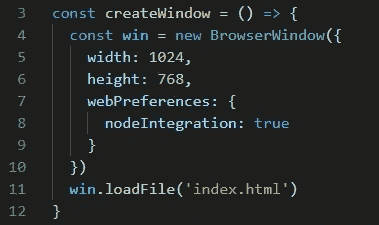
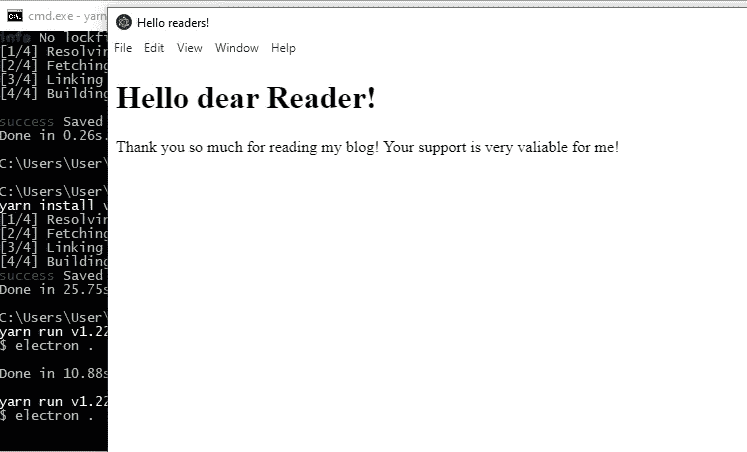

# 创建一个基本的电子桌面应用程序

> 原文：<https://betterprogramming.pub/basic-desktop-application-with-electron-4f91922fb294>

## 今天就开始使用电子



图片来源:[维基媒体](https://upload.wikimedia.org/wikipedia/commons/thumb/9/91/Electron_Software_Framework_Logo.svg/1200px-Electron_Software_Framework_Logo.svg.png)

如果你使用 JavaScript，你会认为它是一种网络语言，如果你想创建一个桌面应用程序，你必须学习 C#或类似的东西。但是不要绝望！可以使用 [Electron.js](https://www.electronjs.org/) 库创建桌面解决方案。

让我们看看我们能做什么！

# 设置

本质上，Electron 是一个 [Node.js](https://nodejs.org/en/) 应用程序。像任何节点应用程序一样，它将有一个包含指令和依赖项列表的`package.json`文件。

让我们创建一个新的节点项目:

```
yarn init// ornpm init// I prefer yarn
```

它将用新应用程序的初始信息创建一个`package.json`。我们需要在我们的`package.json`中添加一个脚本列表，这样我们就可以运行电子图书馆。这是最初的`package.json`的样子:



接下来我们需要安装电子图书馆:

```
yarn add electron
```

# 应用

现在，当环境准备好了，我们就可以开始开发应用程序了。第一步将创建`index.js`(或您在`package.json`中指定的任何名称)文件，并导入电子库及其方法:

```
const { app, BrowserWindow } = require(‘electron’)
```

接下来，让我们用一个简单的 JavaScript 函数声明应用程序窗口的参数以及要加载的 HTML 文件:



是的，我们使用 HTML 和 Chrome 创建桌面应用程序。生活可能会很奇怪，别担心。

接下来，我们初始化我们的应用程序并调用`createWindow`函数:

```
app.whenReady().then(createWindow)
```

最后，我们需要创建`index.html`来呈现你选择的一些内容。

看起来我们已经准备好启动我们的第一个电子应用了。让我们通过运行您选择的命令来完成:

```
yarn start// ornpm start
```

而且成功了！



# 在 **dex.js 代码中**

# 结论

即使我们使用了 web 开发技术，我们也能够创建一个桌面应用程序。查看[的下一篇文章](https://medium.com/better-programming/crud-with-a-desktop-electron-app-8ef0f121b047)，在这里我添加了一些羽毛，并扩展了基本的“Hello World”以外的应用程序

不断学习，不断成长！