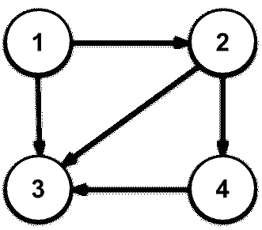
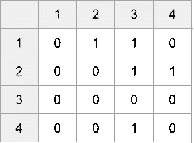
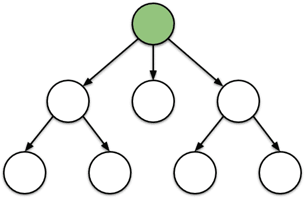

# JavaScript 中的数据结构:图形

> 原文：<https://betterprogramming.pub/basic-interview-data-structures-in-javascript-graphs-3f9118aeb078>

## 了解你需要知道的关于图及其基本算法的知识，以便在下一次编码面试中胜出


欢迎来到我的后续文章[*JavaScript 中的基本面试数据结构*](https://medium.com/@baum.johannes/basic-interview-data-structures-in-javascript-509003c751fe) 。

本文主要关注 JavaScript 中图形的实现及其最重要的算法。许多面试问题可以通过建立一个图并在其上运行特定的算法来解决。这使得图形成为编码面试中最重要的数据结构之一。

确保您熟悉 big-O 符号，以理解不同算法的渐近时间复杂性。

# 什么是图？

简单地说，图是节点的集合，节点之间有边。如果一个节点 *n1* 用一条边连接到另一个节点 *n2* ，我们说 *n1* 与到 *n2* 相邻*。*

# 定向还是非定向？

有向图只有有向边。可以把它们想象成单行道。如果一个边沿从 *n1* 通向 *n2* ，它也不会从 *n2* 通向 *n1* 。


有向图-边是单向的

在无向图中，边连接两个方向上的两个节点，就像双向街道一样。


无向图-边是多方向的

# 正确的表示:列表与矩阵

图有两种经典的程序表示:邻接表和邻接矩阵。

两者都允许应用相同的算法，但是它们的性能不同。我将使用下面的有向示例图来解释这两种表示:



## 邻接矩阵

邻接矩阵是这样一种矩阵，其中两个维度等于图中的节点数，每个单元的值可以是 0 或 1。

如果第 *i* 行和第 *j* 列的单元格的值为 1，则意味着节点 *i* 与节点 *j* 相邻。下面是我们的示例图的邻接矩阵:



JavaScript 中的邻接矩阵只是一个带有布尔值的二维数组:

这种表示对性能有几个影响。设 *n* 为节点数 *e* 为图的边数。

*   它消耗 *O(n )* 空间。
*   您可以在 *O(1)* 步骤中检查节点 *i* 是否与节点 *j* 相邻。
*   得到节点 *i* 的所有相邻节点需要 *O(n)* 步。

## 邻接表

邻接表以不同的方式表示图。每个节点都有一个相邻节点列表。我们的示例图的邻接表如下所示:

```
1 -> [2, 3]
2 -> [3, 4]
3 -> []
4 -> [3]
```

这种邻接表最好使用散列集的散列图来实现:

再次假设 *n* 是节点的数量，而 *e* 是图的边的数量。这种表示的性能可以描述如下:

*   它消耗 *O(n+e)* 空间。
*   可以在 *O(n)* 中检查节点 *i* 是否与节点 *j* 相邻(但根据实现方式不同在 *O(1)* 中也有可能)。
*   获取与节点 *i* 相邻的所有节点需要 *O(1)* 步。

通过使用散列集而不是列表，我们可以在 *O(1)* 而不是 *O(n)* 中检查条目的存在。

## 我应该在面试中使用哪种表述？

我从来没有经历过我更喜欢矩阵而不是邻接表的情况。由于邻接表在大多数情况下表现更好，并且不会增加复杂性，我看不出使用矩阵的理由。

# BFS 还是 DFS？

BFS ( *广度优先搜索*)和 DFS ( *深度优先搜索*)是两种简单的算法，它们构成了许多高级图算法的基础。它们可以用来完全探索一个图形。

虽然它们都只浏览图中的每个节点一次，但是它们的浏览顺序不同。对于一个编码面试，你一定要能够从头开始编码，并且知道它们之间的区别。

在我们实现这些算法之前，让我快速解释一下它们是如何工作的。

DFS 从一个起始节点 *s* 开始研究该图。从该节点开始，它将递归地探索每个邻居。这意味着将在邻居 2 之前探索邻居 1 的邻居。但是一张照片胜过千言万语:


深度优先搜索

人们可以看到，该图首先是深入探讨，然后在广度上。这就是深度优先搜索这个名字的由来。

BFS 也从开始节点 *s* 开始探索该图。从该节点开始，它会先搜索每个邻居，然后再搜索邻居的邻居:



BFS

这一次，首先在广度上探索图形，然后在深度上探索图形，因此名称为*广度优先搜索*。

你还是不明白其中的区别？没问题。从中心节点开始，经过 20 步 DFS 和 BFS 后，查看下面的网格状图形:


从红色节点开始 DSF 20 步后探索节点(绿色)


从红色节点开始 BFS 20 步后探索节点(绿色)

正如你所看到的，DFS 首先深入研究了这个图表，而 BFS 在一定范围内进行了研究。这就是两种算法的巨大区别。

如果您只想浏览所有节点，并且顺序不起作用，那么您可以选择任何一种算法。然而，如果探索的顺序很重要，那么你应该明智地选择。

我将给你两个应用的例子。假设你有一个电脑游戏，其中你控制一个火星探测器，未知大小的地图被表示为一个网格状的图形，如上一个例子所示。

假设您只有有限的燃料，如果您想了解更多关于您周围的情况，使用 BFS 探索地图将是很好的选择。使用 DFS 将更有助于在一个特定的方向上进一步探索。

BFS 也可以稍加修改，以获得两个节点之间的最短距离，但我将把它留到另一篇关于*最短路径*算法的文章中。

## JavaScript 中的 DFS

让我们最后来看看 JavaScript 实现。这些实现是基于邻接表的，但是也可以很容易地采用邻接矩阵。

DFS 有两种常见的实现:一种使用显式堆栈，另一种使用递归，因此隐式使用调用堆栈。

然而，探索的顺序不同于递归 DFS 和 BFS。在本文中，我们将只讨论递归实现，因为它不太复杂，也更常见。

在 BFS 和 DFS 中，我们将有一个`visit`函数，它可以填充您在访问节点时想要执行的任何逻辑。在我们的例子中，我们将只把节点记录到控制台:

下面是递归 DFS 算法:

我们有一个集合，用来保存我们已经访问过的所有节点，以确保在包含循环的图中算法的终止。

访问完节点后，我们将它添加到`visited`集合，然后递归调用`dfs`来访问所有未访问的邻居。

DFS 的时间复杂度为 *O(n+e)。*

## JavaScript 中的 BFS

BFS 通常通过利用队列来实现:

与 DFS 的主要区别是队列。其结果是，在邻居的邻居被访问之前，所有邻居都被访问。

注意，队列上的`shift`操作实际上不是一个 *O(1)* 操作*。*

但是，可以在 *O(1)* 中实现允许插入和移除的队列，如我的文章[*JavaScript 中的基本面试数据结构:堆栈和队列*](https://medium.com/better-programming/basic-interview-data-structures-in-javascript-stacks-and-queues-b68b5a7c82a6) 中所述。也就是说，BFS 的运行时复杂度也是 O(n+e) 。

## 不连通图呢？

如果任意一对节点之间有一条路径，则称该图为*连通*，否则称其为*不连通*。如果它是断开的，这意味着它包含某种孤立的节点。

在面试中，在你开始编码之前，你应该弄清楚图形是否会被连接。如果图表是一个未知的输入，你应该问你的面试官你是否可以假设连通性。

这也显示了你对这个主题的理解，以及不连续图所带来的警告。

让我们让我们的 BFS 和 DFS 算法在这种情况下防弹:

因为算法的适应对于 BFS 和 DFS 是相同的，所以它们在代码中被称为`xfs`，并且可以被替换为`dfs`或`bfs`。

这种修改背后的思想是，将`visited`散列集保留在函数之外，并为给定的开始节点启动 BFS/DFS。

之后，遍历所有节点，并为每个还没有访问过的节点启动一个额外的 BFS/DFS。因此，您可以访问所有节点，即使它们是孤立的。

# 结论

图形是编码面试中大量使用的数据结构。许多面试问题将包括一个可以转化为图形的问题，然后可以用 BFS 和 DFS 的修改版本进行分析。

对你来说，能够从头开始编写 BFS 和 DFS 代码并知道它们之间的区别是非常重要的。请确保您澄清了图形是否连通，并能够相应地修改 BFS 和 DFS。

我希望这能帮助你找到下一份工作。祝你面试好运！

# 参考

*   [JavaScript 中的基本面试数据结构](https://medium.com/@baum.johannes/basic-interview-data-structures-in-javascript-509003c751fe)
*   [JavaScript 中的基本访问数据结构:堆栈和队列](https://medium.com/better-programming/basic-interview-data-structures-in-javascript-stacks-and-queues-b68b5a7c82a6)