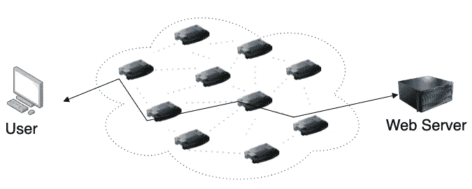
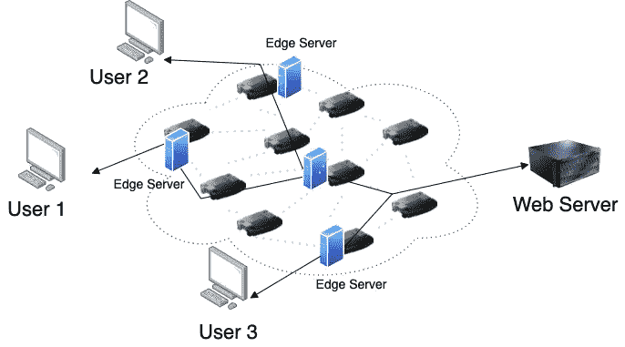
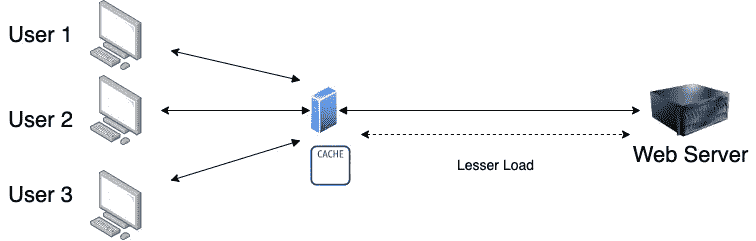
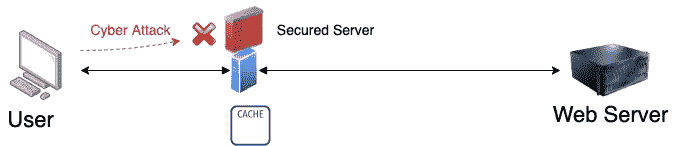
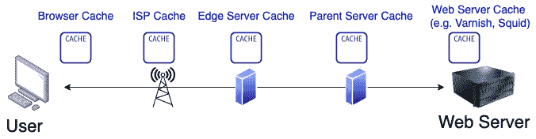
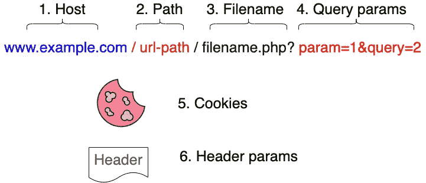
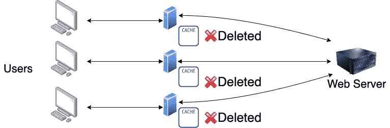
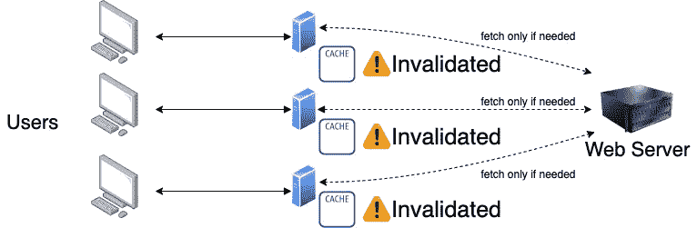

# 内容分发网络(CDN)基本介绍

> 原文：<https://betterprogramming.pub/basic-introduction-of-content-delivery-network-cdn-1356dc63d7d1>

## CDN 如何帮助你的网站表现得更好？

艾莉娜·格鲁布尼亚克在 [Unsplash](https://unsplash.com?utm_source=medium&utm_medium=referral) 上的照片

当我们上网时，我们只需在浏览器上输入一个网址，就会出现一个网页。用我们简单的头脑，我们认为我们只是让我们的计算机以一条直线连接到网络服务器。

它确实通过一个更复杂的网络，如下所示。

这也意味着，最终用户离 web 服务器越远，从 Web 服务器接收内容的速度就越慢。

为了解决这个问题，我们可以从内容交付网络获得支持，内容交付网络是一组地理上分布的服务器，它们一起工作以提供互联网内容的快速交付。

# CDN 有什么帮助？

## 1.更快的内容交付

CDN 在其边缘服务器上缓存来自原始 Web 服务器的可缓存数据。因此，如果边缘服务器确实具有缓存的内容，则用户不再需要通过很长的路线来访问原始内容。

## 2.减少原始 web 服务器上的负载

由于边缘服务器缓存数据，访问原始 web 服务器的需求不会减少。因此，与没有 CDN 的相比，网络服务器的负载要低得多。

## 3.在边缘处理更好的安全性

如果有人试图对服务器进行网络攻击，首先必须通过边缘服务器。

## 4.原始 web 服务器的运行时间更长

随着攻击原始 web 服务器的负载和网络攻击的减少，web 服务器的负担也减轻了。因此，这也确保了网络服务器更长的运行时间。

# 这都是关于缓存的

如果我们观察，CDN 背后的主要成功是缓存内容的能力。为了提高 web 性能，缓存已经应用于许多层，如下所示

对于 CDN，我们可以使用边缘服务器缓存，或者另外使用父服务器缓存作为额外的分层层。

## 缓存控制

为了控制缓存并确定何时重新获取数据，下面是几个标头参数控件

*   [到期](https://developer.mozilla.org/en-US/docs/Web/HTTP/Headers/Expires):自发送之日起不超过 1 年的日期，指示何时需要重新获取。这是一种较老的方法。
*   [Cache-Control](https://developer.mozilla.org/en-US/docs/Web/HTTP/Headers/Cache-Control) :一个新的更精细的控件，可以定义
    - max-age →秒内时间
    - no-store →总是从原点获取所有东西
    - no-cache →仅在过期时从原点获取
    - public →可以在共享缓存上缓存，即使默认情况下没有缓存
    - private →仅在终端浏览器上缓存
    等。

CDN 可以选择相应地忽略接收到的缓存报头参数。

## 缓存键

为了唯一地标识应该缓存什么，我们将缓存键定义为标识符。下面是可能使用的缓存键，有些是强制的，有些是可选的(例如，在使用缓存键之前，可以先对查询参数进行排序)

## 缓存更新

有时我们需要触发一个命令来确保更新缓存。有两种方法

1.清除—我们希望完全移除缓存，并确保在所有 CDN 服务器上获取新的缓存

这是一种慢得多的方法，因为所有的缓存都需要在将来重新获取。

2.Invalidate —我们希望使缓存无效。当用户试图获取数据时，它会检查缓存是否过期。如果不是，则不需要重新获取(为用户带来更快的结果)。如果是，那么只需要重新获取。

# TL；速度三角形定位法(dead reckoning)

简而言之，CDN 只不过是拥有地理上分布的服务器，这些服务器存储来自服务于最终用户的 web 服务器的可缓存数据。这将为 web 服务器带来更好的性能(速度、正常运行时间和安全性)。

为了进一步了解，您可以查看以下内容

*   [你对缓存的了解(第 1 部分)——Akamai](https://developer.akamai.com/blog/2017/03/28/what-you-need-know-about-caching-part-1)
*   [你对缓存的了解(第二部分)——Akamai](https://developer.akamai.com/blog/2017/04/06/what-you-need-know-about-caching-part-2)
*   [你对缓存的了解(第三部分)——Akamai](https://developer.akamai.com/blog/2017/04/14/what-you-need-know-about-caching-part-3)
*   [非官方 Akamai 视频系列—第四部分](https://www.youtube.com/watch?v=7b9s3bloqsU)
*   [Akamai 内容交付网络简介](https://medium.com/free-code-camp/an-introduction-to-the-akamai-content-delivery-network-806aa16d8781)
*   [什么是内容交付网络？](https://www.youtube.com/watch?v=Bsq5cKkS33I)
*   [什么是 CDN？CDN 是如何工作的——由 Cloudflare](https://www.cloudflare.com/en-au/learning/cdn/what-is-a-cdn/)