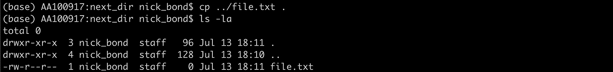
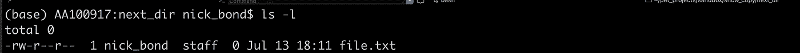
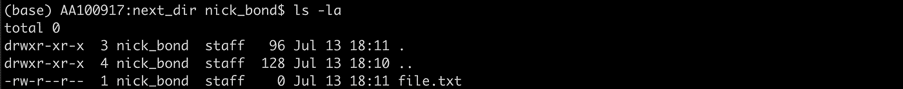
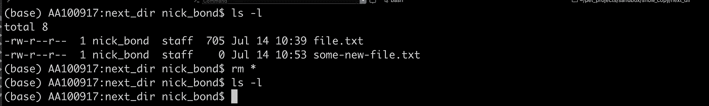
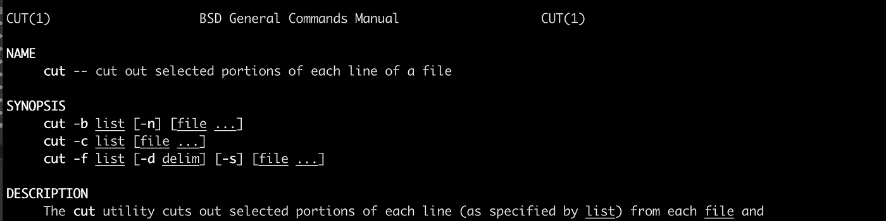

# 基本 Linux 命令

> 原文：<https://betterprogramming.pub/basic-linux-commands-32522b154e48>

## 这个列表包含了最常用的 Linux 命令，对任何开发人员来说都是有用的


照片由 [Sai Kiran Anagani](https://unsplash.com/@_imkiran?utm_source=unsplash&utm_medium=referral&utm_content=creditCopyText) 在 [Unsplash](https://unsplash.com/s/photos/programming?utm_source=unsplash&utm_medium=referral&utm_content=creditCopyText) 上拍摄

# 管理文件和目录

`mkdir`创建一个新目录
`rmdir`删除一个唯一的空目录
`cd myFolder`将当前工作目录更改为指定目录
`cd ..`转到上一个目录
`pwd`打印当前工作目录

```
USER:next_dir nick_bond$ pwd
/Users/nick_bond/projects/sandbox/show/next_dir
```

`cp`复制文件



丙酸纤维素../file.txt。

`cp ../file.txt .` 将文件从先前目录复制到当前目录
`touch`创建新文件
`ls -l`显示一个目录的内容



ls -l

`-rw-r --r--`是文件的权限
`1`是指向文件的索引节点的数量
`nick_bond`和`staff`是文件的所有者和所属的组
`0`是文件的大小
`Jul 13 18:11`是最后修改的日期
`file.txt`是文件的名称

我们可以通过使用下面的命令来改变权限、所有者和文件的组:
`chmod` 改变文件的权限
`chown` 改变文件的所有者
`chgrp` 改变文件的组

`ls -la`显示所有文件，包括以点号开头的隐藏文件。



ls -la

`mv`重命名文件(第一个参数是旧文件名，第二个参数是新文件名)

```
mv file.text renamed.txt
```

`rm`删除一个目录中的内容
删除一个目录中的所有内容`rm *`



rm *

# 对文件内容进行操作

`cat` 显示文件的内容`wc` 统计文件中的字符、字数和行数**打印给定文件的类型**

****

**wc text.txt 和 file text.txt**

**`head` 显示文件的前十行`tail` 显示文件的后十行
`less` 滚动浏览给定文件的内容
`sort` 按字母顺序排列文件的行**

# **附加命令**

**`uptime` 显示计算机已经运行多长时间`who` 打印当前登录计算机的用户列表
`date`打印当前数据
`echo ‘some message**’**`打印消息作为标准输出
`man` 显示给定命令的手册页**

****

**人工切割**

**感谢阅读！我希望这些能帮到你。**