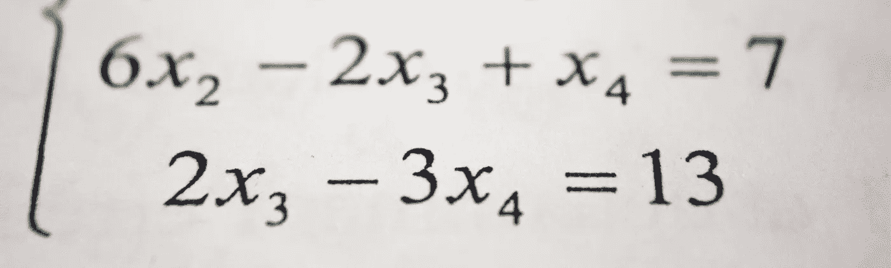

# Swift 中的基础数学

> 原文：<https://betterprogramming.pub/basic-math-in-swift-966ab802c854>

## 将 Swift 用作计算器



安托万·道特里在 [Unsplash](https://unsplash.com/s/photos/math?utm_source=unsplash&utm_medium=referral&utm_content=creditCopyText) 拍摄的照片

我以前写过如何[建立操场](https://medium.com/@stevenpcurtis.sc/coding-in-swift-playgrounds-1a5563efa089)来编写一些 Swift。现在变得严重了；我们可以做一些有用的事情！

难度:**初学者** |简单|普通|挑战

# 先决条件

*   能够使用 Swift Playgrounds 编码。
*   已经[知道变量](https://medium.com/@stevenpcurtis.sc/what-is-a-variable-3447ac1331b9)将是有益的。
*   理解[溢出](https://medium.com/@stevenpcurtis.sc/what-is-overflow-5a2f36d17dc7)的意思。

# 术语

*   编译程序:把指令转换成机器代码或低级形式的程序，以便它们能被计算机读取和执行。
*   数据类型:可以处理的数据类型的表示，例如，整数或字符串。
*   操作数:对其执行运算符的值。
*   溢出:当一个数太大而不能存储时。
*   Playgrounds:可用于创建 Swift 代码的开发环境。
*   UInt8:一个 8 位无符号整数值。

# 解决数学问题

游乐场非常有趣。计算器可以解决许多问题。但是你知道你可以用操场来解决更复杂的问题吗？

## 解决问题

您可以键入:

```
1 + 2
```

直接放到操场上，在右边空白处你会得到答案(3)。

## 算术运算符

在 Swift 中可以使用大量的操作员。

一些例子是:

```
+, -, *, /, %
```

可以像您想象的那样在操作数之间使用(在这个简单的例子中，这意味着简单的数字)。

## 增量和减量

你可以给一个变量加一个或者去掉它！你当然可以，但这里要解释的是`-=`或`+=`。让我们看一个例子:

```
var firstNumber = 4
firstNumber += 1
print (firstNumber) // 5
firstNumber -= 1
print (firstNumber) // 4
```

对于大于 1 的数字也可以这样做！

```
var firstNumber = 4
firstNumber += 3
print (firstNumber) // 7
firstNumber -= 2
print (firstNumber) // 5
```

当然，算术运算符也可以工作！

```
var firstNumber = 4
firstNumber /= 2
print (firstNumber) // 2
```

## 对我来说太大了，伙计

编译器只能处理如此大的其他类型的整数。如果你选择了一个太大的数字，你最终会处于溢出的状态。

在 Swift 中，我们可能会使用一个`UInt8`数据类型，它只能接受 8 位数据。Swift 为我们提供了最大静态 var，但如果我们在那个所谓的 max 上再加一个会怎么样？

```
var largeNumber: UInt8 = Int32.max
largeNumber += 1
```

答案？这确实“对我来说太大了”，也就是说——你已经进入了一个`overflow`状态(这里有一个向导

# 结论

你面前有一台电脑(移动用户:停止阅读)。你可以把它当作一个计算器，如果你使用变量的话，你甚至可以做得更好！

这篇文章旨在帮助你做到这一点，希望对你有所帮助！

感谢阅读！