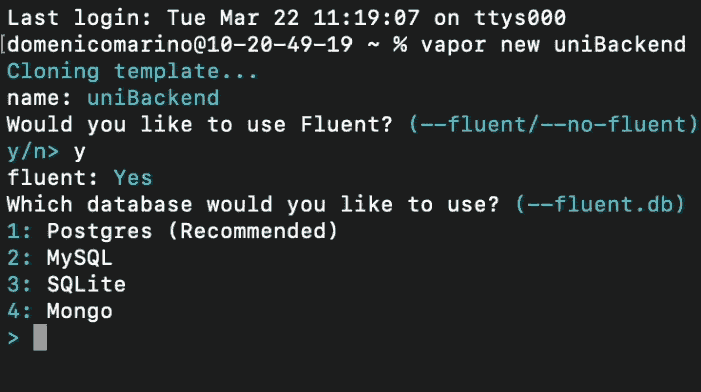
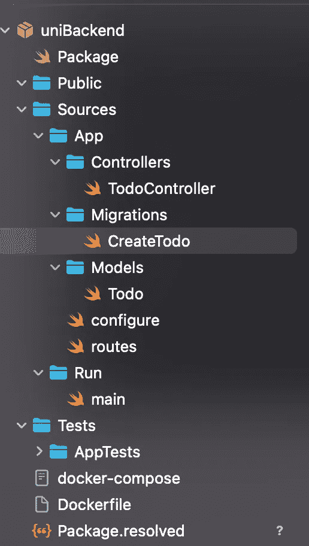

# 使用 Vapor 构建基本的服务器端 Swift 应用程序

> 原文：<https://betterprogramming.pub/basic-server-side-swift-with-vapor-57dec37b6abc>

## 设计一个大学考试系统


照片由 [MChe Lee](https://unsplash.com/@mclee?utm_source=medium&utm_medium=referral) 在 [Unsplash](https://unsplash.com?utm_source=medium&utm_medium=referral) 上拍摄

(与[朱塞佩·卡兰南特](https://www.linkedin.com/in/giuseppe-carannante/)和[多梅尼科·马里诺](https://www.linkedin.com/in/domenicomarino7/)合作)

在本教程中，我们将展示如何使用 [CRUD](https://it.wikipedia.org/wiki/CRUD) 操作创建和处理一个小型数据库。

如果你需要帮助在你的应用程序中使用你的 API，请遵循本指南。

对于下面的例子，我们考虑一个大学考试系统。我们将创建三个不同的表(Exam、Student 和 StudentExam ),以便模拟一个大学数据库，您可以在其中注册和显示您的考试。

# 安装自制软件、Vapor 和 PostgreSQL

在开始打包处理软件(家酿)之前，需要一个框架(Vapor)和一个数据库(PostgreSQL)。

为什么应该使用 Vapor？ *Vapor* 是一个用于 *Swift* 的 HTTP web 框架。它为你的下一个网站、API 或云项目提供了一个漂亮的表达和易于使用的基础。

# 蒸汽项目

让我们开始创建一个新的 Vapor 项目。打开您的终端，跟随下面的视频:

在我们继续之前，让我们关注这一步:



当被问及 Fluent 时，我们选择“是”,因为它会生成大量有用的代码，这些代码将在一段时间内加快我们的工作。

# 输入项目包

在终端中打开“Package.swift”后，将会创建一个新的 Xcode 项目:



在本教程中，我们不会使用 TodoController 文件，所以您可以删除或注释它。

# 1.配置数据库连接

现在打开“configure.swift”文件，对其进行修改，并确保使用您的数据库数据更改“可选默认值”的正确值:

# 2.创建和删除表

您可以选择在项目中创建表。如果没有，可以跳过这一部分，跳到下一步。

*   转到[迁移](https://docs.vapor.codes/4.0/fluent/migration/)文件夹，为您的每个表创建一个类，如下所示:

*   现在回到“configure.swift”文件，用这三行代码替换我们的默认迁移:

*   回到 vapor 并运行“Vapor 运行迁移”:

如果你去你的数据库，你应该找到你的表。

# 3.创建 RESTful APIs

在本节中，我们将讨论如何使用 API 创建和处理 [CRUD](https://it.wikipedia.org/wiki/CRUD) 操作。

# 4.API 测试

为了测试我们的 API，我们使用了 Postman。看看下面的指南，我们在其中测试了一些 API。

*不要忘记运行你的应用程序，否则你将无法使用你所有的代码*

如果你想下载完整的项目，点击这里: [GitHub](https://github.com/Alfuroot/Vapor-Swit_DB_tutorial)

```
**Want to Connect?**In case you have any problem you can contact us on discord:Giuseppe Carannante — **Giuseppe Carannante#3488**Domenico Marino — **Domenico Marino#1203**Gianluca Annina — **SidusProxy#1914**
```