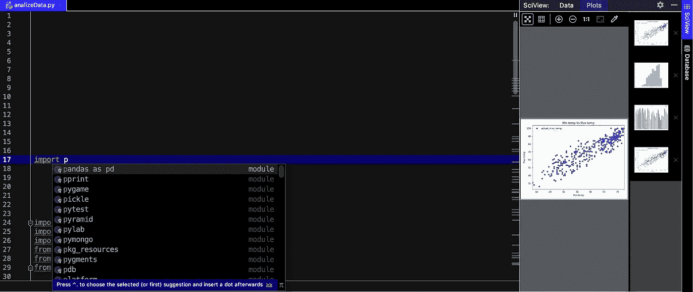

# 机器学习入门，第 2 部分:启动 ML 项目的基本步骤

> 原文：<https://betterprogramming.pub/basic-steps-to-starting-a-ml-project-getting-started-with-machine-learning-part-2-e9d2c614c6cc>

## 平台、解释器、基本库和自动完成

克里斯多夫·伯恩斯在 [Unsplash](https://unsplash.com/s/photos/artificial-intelligence?utm_source=unsplash&utm_medium=referral&utm_content=creditCopyText) 上拍摄的照片

在我之前的文章中，“[机器学习入门，第 1 部分](https://medium.com/@adorekasun/getting-started-with-machine-learning-part-1-5cca93679d74)”，我们谈到了一些机器学习入门的库。现在，我们将讨论如何开始使用 Python 进行编码，以及如何设置使用 Python 的环境。

首先，你需要知道你在数据科学的意义上喜欢什么领域。如果你更愿意从事统计数学方面的工作，你要从事的语言是 R 语言；否则，总的来说你可以使用 Python。

# 平台

在开始之前，你必须考虑你熟悉编码的方式。要么可以在 Jupyter Notebook 和 iPython Notebook 这样的本地主机平台上工作，要么在 PyCharm 这样的 ide 上工作，要么在 VS Code(Visual Studio 代码)或 Atom 这样的代码编辑器中工作。我在这些平台上工作过几次，它们包含了自己的 Python 开发规范。

我们来看看每一个的利弊。

## **Jupyter 笔记本/ iPython 笔记本**

导入库很容易，对于新手来说，这是一个很好的工作平台，因为你必须自己输入所有的东西，包括关键字。

对于一些大项目来说有点困难，因为你不会在这些平台上得到建议。击键次数可能会增加，所以你会花更多的时间。还有一些像腹地这样的扩展，Github 里的开源贡献者还在开发，有 bug。

## 皮查姆

它非常适合处理大型项目，因为它将所有目录分开，等等。此外，当从 Anaconda 导入库时，它让您有机会在虚拟环境中工作，并且它有自己的特性，可以将包导入/安装到您正在工作的特定项目中。一旦你删除了这个项目，你为这个项目安装的所有包都不见了！此外，它给出了很好的匹配建议，减少了击键次数，节省了您的时间。

如果你还在练习 Python，这不是一个完美的平台。你必须在代码编辑器或 Jupyter 笔记本上练习。

## 代码编辑器(相对于代码、Atom 等等)

就我个人而言，我更喜欢 VS 代码，因为它提供了一些很酷的功能和很好的扩展以及一个编辑器终端。

基本上所有的编辑器都包含扩展，这完全取决于你的偏好。GitHub 开发了 Atom，它提供了在合并时使用 Git 的很好的选择，并且提供了提交历史，没有任何扩展。VS 代码使用像 GitLens 这样的扩展给出了这些选项。

我要注意的一点是，安装越来越多的扩展会降低代码编辑器的速度，需要更多的时间来编译代码。

到最后，所有的编辑几乎都是一样的，这是你自己的偏好。此外，如果您正在使用代码编辑器，您将需要一个虚拟环境。

# 解释程序

当谈到虚拟环境时，所有人使用的都是 Anaconda，与其他环境相比，这很容易实现！

*   首先，你需要下载 Anaconda 或者 Miniconda。选择是基于你的电脑性能。如果你的电脑内存和时钟速度较低，你需要下载 Miniconda。否则，可以从 Anaconda 开始。
*   在“环境”下，最初您只会看到基本环境。你可以在基地开始工作，也可以创建自己的基地。在用相关的库设置好环境之后，您必须将代码编辑器/IDE 的 Pycharm 环境更改为您创建的环境。

注意:如果您愿意在 Pycharm 中为项目单独安装库，您不需要通过 Anaconda。您只需在 Pycharm 解释器部分键入库名，然后直接下载。您不能在代码编辑器中这样做。

在 Linux/Ubuntu 中使用 sudo、pip 或 conda 和 apt get 通过终端/命令提示符直接安装库时，在这里使用它的全部目的是，有时您必须通过在终端中键入来安装所有的子库。在环境中，您只需安装主库。其他库将自动安装，您可以开始了。

# 基本库

如果你对 ML 感兴趣，首先学习这些基础库是必要的:

*   NumPy——它是进行科学计算时的主库。它提供了高性能的多维数组对象和工具来处理这些数组。如果你熟悉 Matlab，你可能听说过 NumPy。NumPy 是你在处理数组、矩阵等时需要的库。
*   matplotlib——它是 Python 中的基本绘图库，是 NumPy 的数值数学扩展。它提供了一个面向对象的 API，用于将绘图嵌入到应用程序中。
*   熊猫——这是您在处理 csv 文件时需要的库。它是数据操作和分析的核心库。它还提供数据结构和操作来处理数字表和时间序列。

TensorFlow 和 sci-kit learn 也是一些主要库。稍后我们将讨论它们！

# 自动完成

当在 ide 和代码编辑器中使用自动补全时，ide 会在你用一个.(点)访问它们时显示库内函数。在代码编辑器中，您需要安装扩展。既然是做 VS 代码的，那我就给大家讲讲 VS 代码吧。VS 代码的自动完成扩展最初以智能感知的形式出现，现在以智能代码的形式出现。

最重要的是，有一个名为 [Kite](https://kite.com) for Python 的自动完成应用程序，它使用从我们自己的代码中训练出来的人工智能模型，即使我们只键入一个字母，它也会自动完成。例如，通常当我们导入库时，我们使用简短的形式来利用代码中的库。Kite 甚至暗示了这个短名字，如下所示。PS:我不会因此从风筝队得到任何佣金！

图片由作者提供

Kite 还为 Vim Atom 和 VS 代码提供了插件，从而减少了击键次数。

我认为这对于设置编码编辑器来说已经足够了。让我们再次与[第三部](https://medium.com/p/7f30b81e8b97/edit)见面吧！手指交叉！编码快乐！