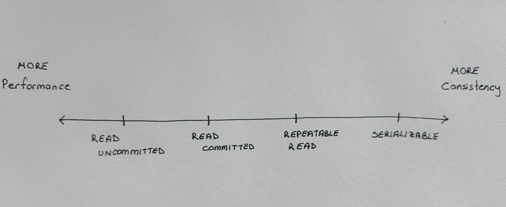

# 数据库中一致性和锁定的基础知识

> 原文：<https://betterprogramming.pub/basics-of-consistency-and-locking-in-databases-8156ffc1166f>

## 让我们了解一下一致性、事务隔离级别和 InnoDB 中的锁定


大卫·普帕扎在 [Unsplash](https://unsplash.com?utm_source=medium&utm_medium=referral) 上的照片

# 酸

数据库事务是数据库管理系统中执行的一个工作单元。例如创建记录、更新记录、删除记录等等。

酸是代表原子性、一致性、隔离性和持久性的首字母缩写词。这是可靠数据库事务的四个属性。

# “C”表示一致性

这篇博客文章主要关注数据库事务的一致性方面。

一致性确保数据始终保持完整。这意味着数据库将始终处于有效状态。

让我们想象一个购物场景来更好地理解一致性。以下可能代表处理此类操作的步骤:

1.  用户将商品添加到购物车
2.  检查的项目数量
3.  用户使用他们的在线钱包支付物品
4.  付款已批准
5.  项目数量已更新
6.  用户余额已更新
7.  订单已处理

```
+---------+---------+----------+
| Item ID |  Price  | Quantity |
+---------+---------+----------+
|       9 | 200.00  |        1 |
+---------+---------+----------++-----------+---------+
| Wallet ID | Balance |
+-----------+---------+
|        42 |  500.00 |
+-----------+---------+
```

假设这些步骤是单个数据库事务的一部分。一旦事务完成，我们期望一致的数据库处于这种状态:

```
+---------+---------+----------+
| Item ID |  Price  | Quantity |
+---------+---------+----------+
|       9 | 200.00  |        0 |
+---------+---------+----------++-----------+---------+
| Wallet ID | Balance |
+-----------+---------+
|        42 |  300.00 |
+-----------+---------+
```

这表明数据库从未处于无效状态。如果不能保证一致性，我们可以让数据库处于这样的状态:

```
+---------+---------+----------+
| Item ID |  Price  | Quantity |
+---------+---------+----------+
|       9 | 200.00  |        0 |
+---------+---------+----------++-----------+---------+
| Wallet ID | Balance |
+-----------+---------+
|        42 |  500.00 |
+-----------+---------+
```

你看到这里的问题了吗？数据库处理了订单，但由于某种原因，钱包余额没有改变。这是数据库的不一致状态。这种不一致可能会损害我们的业务。

# 在不同的一致性水平下会发生什么？

三种现象解释了在一致性保证失败的情况下会发生什么。

在数据库中，“提交”意味着将数据永久保存在数据库中。

## 1.脏读

事务 T1 可以从其他事务中读取尚未提交的数据。

想象上述购物的交易如下所示:

现在假设库存中只剩下一件商品。

*   用户 1 开始交易 T1 通过步骤 1 到 8。
*   就在用户 2 试图查看该项目的细节之后。

即使交易 T1 尚未完成，用户 2 也会看到该商品缺货。

现在假设由于某种原因，T1 在提交之前失败了。现在用户 2 认为该商品缺货，尽管用户 1 不能购买该商品。

## 2.不可重复读取

事务 T1 读取一行两次，得到不同的结果。这可能是因为另一个事务更改了该行中的值或删除了该行。

## 3.幻像读取

事务 1 执行相同的 read 语句，第一次读取时没有显示 see 行。这可能是因为另一个事务插入了与 T1 的读取标准相匹配的新行。

对于我们假设的例子，我们可以用一个更好的设计来避免上面显示的问题。也有不同的隔离级别带来不同的一致性级别。为我们的业务选择合适的隔离级别是一个关键决策。

# 了解锁

在继续讨论事务隔离级别之前，让我们理解不同锁的含义。

锁定是为了达到承诺的一致性水平。为此，每个隔离级别根据其承诺使用不同的锁定方法。

## 共享锁

持有锁的事务可以读取该行。

如果事务 T1 持有行 R 上的共享锁:

-第二个事务 T2 可以获得行 r 上的 S 锁。它们“共享”该锁，并且可以同时读取该行。

-第二个事务 T2 无法获得行 r 上的 X 锁。T1 不共享该锁，并防止 T2 修改行 r

## 独占锁(X 锁)

持有锁的事务可以更新或删除该行。

如果事务 T1 持有对行 R 的排他锁:

-第二个事务 T2 无法获取行 r 上的 S 锁或 X 锁。该锁只属于 T1，直到 T1 释放它。

## 非锁定读取

非锁定读取是不锁定行的“SELECT”语句。这些是“SELECT … FROM …”形式的普通“SELECT”语句。它们不能保证一致性。

## 锁定读取

锁定读取是“SELECT”语句，它锁定行以防止其他人更改它们。

## 记录锁

记录锁是仅在索引记录上的锁。这种锁定防止其他人修改该记录。

## 间隙锁

在索引记录之间的间隙上设置间隙锁。这是为了防止其他事务向锁定的间隙中插入新行。

间隙锁是下一把钥匙锁的一部分。InnoDB 使用锁来锁定相关的间隙，以确保我们在工作的范围内不会遇到幻像行。

## 下一键锁

下一键锁是记录锁和间隙锁的组合。记录上的记录锁和间隙锁被设置在我们不希望被另一个事务影响的范围内。这可能是我们正在处理的记录之前和/或之后的间隙。

# 事务隔离级别

事务隔离级别就像具有不同级别的一致性-性能权衡的预置。



当我们从未提交读取到可序列化时，一致性会增加，性能会降低。

不同的事务隔离级别解决不同的问题。

## 未提交读取

在这一级别，事务隔离处于最低级别——在这一级别时，它们没有被隔离，也没有设置锁。每个事务都将读取其他事务的最新更改。即使这些更改尚未提交。这可能会导致脏读。

## 已提交读取

在这个级别，事务只读取其他事务提交的更改。此级别仅防止脏读。

对于“SELECT … FOR UPDATE”、“SELECT … FOR SHARE”、“UPDATE”和“DELETE”语句，InnoDB 会锁定索引记录。这是为了防止其他事务修改这些行。

## 可重复读

这是 InnoDB 的默认事务隔离级别。

在这个级别，事务内部的读取是一致的。事务在第一次读取时获取当前状态的快照，并在整个事务中使用该快照。这确保了所有的读取可以在同一个事务中重复，因此命名为 Repeatable-Read。此级别可防止脏读和不可重复的读。

在这个级别，InnoDB 使用 next-key 锁进行搜索和索引扫描。下一键锁防止幻影读取。值得注意的是，这个级别保证只有“读”操作才不会出现幻像行。对表中所有记录的“更新”将对“所有提交的行”生效。这包括来自其他事务的行—那些是幻影行。这意味着幻像行仍然可以出现在这个级别。

## 可序列化

在这个级别上，事务之间是完全隔离的。这可以防止脏读、不可重复读和幻像读。

正如我们所看到的，每个事务隔离级别解决不同的问题。我们实现隔离的方法是通过使用不同的锁定机制。

# 结论

当理解数据库中的锁时，我们需要记住目的是提供一定程度的一致性。而且俗话说，天下没有免费的午餐。为了获得更高的一致性，我们需要添加更多的锁，更多的锁意味着更多的开销，因此会损失性能。为了能够选择合适的解决方案，我们必须了解我们系统的需求。

*最初发表于*【https://recepinanc.com】