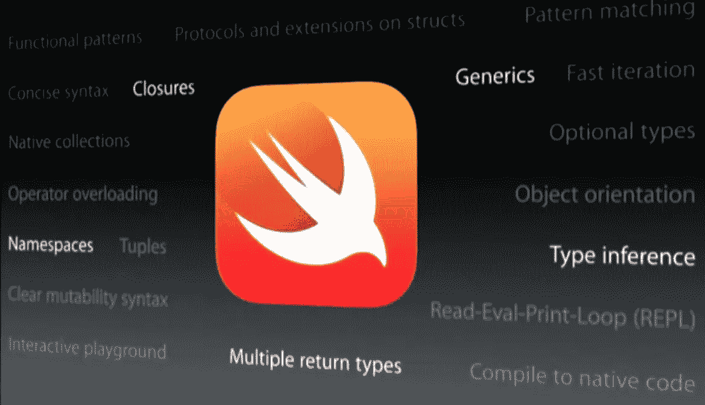

# Swift 的基础知识

> 原文：<https://betterprogramming.pub/basics-of-swift-programming-part-2-3b77f0d8cf98>

## 类型别名、元组、可选项、强制展开等等



在我的[上一篇文章](https://medium.com/@rathodmayur93/basics-of-swift-programming-par-5b59cc68b367)中，我谈到了 Swift 是什么、常量、变量和不同类型的变量(比如整数、浮点、布尔和`UInt`)。我们还了解了字符串插值以及如何注释掉代码。

你可以在下面找到上一篇文章:

[](https://medium.com/@rathodmayur93/basics-of-swift-programming-par-5b59cc68b367) [## Swift 编程基础

### 什么是 Swift？

medium.com](https://medium.com/@rathodmayur93/basics-of-swift-programming-par-5b59cc68b367) 

# 数字文字

整数文字可以写成:

*   一个没有前缀的十进制数
*   一个*二进制*数字，带有一个`0b`前缀
*   一个*八进制*数字，带一个`0o`前缀
*   一个十六进制的*数字，带有一个`0x`前缀*
*   所有这些整数文字都有一个十进制值`17`:

```
let decimalInteger = 17
let binaryInteger = 0b10001 // 17 in binary notation
let octalInteger = 0o21 // 17 in octal notation
let hexadecimalInteger = 0x11 // 17 in hexadecimal notation
```

# 键入别名

*类型别名*为现有类型定义一个替代名称。您可以用关键字`typealias`定义类型别名。当您希望通过更适合上下文的名称来引用现有类型时，类型别名非常有用，例如在处理来自外部源的特定大小的数据时。

```
typealias AudioSample = UInt16
```

一旦定义了类型别名，就可以在任何可能使用原始名称的地方使用该别名:

```
var maxAmplitudeFound = AudioSample.min
// maxAmplitudeFound is now 0
```

# 元组

*元组*将多个值组合成一个复合值。元组中的值可以是任何类型，彼此不必属于同一类型。

```
let http404Error = (404, “Not Found”)
// http404Error is of type (Int, String), and equals (404, "Not Found")
```

`(404, "Not Found")`元组将一个`Int`和一个`String`组合在一起，为 HTTP 状态代码提供两个独立的值:一个数字和一个可读的描述。可以描述为一个`(Int, String)`类型的元组。您可以拥有一个类型为`(Int, Int, Int)`或`(String, Bool)` 的元组，或者，事实上，您需要的任何其他排列。

您可以将元组的内容分解成单独的常量或变量，然后像往常一样访问它们:

```
let (statusCode, statusMessage) = http404Error
print(“The status code is \(statusCode)”)
// Prints “The status code is 404”print(“The status message is \(statusMessage)”)
// Prints “The status message is Not Found”
```

分解元组时，忽略带有下划线(`_`)的元组部分:

```
let (justTheStatusCode, _) = http404Errorprint(“The status code is \(justTheStatusCode)”)
// Prints “The status code is 404”
```

定义元组时，可以命名元组中的各个元素:

```
let http200Status = (statusCode: 200, description: “OK”)print(“The status code is \(http200Status.statusCode)”)
// Prints “The status code is 200”print(“The status message is \(http200Status.description)”)
// Prints “The status message is OK”
```

# 选项

在可能没有值的情况下，使用*选项*。可选表示两种可能性:要么有一个值，您可以打开可选来访问该值，要么根本没有值。您可以通过在变量类型的末尾添加`?`来定义可选变量。

```
var countryName : String?//If you define an optional variable without providing a default value, the variable is automatically set to nil for you:
```

还可以用值声明一个可选变量

```
var countryName : String? = "India"
```

# If 语句和强制展开

我们可以使用一个`if`语句，通过比较可选项和`nil`来确定可选项是否包含值。

如果一个选项有一个值，它被认为不等于`nil`:

```
if convertedNumber != nil {
   print(“convertedNumber contains some integer value.”)
}
// Prints “convertedNumber contains some integer value.”
```

一旦我们确定可选的包含一个值，您可以通过在可选名称的末尾添加一个感叹号(`!`)来访问它的底层值。感叹号有效地表示，“我知道这个可选肯定有一个值；请使用它。”这就是所谓的*强制展开* 的可选值:

```
if convertedNumber != nil {
   print(“convertedNumber has an value of \(convertedNumber!).”)
}
// Prints “convertedNumber has an integer value of 123.”
```

# 可选绑定

我们使用*可选绑定*来发现一个可选参数是否包含一个值，如果是，就把这个值作为一个临时常量或变量。

我们可以使用可选绑定而不是强制解包来重写上面的示例:

```
if let actualNumber = Int(possibleNumber) {
   print(“The actualNumber has an value of \(actualNumber)”)
}else {
   print(“The actualNumber could not be converted to an integer”)
}
// Prints “The actualNumber has an value of 123"
```

# 隐式展开选项

隐式展开的可选值是后台的普通可选值，但也可以像非可选值一样使用，而不需要在每次访问可选值时将其展开

```
let assumedString: String! = “An implicitly unwrapped optional string.”
print(assumedString)
// Prints "An implicitly unwrapped optional string."
```

在上面的例子中，我们可以打印`assumedString`变量，而不用在末尾加感叹号。

# 摘要

您学习了一些关于可选变量、元组、可选绑定和可选变量的知识——它们是什么以及如何解开它们。

# 参考

[“基础知识”通过 Swift 文档](https://docs.swift.org/swift-book/LanguageGuide/TheBasics.html)