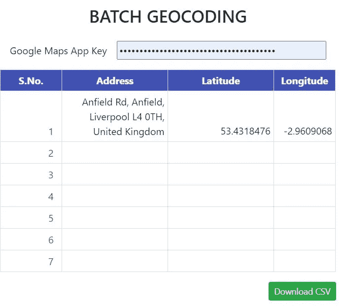
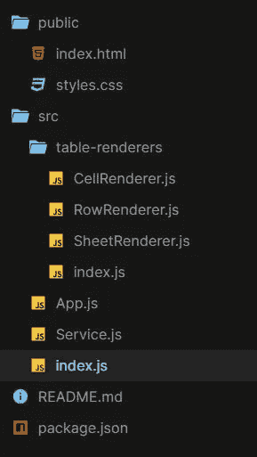

# 使用 React 和 Google 地理编码 API 进行批量地址地理编码

> 原文：<https://betterprogramming.pub/batch-address-geocoding-using-react-and-the-google-geocoding-api-bec9ef4444f2>

## 当您需要将文本地址转换为地理编码地址时


*地理编码*是将地址(如街道地址)转换为地理坐标(如纬度和经度)的过程，您可以使用地理坐标在地图上放置标记或定位地图。这意味着我们需要一个像`Anfield Rd, Anfield, Liverpool L4 0TH, United Kingdom`这样的完整地址来获得坐标`-53.4318476,-2.9609068`。

你可以在下面看到这个项目的快照，或者试着在这里玩一下。



用户界面



代码结构

该地址可以从 Excel 或谷歌工作表中键入或复制粘贴。如果成功，它会自动填充纬度和经度值。如果不是，那么这个值将是`Failed`。您也可以将数据下载到 CSV 文件中。如果您粘贴超过七行，它会自动添加额外的行。

# 开始之前

我们将使用 Google API 键来获取坐标——即纬度和经度。如果你没有 API 密匙，你可以从[这里](https://developers.google.com/maps/documentation/geocoding/get-api-key)创建一个。

我们还将使用以下库:

*   `[react-datasheet](https://github.com/nadbm/react-datasheet)`是一个简单的 React 组件，用于创建电子表格(这意味着它生成一个包含单元格的表格)
*   `[react-csv](https://github.com/react-csv/react-csv)`是一个从给定数据生成 CSV 文件的组件。这些数据可以是数组的数组、文字对象的数组或字符串。
*   `[axios](https://github.com/axios/axios)`是一个简单易用的基于 promise 的 HTTP 客户端，用于浏览器和 Node.js

# 创建新的 React 应用程序

使用 [Create React App](https://github.com/facebook/create-react-app) 创建一个简单的`React`应用程序。为此，您可以运行以下命令:

```
npx create-react-app react-geocoding
cd react-geocoding
npm start
```

# 安装`react-datasheet`、`react-csv,`和`axios`

使用以下命令，安装依赖项:

```
npm install --save react-datasheet react-csv axios
```

# 开始编码

[因为 Google API 密匙是凭证，我们需要保护它们](https://developers.google.com/maps/api-key-best-practices)。有许多方法可以保护 API 密钥，但是在本教程中，我们不会将它们存储在任何地方。相反，我们将要求用户输入一个键。

让我们创建一个`Service`，它将 API 键和地址作为输入，并将返回来自[谷歌地理编码 API](https://developers.google.com/maps/documentation/geocoding/start) 的响应。以下示例请求`Anfield Rd, Anfield, Liverpool L4 0TH, United Kingdom`的纬度和经度，并指定输出必须为`JSON`格式。

```
[https://maps.googleapis.com/maps/api/geocode/json?address=Anfield%20Rd,%20Anfield,%20Liverpool%20L4%200TH,%20United%20Kingdom&key=YOUR_API_KEY](https://maps.googleapis.com/maps/api/geocode/json?address=Anfield%20Rd,%20Anfield,%20Liverpool%20L4%200TH,%20United%20Kingdom&key=YOUR_API_KEY)
```

您可以通过在您的 web 浏览器中输入 URL 并确保用您自己的 API 键替换`YOUR_API_KEY`来测试这一点。响应包括地址的纬度和经度。下面是您在 JSON 中得到的响应:

```
{
   "results" : [
      {
         "address_components" : [
            ...
         ],
         "formatted_address" : "Anfield Rd, Liverpool L4 0TH, UK",
         "geometry" : {..."location" : {
               "lat" : 53.4318476,
               "lng" : -2.9609068
            },
            ...
         },
        ...
      }
   ],
   "status" : "OK"
}
```

在`geometry`的`location`里面有`lat`和`lng`。所以如果成功的话,`Service.js`会返回完全相同的东西，或者它会返回`Failed`。

接下来，我们需要呈现用户只能输入地址的表单。我们需要的列非常简单。

```
const columns = [
  { label: 'S.No.', width: '3%' },
  { label: 'Address', width: '40%' },
  { label: 'Latitude', width: '25%' },
  { label: 'Longitude', width: '25%' }
];
```

我们将渲染七个空行，这样我们就可以看到网格视图。每个网格的值是`[{ value: ""}, { value: ""}, { value: ""}]`。这是因为列`S.No.`是一个序列号，并且会随着行的扩展而自动递增。

```
<ReactDataSheet
  data={grid}
  className="custom-sheet"
  sheetRenderer={props => (
     <SheetRenderer columns={columns} {...props} />
  )}
  rowRenderer={props => (
     <RowRenderer className="data-row" {...props} />
  )}
  cellRenderer={props => (
     <CellRenderer columns={columns} {...props} />
  )}
  onCellsChanged={handleCellsChanged}
  valueRenderer={cell => cell.value}
/>
```

上面的代码片段将呈现数据表。`grid`包含七行的空值。如果您想添加自定义渲染器，这取决于您。我添加它是为了修改每一列的宽度。

*   `sheetRenderer`是一个可选的函数或 React 组件，用于呈现主工作表元素。默认呈现一个`table` 元素。
*   `rowRenderer`是一个可选的函数或 React 组件，用于呈现每个行元素。默认呈现一个`tr`元素。
*   `cellRenderer`是一个可选的函数或 React 组件来渲染每个单元格元素。默认呈现一个`td`元素。关于自定义渲染器的更多信息可以在这里找到[。](https://github.com/nadbm/react-datasheet#custom-renderers-1)
*   `valueRenderer`是一种呈现单元格值的方法
*   `onCellsChanged`是一个回调函数，每当网格中的数据发生变化时就会被调用:(1)当用户在单元格中输入新值时，(2)当用户在一个或多个选定的单元格中按下 delete 键时，(3)当用户将表格数据粘贴到表格中时

最后，我们必须呈现一个按钮，以 CSV 格式从工作表中下载数据。这很简单:

```
<div className="d-flex flex-row justify-content-end mt-3">
  <button className="btn btn-success btn-sm" onClick={downloadCSV}>
 Download CSV
  </button>
</div>
```

`downloadCSV`将使用`react-csv`库中的`CSVLink`组件，并触发 CSV 文件的下载动作。

在`App.js`文件中组合以上所有片段将产生以下事件链:用户输入地址后，我们调用`Service`组件从 Google Geocoding API 获取 JSON 格式的坐标。然后，我们填充纬度和经度列。

你可以在 GitHub 上找到完整的项目。请随时修改或建议修改。

# 参考

*   [GitHub 上的 React-数据表](https://github.com/nadbm/react-datasheet)
*   [GitHub 上的 react-CSV](https://github.com/react-csv/react-csv)
*   [地理编码 API 文档](https://developers.google.com/maps/documentation/geocoding/start)