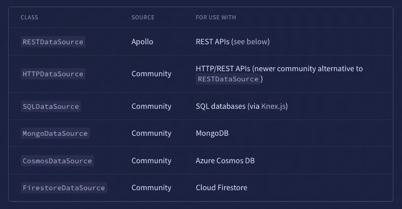
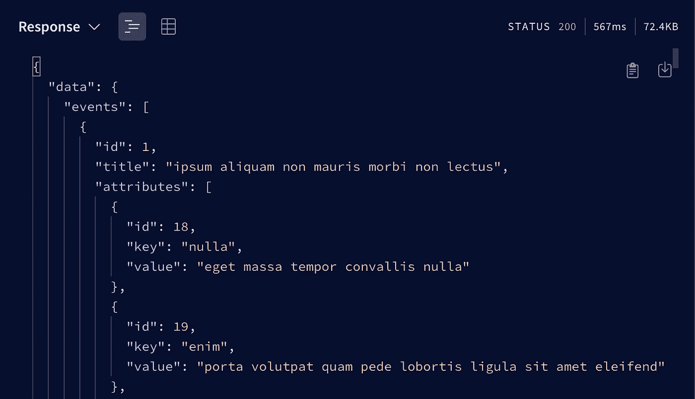
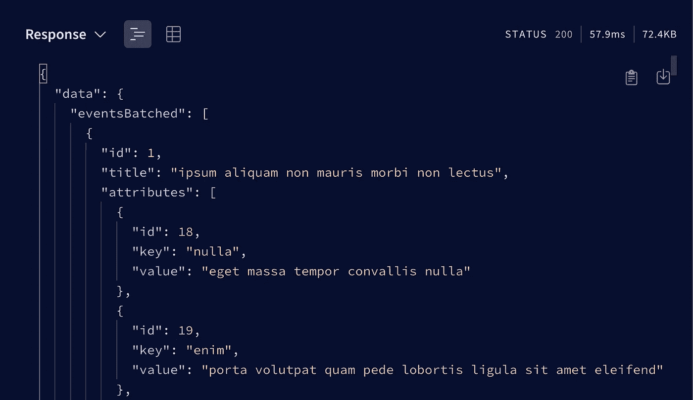
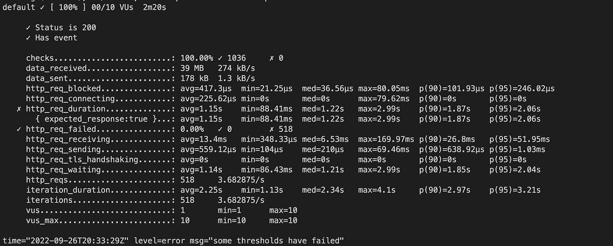
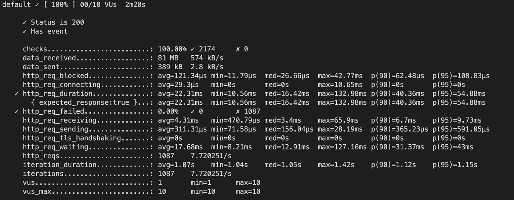

# 为什么批处理您的 Apollo SQL 数据源是非常宝贵的

> 原文：<https://betterprogramming.pub/batching-your-apollo-sql-datasources-is-invaluable-2d264a17df20>

## 这一惊人功能的深入指南


[来源](https://unsplash.com/photos/6sAl6aQ4OWI)

在本文中，我将探讨为什么通过[数据加载器](https://github.com/graphql/dataloader)批处理数据库查询对于快速获得 [Apollo 服务器](https://www.apollographql.com)解析器至关重要。

如果您使用带有数据源的 SQL(或直接在您的解析器中),那么您很可能会遇到 N+1 问题或未解决的性能问题，尽管 Apollo 和社区提供了一些不同的数据源(如下所示),但是没有一个 SQL `DataSource`选项能够解决您的批量请求。



[截图来源](https://www.apollographql.com/docs/apollo-server/data/data-sources/)

为此，我创建了一个新的数据源，可以在这里看到:
[https://www . npmjs . com/package/@ NIC-Jennings/batched-SQL-data source](https://www.npmjs.com/package/@nic-jennings/batched-sql-datasource)

这个数据源允许您在需要的地方轻松地向数据源添加批处理，而不必在整个类中添加 DataLoader 初始化，这将使它变得混乱。

我将演示如何实现这一点，然后展示使用数据加载器作为数据源的一部分在性能上的差异。

# 设置批处理 SQL 数据加载器

我假设你安装了一个 Apollo GraphQL 服务器，但是如果没有，在这个 GitHub 仓库中有一个完整的例子。

要使用数据源，首先安装软件包:

```
npm i @nic-jennings/batched-sql-datasource// or 
// yarn add @nic-jennings/batched-sql-datasource
```

然后创建一个名为`loader.js`的新文件，并创建您的扩展 BatchedSQLDataSource 的数据源，并将其导入到您的 Apollo 服务器中:

在您的解析器中，您现在可以使用我们为 bar 创建的数据加载器:

正如您所看到的，设置是干净和快速的。

# 设置示例服务器

我在这里创建了下面的例子:[https://github . com/NIC-Jennings/batched-SQL-data source/tree/main/example](https://github.com/nic-jennings/batched-sql-datasource/tree/main/example)

使用 [docker-compose](https://docs.docker.com/compose/) 来运行这个带有种子 [Postgresql](https://www.postgresql.org/) 数据库的查询，我得到了以下结果:

## 事件



## 批量事件



如您所见，批处理查询只需要 57.9 毫秒，而标准数据源需要 567 毫秒，快了 9.79 倍！然而，您可能会想，仅仅在 Apollo Studio 中进行这个查询并不是真实的情况。因此，我使用 [K6](https://k6.io/) 编写了一些负载测试，并在我的本地 docker compose 构建上运行它们。你可以在下面看到它们:

# 负载测试—批量测试与标准测试

设置我认为相当宽松的以下阈值，并考虑到我是针对本地 docker 编写堆栈运行它们的。

*   HTTP 错误应该少于 1%
*   95%的请求应低于 250 毫秒

```
thresholds: {
    http_req_failed: ["rate<0.01"], 
    http_req_duration: ["p(95)<250"], 
},
```

运行这里可以看到的测试。提供以下结果:

## 标准数据源



## 批量数据源



# 结果

首先要注意的是，标准数据源没有通过负载测试。超过 95%的测试耗时超过 250 毫秒——平均请求持续时间为 1.15 秒，最长耗时不到三秒，对于一个小数据集来说，这是一个令人震惊的响应时间。我认为这真实地展示了 N+1 问题以及数据加载器如何解决这个问题。例如，批处理数据源完成一个请求平均需要 22.31 毫秒，最长需要 132.98 毫秒

# 结论

我个人认为以上不可否认地显示了使用数据加载器对 GraphQL 请求时间的影响。我希望您同意我创建的包有助于轻松地在 Apollo 中制作和使用数据加载器，并保持您的代码整洁。

感谢您花时间阅读我的文章。我希望你已经发现它的知识性和趣味性。我将围绕 TypeScript、Node、React、Vue、GraphQL、Performance、Go 等写更多文章。