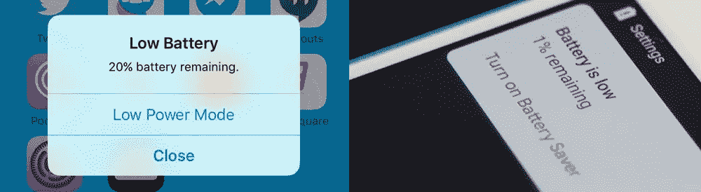
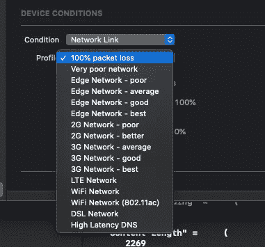
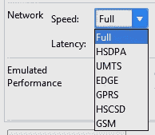

# 电池、网络、磁盘空间:移动应用开发中三个被低估的因素

> 原文：<https://betterprogramming.pub/battery-network-disk-space-three-undervalued-factors-in-mobile-application-development-92988bc1d6a4>

## 如果我们想达到最高的质量，这些是强制性的标准

我刚刚结束了与开发和业务团队的头脑风暴会议。我们与一位敏捷方法学家合作，在 sprint 审查之后，我们讨论了将在我们的应用程序的即将到来的版本中引入的一些新功能。

回想那次会议，不考虑我们交付的最后一个项目，我注意到在移动应用程序的开发中，我们经常不考虑硬件设备的三个重要层。

我指的是电池、网络和磁盘空间。

我在 Android 和 iOS 上看到许多应用程序，它们不关心电池电量、网络质量以及设备上有多少磁盘空间。

关键是:如果我们想让我们的应用程序达到最高质量，我们必须将这些视为强制性标准。

# 电池

你是否曾经在一个移动应用程序的漫长过程结束时，看到手机由于低电量而关机？也许我们正在打电话，或者我们正在填写购买或注册表格。这真是令人沮丧…

在这里，在这种情况下，应用程序本身必须包括一个图形界面，当电池的状态真的很低，在 10%或 5%之间时，它会通知用户。

发出警告后，我们必须让用户能够保存或快速完成正在进行的操作，而不会丢失任何数据。此外，我们可以使用后台任务自动更新和保存流程和数据。

如今，像 Messenger、Skype 或 Whatsapp 这样的应用程序都启用了这一功能，如果你在电池电量低的情况下打电话，你可以找到证据，也可以从我们呼叫的用户发出的低电量信号中找到证据。

当然，像 Android 和 iOS 这样的移动操作系统会像下面的截图一样给用户一个一般性的警告

iOS 和 Android 会发出电池电量低的警告和通知

但是很多应用程序对后台保存过程、状态和记录没有反应，或者只是在应用程序标题中放一点通知。

# 网络

根据网络状态更新用户界面非常重要！一些用户可能使用 Wi-Fi，一些用户使用 4G-LTE，但最有可能的是，许多用户将处于类似 3G 或 EDGE 网络的条件下，这可能比 Wi-Fi 或 4G 慢得多。

有时连接会断断续续或不可用。你的应用架构需要考虑最坏的网络情况。

记住 app 架构设计需要“牢记缓存”，研究数据访问机制和状态管理。

# 使用不同的网络调试和测试您的应用

在带有 Xcode 11 的 iOS 平台上，我们可以[使用网络链路调节器](https://www.agnosticdev.com/content/how-test-network-link-conditioner-xcode-11)来模拟设备状况。

Xcode 11 上的网络链接调节器设置

要应用链接调节器，导航到*Xcode*->-*窗口*->-*设备*和*模拟器*。

在左侧，单击连接的设备，在已安装的应用程序下方，您应该会看到设备条件菜单。在这里，您可以模拟热状态或网络链接。

在 Android 上，我们可以[设置一个 Android 虚拟设备(AVD)](https://developer.android.com/studio/run/managing-avds) 。这是一个配置，它定义了您想要在 [Android 模拟器](https://developer.android.com/studio/run/emulator.html)中模拟的 Android 手机、平板电脑、Wear OS、Android TV 或汽车 OS 设备的特征。

AVD 管理器是一个可以从 Android Studio 启动的界面，可以帮助您创建和管理 AVD。

在 [Android 虚拟设备](https://developer.android.com/studio/run/managing-avds)中，可以设置网络进行调试

# 磁盘空间

尤其是当我们使用多媒体数据，如照片、视频或文档时，我们必须*在进行任何操作之前*检查我们设备上的磁盘空间。

始终检查可用磁盘空间和在设备上保存 raw 文件所需的字节。如果无法继续，我们可以通过警报或通知告知磁盘空间不足。

我们还可以为用户提供在云上保存数据的选项。

# 如何才能做出质量更好的 app？

## **使用应用内通知**(非模态提醒！)

使用应用内通知(不是模式提醒)来提醒用户电池电量不足。

在这里，您可以找到一些有用的文章链接:

*   [为应用程序设计通知](https://medium.muz.li/designing-notifications-for-applications-3cad56fecf96)
*   [设计应用程序通知应遵循的指南](https://www.mobileappdaily.com/2018/11/15/designing-app-notifications)

## **阅读并聆听应用程序中电池、网络和磁盘空间的所有值**

iOS 和 Android 都为我们提供了对这些参数的“只读”API 访问。

我们可以主动使用它在我们的应用程序中执行一些操作和交互。

请查看下面的 API:

*   [电池电量 iOS API](https://developer.apple.com/documentation/uikit/uidevice/1620042-batterylevel)
*   [网络类型 iOS API](https://developer.apple.com/documentation/systemconfiguration/scnetworkreachability-g7d)
*   [磁盘空间 iOS API](https://developer.apple.com/documentation/foundation/urlresourcekey/1412898-volumeavailablecapacitykey)
*   [电池电量安卓 API](https://developer.android.com/reference/android/os/BatteryManager.html)
*   [网络型 Android API](https://developer.android.com/reference/android/net/ConnectivityManager.html)
*   [磁盘空间 Android API](https://developer.android.com/reference/android/os/StatFs)

## **使用系统缓存和云**

我们需要为图像、JSON 文件和视频数据等内容正确使用缓存。这改善了网络的访问和使用，节省了电池寿命！

对于 iOS，请阅读这篇由 John Sundell 撰写的关于 Swift 中的 [*缓存的伟大文章。对于 Android，*](https://www.swiftbysundell.com/articles/caching-in-swift/) *[*缓存在 Android 上变得简单*](https://medium.com/@appmattus/caching-made-simple-on-android-d6e024e3726b) 作者马修·多兰*

## 在云端保存数据

如果我们的本地设备上没有空间，我们可以使用一个程序在云系统上保存数据，比如 [iCloud](https://www.icloud.com) 、 [Dropbox](http://www.dropbox.com/) 、 [Google Drive](https://www.google.com/drive) 等等。

以下是一些改善你的磁盘空间控制流程的链接。

*   [iOS 数据存储指南](https://developer.apple.com/icloud/documentation/data-storage/index.html)
*   [安卓数据存储指南](https://developer.android.com/guide/topics/data/data-storage)

## **根据网络运行时间设计不同的 UI/UX 体验**

请记住，如果网络操作类型需要大量时间来完成，我们使用*进度加载*，如果最终响应时间可以在 0 到 5 秒之间完成，我们使用*不确定加载*。

这篇好文章， [*你需要知道的关于加载动画的一切*](https://medium.com/flawless-app-stories/everything-you-need-to-know-about-loading-animations-10db7f9b61e) *，*来自 Lisa Dziuba 可以帮助我们改进我们的 UI/UX。

## **在临界条件前写日志**

这在开发人员的生活中非常有帮助，可以了解我们的应用程序在何时何地因为电池电量低、磁盘空间不足而崩溃，或者因为网络连接而出现问题。

*   [登录 iOS](https://developer.apple.com/documentation/os/logging)
*   [登录 Android](https://developer.android.com/reference/android/util/Log)

之后，我们可以决定对我们的代码进行一些修复，或者改善用户体验以及与应用程序的交互。

# **我最后的建议**

在应用上述所有或部分要点之前和之后，记录应用的评论和评级。我很确定你会因此而积极向上！