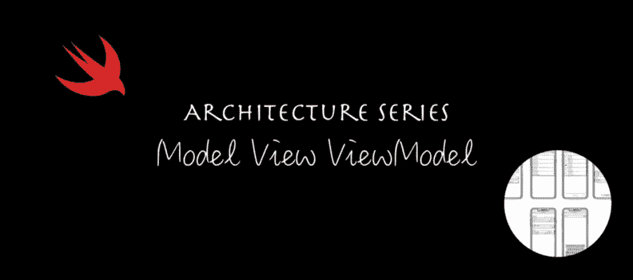

# iOS 架构模式之战:查看模型-视图-视图模型(MVVM)

> 原文：<https://betterprogramming.pub/battle-of-the-ios-architecture-patterns-a-look-at-model-view-viewmodel-mvvm-bdfd07d9395e>

## 使用流行的架构模式构建一个真实世界的足球运动员 iOS 游戏

建筑系列—模型视图视图模型(MVVM)

# 动机

在开始开发一个 iOS 应用之前，我们必须考虑项目的结构。我们需要考虑如何将这些代码添加到一起，以便它们在以后有意义——当我们回来重新访问应用程序的一部分时——以及如何与其他开发人员形成已知的“语言”。

这是这个系列的第二篇文章，全部是关于 MVVM 的。(第一篇文章关于 MVC 的链接出现在最后的有用链接列表中。)

在本文中，我们将检查构建时间和每个模式的优缺点，但最重要的是，我们将看到实际的实现和源代码。

如果您只想看代码，可以跳过这篇文章。该代码可以在 [GitHub](https://github.com/radude89/footballgather-ios) 上开源获得。

# 为什么你的 iOS 应用需要一个架构模式？

最需要考虑的是要有一个可维护的 app。你知道视图在那里，这个视图控制器应该做 X 而不是 y。更重要的是，其他人也知道。

以下是选择一个好的架构模式的一些优势:

*   更易于维护
*   更容易测试业务逻辑
*   与其他队友发展共同语言
*   分离实体的职责
*   更少的错误

# 定义需求

给定一个有六七个屏幕的 iOS 应用程序，我们将使用 iOS 世界最流行的架构模式来开发它:MVC、MVVM、MVP、VIPER、VIP 和 Coordinators。

该演示应用程序名为 Football Gather，是朋友们跟踪业余足球比赛比分的一种简单方式。

## 主要特征

能够:

*   在应用程序中添加玩家
*   给运动员分配队伍
*   编辑玩家
*   为比赛设置倒计时

## 屏幕模型

iOS 应用“Football Gather”的屏幕模型

## 后端

该应用由在 [Vapor web 框架](https://vapor.codes/)中开发的 web 应用提供支持。你可以查看我的 [Vapor 3 初始篇](https://www.radude89.com/blog/vapor.html)和[关于迁移到 Vapor 4](https://www.radude89.com/blog/migrate-to-vapor4.html) 的文章中的 app。

# 什么是 MVVM？

MVVM 代表模型-视图-视图模型(Model-View-ViewModel)，这是一种与 RxSwift 一起自然使用的架构模式，在这里，您可以通过视图模型将 UI 元素绑定到模型类。

这是一个较新的模式，由 John Gossman 在 2005 年提出，其作用是从视图控制器中提取模型。视图控制器和模型之间的交互是通过一个新的层完成的，称为视图模型。

## 模型

*   该模型与 MVC 中的模型是同一层，用于封装数据和业务逻辑。

**通讯**

*   当视图层中发生一些事情时，例如当用户发起一个动作时，它通过视图模型传递给模型。
*   当模型发生变化时，例如，当新数据变得可用，我们需要更新 UI 时，模型会通知视图模型。

## 视角

*   视图和视图控制器是可视元素所在的层。
*   视图包含 UI 元素，比如按钮、标签和表格视图，视图控制器是视图的所有者。
*   这一层与 MVC 中的相同，但是视图控制器现在是它的一部分，并将被更改为引用视图模型。

**通讯**

*   视图不能直接与模型交流。一切都是通过视图模型完成的。

## 视图模型

*   位于视图/视图控制器和模型之间的新层
*   通过绑定，当模型中发生变化时，更新 UI 元素
*   是视图的规范表示
*   为视图提供接口

**通信**

*   可以与模型和视图/视图控制器这两个层通信
*   通过绑定，触发对模型层数据的更改
*   当数据改变时，确保那些改变被传递到用户界面，更新视图(再次通过绑定)

# MVVM 的不同风味

应用 MVVM 的方式取决于您选择实现绑定的方式:

*   使用第三方，如 RxSwift
*   KVO —键值观察
*   用手

在我们的演示应用程序中，我们将探索手动方法。

# 如何以及何时使用 MVVM

当你看到视图控制器做了很多事情，可能会变得很大，你可以开始寻找不同的模式，如 MVVM。

## 优势

*   精简视图控制器
*   更容易测试业务逻辑，因为现在有了处理数据的专用层
*   提供了更好的关注点分离

## 不足之处

*   与 MVC 中相同。如果应用不正确，并且不注意 SRP(单一责任原则)，它可能会变成一个大规模视图模型。
*   对于小项目来说可能太过复杂(例如，在黑客马拉松应用程序/原型中)
*   采用第三方会增加应用程序的大小，并会影响性能
*   使用 UIKit 开发 iOS 应用程序感觉不太自然。另一方面，对于用 SwiftUI 开发的应用程序来说，这非常有意义。

在底部，您可以找到一些链接，告诉您更多关于这种代码架构模式的信息。

# 将 MVVM 应用于我们的代码

这很简单。我们进入每个视图控制器，并将业务逻辑提取到一个新的层(视图模型)。

## 从业务逻辑中分离出`LoginViewController`

转换:

*   `viewModel` —处理视图状态和模型更新的新层
*   服务现在是视图模型层的一部分。

在`viewDidLoad`方法中，我们调用`configureRememberMe()`函数。在这里，我们可以观察视图如何向视图模型请求“记住我”`UISwitch`和用户名的值:

对于登录和注册操作，我们告诉视图模型处理服务请求。一旦服务器 API 调用完成，我们就使用闭包来更新 UI。

`LoginViewModel`由以下属性定义:

我们有从`LoginViewController`传来的服务(`LoginService`、`StandardNetworkService`用于注册用户，存储服务商:`UserDefaults`和`Keychain`包装器)。
它们都是通过初始化器注入的:

如果我们想使用自己的模拟服务或存储，这对于单元测试来说很方便。

公共 API 简洁明了:

和两个服务器 API 调用:

正如您所看到的，通过将模型从视图控制器中分离出来，代码看起来更加清晰。现在，视图/视图控制器向视图模型询问它需要什么。

`PlayerListViewController`比`LoginViewController`更大，更难重构，更难提取业务逻辑。

首先，我们想留下这个类需要的插座和所有的`UIView`对象。

在`viewDidLoad`中，我们会做视图初始状态的设置和配置，设置视图模型委托，通过视图模型触发播放器加载。

加载播放器:

响应处理类似于`LoginViewController`中的内容:

为了在表视图的单元格中显示模型属性并对其进行配置，我们要求 ViewModel 为我们提供原语，然后我们将它们设置为单元格的属性:

要删除玩家，我们需要执行以下操作:

确认/详述和添加屏幕的导航通过`performSegue`完成。我们选择`PlayerListViewModel`负责创建下一个屏幕的视图模型，并将它们注入`prepareForSegue`。这不是最好的方法，因为我们违反了 SRP 原则，但是我们将在 Coordinator 文章中看到如何解决这个问题。

`PlayerListViewModel`相当大，包含了很多暴露给视图的属性和方法，它们都是强制的。
为了演示的方便，我们将保持原样，并将所需的重构留给读者作为练习。您可以:

*   在多个视图控制器/视图模型中分离`PlayerListViewController`,全部由父视图控制器或容器视图控制器处理。
*   通过编辑/列表功能、服务组件或玩家选择将`PlayerListViewModel`分成不同的组件。

视图状态(播放器选择和列表模式)通过工厂模式实现:

以及列表和选择的具体类:

服务方法易于阅读:

## `PlayerAddViewController` 定义添加玩家界面

一旦创建了一个播放器，我们使用委托模式通知播放器添加屏幕并弹出视图控制器。服务调用驻留在视图模型中。

视图模型实体如下所示:

## `PlayerDetailViewController`定义详细信息屏幕

视图模型是在`PlayerListViewController`的方法`prepareForSegue`中创建和传递的。当导航到`PlayerEditViewController`时，我们使用相同的方法:

显示玩家的详细信息与我们在 PlayerList 屏幕中所做的类似:视图向视图模型请求属性并设置标签的文本。

当用户在呈现的屏幕中完成编辑一个播放器时，调用`didFinishEditing`:

`PlayerDetailViewModel`具有以下特性:

## `PlayerEditViewController`

从 PlayerDetails 屏幕触发显示编辑屏幕的顺序。这是你可以编辑玩家资料的地方。

视图模型从`PlayerDetailsViewController`传递过来。
按照同样的方法，我们将所有的服务器 API 交互以及模型处理都转移到了视图模型中。

编辑文本字段基于视图模型的属性进行配置:

当我们编辑完玩家信息后，我们请求视图模型执行服务器更新，完成后，我们处理成功或失败响应。

如果失败，我们通知用户，如果服务器调用成功，我们通知代理并从视图控制器堆栈中弹出这个视图控制器。

`PlayerEditViewModel`与其余类似。最重要的方法是玩家更新方法:

## `ConfirmPlayersViewController`

在到达集合屏幕之前，我们必须确认选中的玩家。该屏幕由`ConfirmPlayersViewController`定义。

在`viewDidLoad`中，我们设置了 UI 元素，如表格视图，并配置了开始收集按钮:

服务器 API 调用如下所示:

以及表视图委托和数据源:

`ConfirmPlayersViewModel`包含与所选玩家及其团队相关的`playersDictionary`,将玩家添加到集合并开始集合所需的服务，在服务器上创建集合后定义的`gatherUUID`,以及协调多个服务器调用的`dispatchGroup`。

这个类最复杂的地方是启动收集时的服务器 API 交互:

## `GatherViewController`

最后，我们有`GatherViewController`，属于来自足球集锦最重要的屏幕。

我们设法清理了属性，留下了`IBOutlet` s，加上加载视图和视图模型:

在`viewDidLoad`中，我们设置和配置视图:

计时器相关的功能看起来很简洁:

和`endGather` API 的交互:

表格视图的数据源和委托看起来也很棒，简洁明了:

其余的方法是:

清理 ViewController 带来了视图模型类中的一些缺点。它有很多方法，类也很大(大约 200 行代码)。

我们决定将计时器交互移到一个新的结构中，名为`GatherTimeHandler`。在这个结构中，我们公开了从类外部设置的`selectedTime`，它还有两个变量:计时器和一个状态变量(可以停止、运行或暂停)。

公共 API 有 stop、reset、toggle timer 等方法，还有`decrementTime`:

总的来说，这比我们通过 MVC 实现应用的第一次迭代要好得多。

# 测试我们的业务逻辑

最重要的部分是视图模型。在这里，我们实现了业务逻辑。

测试标题:

测试格式化的倒计时器标签文本:

测试操作标题文本，应该是开始、继续或暂停。

我们遵循相同的暂停和启动方法:

为了测试`stopTimer`功能，我们模拟系统处于运行状态:

同样适用于`resetTimer`:

`pickerView`和`tableView`的代表很容易测试。下面我们举例说明一些单元测试:

为了结束聚集，我们使用模拟端点和模型。我们验证收到的响应是否为`true:`

为了检查定时器是否被触发，我们使用了一个`MockViewModelDelegate`:

和单元测试:

与在 MVC 架构中测试 ViewController 相比，在测试 ViewModel 层时，工作变得更加容易。单元测试更容易编写，更容易理解，也更简单。

# 关键指标

## 代码行—视图控制器

## 代码行—视图模型

## 单元测试

## 构建时间

*测试在 iPhone 8 模拟器中运行，iOS 14.3，使用 Xcode 12.4，并在 i9 MacBook Pro 2019 上运行。*

# 结论

我们的应用程序现在已经从 MVC 转换到了 MVVM。我们添加了一个新的层来处理业务逻辑，并将其从视图控制器中分离出来，更好地分离职责。

MVVM 是一个很好的模式，它极大地降低了视图控制器的复杂性，使实现变得简单。涵盖业务逻辑的单元测试也更容易编写。

然而，当在你的项目中使用 UIKit 时，MVVM 是不自然的，很难应用。

查看关键指标，我们可以记下以下观察结果:

*   我们通过 **607** 行代码大大减少了视图控制器中的代码行数量。
*   另一方面，视图模型花了我们**1113**行代码来编写。
*   iI 总共，我们在我们的应用程序中添加了 **506** 行代码和**七个**文件。
*   对平均单元测试执行时间有轻微的负面影响，增加了 5.1 秒。
*   应用于 Gathers 功能的代码覆盖率增加了 **1.6%** ，固化了总计 **97.3%** ，在采用更改和重构应用程序部分时给予了更多信心，而不会打破现有逻辑。
*   与 MVC 相比，覆盖业务逻辑的单元测试更容易编写。

总之，MVVM 是一个有趣的练习；我们现在有了一个更干净的应用程序，甚至可以说它更不容易出错。

谢谢你坚持到最后！我们下面有一些有用的链接。

# 有用的链接

*   iOS 应用程序，Football Gather — [GitHub 回购链接](https://github.com/radude89/footballgather-ios/tree/master/FootballGather)
*   Vapor 中的 web 服务器应用— [GitHub Repo Link](https://github.com/radude89/footballgather-ws)
*   Vapor 3 后端 API[文章链接](https://radu-ionut-dan.medium.com/using-vapor-and-fluent-to-create-a-rest-api-5f9a0dcffc7b)
*   迁移到蒸汽 4 [文章链接](https://radu-ionut-dan.medium.com/migrating-to-vapor-4-53a821c29203)
*   模型视图控制器(MVC)——[GitHub 回购链接](https://github.com/radude89/footballgather-ios/tree/master/FootballGather/MVC)和[文章链接](/battle-of-the-ios-architecture-patterns-model-view-controller-mvc-442241b447f6)
*   模型视图 ViewModel (MVVM) — [GitHub 回购链接](https://github.com/radude89/footballgather-ios/tree/master/FootballGather/MVVM)和[文章链接](/battle-of-the-ios-architecture-patterns-a-look-at-model-view-viewmodel-mvvm-bdfd07d9395e)
*   模型视图演示者(MVP) — [GitHub Repo 链接](https://github.com/radude89/footballgather-ios/tree/master/FootballGather/MVP)和[文章链接](https://medium.com/geekculture/battle-of-the-ios-architecture-patterns-model-view-presenter-mvp-f693f6efd23e)
*   协调员模式—带协调员的 MVP(MVP-C)—[GitHub 回购链接](https://github.com/radude89/footballgather-ios/tree/master/FootballGather/MVP-C)和[文章链接](https://medium.com/geekculture/battle-of-the-ios-architecture-patterns-model-view-presenter-with-coordinators-mvp-c-99edf7ab8c36)
*   查看交互者展示者实体路由器(VIPER)——[GitHub Repo 链接](https://github.com/radude89/footballgather-ios/tree/master/FootballGather/VIPER)和[文章链接](https://medium.com/geekculture/battle-of-the-ios-architecture-patterns-view-interactor-presenter-entity-router-viper-8f76f1bdc960)
*   查看互动主持人(VIP)——[GitHub 回购链接](https://github.com/radude89/footballgather-ios/tree/master/FootballGather/VIP)和[文章链接](https://radu-ionut-dan.medium.com/battle-of-the-ios-architecture-patterns-view-interactor-presenter-vip-59ebdae86e84)
*   关于 MVVM 的书。
*   [iOS 中关于 MVVM 的文章](https://medium.com/better-programming/mvvm-in-ios-from-net-perspective-580eb7f4f129)
*   [文章《如何不与 MVVM 实现绝交》](https://medium.com/flawless-app-stories/how-to-use-a-model-view-viewmodel-architecture-for-ios-46963c67be1b)
*   [介绍构建 WPF 应用的模型/视图/视图模型模式](https://docs.microsoft.com/en-us/archive/blogs/johngossman/introduction-to-modelviewviewmodel-pattern-for-building-wpf-apps)
*   [MVVM vs MVC](https://www.appcoda.com/mvvm-vs-mvc/)
*   [在 iOS 中使用 MVV](https://blog.pusher.com/mvvm-ios/)
*   [实用 MVVM + RxSwift](https://medium.com/flawless-app-stories/practical-mvvm-rxswift-a330db6aa693)
*   [MVVM 与 RxSwift](https://academy.realm.io/posts/slug-max-alexander-mvvm-rxswift/)
*   [如何将 RxSwift 集成到您的 MVVM 架构中](https://benoitpasquier.com/integrate-rxswift-in-mvvm/)
*   [模型-视图-视图模型](https://cocoacasts.com/what-are-the-benefits-of-model-view-viewmodel)有什么好处
*   [MVVM 模式的优势——使用 MVVM 模式的好处](https://blogsnook.com/mvvm-pattern-advantages/)
*   [M-V-VM 的优缺点](https://docs.microsoft.com/en-us/archive/blogs/johngossman/advantages-and-disadvantages-of-m-v-vm)
*   [MVVM-1:一般性讨论](https://medium.com/swift-india/mvvm-1-a-general-discussion-764581a2d5d9)