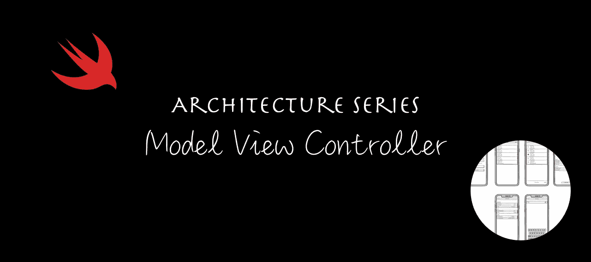
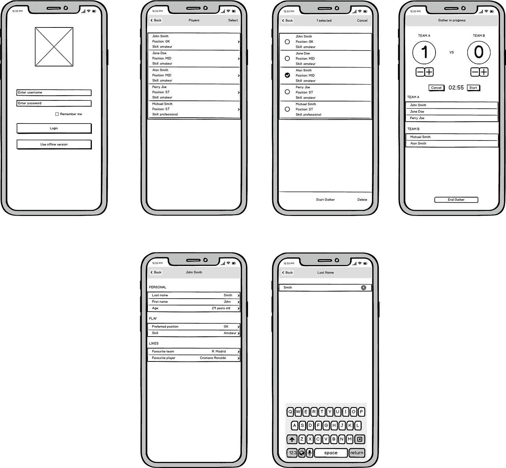
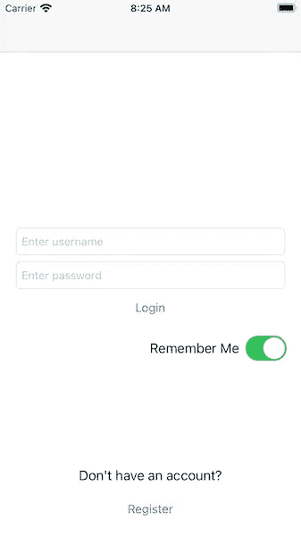
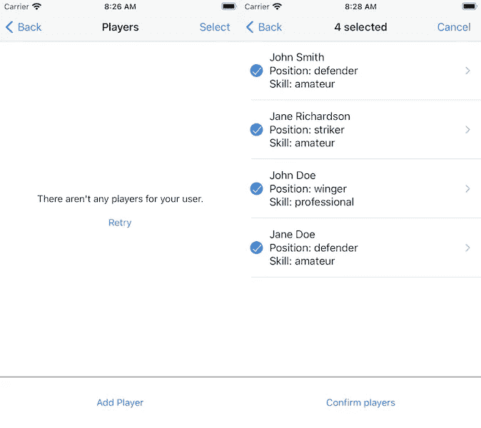
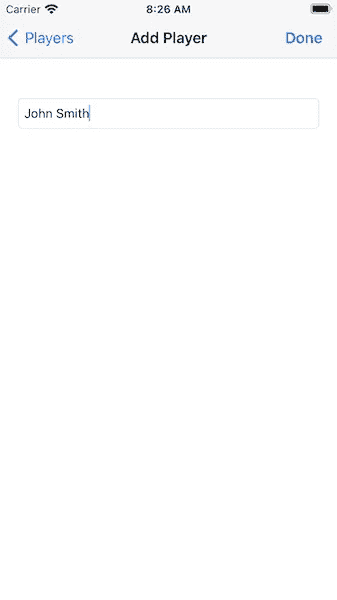
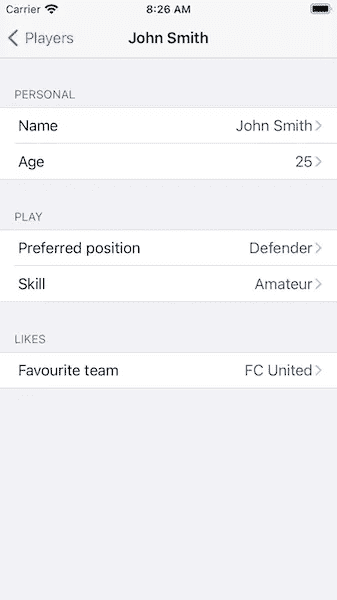
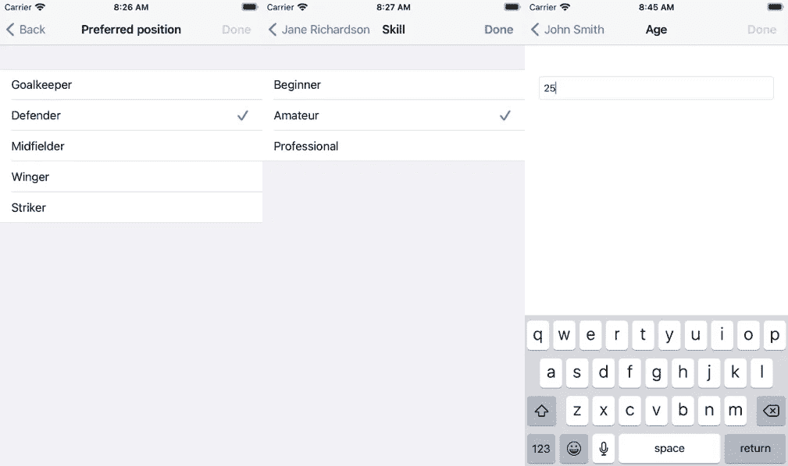
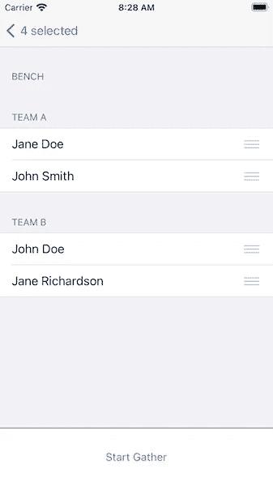
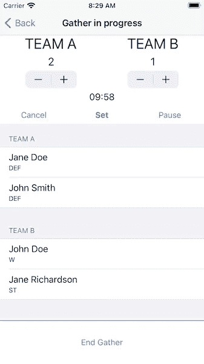

# iOS 架构模式之战:模型视图控制器(MVC)

> 原文：<https://betterprogramming.pub/battle-of-the-ios-architecture-patterns-model-view-controller-mvc-442241b447f6>

## iOS 开发最常见的架构模式入门

架构系列—模型视图控制器(MVC)

# 动机

在开始开发一个 iOS 应用之前，我们必须考虑项目的结构。我们需要考虑如何将这些代码添加到一起，以便它们在以后有意义——当我们回来重新访问应用程序的一部分时——以及如何与其他开发人员形成已知的“语言”。

我们从一系列文章开始，在这些文章中，我们通过最著名的 iOS 开发模式来开发一个应用程序。我们将检查构建时间和每个模式的优缺点，但最重要的是，我们将看到实际的实现和源代码。

如果您只想看代码，可以跳过这篇文章。该代码可以在 [GitHub](https://github.com/radude89/footballgather-ios) 上开源获得。

# 为什么你的 iOS 应用需要一个架构模式？

最需要考虑的是要有一个可维护的 app。你知道视图在那里，这个视图控制器应该做 X 而不是 y。更重要的是，其他人也知道。

以下是选择一个好的架构模式的一些优势:

*   更易于维护
*   更容易测试业务逻辑
*   与其他队友发展共同语言
*   分离实体的职责
*   更少的错误

# 定义需求

给定一个有六七个屏幕的 iOS 应用程序，我们将使用 iOS 世界最流行的架构模式来开发它:MVC、MVVM、MVP、VIPER、VIP 和 Coordinators。

该演示应用程序名为 Football Gather，是朋友们跟踪业余足球比赛比分的一种简单方式。

## 主要特征

能够:

*   在应用程序中添加玩家
*   给运动员分配队伍
*   编辑玩家
*   为比赛设置倒计时

## 屏幕模型

iOS 应用“Football Gather”的屏幕模型

## 后端

该应用由在 Vapor web 框架中开发的 web 应用提供支持。你可以查看我的 [Vapor 3 初始篇](radude89.com/blog/vapor.html)和[关于迁移到 Vapor 4](https://www.radude89.com/blog/migrate-to-vapor4.html) 的文章中的 app。

# 什么是 MVC？

MVC 可能是世界上最著名的架构模式。

有三个组件:**模型**、**视图、**和**控制器**。

## 模型

*   它包含你所有的数据类，助手，网络代码。
*   它拥有特定于您的应用程序的所有数据，并定义了处理这些数据的逻辑，
*   在我们的应用中，模型代表了在实用程序、存储和网络组中发现的内容。
*   它可以与其他模型对象有 1:M 和多对多关系，就像我们有玩家和聚集(多对多)或用户和玩家/聚集(1:M)。
*   它不应该直接与视图通信，也不应该关心用户界面。

**通讯**

*   当视图层中发生一些事情时，例如当用户发起一个动作时，它通过控制器传递给模型。
*   当模型改变时，例如当新数据可用时，模型通知控制器。

## 视角

*   视图代表用户在屏幕上看到的内容。
*   它响应用户的动作。
*   视图的目的是显示来自模型的数据，并使其可用于用户交互。
*   关键的苹果框架是 UIKit 和 AppKit。
*   我们应用程序中的例子有:`LoadingView`、`EmptyView`、`PlayerTableViewCell`和`ScoreStepper`。

**通信**

*   视图不能直接与模型交流。一切都是通过控制器来完成的。

## 控制器

*   这是 MVC 的核心层。
*   它负责视图更新并改变模型。
*   它负责模型更新和视图更新。
*   控制器可以有设置方法或任务来管理其他对象的生命周期。

**沟通**

*   可以与模型层和视图层进行通信。
*   控制器解释用户操作，并通过模型层触发对数据的更改。
*   当数据改变时，它确保那些改变被传达给用户界面，更新视图

# 不同风格的 MVC

传统的 MVC 与 Cocoa 的 MVC 不同:视图层和模型层可以相互通信。

视图是无状态的，一旦模型被更新，就由控制器呈现。

它被引入到 [Smalltalk-79](https://en.wikipedia.org/wiki/Smalltalk) 中，并被创建在几种设计模式之上:复合、策略和观察者。(下面的定义来自[苹果的模型-视图-控制器文档](https://developer.apple.com/library/archive/documentation/General/Conceptual/CocoaEncyclopedia/Model-View-Controller/Model-View-Controller.html#:~:text=Strategy%E2%80%94A%20controller%20object%20implements,meaning%20of%20the%20interface%20behavior)。)

## 复合材料

> 应用程序中的视图对象实际上是以协调方式(即视图层次结构)一起工作的嵌套视图的组合。这些显示组件的范围从窗口到复合视图(如表格视图)，再到单个视图(如按钮)。用户输入和显示可以发生在复合结构的任何级别。”

想想`UIView`的等级制度。视图是用户界面的主要组成部分。它们可以包含其他子视图。例如，在我们的应用程序中，`LoginViewController`的主视图包含一系列堆栈视图，其中有用于输入用户名和密码的文本字段以及登录按钮。

## 战略

> 控制器对象为一个或多个视图对象实现策略。视图对象将其自身限制在维护其视觉方面，并且它将所有关于界面行为的应用特定含义的决定委托给控制器。”

## 观察者

> "模型对象让应用程序中感兴趣的对象(通常是视图对象)知道其状态的变化."

旧 MVC 的主要缺点是所有三层都是紧密耦合的。很难测试、维护它们，甚至重用一些逻辑。

# 如何以及何时使用 MVC

看情况。

如果做对了，每个 app 都可以用。没有明确的是或否的答案——这取决于你的应用、团队、组织、项目的发展、开发人员的技能、最后期限等等。

但是，您应该考虑一些脆弱点:

*   正如您所看到的，控制器是这个架构模式的中心。它与视图和模型层有很强的耦合。
*   控制器可能变成众所周知的大规模视图控制器。
*   更难测试。

有很多方法可以解决上面提到的问题。其中一个是将视图控制器拆分成小视图控制器，其中有一个大容器/父视图控制器充当协调器，应用程序的每个区域由不同的或子视图控制器处理。

为什么应该使用 MVC:

*   这是 Apple 推荐的，并在他们的框架中使用(例如 UIKit)
*   许多开发人员都知道这种模式，这使得与他们合作变得很容易。
*   与其他架构模式相比，您编写代码的速度更快。

# 将 MVC 应用于我们的代码

在 Football Gather 中，我们将每个屏幕实现为一个视图控制器:

## **登录屏幕—登录视图控制器**

登录屏幕

**描述**

*   用户可以使用其凭据登录或创建新用户的登录页面

**UI 元素**

*   `usernameTextField` —用户输入用户名的文本字段
*   `passwordTextField` —用于输入密码的安全文本字段
*   `rememberMeSwitch`—`UISwitch`用于在登录后将用户名保存在钥匙串中，以便下次我们进入应用程序时自动填充该字段
*   `loadingView` —用于在进行服务器调用时显示指示器

**服务**

*   `loginService` —用于使用输入的凭证调用登录 API
*   `usersService` —用于调用注册 API，创建新用户

我们可以看到，这个类有三大功能:登录，注册，记住我的用户名。通过`performSegue`跳转到下一个屏幕。

**代码片段**

## 播放器列表屏幕—播放器列表视图控制器

玩家列表和选择屏幕

**描述**

*   为登录用户显示玩家。由主牌桌视图组成，每个玩家显示在单独的一行中。

**UI 元素**

*   `playerTableView` —显示玩家的桌面视图
*   `confirmOrAddPlayersButton` —视图底部的动作按钮，可以对应于添加玩家的动作，也可以确认选中的玩家
*   `loadingView` —用于在进行服务器调用时显示指示器
*   `emptyView` —当用户没有添加任何玩家时显示
*   `barButtonItem` —右上角的按钮，根据我们所处的视图模式可以有不同的状态。当我们进入选择模式选择我们想要聚集的玩家时，标题为“取消”,或者当我们处于查看模式时，标题为“选择”。

**服务**

*   `**playersService**` —用于检索玩家列表和删除玩家

**型号**

*   `players` —用户创建的玩家数组。这些是我们在`playerTableView`中看到的行。
*   `selectedPlayersDictionar` y —一个缓存字典，将所选播放器的行索引存储为键，将所选播放器存储为值

如果你打开`Main.storyboard`，你可以看到从这个视图控制器你可以执行三个阶段。

*   `ConfirmPlayersSegueIdentifier` —在你选择了你想要的队员后，你进入一个确认界面，在那里你可以分配他们所属的队伍。
*   `PlayerAddSegueIdentifier` —转到可以创建新玩家的屏幕
*   `PlayerDetailSegueIdentifier` —打开一个屏幕，您可以在其中查看玩家的详细信息

我们有以下函数来检索这个视图控制器的模型。

如果我们想删除一个玩家，我们做以下事情:

服务呼叫如下所示:

## 添加播放器屏幕— PlayerAddViewController

添加玩家屏幕

**描述**

*   该屏幕用于创建播放器。

**UI 元素**

*   `playerNameTextField` —用于输入玩家的名字
*   `doneButton` —用于确认要创建的播放器并发起服务呼叫的条形按钮项
*   `loadingView` —用于在进行服务器调用时显示指示器

**服务**

*   我们使用指向/api/players 的`StandardNetworkService`。要添加玩家，我们需要发起一个发布请求。

**代码片段**

## 玩家详细信息屏幕—玩家详细视图控制器

玩家详细信息屏幕

**描述**

*   映射一个显示玩家详细信息的屏幕(姓名、年龄、位置、技能和最喜欢的球队)

**UI 元素**

*   `playerDetailTableView`—显示玩家详细信息的表格视图

**型号**

*   `player` —玩家的型号为`PlayerResponseModel`

我们在此`ViewController`没有服务。从`PlayerEditViewController`接收更新玩家信息的请求，并通过委托传递给`PlayerListViewController`。

这些部分由工厂模式制成:

## 编辑播放器屏幕— PlayerEditViewController

编辑玩家-首选位置、技能或年龄

**描述**

*   编辑玩家的信息

**用户界面元素**

*   d——填充了我们想要编辑的玩家详细信息的字段
*   `playerTableView` —我们希望有一个类似的行为和用户界面，就像我们在 iOS 常规设置中编辑细节一样。这个表格视图要么有一行带有文本字段，要么有多行带有选择行为。
*   `loadingView` —用于在进行服务器调用时显示指示器
*   `doneButton` —执行编辑动作的`UIBarButtonItem`

**服务**

*   更新播放器 API，用作`StandardNetworkService`:

**型号**

*   `viewType` —可以是`.text`(用于通过键盘输入的玩家详细信息)或`.selection`(用于通过点击其中一个单元格选择的玩家详细信息，例如，首选位置)的枚举
*   `player` —我们想要编辑的球员
*   `items` —对应于首选职位或技能的所有可能选项的字符串数组。当一个文本条目将要被编辑时，这个数组是`nil`。

## 确认屏幕—确认播放器视图控制器

确认玩家屏幕

**描述**

*   在到达集合界面之前，我们想把玩家放在想要的队伍中。

**UI 元素**

*   `playerTableView` —一个分成三个部分(替补、A 队和 B 队)的表格视图，显示我们想要集合的选定球员
*   `startGatherButton` —最初禁用，当点击时会触发一个动作来执行开始收集所需的网络 API 调用，最后，它会推动下一个屏幕
*   `loadingView` —用于在进行服务器调用时显示指示器

**服务业**

*   `Create Gathe` r —通过向`/api/gathers`发出 POST 请求来添加新的集合。
*   `Add Player to Gather` —在我们为玩家选择完队伍后，我们通过向`api/gathers/{gather_id}/players/{player_id}`发送 POST 请求将他们添加到集合中。

**型号**

*   `**playersDictionary**` —每支球队都有一个球员数组，所以字典将球队作为键(A 队、B 队或替补)，对于值，我们有选定的球员(球员数组)。

当我们完成选择(UI)时，会创建一个新的集合，并为每个玩家分配一个团队。

添加玩家的 for 循环如下所示:

## 收集屏幕—确认播放视图控制器

收集屏幕

**描述**

*   这是应用程序的核心屏幕，在这里你处于聚集模式，启动/暂停或停止计时器，最后，完成比赛。

**UI 元素**

*   `playerTableView` —用于显示集合中的玩家，分为两部分:A 队和 B 队
*   `scoreLabelView` —一个视图有两个显示分数的标签，一个用于团队 A，另一个用于团队 B
*   `scoreStepper` —有两个团队步进器的视图
*   `timerLabel` —用于以 mm:ss 格式显示剩余时间
*   `timerView` —具有 UIPickerView 视图的叠加视图，用于选择采集时间
*   `timePickerView` —具有两个组件(分和秒)的选取器视图，用于选择采集时间
*   `actionTimerButton` —管理倒计时定时器的不同状态按钮(恢复、暂停和开始)
*   `loadingView` —用于在进行服务器调用时显示指示器

**服务**

*   `Update Gather` —当一次收集结束时，我们发出一个上传请求来更新获胜团队和分数。

**型号**

*   `GatherTime` —以分钟和秒为整数的元组
*   `gatherModel` —包含聚集 ID 和一组玩家团队模型(玩家响应模型和玩家所属的团队)。这是从`ConfirmPlayersViewController`创建和传递的。
*   `timer` —用于倒计时采集的分钟和秒钟。
*   `timerState` —可以有三种状态:`stopped`、`running`和`paused`。我们观察其中一个值何时被设置，这样我们就可以相应地更改`actionTimerButton`的标题。当它暂停时，按钮的标题将是`Resume`。当它运行时，按钮的标题将是`Pause`和`Start`当定时器停止时。

当点击`actionTimerButton`时，我们验证是否要使计时器无效或启动计时器:

要取消计时器，我们需要执行以下操作:

选择器`updateTimer`每秒调用一次:

在结束集合之前，我们会检查获胜者团队:

服务呼叫:

私有方法`updateGather`是从`endGather`调用的:

# 测试我们的业务逻辑

我们看到了将 MVC 应用于演示应用 Football Gather 的第一次迭代。当然，我们可以重构代码，让它变得更好，分离一些逻辑，把它分成不同的类，但是为了练习，我们将保留这个版本的代码库。

让我们看看如何为我们的类编写单元测试。我们将以`GatherViewController`为例，试图达到接近 100%的代码覆盖率。

首先，我们看到`GatherViewController`是`Main storyboard`的一部分。为了使我们的生活更容易，我们使用一个标识符，并用方法`storyboard.instantiateViewController`实例化它。让我们将`setUp`方法用于此逻辑:

对于我们的第一个测试，我们验证所有插座都不是`nil`:

现在我们来看看`viewDidLoad`是否被调用。已经设置了标题并配置了一些属性。我们验证公共参数:

变量`timerView`是一个弹出的自定义视图，用户可以在其中设置他们的比赛计时器。

接下来，让我们对表视图方法进行单元测试:

我们只有两个团队:`Team A`和`Team B`。`Bench`团队不可见，也不属于这个屏幕。

我们的表格视图应该有两个部分，两个标题都设置为团队名称(团队 A 和团队 B)。

为了检查行数，我们注入一个模拟的聚集模型:

单元测试用于验证部分中的行数，加上部分无效时的 Nil 场景。

为了显示玩家的详细信息，我们使用普通的表格视图单元格，用玩家的名字设置`textLabel`,用玩家的首选位置设置`detailTextLabel`。

让我们验证这些属性是否已设置:

太好了！我们现在已经成功地测试了我们的模型。这并不难，但我们必须模仿一些东西，使用故事板，检查表格视图委托和数据源，以及许多用于验证业务逻辑的 UI 东西。

我们继续使用`pickerView`方法。

验证组件数量的唯一方法是公开枚举`GatherCountDownTimerComponent`。

测试组件中的行数有点类似于我们为玩家`tableView`所做的。

行数应该等于分钟数和秒数。行的标题是:

让我们看看如何测试`IBActions`。

`setTimer`动作配置选取器视图(它将选取器视图组件设置为选定的分和秒。如果没有，默认为 10 分钟)并隐藏`timerView`叠加。

我们唯一的公共财产是`timerView`。我们调用`setTimer`并验证`timerView`没有隐藏:

我们为`cancelTimer`复制相同的逻辑，但是这次我们的`timerView`应该被隐藏:

和`timerView`弹出菜单中覆盖按钮的类似方法:

事情变得越来越难:

我们验证`timerView`是否隐藏，分钟和秒钟是否已设置。我们无法访问`ViewController`的默认时间，所以我们使用`XCTAssertGreaterThan`作为分钟组件。

让我们看看我们的计时器是否对行更改做出反应:

在这个测试中，我们选择第一行，所以时间将是 **00:00** 。然后我们调用`timerDone`方法和`actionTimer`。它会击中卫兵的声明:

现在，测试快乐路径:

当我们处于初始状态时，我们检查`actionTimerButton`是否有标题`Start`。在我们调用了`actionTimer`之后，`actionTimerButton`现在应该有了标题`Pause`(因为计时器正在计时，比赛已经开始)。

我们将秒部分设置为 1。因此，如果我们在两秒钟后调度，我们应该已经停止，计时器应该失效，并且`actionTimerButton`应该回到其初始状态，标题为`Start`。

为了等待期望的实现，我们使用`waitForExpectations`，超时 5 秒。

检查`Resum**e**`和`Pause`之间的开关类似:

我们为秒组件设置了一个更长的时间段(三秒)。我们调用`actionTimer`开始，一秒钟后，我们再次调用该函数。比赛应该暂停，`actionTimerButton`应该有`Resume`标题。

为了检查选择器是否被调用，我们可以验证`timerLabel`文本:

在这个测试中，我们检查了当分钟部分达到零时秒是否减少。

进入网点后，我们可以轻松验证`stepperDidChangeValue`代表:

最后，我们在`GatherViewController`中最难也可能是最重要的方法是`endGather`方法。这里，我们做了一个服务调用来更新收集模型。我们通过`winnerTeam`和比赛的比分。

它是一个大方法，不止做一件事，而且是私有的。(我们按例使用:函数不要大，函数要做一件事！).

该职能的职责详述如下。`endGather`执行以下操作:

*   从`scoreLabelViews`得到分数
*   通过比较分数来计算获胜队
*   为服务调用创建`GatherModel`
*   显示了加载微调器
*   `updateGather`服务呼叫吗
*   隐藏加载微调器
*   处理成功和失败
*   如果成功，视图控制器被弹出到`PlayerListViewController`(这个视图应该在堆栈中)
*   对于失败，它会给出一个警告

我们应该如何测试所有这些？(同样，作为最佳实践，此功能应被拆分为多个功能。)

让我们一步一步来。

创建一个模拟服务并将其注入我们的`sut`:

为了测试成功处理程序，我们使用了一个协议来代替具体的类`PlayerListViewController`，并且在我们的测试类中模拟了它:

这应该是导航控制器的一部分:

我们检查初始`viewState`。应该是真的。

单元测试的其余部分如下所示:

我们准备好我们的模拟终点，并称之为`endGather`。

屏幕上会出现一个确认对话框(`UIAlertController`)。我们点击“确定”结束收集。

使用`waitForExpectation`，我们等待闭包被执行，并验证成功路径；`viewState`现在应该是假的。

因为`endGather`是一个私有方法，我们必须使用调用这个方法的`IBAction`。为了在显示的警报控制器中点击 OK，我们必须使用它的私有 API:

我们不能保证这种单元测试在未来的 Swift 版本中也能工作。这很糟糕。

# 关键指标

## 代码行

## 单元测试

## 构建时间

**测试在 iPhone 8 模拟器中运行，iOS 14.3，使用 Xcode 12.4，并在 i9 MacBook Pro 2019 上运行。*

# 结论

就 iOS 开发而言，MVC 是最广为人知的架构模式。

在第一篇文章中，我们看到了它在一个小型应用程序中的实际应用。我们使用简单的方法，每个屏幕由一个视图控制器表示。

在现实世界中，对于有很多动作的屏幕，您不应该遵循这种方法。相反，你应该分担责任。一种解决方案是使用子视图控制器。

我们还拍摄了应用程序的每个屏幕，并解释了它的作用，提供了一个小描述，它的一部分是什么 UI 元素，以及控制器与之交互的模型，我们还看到了关键方法的代码片段。

最后，我们描述了编写关键类`GatherViewController`的单元测试的感觉。这不像我们希望的那么容易。我们甚至不得不使用一个私有的方法`UIAlertController`，这是很糟糕的做法。苹果可能会在未来的版本中改变这个类的公共 API，破坏我们的单元测试。

然而，用得好的话，MVC 在 iOS 应用程序开发方面真的很酷，真的很棒。

通过查看关键指标，我们还不能说太多。我们需要看看其他模式的表现。我们可以猜测，MVC 中的代码行数和类数要少得多。其他模式引入了更多的层，因此有更多的代码行。

谢谢你坚持到最后！你会在下面找到一些有用的链接。

# 有用的链接

*   iOS 应用程序 Football Gather — [GitHub 回购链接](https://github.com/radude89/footballgather-ios/tree/master/FootballGather)
*   Vapor 制作的 web 服务器应用— [GitHub Repo Link](https://github.com/radude89/footballgather-ws)
*   Vapor 3 后端 API[文章链接](https://radu-ionut-dan.medium.com/using-vapor-and-fluent-to-create-a-rest-api-5f9a0dcffc7b)
*   迁移到 Vapor 4 [文章链接](https://radu-ionut-dan.medium.com/migrating-to-vapor-4-53a821c29203)
*   模型视图控制器(MVC) — [GitHub Repo 链接](https://github.com/radude89/footballgather-ios/tree/master/FootballGather/MVC)和[文章链接](/battle-of-the-ios-architecture-patterns-model-view-controller-mvc-442241b447f6)
*   模型视图 ViewModel (MVVM) — [GitHub 回购链接](https://github.com/radude89/footballgather-ios/tree/master/FootballGather/MVVM)和[文章链接](/battle-of-the-ios-architecture-patterns-a-look-at-model-view-viewmodel-mvvm-bdfd07d9395e)
*   模型视图演示者(MVP)——[GitHub 回购链接](https://github.com/radude89/footballgather-ios/tree/master/FootballGather/MVP)和[文章链接](https://medium.com/geekculture/battle-of-the-ios-architecture-patterns-model-view-presenter-mvp-f693f6efd23e)
*   协调员模式—带协调员的 MVP(MVP-C)—[GitHub 回购链接](https://github.com/radude89/footballgather-ios/tree/master/FootballGather/MVP-C)和[文章链接](https://medium.com/geekculture/battle-of-the-ios-architecture-patterns-model-view-presenter-with-coordinators-mvp-c-99edf7ab8c36)
*   查看交互器演示者实体路由器(VIPER)——[GitHub Repo 链接](https://github.com/radude89/footballgather-ios/tree/master/FootballGather/VIPER)和[文章链接](https://medium.com/geekculture/battle-of-the-ios-architecture-patterns-view-interactor-presenter-entity-router-viper-8f76f1bdc960)
*   查看互动者展示者(VIP)——[GitHub 回购链接](https://github.com/radude89/footballgather-ios/tree/master/FootballGather/VIP)和[文章链接](https://radu-ionut-dan.medium.com/battle-of-the-ios-architecture-patterns-view-interactor-presenter-vip-59ebdae86e84)