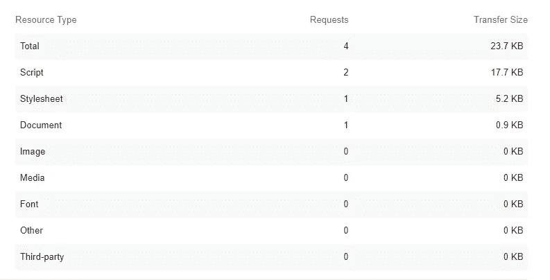
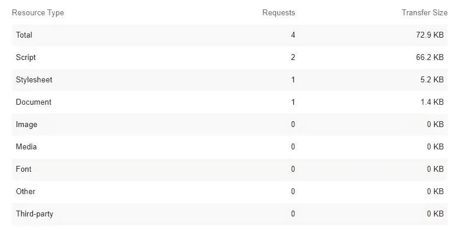

# JavaScript 中的千字节之战

> 原文：<https://betterprogramming.pub/battle-of-the-kilobytes-squeezing-out-every-little-byte-in-web-applications-for-the-greater-good-98489143ab5f>

## 为了速度和更大的利益，挤出网络应用中的每一个字节


由[弗拉德·乔姆帕洛夫](https://unsplash.com/photos/dQkXoqQLn40)在 [Unsplash](https://unsplash.com/) 拍摄的照片。

我经常发现自己在旧手机上浏览互联网，无休止地等待应用程序加载，结果却点击了错误的按钮，因为其他一些 HTML 元素的呈现时间比按钮稍晚。按下按钮会显示一些其他链接。

为什么网页不能...打火机？

有许多方法可以加快页面呈现速度。今天我想关注的一个特别的方法是减少我们发送给我们可怜的访问者的*东西*的数量。

虽然大小很重要，但我仍然希望使用先进的组件库。我最近更喜欢 [Preact](https://preactjs.com/) 而不是其他组件库。

Preact 的好处是它很小！当将 React 的 109kb (34.8 kb gzipped)大小与 Preact 的 3kb 大小进行比较时，很明显 Preact 是一个有吸引力的选项。

Preact 确实有缺点，它提供的功能不如 react 多，而且需要一段时间来适应，但我发现这不是被吓倒的理由。

既然我们已经确定了我们的组件库，我想向你介绍一个最近比较流行的概念:纯 CSS 框架。纯 CSS 框架的伟大之处在于它们非常轻量级，如果构建得好，它们允许您轻松地定制 CSS 框架，以满足您的特定需求。

到目前为止，我最喜欢的 CSS 框架是[布尔玛](https://bulma.io/)。它是轻量级的，有很好的文档记录，并且可以无限定制。

最后，我想提一下，我是 TypeScript[的忠实粉丝，并将在本文中使用 TypeScript。](https://www.typescriptlang.org/)

说够了！让我们构建一个示例项目！让我们安装`preact-cli`来帮助我们创建我们的第一个项目:

```
npm i -g preact-cli
```

安装 Preact CLI 后，让我们创建一个名为 my-app 的新 TypeScript 项目:

```
preact create typescript my-app
```

现在，我们可以通过在终端中输入以下命令，在后台运行我们的应用程序:

```
npm run dev
```

我们的下一步将是收购布尔玛并安装它:

```
npm install bulma node-sass sass-loader --save-dev
```

通常，您会希望将这些类型的依赖项保存为普通的“依赖项”，因为您只需要包含整个 CSS 文件。然而，我们将使用一个 CSS 加载器来只加载我们的应用程序实际需要的 CSS，尽可能地精简我们的应用程序！

我们还需要一个 Sass 加载程序，以便能够导入布尔玛图书馆的一部分。

让我们在`src/style`目录下创建一个文件，将其命名为`index.scss`，并导入必要的 CSS 来将一个布尔玛主题的按钮添加到我们的 web 应用程序的首页:

在 src/style/下创建 index.scss。

还有，一定要把`src`下的`index.js`第一行改成`import “./style/index.scss”`。

看完[关于布尔玛按钮](https://bulma.io/documentation/elements/button/)的文档后，似乎我们必须创建一个简单的`<button>`元素并将其分配给`button`类。听起来很简单！让我们将`src/routes/home/index.tsx`中的代码改为:

切换回你的浏览器，你应该可以看到一个漂亮的按钮出现！

是时候测试我们的应用程序了。让我们运行下面的命令来真正挤出我们能想到的最小的代码块:

```
preact build --no-sw --no-ssr --no-esm
serve -s build
```

让我们打开 Lighthouse，看看具有完全相同代码的应用程序之间的区别(用`react-router-dom`替换`preact-router`):



Preact 和布尔玛:总大小为 23.7kb！



React 中的相同应用。还是小，但是大了三倍！

整洁！这可能看起来不多，但 50kb 的差异对于非常慢的连接或电话来说可能意味着很多。

我希望您能够在享受 Preact 等组件库的体验的同时，学习一些关于纯 CSS 框架、Preact 和创建更小的 web 应用程序的知识。一如既往，如果您有任何问题，请随时联系我们！