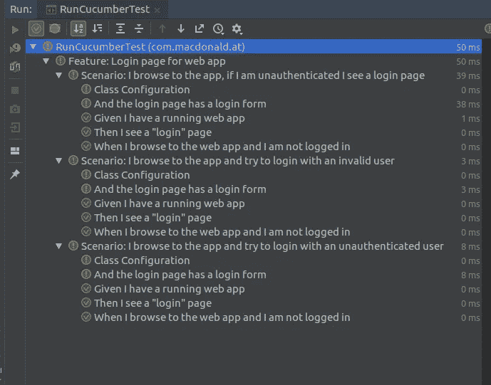
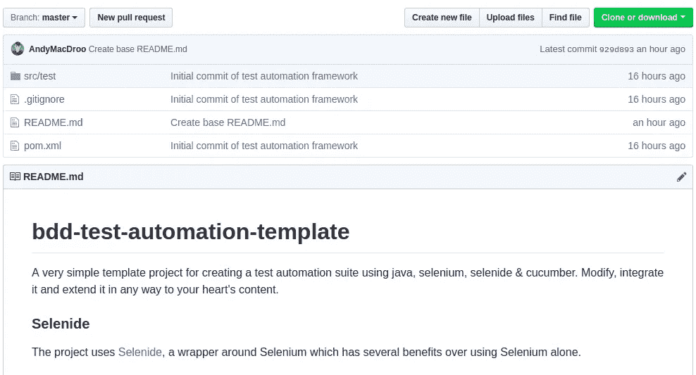

# BDD:编写自动化测试套件不是火箭科学

> 原文：<https://betterprogramming.pub/bdd-writing-a-test-suite-before-writing-code-6279e4cf4be6>


SpaceX 在 [Unsplash](https://unsplash.com/search/photos/rocket-science?utm_source=unsplash&utm_medium=referral&utm_content=creditCopyText) 上拍摄的

这是对行为驱动开发(BDD)的一个简要概述，详细介绍了如何使用 Java、Selenium 和 Cucumber 实现自动化测试套件。

当试图在项目中利用 BDD 时，人们经常被构建自动化测试套件所需的步骤所困扰，好像这是一项巨大的任务——事实并非如此。

希望这篇文章能在一定程度上揭开这个过程的神秘面纱，并提供一些有用的技巧来帮助您开始您的项目。

# BDD 到底是什么？

BDD 是一组开发实践，旨在减少常见的开发难题导致的开销——比如因为需求被误解或没有被充分阐述而不得不重新工作。

BDD 是 [TDD](https://medium.com/@andrewjamesmacdonald/tdd-paint-by-numbers-programming-6e09b89ca35b) 的扩展——方法上唯一真正的不同是 BDD 中测试用例被指定的方式。

BDD 对测试用例使用清晰的、无处不在的语言，这些测试用例是从中的*外部获得的——也就是说，直接从应用程序行为的业务需求和期望的业务结果中获得。*

这些测试用例中使用的明确语言通常以 [Gherkin DSL(特定领域语言)的形式编写。](https://docs.cucumber.io/gherkin/reference/)

# 用小黄瓜写的特写

所以你有了一个杀手级应用的想法——你将通过拥有完美的登录屏幕来彻底改变世界！

让我们从写出我们希望它在 Gherkin 中如何表现开始。

**注意:**后台步骤是为每个场景创建一组运行步骤的简写。

```
**Feature:** Login page for web app

  **Background:
    Given** I browse to the web app and I am not logged in **Scenario:** Login page displayed
    **Then** I see a "**login**" page
    **And** the login page has a login form
    **And** there is a logo on the login page **Scenario:** I try to login with an invalid user
    **When** I login with an invalid user
    **Then** I see a "**Username or password is incorrect**" error message

  **Scenario:** I try to login with a valid user
    **When** I login with a valid user
    **Then** I see a "**home**" page
```

以这种形式编写测试用例的真正优势在于它们有两个目的:

*   它们作为项目的文档，任何人都可以阅读和理解。
*   它们清楚地阐明了我们需要代码做什么

# 步骤定义

步骤定义将 Gherkin(特征文件)中定义的步骤映射到具体的动作。我们已经就我们希望我们的应用程序如何运行达成一致，并记录下来，但是现在我们需要编写测试该行为的代码。

使用 Cucumber，我们可以编写如下形式的空白步骤定义——其中注释和正则表达式将特征文件中的步骤映射到具体的操作:

```
...**@Given**("^I browse to the web app and I am not logged in$")
public void iBrowseToTheWebAppAndIAmNotLoggedIn()
{
  // TODO
}

**@When**("^I login with an invalid user$")
public void iLoginWithAnInvalidUser()
{
   // TODO 
}

**@Then**("^I see a \"([^\"]*)\" error message$")
public void iSeeAErrorMessage(String errorMessage)
{
    // TODO
}...
```

**注意:**许多 ide 都有插件，可以从特征文件中自动生成这些插件。

# 用于浏览器自动化的硒/硒化物

我们希望能够在实际运行的 web 应用程序(我们即将编写的程序)上运行我们的测试。为此，我们可以将我们的 Cucumber 步骤定义与 [Selenium 框架](https://www.seleniumhq.org/)的功能结合起来。

Selenium 是一个浏览器自动化框架。你可以利用一个 web 驱动程序，使用一个真正的浏览器，通过使用 [CSS 或 XPath 选择器](http://elementalselenium.com/tips/32-xpath-vs-css)在屏幕上选择元素，与网页进行交互。WebDriver 有许多不同的实现——针对各种不同的浏览器，以及在没有 GUI 的情况下运行浏览器的无头实现。

```
public final class WebDriverUtils
{

    private static WebDriver *webDriver*;

    public static synchronized WebDriver getWebDriverInstance()
    {
        if(*webDriver* == null)
        {
            DriverPathLoader.*loadDriverPaths*(null);
            *webDriver* = new ChromeDriver();
        }
        return *webDriver*;
    }}
```

## 断言元素的例子是在使用标准 Selenium 的页面上

```
Assert.assertNotNull(webDriver.findElement(By.cssSelector("#username")).getText());
```

Selenium 本身非常强大，但是它也有一些缺点——例如，用于选择页面上的元素的选择器过于冗长，处理异常，以及框架如何处理计时和超时。

## **断言元素的例子是在页面上使用硒化物**

这就是硒化物的用武之地。本质上，它只是围绕 Selenium 框架的一个非常干净易用的包装器。

```
*$*("#username").*shouldBe*(*visible*);
```

你会同意上面的内容不那么冗长，可读性更好。

# 页面对象模型

页面对象模型是一种设计模式，其中页面和页面上的元素被表示为面向对象的类。当您需要与屏幕上的元素交互时，不要直接调用 WebDriver 而是调用表示页面上元素的类上的方法。

让我们以登录页面应用程序为例:

```
public class LoginPage extends AbstractPage
{

    private static final String *PAGE_NAME* = "login";

    LoginPage(String basePath)
    {
        super(basePath);
    }

    **@Override**
    public String getPageName()
    {
        return *PAGE_NAME*;
    }

    **@Override**
    public void go()
    {
        URI loginUri = URI.*create*(basePath).resolve(getPageName());
        *open*(loginUri.toString());
    }

    public LoginFormElement loginForm()
    {
        return new LoginFormElement();
    }
}
```

上面的类代表我们的登录页面——它返回存在于页面上的主要元素(`LoginFormElement`)作为一个单独的类，它有自己的方法和自己处理的责任(比如登录)。

```
public class LoginFormElement extends AbstractElement<LoginFormElement>
{
    private static final String *INPUT_USERNAME* = "#username";
    private static final String *INPUT_PASSWORD* = "#password";
    private static final String *SUBMIT* = "#login_submit";

    **@Override**
    public LoginFormElement isVisible()
    {
        *$*(*INPUT_USERNAME*).shouldBe(*visible*);
        *$*(*INPUT_PASSWORD*).shouldBe(*visible*);
        *$*(*SUBMIT*).shouldBe(*visible*);
        return this;
    }

    public void login(String username, String password)
    {
        *$*(*INPUT_USERNAME*).setValue(username);
        *$*(*INPUT_PASSWORD*).setValue(password);
        *$*(*SUBMIT*).click();
    }
}
```

您将看到这里为用户名和密码输入字段以及登录提交按钮定义了 CSS 元素选择器。

当我们构建 web 应用程序时，我们只需要确保用这些标识符标记字段和按钮——如果一切顺利，测试将会通过。

# 把所有的放在一起

下面是我们根据我们在特性文件中描述的场景，为测试我们的登录页面的步骤定义整理的内容。

我们几乎肯定会对此进行重构(例如，我们将需要弄清楚如何为我们的“用有效用户登录”场景注入或知道有效的凭证)，但是这给了我们一个基础。

```
public class LoginStepDefinition extends BaseStepDefinition
{

    private LoginPage loginPage = pages.loginPage();
    private AlertElement alertElement = pages.alertComponent();
    private LoginFormElement loginFormElement = loginPage.loginForm();

    @Given("^I browse to the web app and I am not logged in$")
    public void iBrowseToTheWebAppAndIAmNotLoggedIn()
    {
        loginPage.go();
    }

    @And("^the login page has a login form$")
    public void theLoginPageHasALoginForm()
    {
        loginPage.loginForm().isVisible();
    }

    @When("^I login with an invalid user$")
    public void iLoginWithAnInvalidUser()
    {
        loginFormElement.login("invalid", "invalid");
    }

    @Then("^I see a \"([^\"]*)\" error message$")
    public void iSeeAErrorMessage(String errorMessage)
    {
        alertElement.isVisible().hasMessage(errorMessage);
    }

    @When("^I login with a valid user$")
    public void iLoginWithAValidUser()
    {
        loginFormElement.login("valid", "valid");
    }

    @And("^there is a logo on the login page$")
    public void thereIsALogoOnTheFrontPage()
    {
        loginPage.logo().isVisible();
    }
}
```

在进一步编写步骤定义和页面对象之后，我们有了一个自动化测试套件，它对于我们的登录页面应用程序来说肯定会失败(因为我们还没有构建任何东西来通过测试)。



随着您构建应用程序并添加更多功能，更多的测试会通过。为了确保测试通过，您只需要用适当的选择器(在您的页面对象模型和元素中定义)构建适当的功能。

随着更多需求的增加，您需要添加更多的测试。简单。

我建议[停止](https://github.com/AndyMacDroo/bdd-test-automation-template)项目，理解框架是如何组合在一起的，并尝试运行它(看着它失败)。



# 进一步阅读

*   [https://medium . com/agile-vision/behavior-driven-development-BDD-software-testing-in-agile-environments-d 5327 c 0 f 9 e 2d](https://medium.com/agile-vision/behavior-driven-development-bdd-software-testing-in-agile-environments-d5327c0f9e2d)
*   [https://medium . com/tech-taja wal/page-object-model-POM-design-pattern-f 9588630800 b](https://medium.com/tech-tajawal/page-object-model-pom-design-pattern-f9588630800b)
*   [https://selenide.org/documentation.html](https://selenide.org/documentation.html)
*   [https://docs.cucumber.io/gherkin/reference/](https://docs.cucumber.io/gherkin/reference/)
*   [https://medium . com/@ andrewjamesmacdonald/TDD-paint-by-numbers-programming-6e 09 b 89 ca 35 b](https://medium.com/@andrewjamesmacdonald/tdd-paint-by-numbers-programming-6e09b89ca35b)

# 笔记

这个例子是用 Java、Cucumber、Selenium 和 Selenide 描述的——这绝对不是编写自动化测试套件的唯一方法。每种语言都有自己的一套框架，但是基本的方法通常是相同的。

没有理由为什么你不能使用一种完全不同的语言来进行自动化测试，而不是使用编写项目的语言——只要它不太奇特(不要用 Fortran 或汇编语言编写)，不完全违背你的项目和公司的技术策略，并且你的团队中有很好的嵌入技能来支持这种语言。

事实上，如果负责自动化测试套件的团队成员拥有在不同的框架或语言中更加成熟的技能，我会强烈推荐这样做。通过考虑团队的能力，找出最适合您的项目的方法。

感谢您的阅读。