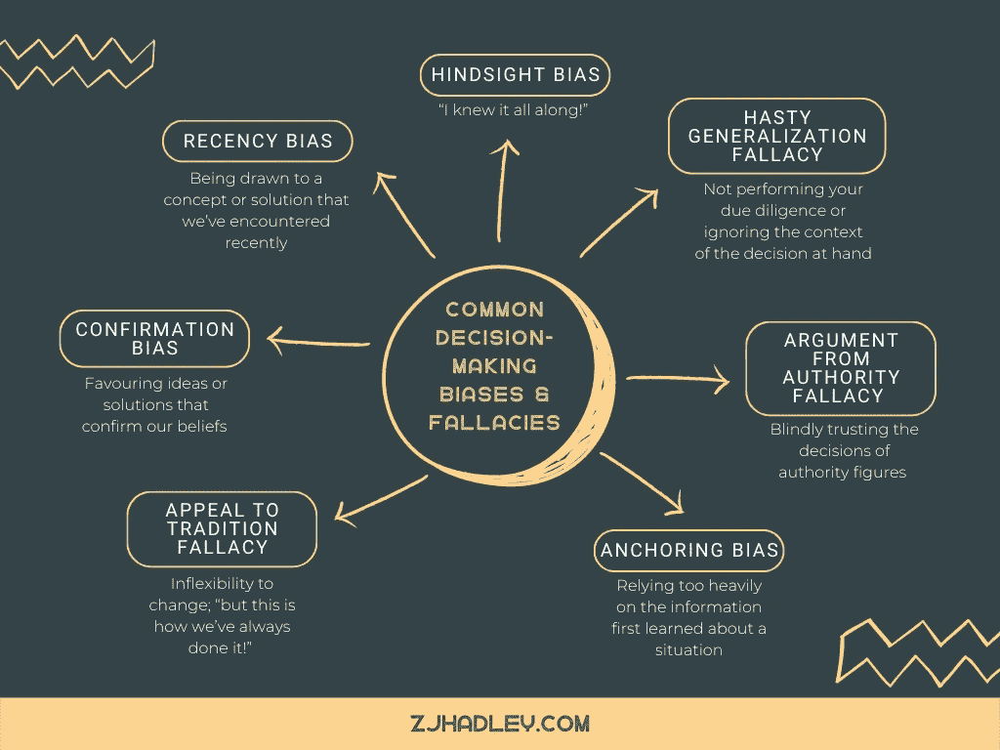
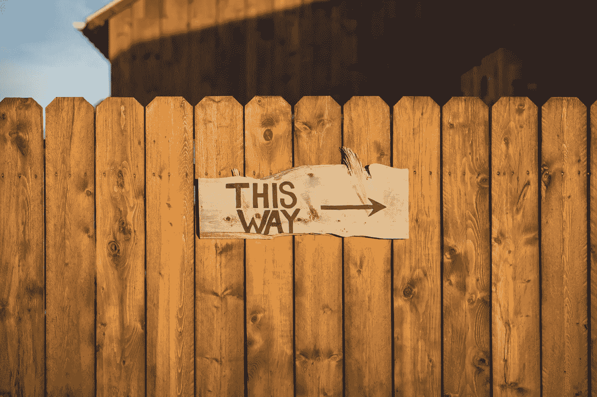
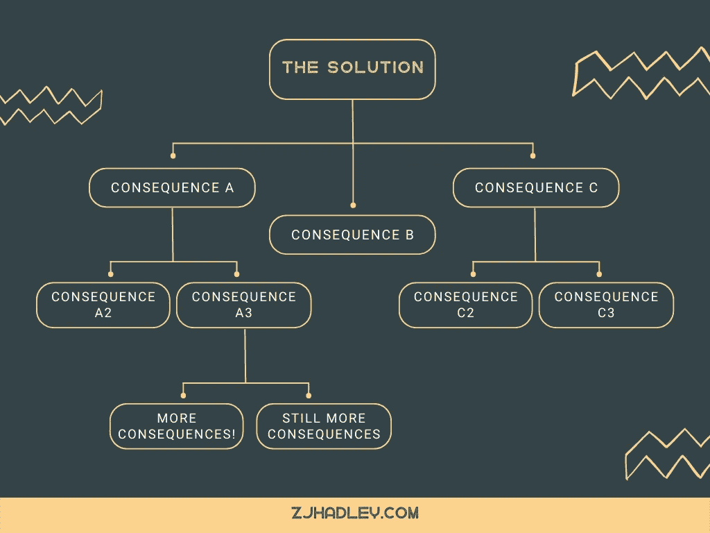
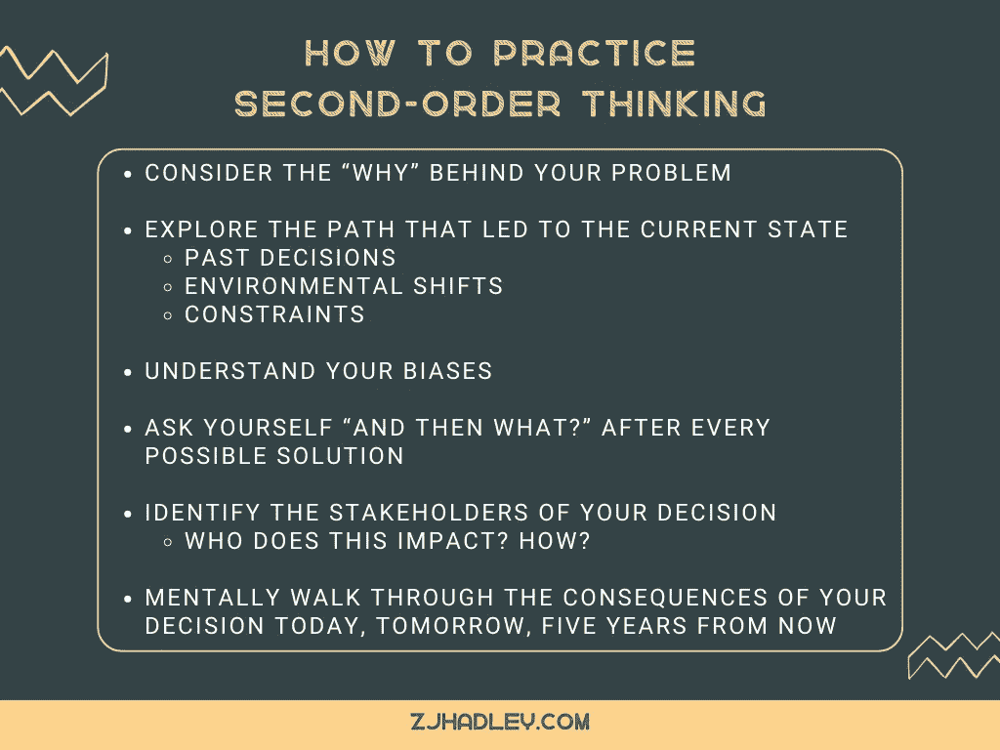

# 更聪明:二阶思维速成班

> 原文：<https://betterprogramming.pub/be-smarter-a-crash-course-in-second-order-thinking-3595e188070>

## 成功的决策始于好奇心

塞巴斯蒂安·诺尔在 [Unsplash](https://unsplash.com?utm_source=medium&utm_medium=referral) 上的照片

你好，是我。她在会议上滔滔不绝，不回答任何问题，直到说出她的经典台词:“我们在试图解决什么问题？”你翻白眼。又是这个。

我很讨厌吗？是的，经常。但我也在引导我们所有人进入一个重要的心智模式:二阶思维。当你利用二级思维的力量时，如果不首先考虑——我们是如何走到这一步的——就不可能提出一个冲动的解决方案。

改变你考虑决策后果的方式将会提高你想法的质量和决策的影响力。另外，你看起来很聪明。

灯泡=创意(照片由 [Dstudio Bcn](https://unsplash.com/@dstudiobcn?utm_source=unsplash&utm_medium=referral&utm_content=creditCopyText) 拍摄)

# 一阶思维:做出错误决定的最快方式

一阶思维简单化，肤浅化，缺乏远见。我们都这样做。

我们想要找到问题的解决方案，如果有，我们经常会抓住不放，而不去想“解决”问题的直接满足感。一阶思维就是你如何得出临时的、不可持续的解决方案。

即时满足是可以理解的诱惑。我们希望毫不拖延地满足我们的欲望，但这往往意味着我们放弃了未来的利益，而这些利益可能会超过我们目前所要求的。

众所周知，人类也希望自己是对的……所以我们经常选择第一个“最明显”的解决方案是有道理的。我们希望现在就有正确的答案，然后继续前进。

然而，理解我们正在考虑的问题的历史和未来后果对于明智的决策是至关重要的。

> “未能考虑二阶和三阶后果是许多令人痛苦的糟糕决定的原因，当第一个次等选择证实了你自己的偏见时，这尤其致命。在你提出问题和探索之前，永远不要抓住第一个可行的选择，不管它看起来有多好。”— [雷伊·达里奥](https://fs.blog/second-order-thinking/)

# 常见的决策偏见和谬误

我自己也是个马后炮。我告诉过你！

# 心智模型:你可以练习的大脑捷径

当今的环境非常复杂。我们在醒着的每时每刻都在不断地摄取、分类和处理大量的数据。[2011 年，人们每天处理的信息是 1986 年的 5 倍多](https://www.fastcompany.com/3051417/why-its-so-hard-to-pay-attention-explained-by-science)，可以肯定的是，我们今天吸收的信息甚至更多。(感谢，互联网！)而这只是周围的信息，所以当我们专注于一个特定的问题时，我们会处理更多的信息。

面对这种超载，我们的大脑下意识地寻找模式，并锁定阻力最小的路径，尽管这个过程可能不会让我们找到理想的解决方案。我们都有自己的生活经历和偏见，它们会影响我们解决问题和决策的方式。

这个世界是多层次的，复杂的，而且经常是错综复杂的。难怪我们需要一种方法来减轻理解我们周围环境和场景的负担。输入心智模型、启发法和吓人的短语，它们仅仅意味着“大脑捷径”

好消息是心智模型是可以磨练和发展的。当我们学会识别认知偏差和逻辑谬误如何影响我们的思维过程时，它们就失去了影响力。

照片由[杰米·坦普顿](https://unsplash.com/@jamietempleton?utm_source=unsplash&utm_medium=referral&utm_content=creditCopyText)拍摄

# 切斯特顿的栅栏:为什么这个栅栏在这里？

切斯特顿的栅栏是一个心智模型，它鼓励思考者在拆除之前发现为什么要建造某物。在你之前做出的决定都是有原因的，重要的是要理解为什么会做出那个决定，以及它是如何产生的。

栅栏不仅仅是为了好玩而建的。它们被放在那里是有原因的。

这是一个和时间一样古老的故事…一个新的高管进入了这个场景，他不顾一切地想要证明他们在头 90 天的影响，立即拆除了老一代人建立的现有框架。然而，这些雄心勃勃的变革中有太多失败了——因为没有探索或理解当前流程背后的推理。

变化可以推动进步，这是肯定的，但不能没有对当前环境发展的原因和方式的整体考虑。事情之所以是这样，是有原因的，必须探究这一点，以理解变革的冲击。

> 请注意:切斯特顿的栅栏不是维持现状；这是关于在做决定之前确保你有所有相关的信息。

保持好奇，问一些问题，关于是什么把你带到了现在的位置。

*   *你的解决方案有人尝试过吗？*
*   *是什么推动了当前解决方案的发展？*
*   *哪些限制因素影响了最初的决策？*
*   *谁受到了影响，变革将如何影响当前的团队成员？*

请记住，你的解决方案的好坏取决于它所建立的基础，那些不学习历史的人注定会重蹈覆辙。

# 考虑后果的后果

切斯特顿的栅栏是关于了解相关历史，二阶思考是关于探索未来的含义。

这两者，一前一后，提高你的决策技能，建立[庄严](https://www.zjhadley.com/read/the-authentic-executives-guide-to-developing-gravitas)。

二阶思维是考虑你的决定在直接结果之外的后果和影响。简单来说，就是在问“……然后呢？”得出初步结论后。

在练习二阶思维的时候，你考虑的是最初的后果和之后的每一个可能的后果。

把每一个决定想象成一块被扔进池塘的石头。不可避免地会有涟漪，而不仅仅是水花。每一个涟漪都是一个结果，当它们向多个方向扩散时，它们会相互建立。

> *关键是:你的决定或解决方案可能会产生你以前没有考虑到的长期影响。*

这就是为什么好奇心是二阶思维和有益决策的重要品质。

当我们年轻时，每一次相遇都会有惊喜，部分原因是我们意识到自己有多少不知道。这就是为什么小孩子喜欢问问题，并接着问一系列“为什么？”所有的解释。我们渴望整体的理解。

好奇心是一种与智力紧密相连的品质，因为它激活并强化你的思维。

好奇能让你扩大知识面，考虑不同的观点，并深思熟虑地考虑与核心问题无关的变量。这对二阶思维至关重要。

# 在你的团队中鼓励二阶思维的好处

## 健康的工作环境

除了避免会对你的工作场所造成严重破坏的决定之外，鼓励二阶思维还可以有助于营造一个团队成员感到受欢迎的分享和探索想法的工作环境(这被称为心理安全)。

## 改进的创意生成

通过实践，工作中的人们会明白他们的想法会被尊重和好奇对待，从而增加参与度。听到更多的想法使我们能够找到理想的解决方案。

## 社会资本

一个共享尊重、规范和价值观的团队将会高效协作。社会资本是心理安全和深思熟虑的副产品。

## 提高战略成功的几率

当你仔细考虑一个解决方案的所有角度，权衡过去和现在，你更有可能找到一个成功的解决方案。

## 最佳冲突解决方案

发展二阶思维对解决冲突特别有利。当你考虑到相关的历史和随后的后果时，权衡冲突解决方案的好处、成本和社会影响就容易多了。

## 成为会议中的聪明人

(或者至少看起来像。)

[在 LinkedIn](https://www.linkedin.com/in/zjhadley/) 上关注我，了解更多以人为本的职业见解，并与你的团队分享！

# 额外资源

*   [成功的领导者是如何思考的](https://hbr.org/2007/06/how-successful-leaders-think)
*   科学解释了为什么注意力如此难以集中
*   [心智模型:终极指南](https://blog.hubspot.com/marketing/mental-models)
*   [心智模型:做出明智决策的最佳方式](https://fs.blog/mental-models/)
*   [二阶思维:聪明人用什么来超越别人](https://fs.blog/second-order-thinking/)
*   切斯特顿的栅栏:二阶思维的一课
*   [即时满足的心理以及它将如何革新你的营销方式](https://www.entrepreneur.com/growing-a-business/the-psychology-of-instant-gratification-and-how-it-will/235088)
*   [7 个会损害你决策的逻辑谬误](https://www.projectmanager.com/blog/logical-fallacies)