# 成为 JavaScript 中事件循环的主人(第 1 部分)

> 原文：<https://betterprogramming.pub/be-the-master-of-the-event-loop-in-javascript-part-1-6804cdf6608f>

## 宏任务、微任务、执行上下文、事件队列和 rAF


[马克·威廉姆斯](https://unsplash.com/@markwilliamspics?utm_source=medium&utm_medium=referral)在 [Unsplash](https://unsplash.com?utm_source=medium&utm_medium=referral) 上的照片

猜测下面代码的结果:

我会给你一些选择。

1.  `start`、`foo`、`bar`、`end`、`rep`、`foo`、`baz`、`liz`
2.  `start`、`foo`、`foo`、`bar`、`baz`、`liz`、`rep`、`end`
3.  `start`、`end`、`foo`、`bar`、`foo`、`baz`、`liz`、`rep`
4.  `start`、`foo`、`bar`、`end`、`foo`、`baz`、`liz`、`rep`

如果你不知道答案或者你的答案在 1 到 4 之间，你就来对地方了。那是一个相当棘手的测验。不幸的是，上面的选择都不能被认为是测验的答案。

在本帖中，我将在下面谈谈这个内容。这篇文章可能真的很长，因为它应该包含这么多的东西，但它非常重要。

但是我敢打赌，看完我的帖子你就明白 JavaScript 中事件循环的工作流程了！

*   执行上下文堆栈。
*   JavaScript 如何处理任务—任务队列。
*   `SetTimeout` —宏任务。
*   `RequestAnimationFrame` — JavaScript 渲染步骤。
*   微任务—承诺，`queueMicrotask`。

# 相关内容

你可能会对我的其他帖子感兴趣，这些帖子与这篇帖子中提到的一些概念有关。

我建议您阅读我的帖子或 MDN 文档，以便更好地理解 JavaScript 事件是如何工作的。

*   [执行上下文和词汇环境](https://medium.com/better-programming/execution-context-lexical-environment-and-closures-in-javascript-b57c979341a5)

# 放弃

各位，请注意！这个帖子只说浏览器 JavaScript，不说服务器端 JavaScript，Node.js！

我对 Node 了解不多，可能和浏览器 JavaScript 不太一样。为了更好地理解事件循环，我可能会使用一些例子，但这个例子可能与 JavaScript 的工作方式不完全相同。

有些故事可能与真实的 JavaScript 模型大相径庭。

# 执行上下文堆栈

一旦 JavaScript 运行时引擎运行，它做的第一件事就是创建一个全局区域的执行，我们称之为`window`。

JavaScript 函数的执行不同于它们的声明。除非它们是生命的，否则它们不会被执行。但是一旦它们被调用，就会为函数的区域创建一个新的区域，这被称为函数执行上下文。

有一个函数，`cal`，一旦调用，JavaScript 的工作流程可以表示如下。

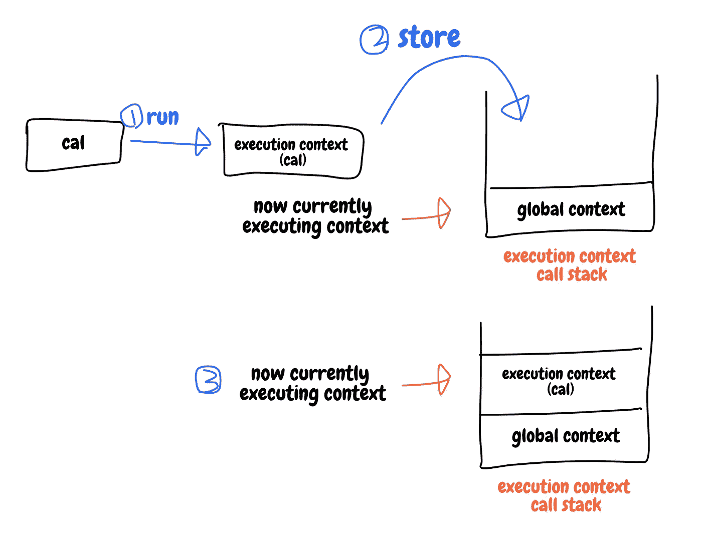

执行上下文的基本概念

管理执行上下文的堆栈称为执行上下文调用堆栈(或执行上下文堆栈)。

然而，堆栈大小不是无限的，所以如果堆栈中堆叠了太多的上下文，就会溢出，您会看到以下消息:


调用堆栈错误

在这个例子中，`a`不断地递归调用自己，直到有人(JavaScript 引擎)停止它。

每个函数和变量都必须在全局执行上下文的顶层范围内是可搜索的。

因此，确保到目前为止您在项目中调用的每个函数都存在于作用域中。这个概念将在这篇文章或本系列的下一篇文章中提到。

# JavaScript 如何处理任务—任务队列

与作为 [LIFO](https://en.wikipedia.org/wiki/FIFO_and_LIFO_accounting#LIFO) 工作的堆栈不同，每个 JavaScript 任务或作业，或者您调用的任何东西，都被堆叠到一个作为 [FIFO](https://en.wikipedia.org/wiki/FIFO_and_LIFO_accounting#FIFO) 工作的队列中。这个队列被称为*任务队列*。

实际上，JavaScript 规范说任务队列是集合，不是队列。

因为 JavaScript 不会从任务列表中删除正在运行的任务。但是在这篇文章中，我将把那个*列表队列称为*,因为它不仅超出了本主题的范围，而且你理解事件循环的概念也不会有任何问题。

如果你想得到更多关于任务队列的细节，请访问这个网站。

但是 JavaScript 使用哪种数据结构并不是我想要指出的。首先要知道的是，无论如何，一次只能运行一个任务。让我们看一个简单的例子。

```
console.log(1);
while (true);
console.log(2);
```

`2`永远不会被打印，因为它被`while (true)`挡住了。这基本上意味着什么？

`1`将首先被打印，然后 JavaScript 运行第二条语句`while`。它将一个任务推入队列并执行该任务。

但是`while`的条件是`true`，所以 JavaScript 再次运行`while`，它将另一个任务推入队列并执行该任务。

但是`while`的条件是`true`，所以 JavaScript 运行`while`一次，再一次，它将另一个任务推给…

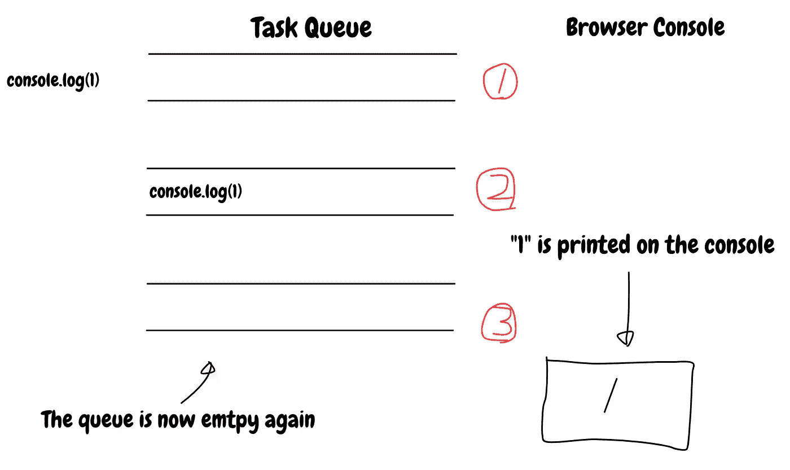

当 console.log(1)存储在任务队列中时

上图展示了`console.log(1)`是如何被推入任务队列并被移除的。一旦 JavaScript 找到要执行的语句，就会将任务推入任务队列并运行它。

一旦任务被执行，JavaScript 就将任务从队列中取出，然后执行下一条语句。

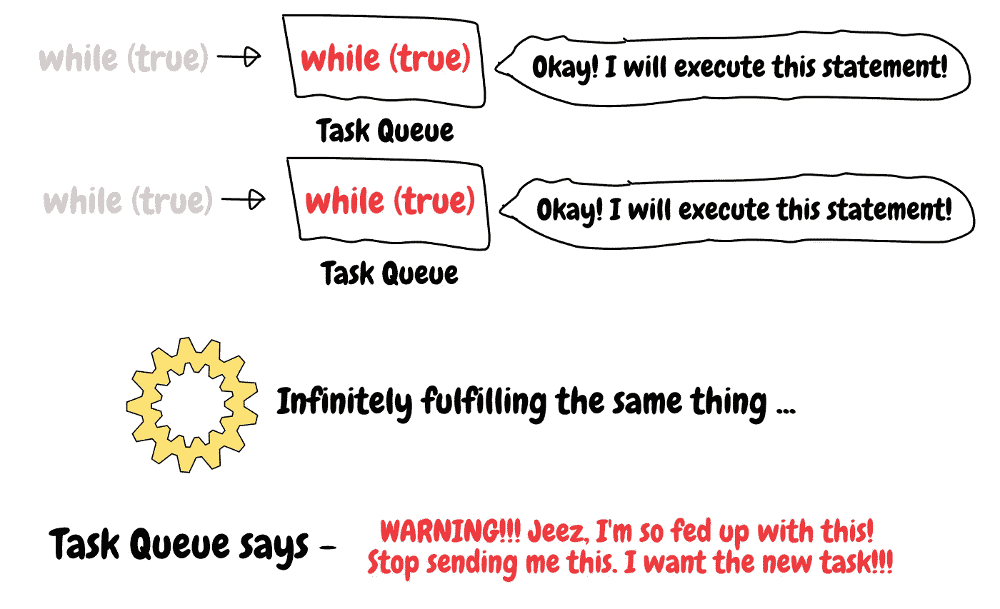

一旦同一任务长时间阻塞，JavaScript 就会停止整个程序

这种情况会持续发生，因为循环的条件总是`true`。

所以，`console.log(2)`连进入任务队列的机会都没有。如果 JavaScript 不能在那么长时间内执行其他代码，它会向您显示一条警告消息，提示您退出无限循环。

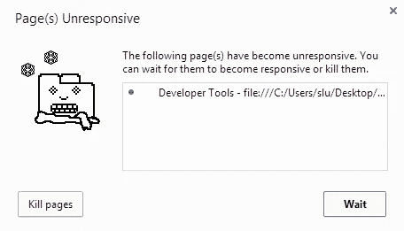

如果花费的时间太长，JavaScript 会抛出一条消息— [StackOverflow](https://stackoverflow.com/questions/21196189/chrome-unresponsive-page-false-positive-since-chrome-32)

文档中的*任务队列*的术语可能不同。有的使用*消息队列*。

# 设置超时—宏任务

再说说`setTimeout`。试着猜测这段代码的结果。

```
console.log(1);
setTimeout(() => console.log(2), 100);
console.log(3);
setTimeout(() => console.log(4), 10);
```

所以，我相信你已经知道`setTimeout`在所有其他同步代码执行后运行代码。

你应该首先了解 JavaScript 是如何运行定时器的。JavaScript 本身并不具备您所使用的所有 API 方法。

例如，在 Chrome 浏览器中，你可以使用 JavaScript 的方式是因为 Chrome 引擎将计算机语言 JavaScript 和其他类似第三方库的 API 模块放在一起。

而`document`是`DOM`模块中模块的一部分，该模块是被称为*Web API*的 API 之一。

`setTimeout`不是 ECMAScript 的纯方法。它属于`window` API，也是 ECMAScript 中没有的 API 之一。但是如果你在代码中运行`setTimeout`，它是可执行的。

这是因为幕后的核心引擎将 JavaScript 与浏览器环境中所需的所有其他 API 混合在一起。

然而，一旦调用了`setTimeout`, JavaScript 就会发送一个请求(这不是网络请求！)到具有`setTimeout`的 API，并移动到下一个代码行。


照片由 [Ibrahim Boran](https://unsplash.com/@ibrahimboran?utm_source=medium&utm_medium=referral) 在 [Unsplash](https://unsplash.com?utm_source=medium&utm_medium=referral) 上拍摄

好的。为了更好地理解一切，我将讲一个例子。

这是一家相当豪华的酒店餐厅。目前有相当多的桌子是空的。


左—由 [Austin Distel](https://unsplash.com/@austindistel?utm_source=unsplash&utm_medium=referral&utm_content=creditCopyText) 拍摄于 [Unsplash](https://unsplash.com/photos/7uoMmzPd2JA) /右—由 [Kate Townsend](https://unsplash.com/@k8townsend) 拍摄于 [Unsplash](https://unsplash.com/photos/hEC6zxdFF0M)

两个工人在餐馆工作。经理，左边的人，他安排等候的队伍，让顾客进来，或者管理顾客的预订。

服务员，右边的人，负责点菜和清理桌子。

每个顾客都要排队等候，直到经理说:“好的，现在我们有一张桌子给你，请进。”

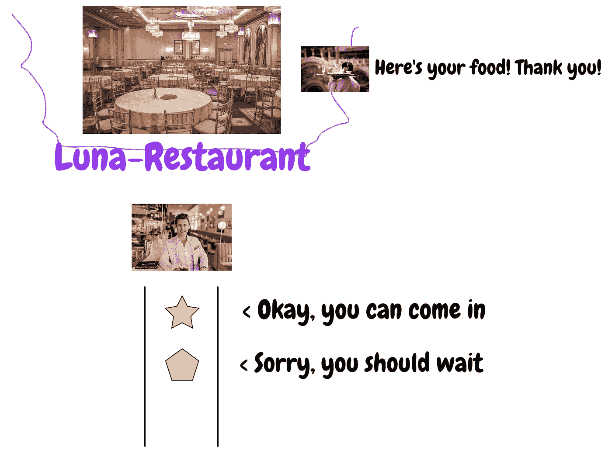

队伍里有两个顾客，星形和多边形。经理说星星可以进来，但是多边形应该再等一会儿。餐馆里的服务员现在所做的就是为顾客提供食物。

在这个例子中，管理器是 JavaScript 中的任务队列。任务队列将任务保存在其中，就像餐厅经理将顾客放在队列中一样。

而服务员就是 JavaScript 引擎。它为执行上下文的动作提供了一个转向/控制，就像服务员为顾客上菜一样。

比方说此刻排队等候的客户，星星形状的是`console.log(1)`。它已经排队了。(顾客在排队等候)。

一旦 JavaScript 引擎执行完当前任务，如果任务队列中有任务，它就会接受另一个任务并执行它，就像经理让排在队伍前面的顾客进来，服务员接受订单并给他们食物。

下一个客户，多边形形状，是`console.log(3)`，一旦第一个客户吃完他们的食物，它就可以进来，这意味着它已经完成运行，所以`1`已经被打印在浏览器控制台中。

使用同样的过程，`3`也会被打印出来。

现在，假设实际上还有其他顾客，但是他们没有预订。

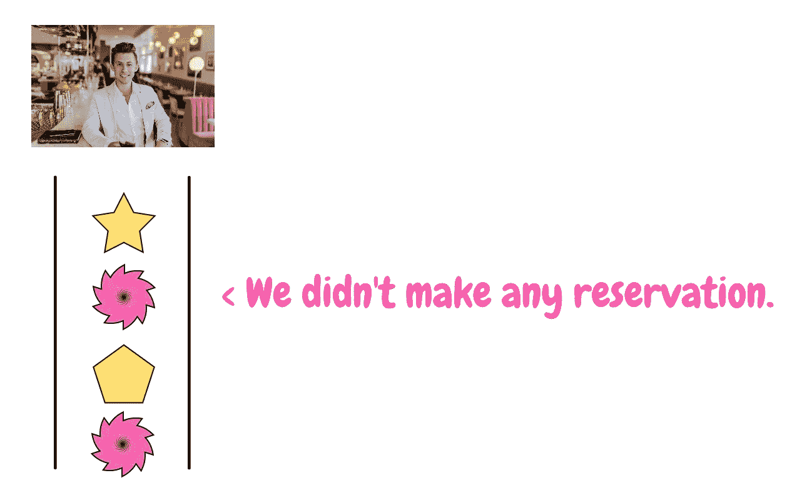

像这样。

粉红色的顾客根本没有预订。但是黄色顾客预定了。那么，如果你是这个地方的经理，你该怎么办？

当然，你应该只让预定的顾客进来。就像这样，经理道歉并让他们排队等候“非预订客户”。


这似乎是一个相当合理的系统。但是，实际上，那些粉红色的顾客根本不会说英语。

所以，经理不得不雇用一个有很多会说各种语言的翻译的机构，并要求他们把他的话翻译成粉红色，这样他们就可以去排队等候了。

所以正确的数字应该如下。

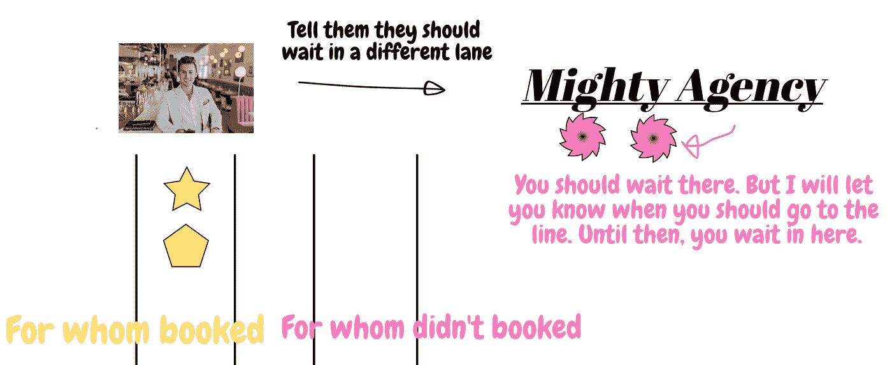

经理告诉旅行社，粉红顾客应该排队等候。

该机构收到了请求，但是，另外，该机构没有让粉红色去正确的方式，直到正确的时间，因为他们不想让他们制造麻烦，当他们在外面的时候，这不是去排队的最佳时机。

粉色顾客是`setTimeout` s。当 JavaScript 读取`setTimeout`时，它将它放入另一个队列，就像经理让粉色顾客在另一个队列中等待那些没有预订的顾客。

而 JavaScript 在调用`setTimeout`之前会执行其他类似`console.log`的代码。

我告诉过你`setTimeout`不包含在 ECMAScript 中。属于`window`。如果 JavaScript 看到了`setTimeout`，它会向正确的 API 发送一个请求来处理`setTimeout`的调用，在本例中。

然后，它的 API 模块保存它，并在 *x* 毫秒内将其推入非预订客户的不同队列，这是`setTimeout`的第二个参数。

```
setTimeout(() => console.log(2), 100);
setTimeout(() => console.log(4), 10);
```

第一个`setTimeout`在第二个之前被发送给 API。但是由于其延迟时间，第二个在第一个之前被添加到队列中。

`setTimeout`的 API 模块在 10ms 内推送第二个。然后，`setTimeouts`的队列将如下所示。

```
------------------------
log(4)   |   log(2)  |
------------------------
```

这个新的任务队列被称为宏任务队列。宏任务队列的工作方式与任务队列相同。但它们之间的区别在于，任务队列用于同步语句，而宏任务队列用于异步语句。

现在你可以猜出这个小测验的正确答案了。

```
console.log(1);
setTimeout(() => console.log(2), 100);
console.log(3);
setTimeout(() => console.log(4), 10);// 1 -> 3 -> 4 -> 2
```

# RequestAnimationFrame—JavaScript 呈现步骤

到目前为止，您已经了解了 JavaScript 如何将`setTimeout`作为异步函数来处理。

然而，你们中的许多人可能知道，由于许多原因，现在最好使用`rAF`、`requestAnimationFrame`，而不是使用`setTimeout`。

别担心，我很快也会谈到这一点，但是你可以阅读我的另一篇关于 JavaScript 定时器的文章。

`rAF`也做和`setTimeout`一样的事情。它在被调用时不会被执行。但是你难道不想知道`setTimeout`和`rAF`哪个跑得更早吗？

```
console.log(1);
setTimeout(() => console.log(2), 0);
requestAnimationFrame(() => console.log(3));
```

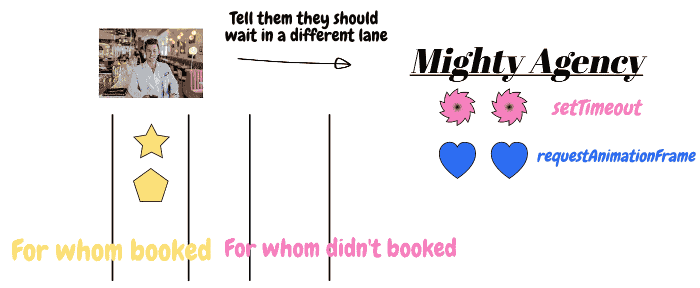

让我们再次回到餐馆。现在我们又多了两位没有预订的顾客。所以，经理把他们送到一个强大的机构去照顾他们。

代理商告诉他们什么时候去排队，就像不久前一样。但很快，该机构意识到，这些顾客，粉红色和蓝色，有一个不同的成员的餐厅。

蓝色客户的会员级别是钻石，高于粉色客户会员级别的白金。所以，旅行社问经理他们应该如何处理这些不同的会员资格，经理说:“别担心，我会处理的。”

与此同时，我们忠诚的员工，服务员，一直在努力工作。

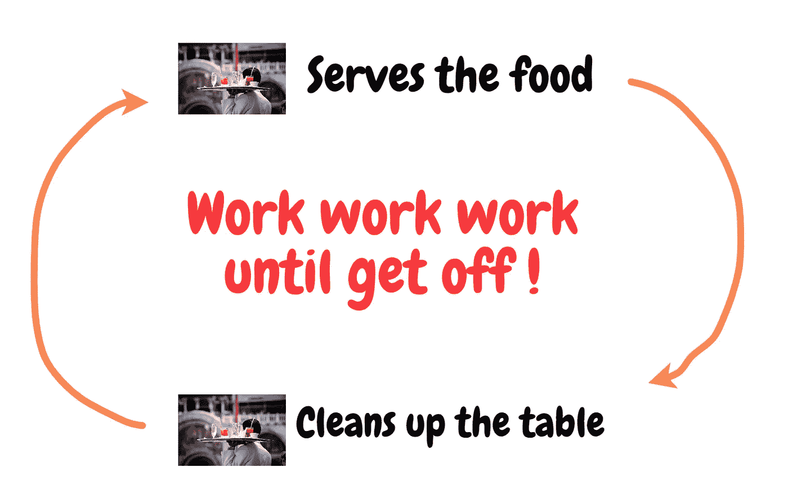

这个可怜的服务员从来没有休息过，但是他很开心！他所做的是给顾客上菜和收拾桌子。

上菜就是执行一个语句。清理表格就是重新渲染浏览器。JavaScript 引擎，这个餐馆示例中的服务员，从任务队列中取出一个任务并执行它。

它一直执行任务，直到再次呈现页面。这就像服务员一次给尽可能多的人上菜，直到为下一位顾客收拾桌子更好。

正常情况下，JavaScript 每 16.6 毫秒渲染一次页面。然后，它以 16.6 毫秒的速度每分钟大约渲染 60 次页面。这就是 60FPS 的用武之地。

一旦服务员再次回到餐厅，认为是时候清理桌子了，他告诉经理在他清理桌子之前，先检查一下是否有一些顾客应该让他们进来。

如果有钻石级的顾客，他们就进去等他收拾桌子。

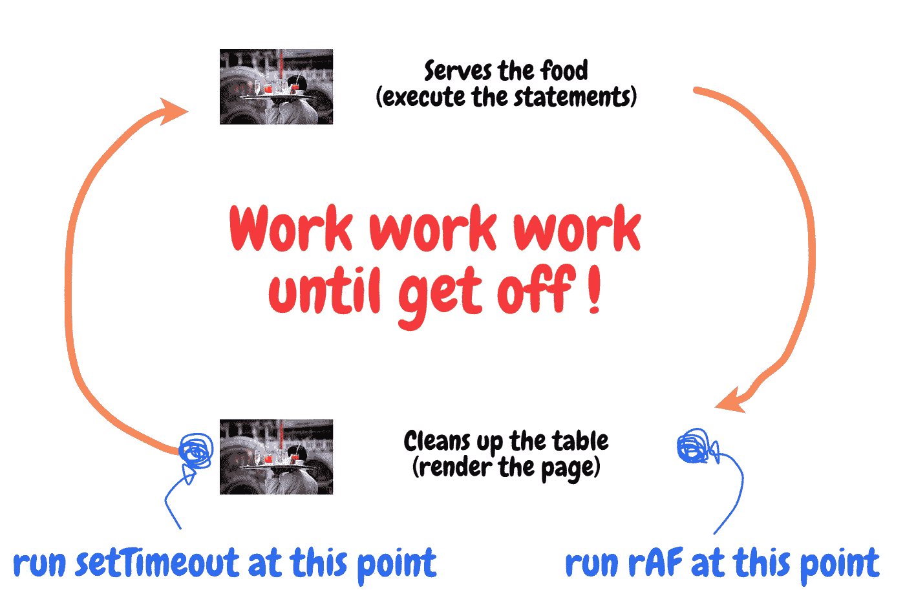

`rAFs`在 JavaScript 引擎呈现页面之前执行，而`setTimeouts`在呈现过程之后执行，比如钻石级客户可以在服务员清理桌子之前进入餐厅，在桌子擦干净之后，白金级客户可以进来。

`rAF`也是一个宏任务，因为它与`setTimeout`共享同一个任务队列。并且`rAF`可以确保在脚本解析和页面重绘之前运行，这意味着它比`setTimeout`早执行。

# 微任务—承诺，排队微任务

我们还没有谈到*承诺*，这也在本文开头的测验中。

来吧，这将是我们最后一次回到餐厅的故事。

经理和服务员已经习惯了这种繁忙的业务。他们有很多不同的客户——预订的客户(正常任务),没有预订但实际上是高级会员的客户(宏任务)。

有的是白金级(`setTimeout`)，有的是钻石级(`requestAnimationFrame`)。但无论如何，他们已经习惯了处理这种情况。

但是他们忘记了一些事情。他们意识到有一些顾客没有得到他们的食物，因为厨师忘记煮他们的食物。

所以，他们对他们很生气。经理不得不给他们一张特殊的优惠券，让他们在所有预订的顾客进去后才能进入餐厅。

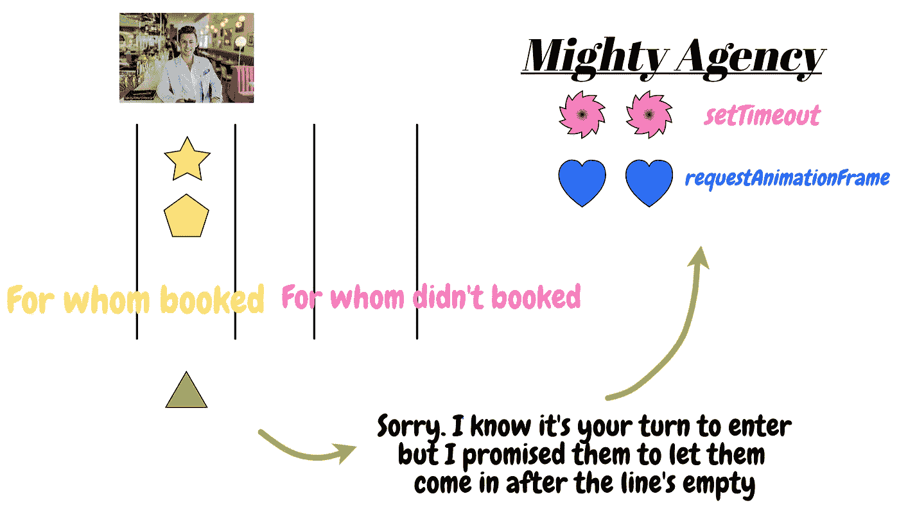

绿三角的顾客是前几天没拿到食物的那个。因此，经理“承诺”他们，他会让他们在已预订的客户点菜之后，在会员级别更高但没有预订的客户之前点菜。

你得到暗示了吗？是的，没错。绿色客户是`Promise`。一旦 JavaScript 读取了承诺，它会将它们推送到另一个队列，该队列不是任务队列或宏任务队列。

这叫做微任务队列。请注意，macrotask 和 microtask 的拼写非常相似，但它们有很大的不同。

只有当任务队列为空时，才会执行微任务，就像绿色顾客只能在所有预订的顾客(黄色)都点完菜后才能进入餐厅。

但是，可以肯定的是，微任务比宏任务有更高的优先级。

那么，这到底意味着什么呢？

```
console.log(1);
Promise.resolve().then(() => console.log(2));
setTimeout(() => console.log(3), 100);
console.log(4);// 1 -> 4 -> 2 -> 3
```

`console.log(1)`和`console.log(4)`将被首先打印，因为它们只是任务。JavaScript 已经读取了第 2 行的`Promise`代码，但是它没有立即执行。

相反，它将其推入微任务队列，等待所有任务从任务队列中出列。当 JavaScript 读取到`setTimeout`时，它会将其发送到 web API。

`setTimeout`的 web API 模块在 100ms 内将其发送到宏任务队列。当执行宏任务队列中的宏任务时，执行所有的任务，并且执行所有的微任务。

但与`requestAnimationFrame`不同的是，`setTimeout`并不在乎渲染步骤。它们只是在几毫秒后被发送到宏任务队列，等待轮到它们。

一旦轮到他们，他们就会被处决。另一方面，`rAF`不把毫秒作为参数。相反，如果`rAF`在正确的时间被执行，JavaScript 会将它保存在队列中，并在页面呈现之前运行它。

换句话说，如果微任务调用另一个微任务，后者调用另一个微任务，后者调用另一个微任务……如果这种情况无限发生，浏览器将永远无法渲染。因为渲染步骤是在调用微任务之后。

如果你想把一个任务推入微任务，但是你的代码不是`Promise`，你可以使用`queueMicrotask`。该方法将您的函数添加到微任务队列中。但这在 IE 系列浏览器中根本不受支持。

# 摘要

最后。你已经很好地理解了所有复杂的概念。我将简要总结一下我在这篇文章中谈到的内容。

任务队列是存储 JavaScript 任务的队列。它可以改变 DOM 元素的颜色，或者增加一个值的计数。JavaScript 任务具有最高的执行优先级。

宏任务队列是用于`setTimeout`和`requestAnimationFrame`的队列。实际上，有更多的任务被认为是宏任务队列，请查看我在*资源*部分附加的链接。

`setTimeout`和`requestAnimationFrame`是异步函数。它们是`window` web API 模块的一部分。所以，JavaScript 将它们发送到 API 模块，模块在合适的时间将它们推送到宏任务队列。

然而，`setTimeout`可能会干扰渲染帧间隔，16.6 毫秒，因为它是在渲染之后执行的。如果`setTimeout`中的回调函数花了很长时间才完成，那么下一个渲染时钟也会延迟执行。

这就是`requestAnimationFrame`的用武之地。`rAF`在渲染前执行。

微任务队列是针对`Promise`的队列——当然，不仅仅是`Promise`。

需要记住的一点是，只有当任务队列完全为空时，才会执行微任务。如果任务队列不为空，则不执行任何微任务。并且在执行宏任务之前执行微任务。

# 回到测验

现在我相信你能猜出这个问题的正确答案了！

有趣的结果是，不同浏览器的答案略有不同。

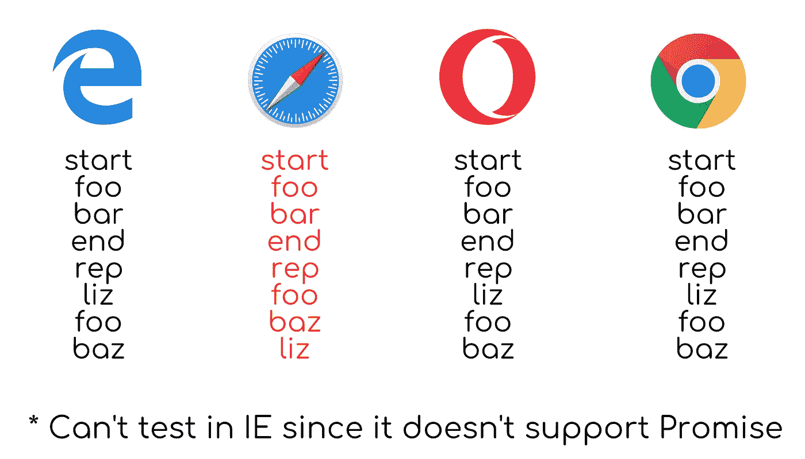

Safari 以不同的顺序打印单词，这是因为 Safari 在渲染后运行`rAF` 。

# 结论

非常感谢您阅读我的帖子！我花了很多时间来理解 JavaScript 事件循环的整个概念。同样的文章我看了一遍又一遍，视频也看了几遍。

前几天想给我这样的初学者写点东西，给他们另一个可以用来学习的学习参考。感谢您再次阅读我的帖子！

# 本系列的更多内容

*   [阅读成为 JavaScript 中事件循环的主人(第 2 部分)](https://medium.com/better-programming/be-the-master-of-the-event-loop-in-javascript-part-2-54637d49889f)
*   [阅读成为 JavaScript 中事件循环的主人(第 3 部分)](https://medium.com/better-programming/be-the-master-of-the-event-loop-in-javascript-part-3-df51ab655c94)

# 资源

*   [究竟什么是事件循环？——YouTube](https://youtu.be/8aGhZQkoFbQ)
*   [JavaScript 事件循环— YouTube](https://youtu.be/XzXIMZMN9k4)
*   杰克·阿奇博尔德:在圈内——YouTube
*   [Web API—MDN](https://developer.mozilla.org/en-US/docs/Web/API)
*   [队列微任务— MDN](https://developer.mozilla.org/en-US/docs/Web/API/WindowOrWorkerGlobalScope/queueMicrotask)
*   [requestAnimationFrame—MDN](https://developer.mozilla.org/en-US/docs/Web/API/window/requestAnimationFrame)
*   [并发模型和事件循环— MDN](https://developer.mozilla.org/en-US/docs/Web/JavaScript/EventLoop)
*   [宏任务和微任务的区别——堆栈溢出](https://stackoverflow.com/questions/25915634/difference-between-microtask-and-macrotask-within-an-event-loop-context)
*   [JavaScript 事件循环— flavicopes](https://flaviocopes.com/javascript-event-loop/)
*   [setTimeout — w3c](https://www.w3.org/TR/2011/WD-html5-20110525/timers.html#dom-windowtimers-settimeout)
*   [理解 JS:事件循环—黑客日](https://hackernoon.com/understanding-js-the-event-loop-959beae3ac40)