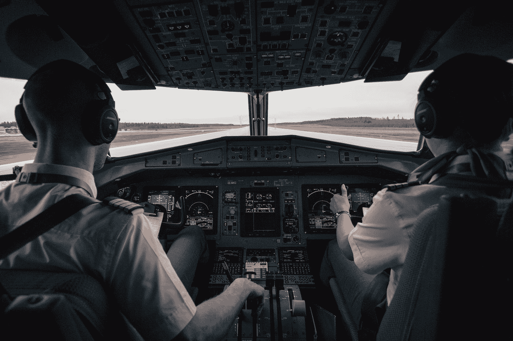
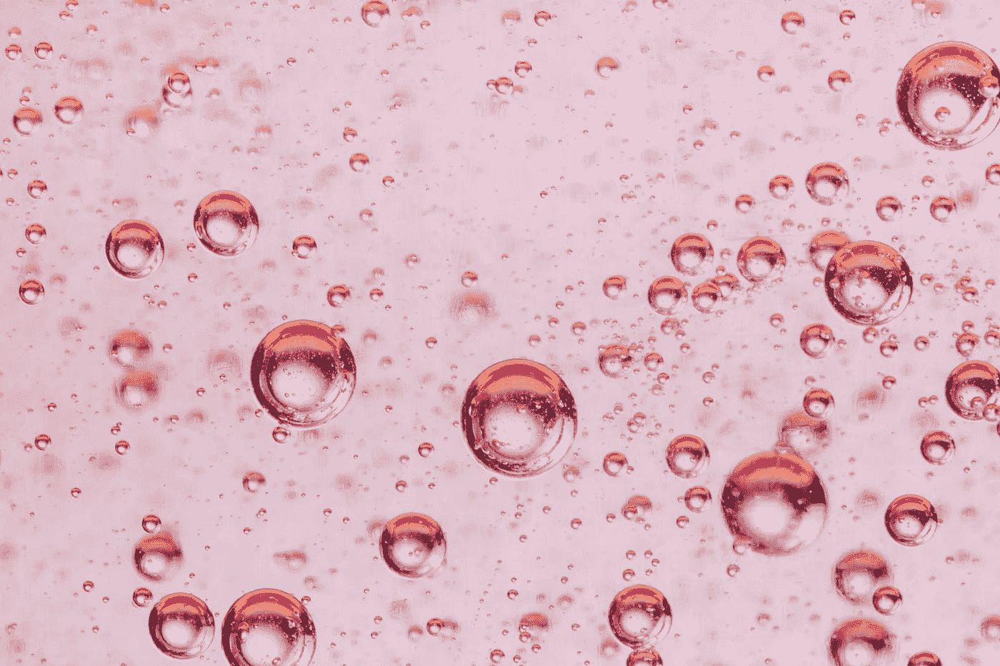
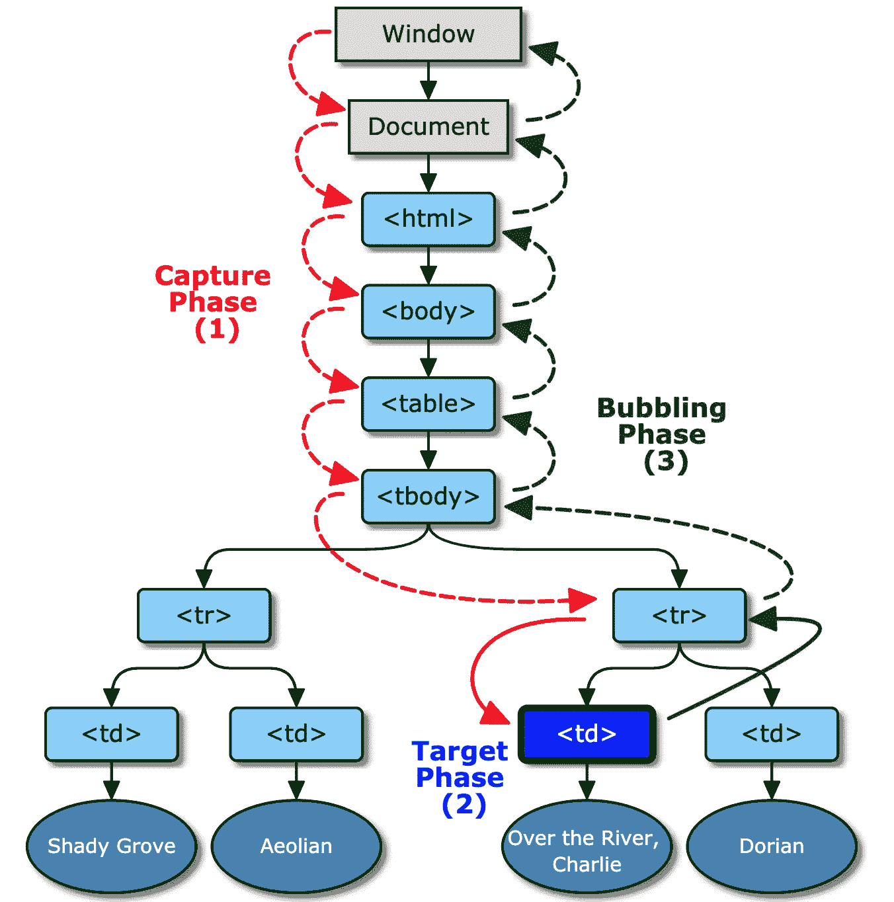
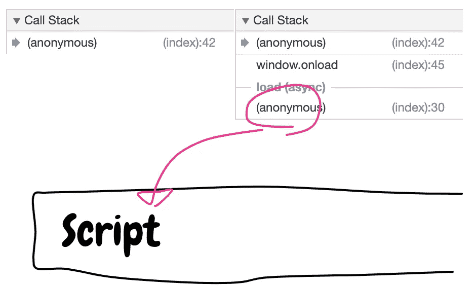

# 成为 JavaScript 中事件循环的主人(第 2 部分)

> 原文：<https://betterprogramming.pub/be-the-master-of-the-event-loop-in-javascript-part-2-54637d49889f>

## 事件冒泡、捕获和委托



乔恩·弗洛布兰特在 [Unsplash](https://unsplash.com?utm_source=medium&utm_medium=referral) 上的照片

在我之前的文章中，我谈到了 JavaScript 事件循环的基本概念、队列以及 JavaScript 引擎如何执行任务。如果你没有看过我之前的帖子，我建议你先看看，因为这是事件循环系列的第二部分。

[](https://medium.com/better-programming/be-the-master-of-event-loop-in-javascript-1-6804cdf6608f) [## 成为 JavaScript 中事件循环的主人(第 1 部分)

### 两个工人在餐馆工作。经理，左边的人，安排等候的队伍，让顾客…

medium.com](https://medium.com/better-programming/be-the-master-of-event-loop-in-javascript-1-6804cdf6608f) 

和上一篇文章一样，我将以一个小测验开始这篇文章。

```
<body>
  <div id="myDiv">
    <button id="myBtn">Click me</button>
  </div>
</body>
```

这里，我们有这样的 DOM 元素。

```
const div = document.getElementById('myDiv');
const btn = document.getElementById('myBtn');const t = () => {
  setTimeout(() => console.log('setTimeout in 10ms'), 10);
  requestAnimationFrame(() => console.log('rAF'));
  Promise.resolve().then(() => console.log('Promise'));
}div.addEventListener('click', () => { console.log(1); t(); });
btn.addEventListener('click', () => { console.log(2); t(); });
```

现在，猜猜答案。

如果你不知道明确的答案，或者如果你觉得它相当令人困惑或棘手，足以让你头痛，你就在正确的位置上，以便更好地理解事件循环！

在本帖中，我们将讨论:

1.  DOM 事件
2.  事件冒泡和捕获
3.  事件委托
4.  事件传播
5.  测验答案

# DOM 事件

假设在`body`标签中有一个元素。

```
<div id="myDiv">Hello</div>
```

每个 DOM 元素都可以有事件回调，比如单击或双击。`#myDiv`元素没有任何连接到事件模块的回调。即使没有任何东西连接到它的 click 事件，一旦被点击，`DOM`模块仍然会查看回调队列。

有三种方法可以将回调函数作为事件回调添加到 DOM 元素中。

```
<div onclick="console.log('div')">Hello</div>
```

这是一个内联事件回调。您可以将回调函数直接连接到 DOM。与其他方法相比，此方法具有更高的执行优先级。

```
div.onclick = () => console.log('div');
```

第二种方法是将回调函数直接绑定到 DOM 的`onclick`方法。

```
div.addEventListener('click', () => console.log('div'));
```

最后一种方法是使用 DOM API，`addEventListener`。它有两个参数——事件的名称，以及事件触发后的回调函数。有很多不同的事件(你可以在这里查看[)。确保写出事件类型的正确名称，因为它是区分大小写的字符串。](https://developer.mozilla.org/en-US/docs/Web/Events)

由于以下原因，这可能是绑定事件回调函数的最典型方式:

1.  `addEventListener`有一个对应的功能——是`removeEventListener`。

可以将声明的函数传递给`addEventListener`而不是匿名函数。一旦程序变得更大更复杂，你可能想要更微妙地控制你的事件。

```
div.addEventListener('click', callbackOne);
div.addEventListener('click', callbackTwo);-- Later --div.removeEventListener(callbackOne);
```

`div`注销`callbackOne`后，最终只有一次回调。

2.与将回调函数绑定到 DOM 的方法不同，比如`onclick`，您可以将多个回调函数注册到`addEventListener`。

```
// All of these callback functions
// are executed in first-register-first-execute order
// once the button is clicked
div.addEventListener('click', () => console.log(1));
div.addEventListener('click', () => console.log(2));
div.addEventListener('click', () => console.log(3));
```

3.只有`addEventListener`支持事件冒泡和捕捉。我们稍后会更深入地讨论这些。

# 事件冒泡和捕获

在 W3C(万维网联盟)文档中，事件冒泡描述如下:

> 在被[事件目标](https://www.w3.org/TR/uievents/#event-target)处理之后，[事件](https://www.w3.org/TR/uievents/#event)可以被目标的一个祖先*处理的过程。更多细节参见事件流中[气泡阶段](https://www.w3.org/TR/uievents/#bubble-phase)的描述。*

就像这个概念的名字一样，*冒泡*，你可以想象一个小水泡一直升到表面。



由[paweczerwi ski](https://unsplash.com/@pawel_czerwinski?utm_source=medium&utm_medium=referral)在 [Unsplash](https://unsplash.com?utm_source=medium&utm_medium=referral) 上拍摄的照片

```
<div onclick="console.log('div')">
  <p onclick="console.log('p')">
    <span onclick="console.log('span')">
    </span>
  </p>
</div>
```

一旦点击了 span 标签，就执行事件回调`console.log('span')`。然后，JavaScript 查找它的祖先。在这种情况下，p 标记是 span 的父元素，因此执行其回调函数`console.log('p')`。然后执行其父级的回调函数。因此，调用回调函数的顺序是:

```
span → p → div
```

另一方面，事件捕获的工作方式不同。JavaScript“捕获”最顶层的事件，并一直向下到达子元素，查看是否有回调。

要让 JavaScript event 捕获事件，应该使用`addEventListener`。有两种方法可以将回调函数设置为捕获函数:

```
div.addEventListener('click', () => console.log('div'), true);
div.addEventListener('click', () => console.log('div'), { capture: true });
```

两种方式都可以。但是如果你传递一个对象给`addEventListener`，你可以设置更多的选项——在这里查看它们[。](https://developer.mozilla.org/en-US/docs/Web/API/EventTarget/addEventListener#Parameters)

```
div.addEventListener('click', () => console.log('div'), true);
p.addEventListener('click', () => console.log('p'), true);
span.addEventListener('click', () => console.log('span'), true);
```

点击`span`后，打印顺序如下。

```
div → p → span
```

*   冒泡:最里面的元素→第二个最里面的元素→ … →最外面的元素
*   捕获:最外面的元素→第二个最外面的元素→ … →最里面的元素

猜猜这个点击事件的结果。

```
div.addEventListener('click', () => console.log('div'));
p.addEventListener('click', () => console.log('p'), { capture: true });
span.addEventListener('click', () => console.log('span'));
```

`div`和`span`使用冒泡，`p`使用捕捉。所有这些元素都在同一个层次结构中。那时会发生什么？答案是:

```
p → span → div
```

为什么？因为捕获比冒泡更早触发。



图片来源于 [W3C](https://www.w3.org/TR/uievents/#bubble-phase)

首先，JavaScript 从最顶层的元素开始触发事件，一直到事件被触发的元素(`Target Phase(2)`)，然后再到最外层的元素。

# 事件委托

这更关乎表演。假设有一百个列表元素。无论你点击哪个，你都想知道它的 ID。你怎么能这样做？

```
const ul = document.getElementById('myUL');for (let i = 0; i < 100; i += 1) {
  const li = document.createElement('li');
  li.textContent = `li-${i}`;
  li.id = `li-${i}`;
  li.addEventListener('click', e => console.log(e.target.id));
  ul.appendChild(li);
}
```

在这个例子中，事件`click`已经被注册了一百次，到每个`li`。但是如果你必须制造一千个元素呢？就性能而言，向每个元素注册相同的事件回调并不是最佳实践。

您可以通过事件冒泡来解决这个问题。一旦点击了任何一个`li`，JavaScript 就会在`li`的回调列表中寻找回调函数，然后转到外层元素，再次寻找回调函数。

```
li → ul
```

然后就可以注册回调函数到`ul`标签了。即使`li`没有任何事件回调函数，冒泡终究会到达`ul`标签。

```
const ul = document.getElementById('myUL');for (let i = 0; i < 100; i += 1) {
  const li = document.createElement('li');
  li.textContent = `li-${i}`;
  li.id = `li-${i}`;
  ul.appendChild(li);
}**ul.addEventListener('click', e => console.log(e.target.id));**
```

现在只有一个事件回调函数。

# 事件传播

上面，我解释了冒泡发生在捕获之后。但是，如果您不想触发冒泡或捕获，该怎么办呢？

每个事件回调函数都有一个参数——事件对象。它有几个有用的方法。用于停止将事件传播到其他元素的是`stopPropagation`。它停止冒泡和捕捉。让我们看一个例子。

```
<div>
  <p>
    <span>Click me</span>
  </p>
</div>
```


```
div.addEventListener('click', () => console.log('div'));
p.addEventListener('click', () => console.log('p'));
span.addEventListener('click', () => console.log('span'));
```

如果你点击`p`，那么结果将会是`p → div`冒泡。但是如果用`stopPropagation`，结果就不一样了。

```
p.addEventListener('click', e => {
  e.stopPropagation();
  console.log('p');
})
```

如果再次点击`p`标签，结果将只是`p`，因为`stopPropagation`已经“停止”了正在冒泡的事件。

```
div.addEventListener('click', () => console.log('div'), true);
p.addEventListener('click', e => {
  e.stopPropagation();
  console.log('p');
});
span.addEventListener('click', () => console.log('span'), true);
```

现在，冒泡和捕获混在一起了。点击`span`标签。结果会是`div → span → p`。记住，捕捉是第一位的。所以，`div`是`span`的祖先元素，首先执行它的回调。`p`有回调函数，但不是用来抓图的。然后执行`span`的回调函数作为最后的捕获步骤。现在冒泡被触发。`span`没有为冒泡注册任何回调函数，所以什么都不会发生。另一方面，`p`有一个用于冒泡的回调函数，它被执行。还有，`div`的回调函数都不是用来冒泡的，所以什么都不会打印出来。

`addEventListener`可以添加多个回调函数。

```
div.addEventListener('click', () => console.log('div'), true);
p.addEventListener('click', () => console.log('p - capturing'), true);
p.addEventListener('click', e => {
  e.stopPropagation();
  console.log('p - bubbling');
});
span.addEventListener('click', () => console.log('span'), true);
```

如果点击`span`，打印顺序将为`div → p-capturing → span → p-bubbling`。

注意，不是每个事件都可以被冒泡。比如`focus`和`blur`事件不支持冒泡。因此，您应该提前检查要使用的事件是否支持冒泡。可以查看 [W3C 文档](https://www.w3.org/TR/uievents/#blur)或者 [MDN 文档](https://developer.mozilla.org/en-US/docs/Web/Events#Focus_events)。

# 测验答案

现在，你可以猜出我在本文开头给你的这个测验的正确答案了:

```
const div = document.getElementById('myDiv');
const btn = document.getElementById('myBtn');const t = () => {
  setTimeout(() => console.log('setTimeout in 10ms'), 10);
  requestAnimationFrame(() => console.log('rAF'));
  Promise.resolve().then(() => console.log('Promise'));
}div.addEventListener('click', () => { console.log(1); t(); });
btn.addEventListener('click', () => { console.log(2); t(); });
```

`div`和`btn`没有捕捉的回调函数。所以现在你知道一旦`btn`被点击，事件的顺序将会是`btn → div`。`2`显然会先打印出来。并且在函数中有三个不同的任务，`t`。

正如我在上一篇文章中解释的那样， *Promise* 是一个微任务。只有当任务队列完全为空时，才执行微任务。在`console.log(2)`被执行后，任务队列中什么都没有，所以`console.log('Promise')`现在被执行。然而 *setTimeout* 和 *rAF* 都是宏任务。它们可以在所有任务和微任务被完全执行之后被执行。

然后事件冒泡到`div`。并且`console.log(1)`被执行。然后*承诺*以与`btn`相同的理由执行。那么到目前为止，顺序是`2 → Promise → 1 → Promise`。并且所有的任务和微任务出列。 *rAF* 首先出列，因为它总是在渲染之前，不像 *setTimeout* 。所以最后的答案如下。

```
2 → Promise → 1 → Promise → rAF → rAF → setTimeout → setTimeout
```

但是，如果用 JavaScript `click`方法点击`btn`，结果会有所不同。

```
btn.click()
```



左边的调用栈是你在浏览器上点击`btn`的时候，右边的调用栈是你用 JavaScript 点击`btn`的时候。由于 JavaScript 点击了按钮，`script`在任务队列中。然后，影响结果。微任务只能在任务队列完全为空的情况下执行，但是因为`script`，任务队列不会为空，直到每个任务都被首先执行。因此，单击 JavaScript，结果将如下所示:

```
2 → 1 → Promise → Promise → rAF → rAF → setTimeout → setTimeout
```

# 结论

JavaScript 事件非常神秘和有趣。但是一旦你理解了 JavaScript 事件是如何工作的，你就可以减少错误并摆脱恐惧。

有趣的一点是，DOM 元素的事件因事件发生方式的不同而不同。当你用鼠标点击按钮时，JavaScript 不会将“脚本”任务推入任务队列，然而，当你用 JavaScript 代码点击按钮时，它会，比如`btn.click()`。我希望你对这个神秘的问题做你自己的实验！

# 本系列的更多内容

*   [阅读成为 JavaScript 中事件循环的主人(第 1 部分)](https://medium.com/better-programming/be-the-master-of-the-event-loop-in-javascript-part-1-6804cdf6608f)
*   [阅读成为 JavaScript 中事件循环的主人(第 3 部分)](https://medium.com/better-programming/be-the-master-of-the-event-loop-in-javascript-part-3-df51ab655c94)

# 资源

*   [事件冒泡— W3C](https://www.w3.org/TR/uievents/#bubble-phase)
*   [事件冒泡和捕获— JavaScript.info](https://javascript.info/bubbling-and-capturing)
*   [事件参考— MDN](https://developer.mozilla.org/en-US/docs/Web/Events)
*   [事件介绍— MDN](https://developer.mozilla.org/en-US/docs/Learn/JavaScript/Building_blocks/Events)
*   [addEventListener — MDN](https://developer.mozilla.org/en-US/docs/Web/API/EventTarget/addEventListener)