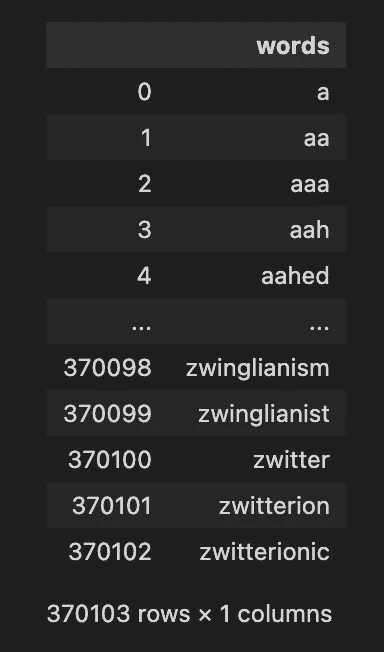
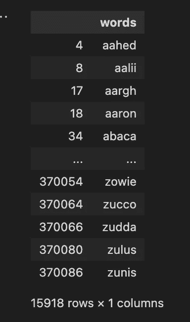

# 击败 Wordle:约束编程

> 原文：<https://betterprogramming.pub/beating-wordle-constraint-programming-ef0b0b6897fe>

## 获取数据集，预处理，定义约束变量，让 Wordle 求解器完成它的工作


斯文·布兰德斯马在 [Unsplash](https://unsplash.com?utm_source=medium&utm_medium=referral) 上的照片

> TL；博士，开始你的世界最好的两个词是“孤独”和“衬衫”。

当我看到 Wordle(1 月 31 日星期一)时，我想哎呀，约束编程在解决这个问题上不是很棒吗？在做餐巾纸背面的数学时，如果我们有 500 个单词可供选择，我们想找出最好的两个单词，我们需要在最坏的情况下进行 62 亿次比较。我们将把它提高几个档次，设定 2000 字的目标:)

数学，如果有人感兴趣的话。我可能是错的，但我在假设最坏的情况:

```
1st word: 500 possibilities2nd word: 499 possibilitiesThen we will need to check how each of these words compares to all the other words 498 and each word contains 5 letters so we would need to compare all 2words each with 5 letters to those 5 letters.Thus: 500*499*498*2*5*5=~6.2 billion Operations
```

约束编程来拯救！对于那些不熟悉约束编程的人，我将使用 Google 的话:

> 约束优化，或约束规划(CP)，是从一个非常大的候选集合中识别可行解的名称，其中问题可以根据任意约束来建模。CP 问题出现在许多科学和工程学科中。(“编程”这个词有点用词不当，类似于“计算机”曾经的意思是“计算的人”。这里的“编程”指的是一个计划的安排，而不是用计算机语言编程。)
> — [来源](https://developers.google.com/optimization/cp)

为了简化约束编程，需要定义问题的参数，并定义这些参数的约束。

在 Wordle 中，我们希望挑选出能给我们最大暗示的词，告诉我们目标词是什么。如何找到那些神奇的文字？我们需要遵循以下步骤:

1.  获取英语单词数据集。
2.  将这些单词预处理成我们想要的大小(5 个字母的单词)。
3.  将这些单词转换成求解者可以理解的东西。
4.  定义约束变量。
5.  选择一种启发式方法来选择最佳单词并创建约束条件。
6.  运行规划求解并将结果重新转换成文字。

# 1.获取英语单词数据集。

要打败 wordle，我们必须找到一个英语单词列表，幸运的是在搜索了 GitHub 之后，我找到了这个美丽的单词。

正如回购推荐的那样，我选择了`[words_alpha.txt](https://github.com/dwyl/english-words/blob/master/words_alpha.txt)`，你可以随意选择自己的。现在我们有了一个英语单词列表，可以进入下一步了。

# 2.将这些单词预处理成我们想要的大小(5 个字母的单词)。

那么现在我们有了一些单词，我们把它们导入到 Python 中来看看吧。为此，我们可以使用熊猫来读取数据。



这很酷，我们可以看到我们有 370，103 个单词。现在让我们只得到 5 个字母的单词。



耶！我们现在有 15918 个单词可以玩，其中一些单词我从未听说过，比如`aalii` ，意思是“一种浓密的无患子灌木”**。**

# 3.将这些单词转换成求解者可以理解的东西。

现在我们有了很多单词，我们需要一种方法让求解者理解。CSP 求解器可以理解一些数据类型，如整数和布尔。但是我将使用的求解器不理解字符，所以我们需要将字符转换成他们可以理解的东西。

我们可以使用[一键编码](https://en.wikipedia.org/wiki/One-hot)。或者我们可以保持简单，给每个字母分配一个数字(例如字母 a → 0，b → 1 … z → 25)，这就简单多了。让我们开始吧。

当我们运行这段代码时，我们得到一个名为`words`的变量，它是一个由整数表示的单词列表。例如，`[0,0,7,4,3]`代表“aahed”。

# 4.定义约束变量。

现在我们需要进入杂草中一点。我们想为约束求解器定义一些变量来理解。我们将要使用的约束求解器叫做[Cadical](http://fmv.jku.at/cadical/)——它是最先进的求解器之一。

为 Cadical 编写代码实际上需要很长时间，因此我们将使用一个名为 [SavileRow](https://savilerow.cs.st-andrews.ac.uk/) 的抽象，它运行在 Essence Prime 语言上，然后可以将我们的代码翻译成 Cadical，Cadical 随后可以求解。

首先，我们需要告诉萨维罗我们的参数是什么。为了提高效率，我们可以编写一个 Python 函数，它将接受`words`变量，并输出一个【SavileRow 可以理解的文件。

在这个函数中，我们将单词数、单词的字母数以及我们希望求解器为我们选择的单词数传递给 SavileRow。

正如我们在本文开头所承诺的，我们将比较 2000 个单词。所以让我们将`words`随机化，这样当我们将它传递给函数时，它有一个以不同字符开头的单词混合。

```
random.shuffle(words)
```

我们现在可以将`words`传递到函数中。我们得到这个参数文件:

# 5.选择一种启发式方法来选择最佳单词并创建约束条件。

为了让求解者选择最好的单词，我们需要告诉求解者要找什么。我们可以通过`find`命令告诉求解器要找什么。在这种情况下，我们希望找到最佳单词的索引，这些索引具有查找单词的最佳特征。我们可以称这个数组为`best_words`

`heuristic`是约束编程中最重要的，这是我们试图优化的。这里我们试图优化两个词覆盖目标词的可能性。实际上，我们想要计算每隔一个字母中这两个单词字母出现的次数。我们可以称之为变量`cost`，我们可以告诉求解器`maximise`这一点。

至于约束，我们希望确保求解器选择的所有单词都是不同的，我们可以使用`AllDiff`约束来实现这一点。我们还希望确保求解器不会两次得出相同的解，例如，如果选择的索引是:[1，3]，则[3，1]是相同的解，只是顺序不同。我们可以通过约束较大的索引总是在最前面来强制排序。

有了所有这些，我们可以创建一个 SalvileRow 模型:

# 7.运行规划求解并将结果重新转换成文字。

使用以下命令运行求解程序后:

```
savilerow words.eprime words.param -run-solver -sat
```

我们得到一个输出`[414, 129]`，这些是在启发式搜索中得分最高的单词的索引。如果我们接着查找这些单词，我们得到`[11, 0, 20, 13, 3]`和`[14, 18, 8, 4, 17]`，当翻译回字符时，我们得到‘laund’和‘osier’

# L̶i̶m̶i̶t̶a̶t̶i̶o̶n̶s̶

̶s̶o̶m̶e̶̶o̶f̶̶t̶h̶e̶̶w̶o̶r̶d̶s̶̶i̶n̶̶t̶h̶e̶̶w̶o̶r̶d̶s̶_̶a̶l̶p̶h̶a̶.̶t̶x̶t̶̶d̶o̶̶n̶o̶t̶̶a̶p̶p̶e̶a̶r̶̶t̶o̶̶b̶e̶̶c̶o̶m̶p̶a̶t̶i̶b̶l̶e̶̶w̶i̶t̶h̶̶w̶o̶r̶d̶l̶e̶,̶̶s̶o̶̶i̶t̶̶m̶a̶y̶̶n̶o̶t̶̶b̶e̶̶a̶c̶c̶u̶r̶a̶t̶e̶̶f̶o̶r̶̶w̶o̶r̶d̶l̶e̶.̶̶i̶f̶̶a̶̶d̶a̶t̶a̶s̶e̶t̶̶o̶f̶̶w̶o̶r̶d̶l̶e̶̶w̶o̶r̶d̶s̶̶t̶h̶a̶t̶̶a̶r̶e̶̶u̶s̶e̶d̶̶i̶s̶̶e̶v̶e̶r̶̶r̶e̶l̶e̶a̶s̶e̶d̶̶t̶h̶e̶n̶̶a̶n̶̶a̶c̶c̶u̶r̶a̶t̶e̶̶a̶n̶s̶w̶e̶r̶̶c̶a̶n̶̶b̶e̶̶r̶e̶a̶c̶h̶e̶d̶̶o̶n̶̶w̶h̶i̶c̶h̶̶w̶o̶r̶d̶s̶̶a̶r̶e̶̶b̶e̶s̶t̶̶f̶o̶r̶̶w̶o̶r̶d̶l̶e̶.̶

# 更新

我发现了一个更好的单词表，你可以从牛津词典中提取。

我执行了与上面相同的步骤，并想出了两个更有可能出现在 Wordle 中的单词，分别是“孤独”和“衬衫”。