# Python 和 Seaborn 的美丽情节

> 原文：<https://betterprogramming.pub/beautiful-plots-with-python-and-seaborn-9d05c9ead6ed>

## 使用 Python 和 Seaborn 绘制数据指南

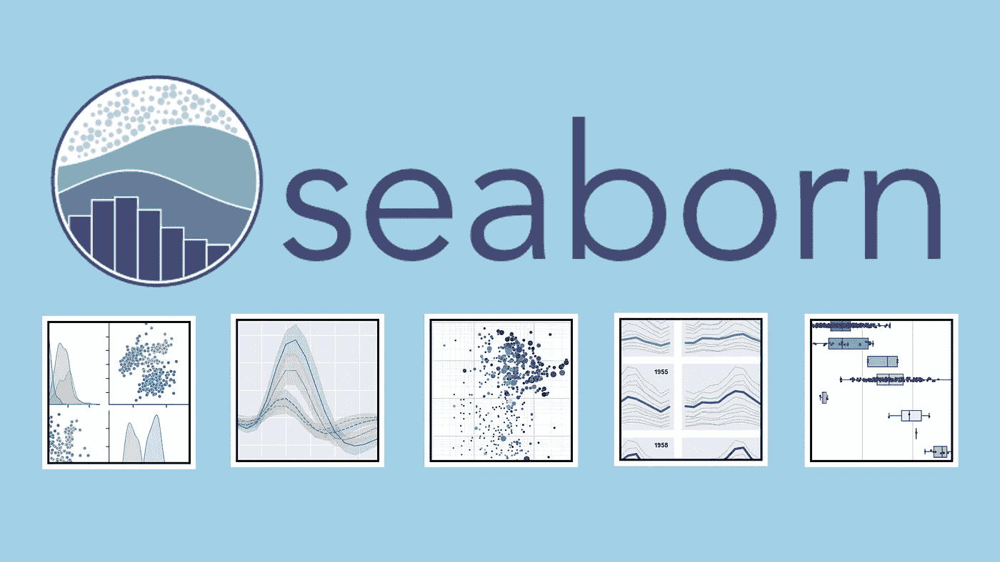

作者照片。

数据可视化是一种技术，允许数据科学家将原始数据转换为图表和图形，从而产生有价值的见解。图表降低了数据的复杂性，使任何用户都更容易理解。

有许多非代码工具可以执行数据可视化，比如 Tableau、Power BI、ChartBlocks 等等。它们是非常强大的工具，并且拥有自己的受众。然而，当处理需要转换的原始数据和良好的数据平台时，Python 是一个极好的选择。

虽然更复杂——因为它需要编程知识——Python 允许您对数据执行任何操作、转换和可视化。它非常适合数据科学家。

Python 是数据科学的最佳选择有很多原因，但最重要的原因之一是它的库生态系统。Python 可以使用许多优秀的库来处理数据，比如`numpy`、`pandas`、`matplotlib`、`tensorflow`等。

`Matplotlib`可能是最受认可的绘图库，可用于 Python 和其他编程语言，如`R`。它的定制化程度和可操作性首先确立了它的地位。但是，在使用它时，有些操作或定制可能很难处理。

开发人员基于 matplotlib 创建了一个名为`seaborn`的新库。`Seaborn`和`matplotlib`一样强大，同时还提供了一个抽象来简化情节并带来一些独特的特性。

在本文中，我们将重点介绍如何使用`seaborn`创建一流的情节。如果你想继续，你可以创建你自己的项目或者简单地在 GitHub 上查看我的 [seaborn guide 项目](https://github.com/bajcmartinez/python-seaborn-guide)。

# 什么是 Seaborn？

`[Seaborn](https://seaborn.pydata.org/)`是用 Python 制作统计图形的库。它构建在 [matplotlib](https://matplotlib.org/) 之上，并与 [pandas 数据结构](https://livecodestream.dev/post/how-to-work-with-pandas-in-python/)紧密集成。

`Seaborn`的设计允许您快速浏览和理解您的数据。`Seaborn`的工作原理是捕获包含所有数据的整个数据帧或数组，并执行语义映射和统计聚合所需的所有内部功能，以将数据转换为信息图。

它抽象了复杂性，同时允许你根据自己的要求设计你的情节。

# 安装 Seaborn

安装`seaborn`就像使用您最喜欢的 Python 包管理器安装一个库一样简单。安装`seaborn`时，库会安装其依赖项，包括`matplotlib`、`pandas`、`numpy`和`scipy`。

接下来，让我们安装`seaborn`，当然，还有包[笔记本](https://jupyter.org/)来访问我们的数据平台:

```
pipenv install seaborn notebook
```

此外，在开始之前，我们将导入几个模块:

```
import seaborn as sns
import pandas as pd
import numpy as np
import matplotlib
```

# 构建您的第一个地块

在我们开始绘制任何东西之前，我们需要数据。`seaborn`的美妙之处在于它可以直接处理`pandas`数据帧，非常方便。此外，该库带有一些内置的数据集，您现在可以从代码中加载这些数据集。无需手动下载文件。

让我们通过加载包含航班信息的数据集来看看它是如何工作的:

```
flights_data = sns.load_dataset("flights")
flights_data.head()
```

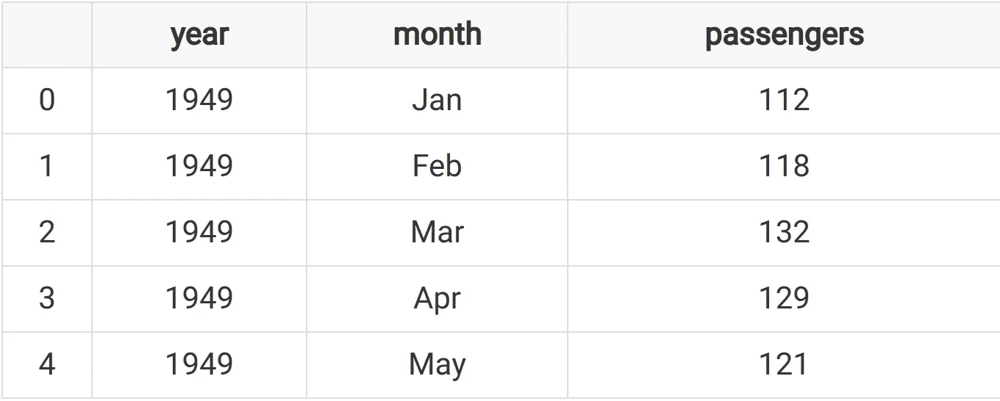

所有神奇的事情都发生在调用函数`load_dataset`时，该函数期望加载数据的名称并返回一个 dataframe。所有这些数据集都可以在 [GitHub 知识库](https://github.com/mwaskom/seaborn-data)中找到。

# 散点图

散点图是基于数据集的两个维度显示点的图表。在 seaborn 库中创建散点图非常简单，只需要一行代码:

```
sns.scatterplot(data=flights_data, x="year", y="passengers")
```

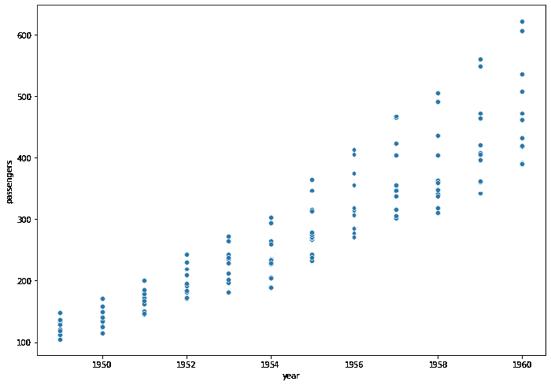

样本散点图

很简单，对吧？函数`scatterplot`需要我们想要绘制的数据集，列代表`x`和`y`轴。

# 线形图

该图绘制了一条代表连续或分类数据变化的线。这是一种流行的、众所周知的图表类型，而且非常容易制作。与之前类似，我们对数据集使用函数`lineplot`，列代表轴`x`和轴`y`。`Seaborn`剩下的我来做。

```
sns.lineplot(data=flights_data, x="year", y="passengers")
```

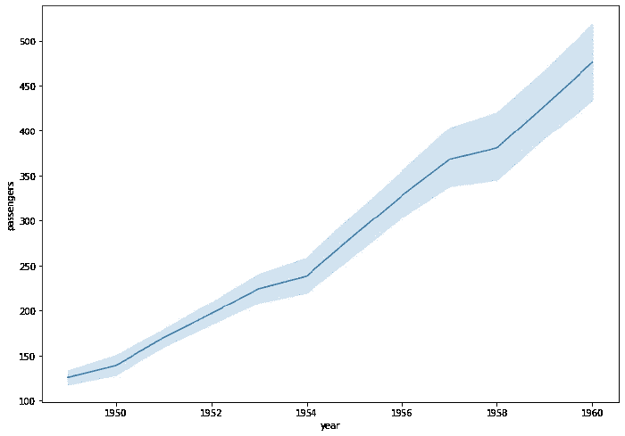

采样线图

# 条形图

这可能是最广为人知的图表类型，正如您可能已经预料到的，我们可以用函数`barplot`绘制这种类型的图，就像我们绘制折线图和散点图一样。

```
sns.barplot(data=flights_data, x="year", y="passengers")
```

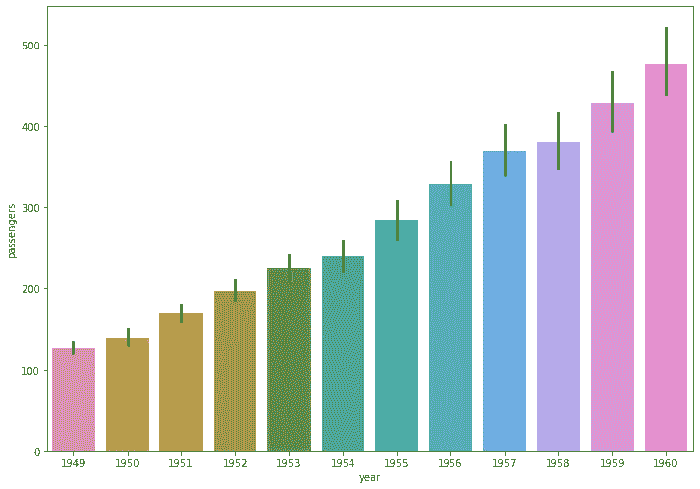

样本条形图

我知道，它非常丰富多彩。我们将在指南的后面学习如何定制它。

# 使用 matplotlib 扩展

Seaborn 建立在`matplotlib`之上，扩展了它的功能并抽象了复杂性。也就是说，它不会限制自己的能力。任何`seaborn`图表都可以使用`matplotlib`库中的函数进行定制。它可以在特定操作中派上用场，并允许 seaborn 利用`matplotlib`的能力，而不必重写它的所有功能。

比方说，您想要使用`seaborn`同时绘制多个图形。您可以使用`matplotlib`中的`subplot`功能:

```
diamonds_data = sns.load_dataset('diamonds')
plt.subplot(1, 2, 1)
sns.countplot(x='carat', data=diamonds_data)
plt.subplot(1, 2, 2)
sns.countplot(x='depth', data=diamonds_data)
```

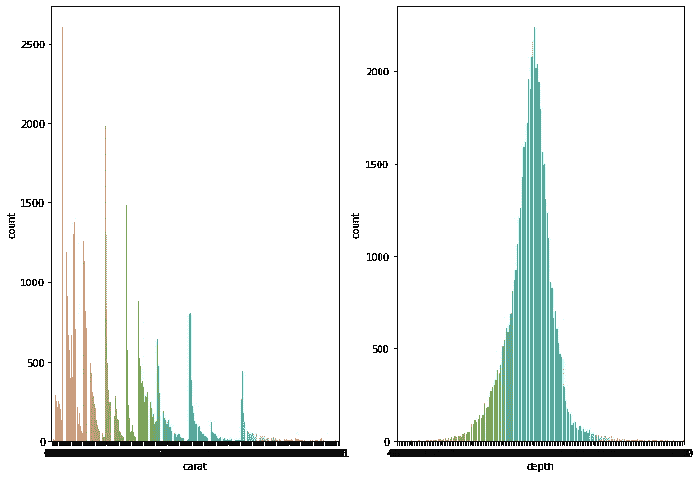

带有支线剧情的示例剧情

使用`subplot`功能，我们可以在一个图上绘制多个图表。该函数有三个参数:第一个是行数，第二个是列数，最后一个是图号。

我们在每个子情节中渲染一个`seaborn`图表，混合`matplotlib`和`seaborn`函数。

# Seaborn 喜欢熊猫

我们已经讨论过这一点，但是`seaborn`非常喜欢`pandas`,它的所有功能都建立在`pandas`数据框架之上。到目前为止，我们已经看到了使用`seaborn`预加载数据的例子，但是如果我们想从已经使用`pandas`加载的数据中绘制一个图呢？

```
drinks_df = pd.read_csv("data/drinks.csv")
sns.barplot(x="country", y="beer_servings", data=drinks_df)
```

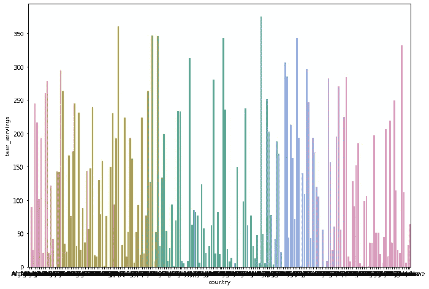

有熊猫的样地

# 用风格创造美丽的情节

Seaborn 给了你改变图形界面的能力，它提供了五种不同的风格:`darkgrid`、`whitegrid`、`dark`、`white`和`ticks`。

```
sns.set_style("darkgrid")
sns.lineplot(data = data, x = "year", y = "passengers")
```

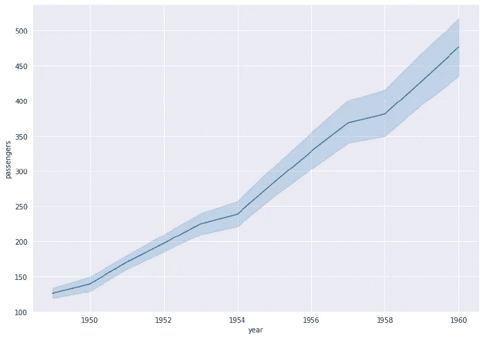

具有暗网格样式的示例图

这是另一个例子:

```
sns.set_style("whitegrid")
sns.lineplot(data=flights_data, x="year", y="passengers")
```

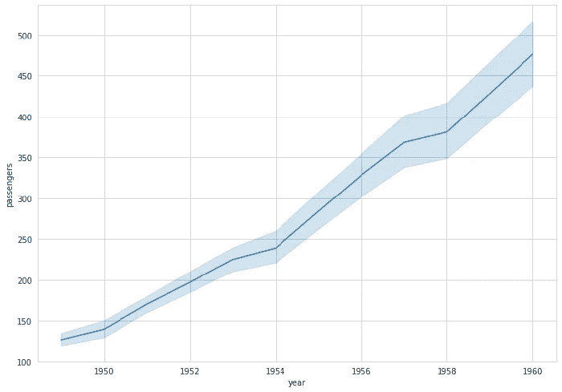

白色网格样式的示例图

# 酷用例

我们现在知道了`seaborn`的基本知识。让我们通过在同一个数据集上构建多个图表来实践它们。在我们的例子中，我们将使用数据集“tips ”,您可以使用`seaborn`直接下载。

首先，加载数据集:

```
tips_df = sns.load_dataset('tips')
tips_df.head()
```

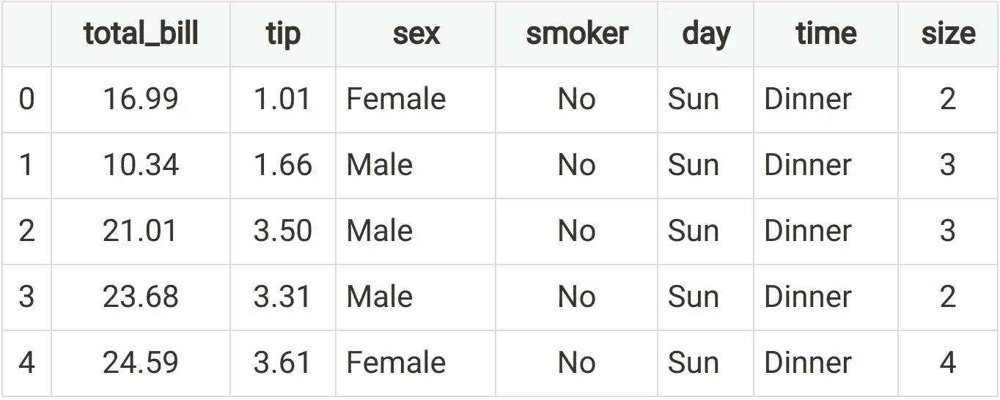

我喜欢打印数据集的前几行，以获得对列和数据本身的感觉。通常，我使用一些`pandas`函数来修复一些数据问题，如`null`值，并向数据集添加可能有帮助的信息。你可以在[大熊猫工作指南](https://livecodestream.dev/post/how-to-work-with-pandas-in-python/)上了解更多。

```
tips_df["tip_percentage"] = tips_df["tip"] / tips_df["total_bill"]
tips_df.head()
```

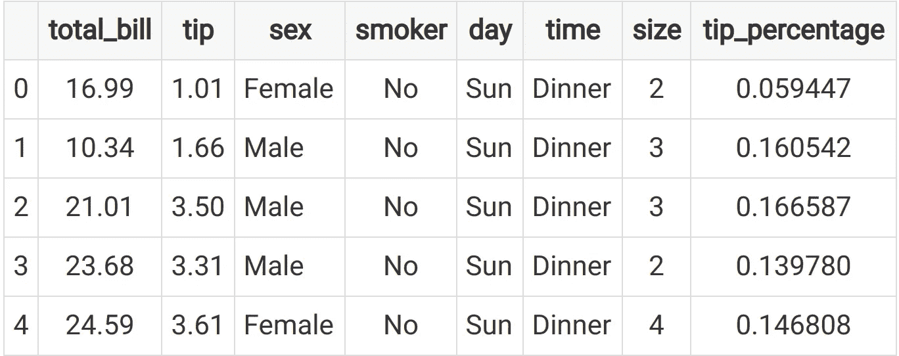

接下来，我们可以开始绘制一些图表。

## 了解小费比例

我们先来试着了解一下小费的百分比分布。为此，我们可以使用`histplot`，它将生成一个直方图:

```
sns.histplot(tips_df["tip_percentage"], binwidth=0.05)
```

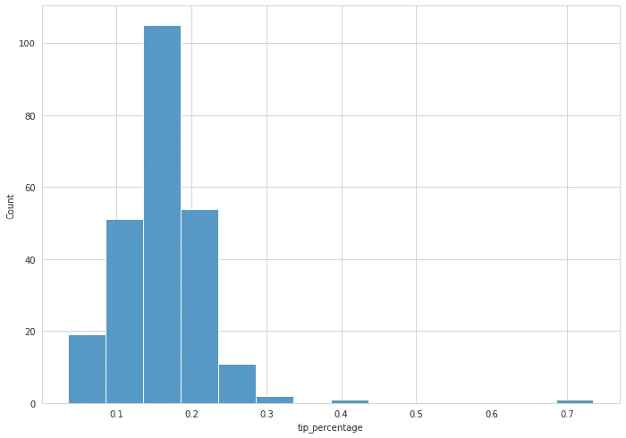

那很好。我们必须定制`binwidth`属性，使其更具可读性，但是现在我们可以很快体会到我们对数据的理解。大多数顾客会给 15-20%的小费，我们也有一些超过 70%的情况。这些值是异常的，它们总是值得探究，以确定这些值是否是错误的。

了解小费比例是否会随着一天中的不同时间而变化也是很有趣的:

```
sns.histplot(data=tips_df, x="tip_percentage", binwidth=0.05, hue="time")
```

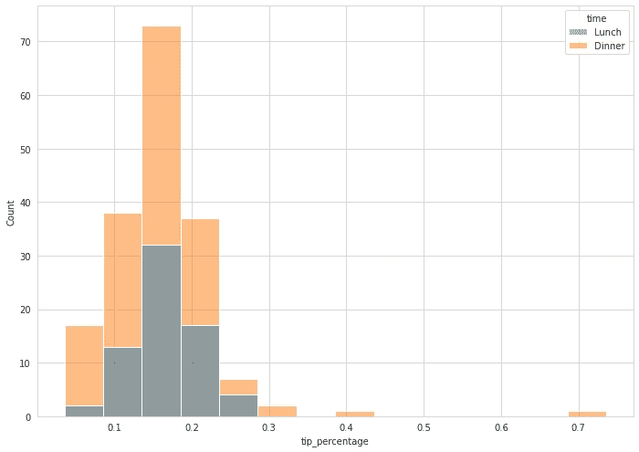

这一次，我们加载了包含完整数据集的图表，而不仅仅是一列。然后，我们将属性`hue`设置为列`time`。这将强制图表对`time`的每个值使用不同的颜色，并为其添加一个图例。

## 一周中每天的小费总数

另一个有趣的指标是了解员工根据一周中的不同日子可以期望得到多少小费:

```
sns.barplot(data=tips_df, x="day", y="tip", estimator=np.sum)
```

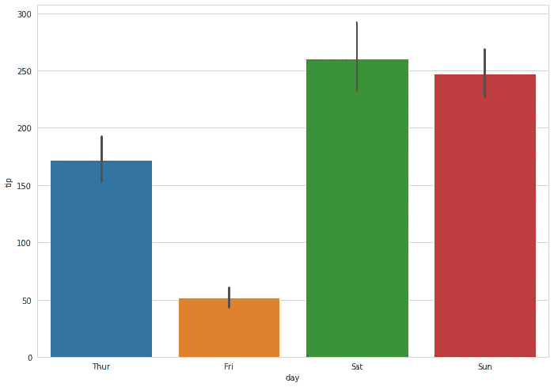

看起来星期五是呆在家里的好日子。

## 桌子大小和日期对小费的影响

有时，我们想了解变量是如何共同决定产出的。例如，星期几和桌子大小如何影响小费比例？

为了绘制下一个图表，我们将结合熊猫的`pivot`功能对信息进行预处理，然后绘制一个热图图表:

```
pivot = tips_df.pivot_table(
    index=["day"],
    columns=["size"],
    values="tip_percentage",
    aggfunc=np.average)
sns.heatmap(pivot)
```

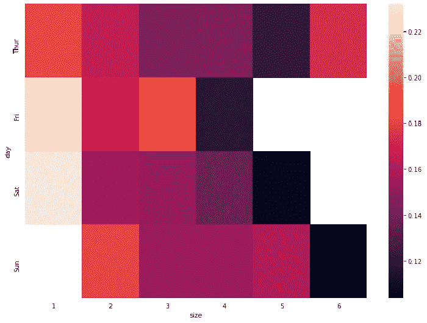

# 结论

当然，我们可以用`seaborn`做更多的事情。您可以通过访问[官方文档](https://seaborn.pydata.org/examples/index.html)了解更多用例。

我希望你喜欢读这篇文章，就像我喜欢写它一样。

感谢阅读！