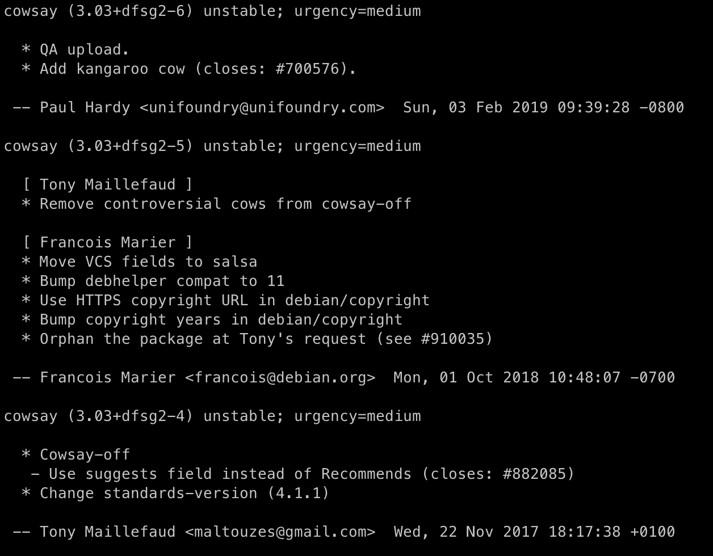

# 使用这些命令成为更好的“apt”用户

> 原文：<https://betterprogramming.pub/become-a-better-apt-user-with-these-commands-ecd7b13fd502>

## 不要只是盲目地安装，要学会如何利用 apt 的全部能力


尼基塔·卡恰诺夫斯基在 [Unsplash](https://unsplash.com/s/photos/computer?utm_source=unsplash&utm_medium=referral&utm_content=creditCopyText) 上的照片

大多数人在安装新的基于 Debian 的 Linux 时做的第一件事就是运行`sudo apt-get update`。这个流行的命令刷新缓存并检查系统安装包的可用更新。保持缓存和安装包都是最新的，这是一个很好的内务处理。

大多数情况下，普通 Linux 用户的 apt 体验就到此为止了。安装、更新和删除软件包是主要功能，那么为什么还要走得更远呢？

嗯，如果你深入了解 apt，你会发现不仅仅是一个简单的安装软件的方法。apt 实用程序是一个功能全面的程序，允许您管理您安装的软件包和系统本身的许多不同方面。在本文中，我们将探索一些使用 apt 的新方法，以及如何从这个流行的开源包管理器中获得更多的灵活性。

# 搜索包

如果你找不到包的名字，就不会安装它。幸运的是，apt 有一个内置的方法来搜索包。您可以通过包描述中包含的关键字进行快速搜索。

发出以下命令将搜索任何包含关键字“cows”的包:

```
apt-cache search cows
```

*注意:您不必以* `*sudo*` *的身份运行该命令，并且应该避免养成对实际上不需要的东西使用* `*sudoing*` *的习惯。*

运行这个命令后，您应该会看到一个包含“cows”的包列表，并且能够挑选出您正在寻找的包。在这种情况下，让我们假装忘记了心爱的`cowsay`包的名字。名单上不远的地方应该是`cowsay`。答对了。你已经找到了那个难以捉摸的包裹。

现在你不用离开终端就可以搜索软件了。

# 阅读变更日志

开发者并不完美。bug 时有发生。发生了突破性的变化。东西会被删除。如果你想知道为什么会丢失一些东西，或者什么时候增加了一些新特性，apt 可以帮助你。

每个包都包含一个详细的变更日志，维护人员可以在其中添加关于特定变更的注释。这有助于参考新功能或寻找特定的错误修复。

您可以通过发出以下命令来查看`cowsay`包的变更日志:

```
apt-get changelog cowsay
```

您应该会得到类似于下面的内容:



Cowsay 的 apt-get changelog。

在这里，你可以看到每个变化的主要说明，甚至发现添加的小宝石。如果你错过了增加袋鼠牛的机会，那该多可惜！

# 修复损坏的包

有时候 apt 会碍手碍脚。软件包会被破坏、废弃或完全删除。如果您正在为一个损坏的安装而挣扎，或者 apt 因为依赖地狱而让您痛苦，这是一组很好的开始故障诊断的命令:

```
sudo apt-get clean
sudo apt-get autoremove
sudo apt-get update --fix-missing
sudo apt-get install -f
```

以下命令类似于 apt 的一个小重置:

*   首先，清理本地缓存以消除任何损坏。
*   接下来，删除所有不必要的包。
*   之后，我们更新包缓存并修复任何缺失的依赖项。
*   最后，我们安装并尝试修复损坏的软件包情况。

魔力来自于试图自动修复破损软件包的`-f`标志。你应该只在 apt 崩溃的情况下使用`-f`,因为它可能会无意中删除你真正想要保留的东西。

# 下载源文件

能够修改和扩展其他开发人员的代码是开源社区最好的部分之一。因为 apt 中包含的几乎所有包都是开源的，所以您可以下载它们的所有源代码来使用。

如果您想获取`cowsay`包的源代码，只需执行:

```
apt-get source cowsay
```

您将看到所有的源文件都被转储到当前的工作目录中。现在你可以自己给`cowsay`添加一种新的奶牛了。

# 从自定义来源列表升级

如果您在一个系统上安装了许多来自自定义源的软件包，管理升级会变得很困难。有时候你不想升级所有的东西。某些包可能需要保留，以防止破坏性的更改或错误。

如果您想从自定义列表升级，可以向 apt 传递一个特殊的参数:

```
sudo apt-get upgrade -o Dir::Etc::SourceList=/etc/apt/<my_list>
```

您可以告诉 apt 使用特定的源代码列表，而不是简单地从所有源代码升级。传递带有源列表路径的`-o`参数只会从该文件中找到的源进行升级。

这对于保持包的基本子集更新和避免其他包非常有用。

# 标记包裹

管理源代码和其他包组可以完成 apt 的大部分工作，但是有时候你有一个特别烦人的包需要一些手工干预。在这种情况下，您可能需要告诉 apt 如何处理它。`apt-mark`实用程序在这里派上了用场。

使用`apt-mark`工具，你可以改变 apt 处理特定包的方式。你可以阻止它升级，改变它的安装方式或阻止它被删除。

如果您想将一个包标记为“手动”安装，这将防止它在不再有依赖项需要它时被删除。您可以通过执行以下命令为`cowsay`实现这一点:

```
sudo apt-mark manual cowsay
```

如果这是一个开发库，您希望为将来的工作保留它，您可以将它标记为“手动”安装，而不用担心它以后会自动删除。

# 查看哪些包有升级

如果你曾经更新过 apt 缓存，并且背负着大量可能令人望而生畏的升级。如果你关心特定的软件包，那么继续所有的升级可能是没有意义的。有了 apt，你可以看到需要升级的软件包列表，甚至可以看到你要升级到哪个版本。

执行以下命令以查看可用升级的列表以及它们可以移动到的版本:

```
sudo apt list --upgradeable -a
```

现在，在盲目升级系统并可能破坏整个系统之前，您可以确切地看到软件包会发生什么。

感谢阅读！如果你喜欢这篇文章，请花点时间看看下面更多的 Linux 冒险:

*   [*6 更古怪的 Linux 实用程序你应该试试*](/6-more-oddball-linux-utilities-you-should-try-7ba8552c2e2e)
*   [*你应该知道的 5 个基本 Linux 磁盘管理命令*](/5-basic-linux-disk-management-commands-you-should-know-ee47c49ce6e6)
*   [*6 个你不知道自己需要的简单 Linux 实用程序*](/6-simple-linux-utilities-you-didnt-know-you-needed-a60c150747e8)