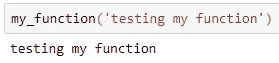
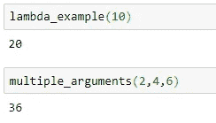
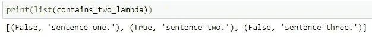
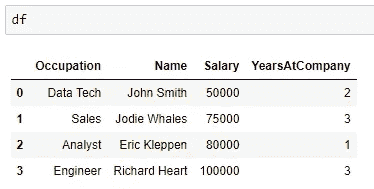
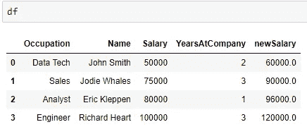

# Python Lambda 函数到底是什么？

> 原文：<https://betterprogramming.pub/become-a-python-programmer-what-are-lambda-functions-1de065686edf>

## 通过使用 lambda 函数，学习像专家一样编写 Python


安内特·lūsiņa 在 [Unsplash](https://unsplash.com?utm_source=medium&utm_medium=referral) 上拍摄的照片

# 学习 Python 需要时间

从*菜鸟*到*蟒蛇*的旅途可能需要一段时间，因人而异。大多数人开始学习 Python 时都是先复习数字、布尔和字符串的基本数据结构，然后再学习复杂的数据结构，比如列表和字典。从那里，您学习循环和 if/else 控制逻辑，并最终学习通过函数编写可重用的代码。

一旦你开始探索函数，你将会遇到 lambda 函数，它起初看起来很吓人。类似于列表理解，lambda 函数允许你编写简洁的代码。通常需要几行代码作为定义函数的事情可以用 lambda 函数在一行代码中完成！

# 查看 Python 函数

典型的 Python 函数只是一组独立的指令，用于执行特定的任务。掌握和理解它们很重要，因为它们允许我们通过将代码分成更小的、可重用的块来保持代码的组织性。如果我们正在编写一个大的程序，利用函数也可以使代码更容易阅读和调试。

在 Python 中，我们使用 ***def*** 关键字定义一个函数，然后给这个函数起一个名字，以及任何影响函数体执行的必要参数。通常情况下， ***return*** 关键字用于终止函数，并将所需的输出返回给调用该函数的对象。下面是一个函数示例:

```
#python example function
def my_function(string):
     return print(string) 
```



测试我的功能

示例`my_function` 将一个*字符串*作为参数，并将该字符串打印为返回的输出。

# **什么是λ函数？**

为了让您的 Python 技能更上一层楼，您需要掌握普通函数和 lambda 函数。Lambda 函数非常有助于使代码更短更简洁，这是 Pythonista 的方法！我们将看几个简单的例子来回顾语法，然后看一些 lambda 函数的实际用例，这会让你看起来像个专家。

正如我们在前面的例子中看到的，普通函数是用`def`定义的，并给了一个名字。λ函数是使用`lambda` 关键字定义的，并且是**未命名的**。它们是没有在任何名称空间中定义的匿名函数，并且只供一次使用。

当我第一次学习 lambda 函数时，似乎有点难以理解。由于 lambda 函数可以接受任意数量的参数，但只能有一个表达式，所以语法可能会令人困惑。这里有几个简单的例子:

```
#lambda syntax
#lambda <arguments> : <return expression>#simple example
lambda_example = lambda x: x + x#multiple arguments example
multiple_arguments = lambda x, y, z: (x + y) * z
```



测试 lambda 函数示例

请注意，多个参数由逗号分隔。调用函数时，调用者提供参数。返回表达式在冒号(:)后定义。有一个返回表达式，但返回表达式可以是简单的，也可以是复杂的。它甚至可以是另一个函数，这使得 lambda 函数成为 Python 编程工具箱中的一个强大工具。

# 使用 Lambda 函数

让我们看看如何使用 lambda 以 Pythonic 的方式编写函数。下面我们有一个函数来检查单词“two”的字符串列表它根据单词是否在字符串中返回字符串列表以及 True 或 False:

```
sentences = ['Sentence one.', 'Sentence two.', 'Sentence three.']def contains_two(text):
    answers = []
    for s in txt:
        if 'two' in s:
            answers.append(True)
        else:
            answers.append(False)
    return zip(answers, text)
```


测试包含两个功能

我们可以使用 Python 的 [**map()**](https://www.geeksforgeeks.org/python-map-function/) 函数和 lambda 函数简洁地重写这个函数，而不是定义一个函数并使用 for 循环遍历列表。

```
contains_two_lambda = map(lambda x: (True, x) if 'two' in x else (False, x), sentences)
```



测试包含 _two_lambda 函数

`**map()**`函数以一个函数和一个序列作为参数，在给定的序列上运行函数。我们传递给 map()的函数是一个 lambda 函数，允许我们只用一行代码就可以执行我们定义的函数所做的事情！

Lambda 函数与 map()、 [reduce()](https://realpython.com/python-reduce-function/) 和 filter()等函数配合得很好，这三个内置的 Python 函数都将函数作为参数。Lambda 函数在数据管理中也很受欢迎，因为它们可以很好地处理 pandas `dataframes`。它们可以使对列和行应用逻辑操作成为简洁的一行程序。

# 对熊猫数据帧使用 Lambda 函数

作为一名分析师，我发现自己一直在使用[熊猫数据框架](https://pandas.pydata.org/pandas-docs/stable/reference/api/pandas.DataFrame.html)。由于 DataFames 是一种流行的数据结构，让我们看看在`dataframes`中使用 lambda 函数来转换数据是多么容易。让我们用一些模拟数据创建一个简单的熊猫数据框架:

```
#import dependencies
import pandas as pd#create dataframe
df = pd.DataFrame({
  'Occupation': ['Data Tech','Sales','Analyst','Engineer'],
  'Name': ['John Smith', 'Jodie Whales', 'Eric Kleppen', 'Richard Heart'],
  'Salary': [50000, 75000, 80000, 100000],
  'YearsAtCompany': [2, 3, 1, 3],})
```



示例数据帧

接下来，让我们使用 lambda 函数创建一个名为`newSalary`的新列。如果我根据列`YearsAtCompany`给出加薪，并且想知道一个人的新工资是多少，我可以使用`[apply()](https://pandas.pydata.org/pandas-docs/stable/reference/api/pandas.DataFrame.apply.html)`函数，类似于我们在前面的例子中使用`map()`的方式:

```
df['newSalary'] = 
df['Salary'].apply(lambda x: x * (1 + df['YearsAtCompany']/10))
```



验证新销售列

请注意，`apply()`函数将 lambda 函数作为参数，并将该函数应用于`Salary` 列中的每一行。lambda 函数中的表达式使用 YearsAtCompany 来确定加薪的大小。

# 包扎

像专业人士一样编写 Python 需要练习，所以如果你对 lambda 函数这样的新概念感到害怕，不要担心。语法看起来很奇怪，但是 lambda 函数允许您编写简洁的一次性函数，非常适合应用逻辑运算。

虽然它们只能执行一个表达式，但是表达式可以是复杂的，甚至可以包含另一个函数。Lambda 函数可以很好地处理一系列数据，甚至像熊猫数据帧这样的数据结构。

# 谢谢大家！

*   *如果你喜欢这个，* [*在 Medium 上关注我*](https://medium.com/@erickleppen) *了解更多*
*   [*通过订阅*](https://erickleppen.medium.com/membership) 获得对我的内容的完全访问和帮助支持
*   *我们来连线上*[*LinkedIn*](https://www.linkedin.com/in/erickleppen01/)
*   *用 Python 分析数据？查看我的* [*网站*](https://pythondashboards.com/)

[**—埃里克·克莱本**](http://pythondashboards.com/)