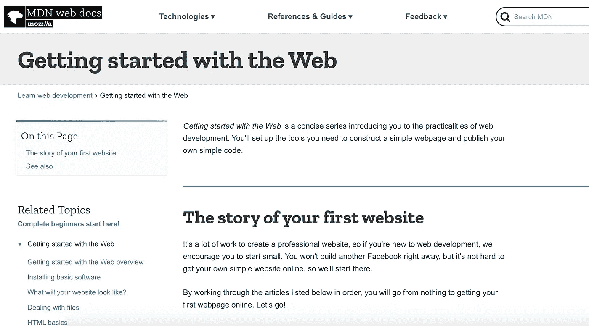
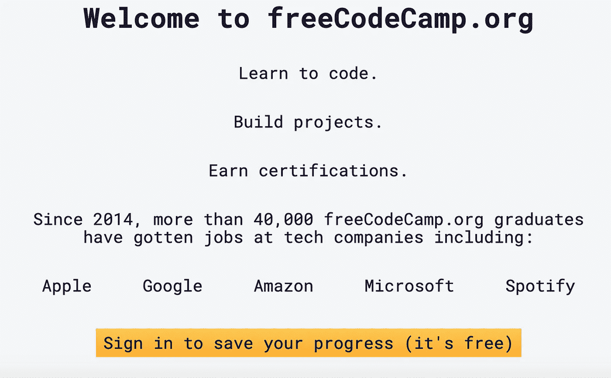
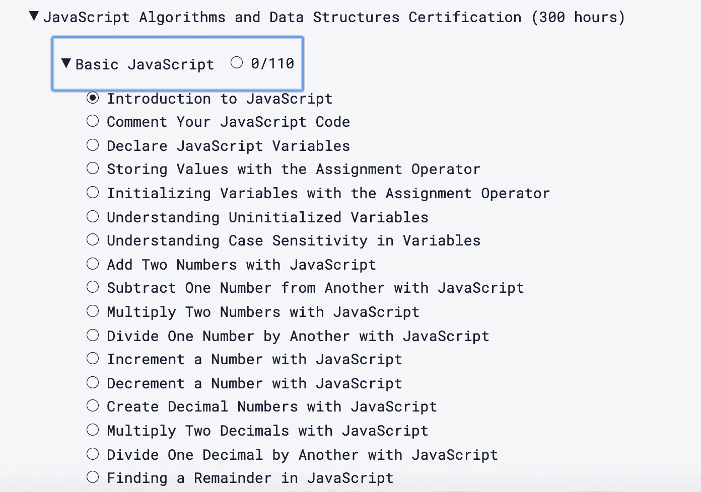
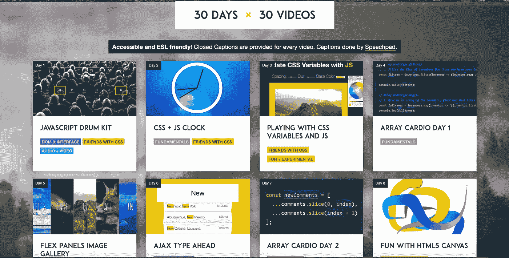
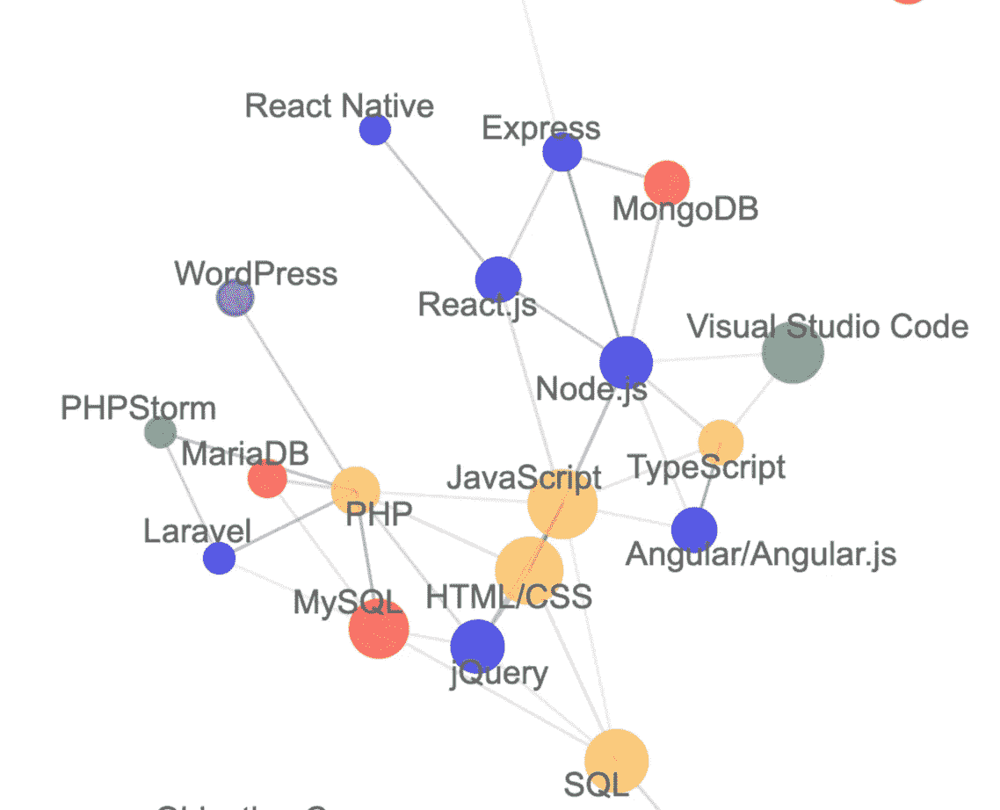
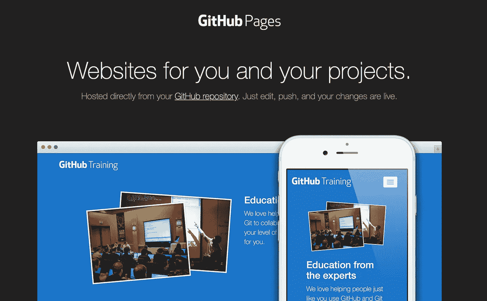

# 在 180 天内成为一名网络开发人员(没有计算机科学学位)

> 原文：<https://betterprogramming.pub/become-a-web-developer-in-180-days-without-cs-degree-e869395972e1>

## 没有大学学位也能成为一名网站开发者的指南

照片由[特雷西·亚当斯](https://unsplash.com/@tracycodes?utm_source=medium&utm_medium=referral)在 [Unsplash](https://unsplash.com?utm_source=medium&utm_medium=referral) 拍摄

通往 web 开发世界的道路有时看起来很混乱——因为有多种编程语言、数百个框架和数千个库，所以没有清晰的道路。哪些应该学，按什么顺序学？

我是一名自学成才的程序员，曾在多家初创公司和大型企业担任高级工程师，其中一家是瑞士最大的银行。以下是我学到的东西，以及你如何利用这些知识。任何人都可以成为一名网页开发者——这是一个坚持和努力的问题。如果你把工作投入进去，你就能成为一名网页开发者。

事不宜迟，这里告诉你如何在 180 天内成为一名 web 开发人员。180 天的时间足以启动你在 web 开发领域的编程生涯。180 天不保证。可能需要更长时间，也可能更快——这完全取决于你有多想要它，以及你愿意付出多少努力。

*我 19 岁开始学习 web 开发——那时候我自然没有很多现金，所以我必须尽可能节俭地学习。我设计的路线是最便宜的，也是最划算的。*

没有必要为编程训练营支付 10，000 美元，因为那里有大量的免费资源——你只需要知道去哪里找。

我并不反对编程训练营，它们已经被证明是有效的。它们也被证明价格过高且效率低下。去看看 Reddit 上关于这个主题的帖子。*[*Web 开发编码训练营的好、坏、丑* —深度讲解](https://www.reddit.com/r/cscareerquestions/comments/doixms/the_good_bad_and_the_ugly_of_web_dev_coding/?utm_source=share&utm_medium=web2x)*

*[成为媒介会员直接支持我的工作](https://trevorlasn.medium.com/membership)。你也可以在媒体上看到所有的故事。提前感谢！*

**作者注:*考虑给这篇文章做个书签，这样无论何时你完成一门课程、挑战等，你都可以快速查阅。*

# *第 1-15 天:学习 HTML 和 CSS 的基础知识*

*这是你旅程的开始。关键是你要把注意力集中在正确的基础上。拥有坚实的基础能让你更快地掌握不同的科目。*

*从小处着手，了解什么是超文本标记语言(HTML)及其工作原理。HTML 是每个网站和 web 应用程序的构建块。学习层叠样式表(CSS **)** 来补充这个技能。CSS 用于设计网站和 web 应用程序的样式。*

*Mozilla 有一个简明且最新的免费资源列表，你可以深入研究。它们包括以下内容:*

## *Mozilla 的网络入门指南*

1.  *[网络概述入门](https://developer.mozilla.org/en-US/docs/Learn/Getting_started_with_the_web)*
2.  *[安装基础软件](https://developer.mozilla.org/en-US/docs/Learn/Getting_started_with_the_web/Installing_basic_software)*
3.  *你的网站会是什么样子？*
4.  *[处理文件](https://developer.mozilla.org/en-US/docs/Learn/Getting_started_with_the_web/Dealing_with_files)*
5.  *[HTML 基础知识](https://developer.mozilla.org/en-US/docs/Learn/Getting_started_with_the_web/HTML_basics)*
6.  *[CSS 基础知识](https://developer.mozilla.org/en-US/docs/Learn/Getting_started_with_the_web/CSS_basics)*
7.  *[JavaScript 基础知识](https://developer.mozilla.org/en-US/docs/Learn/Getting_started_with_the_web/JavaScript_basics)*
8.  *[发布您的网站](https://developer.mozilla.org/en-US/docs/Learn/Getting_started_with_the_web/Publishing_your_website)*
9.  *[网络如何工作](https://developer.mozilla.org/en-US/docs/Learn/Getting_started_with_the_web/How_the_Web_works)*

*创建一个专业网站需要做很多工作，所以如果你是 web 开发的新手，我鼓励你从小处着手。*

*你不会马上建立另一个脸书，但是在网上建立一个简单的网站并不难，所以让我们从这里开始吧。*

**

*网络入门—[https://developer . Mozilla . org/en-US/docs/Learn/Getting _ started _ with _ the _ Web](https://developer.mozilla.org/en-US/docs/Learn/Getting_started_with_the_web)*

# *第 16–50 天—开始学习 JavaScript 的基础知识*

*JavaScript 是最流行的编程语言。JavaScript 如此广泛，因为每个网站都在使用它。如果你使用的是现代浏览器，那就关掉 JavaScript，上网冲浪——你会很快发现 97%的网站无法正常运行，甚至无法加载。*

*JavaScript 为网络提供动力。任何 web 开发工作都会有某种形式的 JavaScript 编程。如果你好奇为什么 JavaScript 如此受欢迎，看看我之前的帖子[“是什么让 JavaScript 受欢迎？”](https://medium.com/better-programming/what-makes-javascript-javascript-b9ab51ad983a)*

*由于它的流行，有很多地方可以学习 JavaScript。如果你刚刚开始，我建议你从 FreeCodeCamp JavaScript 课程开始。*

**

*免费代码营课程*

*它是免费的，有效的，并且给你交互式的挑战去解决。*

**

*FreeCodeCamp JavaScript 课程—[https://www.freecodecamp.org/learn](https://www.freecodecamp.org/learn)*

*完成本课程后，您将了解 JavaScript 的基础知识，以及它如何融入 web 开发的大环境中。FreeCodeCamp JavaScript 课程涵盖了许多主题，您将需要几周时间来完成所有这些主题。如果你遇到困难，不要羞于用谷歌搜索你的解决方案——web 开发包括大量的现场学习和阅读 StackOverflow 来找到你的问题的答案。*

# *第 51–81 天:30 天普通 JS 编码挑战*

**"Javascript30"* 面向希望熟练掌握 Javascript 基础知识并在没有库的情况下使用 DOM 的初级到中级开发人员和设计人员。*

**

*用 30 个教程在 30 天内做 30 件东西—[https://javascript30.com/](https://javascript30.com/)*

*你应该已经开始了解一些 JavaScript——这不是 JavaScript 101 课程。我们通过应用来学习——遇到许多新的情况，谈论如何、为什么以及我们用什么来解决它们。*

*我们避开固执己见的设计模式、框架、库和任何类型的抽象。这些东西很棒，而且经常需要，但是会阻碍学习，限制最初的理解。*

*这些教程在很大程度上依赖于浏览器 API，其中大部分都涉及到与页面的交互。如果你被困在`console.log()`土地，这些视频就是你的下一步。你在这里建造的东西真的很有趣！*

*该课程免费、有趣且富有挑战性。在总共 30 天的时间里，每天你都有一个新的挑战要完成。学完本课程后，您应该会对 JavaScript、与 DOM 交互以及使用浏览器 API 感到很舒服。*

# *第 82–120 天:学习前端库(React，Vue，Angular)*

*询问任何有竞争力的企业，他们是否在使用某种形式的前端库，答案是肯定的。回到过去(2000 年代)，公司卷起袖子，建立适合他们需求的内部框架和库。现代 web 开发都是关于使用开源框架和库，比如 React、Vue、Angular 和 Svelte。*

*很难决定选择哪个框架——选择太多了。*

*记住，你的最终目标是在 web 开发领域找一份工作。我的建议是扫描你的领域，看看哪些框架是最流行的，并坚持下去。一些城市可能有 100 个 React 开发人员的职位空缺，而其他城市可能有 1000 个 Angular 的职位空缺。挑选你所在地区最受欢迎的一个符合你的利益。*

*我本人倾向于[反应](https://reactjs.org/)，因为这是我的选择框架，但在做出决定之前要仔细思考。这里没有正确或错误的答案。*

**注意:React 是一个用于构建用户界面的 JavaScript 库。了解 React 是什么都在* [*首页*](https://reactjs.org/) *或者* [*官方教程*](https://reactjs.org/tutorial/tutorial.html) *。**

*这是一张相互关联的网络开发技术的图表:*

**

*技术如何连接—[https://insights . stack overflow . com/survey/2019 #相关技术](https://insights.stackoverflow.com/survey/2019#correlated-technologies)*

*在你选择了一个框架之后，开始构建吧！变得更好的唯一方法就是不断地走出你的舒适区，不断地鞭策自己。*

*如果你需要一些关于编码内容的想法，这里有 6 个前端挑战，你可以今天就开始编码。选择一个框架，开始朝着你的目标努力吧！*

*如果你需要帮助，Github 和 StackOverflow 上有一个充满活力的社区随时准备帮助你。你永远不会孤单。*

# *第 121-170 天:学习 Node、MongoDB 和 PostgreSQL(后端开发)*

*你已经走到这一步了，放弃不是一个选择。现在我们已经了解了前端开发是如何工作的，让我们将一些后端知识添加到我们的花名册中。*

*为了真正利用 web 开发，每个应用程序都有一个后端。在现代，后端是与前端交互的应用程序编程接口(API)。*

*但是我们为什么需要后端呢？好吧，假设用户可以在与我们的应用程序交互时创建用户。我们需要将用户数据存储在某个地方以备将来使用，因此我们需要一个后端服务来创建用户。后端是与数据库交互并将数据提供给前端的中间人，所有这些都是通过 API 进行通信的。*

*安全性是我们需要后端的另一个重要原因。记住，后端意味着我们在服务器端执行，这意味着在这个上下文中在浏览器之外。任何人都可以通过开发工具检查你的前端代码，所以从安全角度来看，在那里存储敏感数据没有多大意义。*

*如果这听起来有趣的话，我会先通过[https://insights . stack overflow . com/survey/2019 #相关技术](https://medium.com/u/86a55cd7983b#correlated-technologies)*

*技术聚集到相关的生态系统中，这些生态系统往往由相同的开发人员使用。这张网络图通过显示哪些技术彼此关联度最高来证明这一点。*

# *第 171–17 天:学习 DevOps 和 Git (Docker、Heroku、AWS)*

*为了向世界展示你的 web 开发能力，托管你的 web 应用程序是必须的。你未来的雇主希望看到你以前的作品，即使是未完成的作品。*

*了解如何使用 Git 在 Github 页面上托管您的项目——它不会让您付出任何代价。Github 页面是免费的，唯一的缺点是你只能托管客户端代码。如果你想托管你的 API，你需要用 Heroku，AWS 或者 Digital Ocean 来运行你自己的服务器。*

**

*github Pages—[https://pages.github.com/](https://pages.github.com/)*

*大致来说，十分之九的团队使用 Git 来共享代码。了解 Git 会让你更容易被雇佣，因为你已经在团队协作的圈子里了。*

# *第 180 天:开始申请网络开发工作*

*你到达了终点线，现在你的旅程真正开始了。*

*找到并申请你能找到的所有职位。确保向你的雇主澄清这样一个事实:你是一名初级开发人员，这是你的第一份工作。诚实大有裨益——让你的新关系有一个良好的开端。当你申请工程类的工作时，了解对初级工程师的确切期望是有好处的。*

*对于工作面试来说，这里有 8 个你在接受工作之前应该问面试官的问题。*

# *结论*

*感谢您的阅读，祝您在新的旅程中一切顺利。*

*开始从来都不容易，而放弃似乎是最容易的出路。不要放弃梦想，继续奋斗。*

*对学习新事物保持开放的态度，如果你不知道就问，并保持饥渴和好奇。*