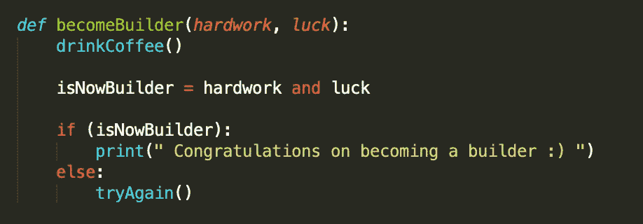

# 成为构建者——从非技术角色到软件工程

> 原文：<https://betterprogramming.pub/becoming-a-builder-from-a-non-technical-role-to-software-engineering-f9c007489eed>

## 我学到的 6 个技巧可以帮助你开始

✅经济学学位，辅修商科。✅负责营销活动。
✅创建了 KPI 仪表盘。
❌计算机科学学位。
❌编码训练营毕业。

对于想找软件工程工作的人来说，这不是一份理想的简历，对吗？好吧，那是我在 2016 年，当我开始认真考虑搬家的时候。

一晃两年半过去了，我现在已经在旧金山的 Twilio 做了一年多的软件工程师。仍然没有计算机科学学位，仍然没有编码训练营。

# 故事时间

毕业后，拿着经济学学位，我不知道自己想做什么。我感到失落。

接下来的几年，我在不同的公司担任不同的角色，每次都发现我*不想做的事情。*

但是有一种模式。在 Google、Zenefits 和 Twilio 的时候，虽然我没有从事技术工作，但我热衷于做一些兼职项目，以自动化团队执行的重复性和手动任务。

我一天中 99%的时间都花在了完成日常工作上，期待着那 1% —学习编码和构建。

那么，为什么不去参加编码训练营呢？我尽力了。事实上，我甚至被录取了！

2017 年 8 月，我被 App Academy 录取，这是一个在旧金山为期三个月的编码训练营项目。梦想成真。把那 1%变成 100%的机会。

不幸的是，我有一些个人财务问题，使我无法做出承诺。我仍然相信编码训练营很棒，但是说实话，它们并不便宜。在你被录用后，App Academy 目前可以让你花费 28，000 美元，我觉得这不再是我的一个选择。

那之后发生了什么？我能够在 Twilio 采取行动，利用我在业余时间从事的开发项目组合。

我绝不是第一个从非技术角色转变为软件工程角色的人，也没有确切的“公式”来做到这一点，但我想分享我的故事以及我学到的一些可以帮助你开始的技巧。

# 1.了解你的优势

众所周知，技术能力对于在工程领域脱颖而出非常重要，但是不要忽视你在职业生涯中获得的其他经验。

在我从事运营和财务工作期间，我与客户的关系非常密切，并将这种关注带到了我的开发工作中——努力从最终用户的角度来构建一个出色的产品，而不是简单地将代码串在一起。

*顾客的同情心很重要。*你会惊讶地发现，有多少传统的、有才华的工程师在努力理解客户的声音，以及*为什么要制造* 某种东西。

无论你目前是在支持、运营、财务还是其他领域，总有*种* 种技能(无论是非技术性还是技术性的)会让你在工程职位中脱颖而出。利用它们。

# 2.做一个终身的现代学习者

不得不坐在教室里学习的日子已经结束了，这是一件很棒的事情！

Udemy、Coursera 和其他在线学习平台正在扰乱教学和学习行业，你应该利用这些资源的简单性和灵活性。

说到在线课程，请继续关注后续文章，详细介绍我用来自学编程的资源！

# 3.面试的时候仔细看看公司文化

你只有公司愿意给你的机会。如果你在面试，一定要评估公司的文化。

他们如何投资职业发展？他们有什么资源来支持员工？他们会报销学习和发展(L&D)——比如你将要上的 Udemy 或 Coursera 课程吗？

例如，Twilio 非常支持 L&D，并关心将具有非传统背景的人带入技术岗位。看看[孵化](https://www.twilio.com/company/diversity/hatch)举个例子，Twilio 的软件工程学徒计划！

# 4.如果可以的话，加入创业公司

初创公司必须斗志昂扬。他们通常缺乏资源，需要员工身兼数职才能完成工作。这就是你进来的地方。

很可能工程团队已经有了大量的面向客户的特性工作，这意味着内部工具经常变得不那么重要。这种资源限制为承担技术项目以获得更多工程经验创造了完美的环境。

在大公司也是如此，但我发现大多数公司都有更多的“繁文缛节”，这让他们更难成长为工程师。

# 5.自动化，自动化，自动化

即使你还不是正式的工程师，开始像工程师一样思考也是很重要的。列出您当前角色中执行的所有手动流程和工作流。

用一个简单的脚本可以自动化什么？您能否构建一个应用程序来简化工作流程？

自 2011 年以来，我在 Twilio 的旧团队一直通过电子表格和传统系统管理复杂的产品生命周期工作流，工程部门从未有时间帮忙，因为他们专注于更紧迫的优先事项。

2017 年 3 月，我设计、开发并推出了一个至今仍在使用的内部工具。它花了大约四个月的时间来构建，包括花在学习编程语言(Python)和框架上的时间。

建立你的投资组合和信誉。这一点，再加上你的工程网络，将是转型的关键。

# 6.给人们买咖啡

你的关系网就是你的净资产。我犯的一个严重错误是，在我试图转型的过程中，没有尽早建立关系网。一个坚实的技术项目组合是没有用的，除非你有机会展示给别人看。

在这个过程中，你需要有人为你担保，所以尽快开始建立关系网。开始问工程师问题。请他们出去喝咖啡，确保他们知道你感兴趣。

不要只和工程师说话。与产品经理、工程经理以及几乎所有愿意倾听的人交谈。

# 快速笔记

老实说，我不确定我写这篇文章的目的是什么。那么为什么要这么做呢？

我和几个聪明有魄力的人谈过(像你这样的人！)不敢迈出这一步，因为感觉不可能。我知道那种感觉。我很了解它。

我也知道我热衷于让更多的人进入这个领域，所以我想分享我的故事来证明*这是*可能的。

我知道我的方法可能不适合每个人。然而，我也相信游戏正在改变。

有了丰富的在线学习资源，以及新的、快速发展的创业公司每天都在涌现，我坚信我的转变和旅程会成为常态。