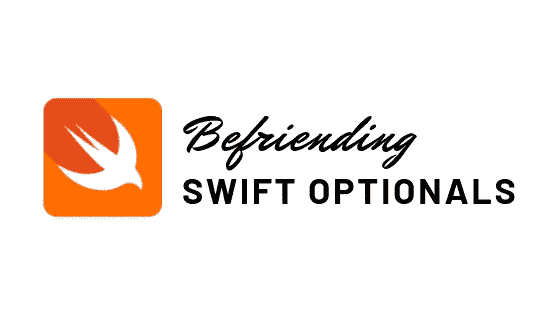

# Swift 选项指南

> 原文：<https://betterprogramming.pub/befriending-swift-optionals-part-1-149aa5b91301>

## 它们是什么，如何使用它们来保护你的代码不崩溃？



我开始学习 Swift 已经一个月了。老实说，我觉得学习这门语言很有趣。但是当我不得不应用我所学的东西时，这变成了一个巨大的挑战*(幸运的是，我喜欢挑战！)*。

准确地说，我与 Swift 的期权进行了激烈的斗争。我认为期权是我最大的敌人。但是经过几天的工作和研究，Optionals 和我终于达成了共识，现在我们是最好的朋友！

因此，本文是为那些刚开始学习 Swift 并在学习 Swift 选件时遇到困难的人而写的。我们开始吧！

# 什么是可选的？

Optionals 是 Swift 中的一种变量，它或者包含一个值，或者具有成为`nil`的超级能力。换句话说，*它们可能包含也可能不包含值*。可选变量可以在 Swift 中声明如下:

```
var superOptional: String?
print(superOptional)
```

这里，变量`superOptional`是一个类型为`String`的`Optional`变量。这意味着它既可以包含某个字符串，也可以有`nil`值。现在，因为我们还没有给变量赋值，所以`superOptional`的当前值被打印为`nil`。然而，在声明非可选变量时，情况就不同了。例如，如果我们这样做:

```
var superVariable: String
print(superVariable)
```

然后，一旦我们完成了下面的代码，IDE 将开始对我们大喊`Variable ‘superVariable’ used before being initialized`。

这清楚地表明我们不需要在使用前初始化一个`Optional`变量(因为它自动用`nil`初始化)，但是我们必须在使用前初始化一个非可选的或普通的变量。

现在，让我们继续并初始化我们的`superOptional`变量。

```
superOptional = "Hello world!"
print(superOptional)
```

添加后，整个代码将如下所示:

```
var superOptional: String? // old code
print(superOptional)superOptional = "Hello world!" // new code
print(superOptional)
```

输出将是这样的:

```
nil
Optional(“Hello world!”)
```

在我们初始化变量`superOptional`之前，它的值是`nil`。然而，在用字符串`“Hello world!”`初始化之后，该值不再是`nil`，因此输出变成了`Optional(“Hello world!”)`。

但是等等，输出应该只是`“Hello world!”`！是的，当我创建我的第一个`Optional`变量时，我就是这么想的。但是因为存储`“Hello world!”`的变量是一个`Optional`变量，所以它用`Optional()`包装起来。有很多方法可以提取或解开这个价值并投入使用。我会在这篇文章中描述。

# 展开选项

从`Optional`变量中解包实际值(未在`Optional()`内包装的值)有六种方法。它们是:

1.  使用 if-else 条件展开`Optionals`
2.  零合并算子
3.  强制展开
4.  可选装订(`if let`)
5.  `guard let`
6.  可选链接

## 1.使用 if-else 条件展开选项

这是展开选项的方式，我们使用 if-else 条件来检查`Optional`是否包含`nil`值。如果`Optional`没有保存一个`nil`值，我们打开它，否则我们打印一个字符串`“Default value”`。我们来实施吧。

```
var superOptional: String?
superOptional = "Hello world!"if superOptional != nil {
    print(superOptional)
} else {
    print("Default value")
}
```

对于很多人来说，这可能是一种熟悉的释放价值的方式。然而，在 Swift 中有更好、更短的方法来完成这项工作。因此，不建议以这种方式展开。

## 2.零合并算子

使用零合并运算符是展开选项的另一种方式。与使用 if-else 条件相比，这是一种更好、更短的展开方式(本文这一部分刚刚提到的方式)。这个操作符帮助我们展开一个`Optional`，如果它有一个实际值，或者给出一个默认值，如果`Optional`是`nil`。例如:

```
var superOptional: String?
print(superOptional ?? "Default value") // nil coalescing operator
```

在上面给出的例子中，`superOptional`变量具有`nil`值，因为它属于`Optional`性质，并且没有被赋值。因此，当使用一个零合并操作符，后跟字符串`“Default value”`来展开时，`nil`不会被打印，而是`“Default value”`。但是，如果`superOptional`保持实际值，这种情况不会发生。让我们看看这个例子:

```
var superOptional: String?
superOptional = "Hello world!"
print(superOptional ?? "Default value")
```

在上面的例子中输出是不同的，因为`superOptional`在解包之前是用字符串`“Hello world!”`初始化的。所以屏幕上印的是`“Hello world!”`，而不是`“Default value”`。

## 3.强制展开

顾名思义，强制解包是一种从可选值中解包值的方法，我们强制从变量中解包值，而不关心`Optional`是实际值还是`nil`值。我们通过添加感叹号(！)放在`Optional`变量的名字后面。这是一种不安全的展开方式，因为在`Optional`持有`nil`值的情况下，它会导致致命错误。这个方法只在我们完全确定`Optional`没有保存`nil`值的情况下使用。让我们来看看它的实际应用:

```
var superOptional: String?
superOptional = “Hello world!”
print(superOptional) // prints Optional("Hello world!")
print(superOptional!) // prints Hello world!
```

在示例中，我们可以看到有一个名为`superOptional`的`Optional`变量，它属于`String`类型。字符串`“Hello world!”`被分配给它并被初始化。当我们打印`superOptional`变量而不展开它时，就会打印`Optional(“Hello world!”)`。但是当我们通过在末尾加一个感叹号来打印的时候，`Hello world!`就打印出来了。通过这种方式，在`Optional`上执行强制展开以获得实际值。但是，如果我们试图在没有初始化变量`superOptional`的情况下强制展开并打印它，会怎么样呢？或者，如果我们在变量值为`nil`时尝试这样做呢？让我们看看代码:

```
var superOptional: String? // or var superOptional: String? = nil
print(superOptional!) // force unwrapping
```

当我们执行上面给出的代码时，我们的代码崩溃，并得到以下错误:

```
Fatal error: Unexpectedly found nil while unwrapping an Optional value
```

在这里，由于我们对带有`nil`值的`Optional`使用了强制展开，代码崩溃了。因此，必须记住，如果我们使用强制展开，我们必须确保`Optional`永远不会有`nil`值。

## 4.可选绑定(如果有)

可选绑定是强制解包的安全替代方法。如果我们试图展开的`Optional`包含一个`nil`值，强制展开会使我们的代码崩溃。但是通过使用可选绑定，我们可以阻止这种情况发生。在这种方法中，我们只有在确保`Optional`包含一个实际值之后，才展开它。为此，我们使用了`if let`。为了更好地说明这一点，让我们来看看这个例子:

```
var superOptional: String?
superOptional = "Hello world!"if let superValue = superOptional { // optional binding
    print(superValue)
}
```

在这里，我们已经检查了`superOptional`是否是`nil`。如果不是`nil`，则该值被赋给`superValue`。因此，使用从`superOptional`获得其值的`superValue`变得安全。

## 5.警卫信

`guard let`是`if let`的一个很好的替代品，用于展开可选件。如果`guard let`得到了我们试图解开的`Optional`的`nil`值，它希望我们退出使用它的函数、循环或条件。然而，`if let`和`guard let`的区别在于，即使在`guard let`代码之后，我们仍然可以使用我们的 unwrapped 选项。让我们看一个例子:

```
func printName(personName: String?){
    guard let name = personName else {
        print(“No name has been passed.”)
        return}print(“Your name is \(name).”)
}printName(personName: “John Doe”) // outputs "Your name is John Doe."
printName(personName: nil) // outputs "No name has been passed.
```

这里，我们有一个函数`printName(personName:)`。它接受一个名为`personName`的可选`String`，并利用`guard let`来检查`personName`是否为`nil`，然后打印不同的输出。在带有`guard let`的行中，`personName`的值被分配给`name`。如果发现`personName`的值为`nil`，则立即执行`else`块，控制移出功能。在当前示例中，首先打印`“No name has been passed”`并停止功能执行。但是，如果`personName`不包含`nil`值，则跳过`else`块，打印该人的姓名。在当前情况下，打印`“Your name is John Doe.”`。

*记住在* `*guard let*` *的* `*else*` *块中包含* `*return*` *语句是很重要的，因为我们希望一遇到* `*nil*` *值就停止函数执行。*

## 6.可选链接

如果我们必须同时处理多个选项，可选链接可能是一种有用的方法。假设我们有一个名为`emailField`的带有文本字段的视图控制器，它的类型是`UITextField?`。假设我们还设置了一个`emailField`的`@IBOutlet`，允许我们以编程方式设置`emailField`的各种属性。在这个例子中，我们将处理它的`text`属性。因此，如果我们要检查`emailField`是由一个`nil`值还是一些实际值组成，我们可以像这样使用可选绑定和强制解包:

使用可选绑定检索 emailField 的文本值:

```
if let email = emailField, let emailText = email.text {
    print("The email address is: \(emailText)")
}
```

使用强制展开来检索 emailField 的文本值:

```
if emailField != nil && emailField!.text != nil {
    print("The email address is: \(emailField!.text)")
}
```

尽管这些方法可以用于展开，但是当视图控制器中 UI 组件的数量增加时，处理选项就变得很困难。它会变成一大堆条件句、括号和缩进，妨碍代码的可读性。因此，在这种情况下，可选的链接很方便。例如:

```
emailField?.text = "someone@example.com"
```

这里，变量`emailField`是一个`Optional`，后面跟一个问号。此时，在我们的代码中会发生两件事——要么变量`emailField`不保存`nil`值，对属性`text`的访问成功，要么变量`emailField`保存`nil`值，对属性`text`的访问失败。

当对属性`text`的访问失败时，该行的执行会安全地停止，而不会导致代码崩溃。在给出的例子中，当`emailField`为`nil`时，`emailField`的`text`属性没有设置为`“someone@example.com”`。

描述使用可选链接的另一个示例是:

```
car?.wheel?.airPercent = 50
```

那都是乡亲们！我希望这篇文章能给你一些关于结交 Swift 期权和利用它们的想法。我知道，一开始，他们看起来像是我们最大的敌人，但最终，你会意识到他们是多么有帮助。

快乐的雨燕！

如果你觉得这篇文章有用，并且愿意支持我，请"[给我买杯咖啡](https://www.buymeacoffee.com/sagunraj)"

[](https://www.buymeacoffee.com/sagunraj) [## Sagun Raj Lage 正在撰写博客和书籍，并免费教授编程。

### 我是一名 iOS 开发人员，有从事各种领域相关项目的经验，如交通和…

www.buymeacoffee.com](https://www.buymeacoffee.com/sagunraj)